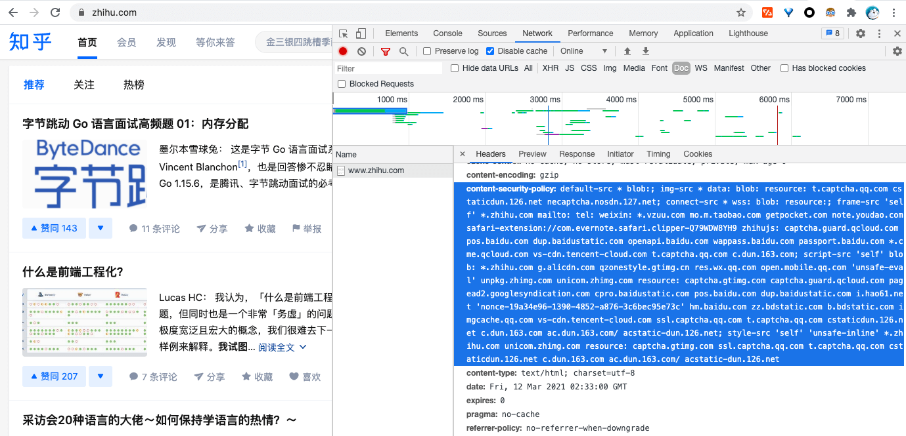
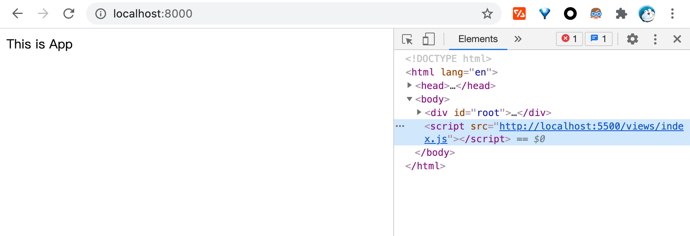
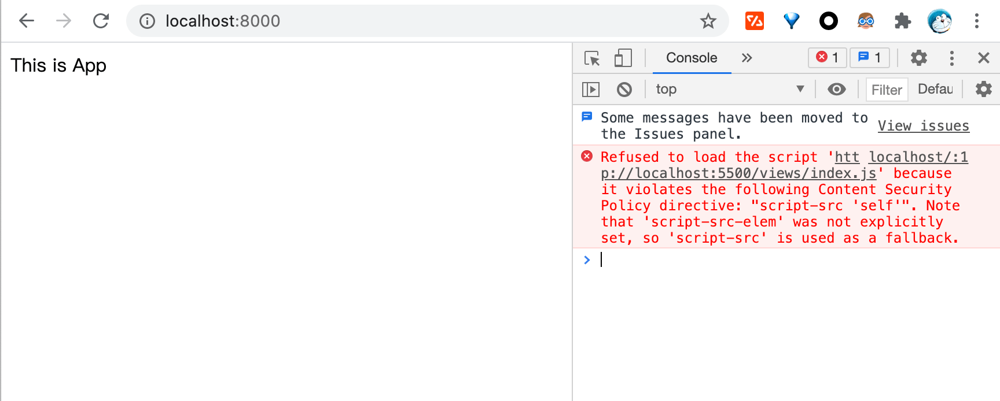
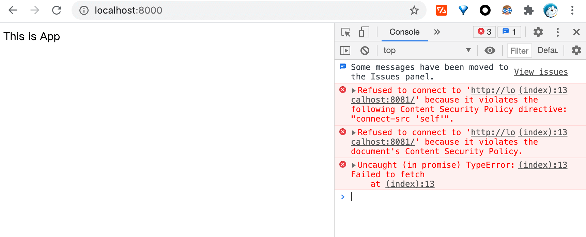
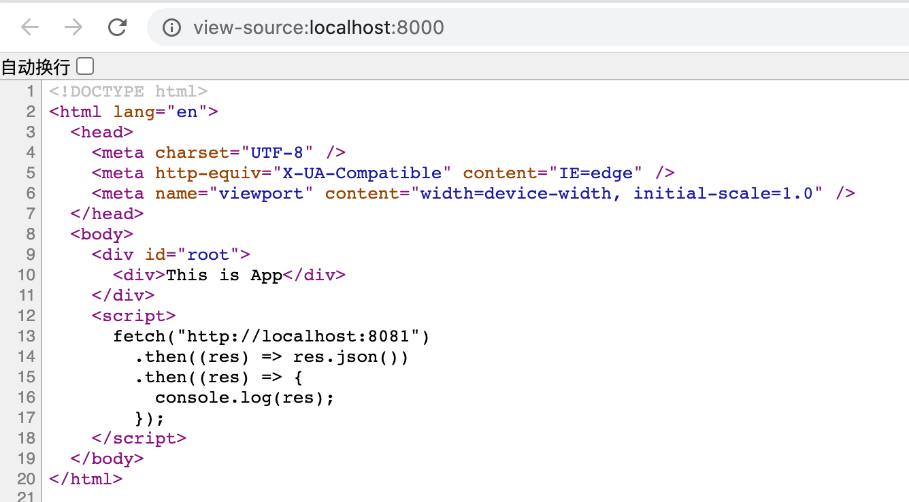
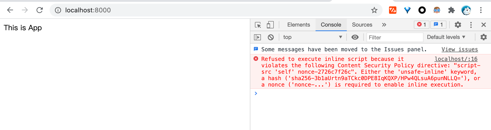
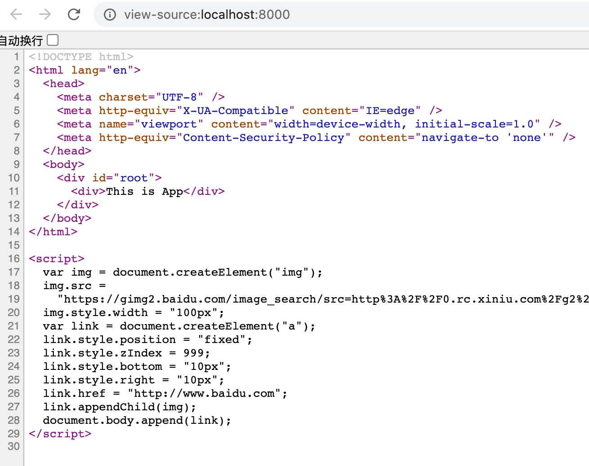
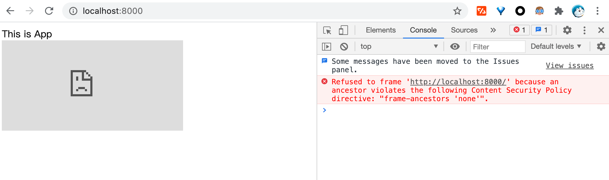
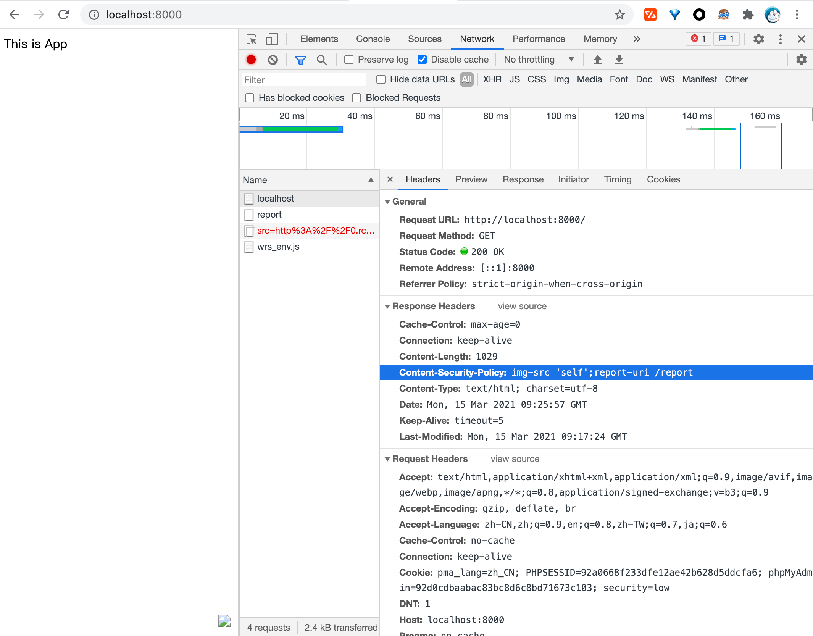
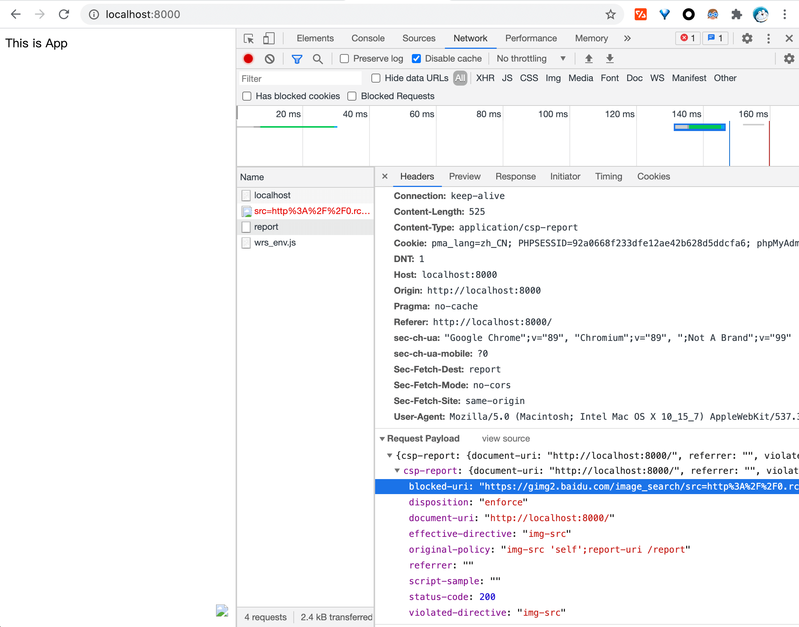

# CSP(Content-Security-Policy)

## 大纲

1. 基本概念
2. 目前 CSP 的使用情况
3. 一些具体场景下 CSP 的应用
4. 小结

## 基本概念

CSP 的全称是`Content-Security-Policy`<sup>[[1]](#reference-1)</sup> ，是一种计算机安全标准，可以防御跨站脚本、点击劫持等代码注入攻击，阻止恶意内容在守信网页内容中执行。站点可以指定用户代理资源加载的策略，主要是通过响应头`Content-Security-Policy`，或者是使用带有`http-equiv`属性的 meta 标签来进行配置的。这可以有效的避免 xss 等一些代码注入形式的攻击。

⚠️ 同时值得注意的是，部分属性并不能通过`meta`标签或者是响应头`Content-Security-Policy-Repory-Only`进行配置，需要将配置写到响应头`Content-Security-Policy`中。

其基本的使用方式<sup>[[2]](#reference-2)</sup>为`Content-Secuirty-Policy: <policy-directive>; [<policy-directive>];` 通过设置指令对各类资源的加载，基本可以分为`获取指令`、`导航指令`、`报告指令`、`其他指令`。

### 获取指令(Fetch Directives)

| 指令名      | 主要作用                              |
| ----------- | ------------------------------------- |
| chlid-src   | 限制了 worker 和 iframe 的资源来源    |
| connect-src | 限制了通过脚本接口加载的链接的地址    |
| default-src | 作为其他`获取指令`的备选项            |
| font-src    | 限制了`@font-face` 加载的源字体的地址 |
| frame-src   | 限制了 iframe 的加载源                |
| script-src  | 限制 JavaScript 的源地址              |
| style-src   | 限制层叠样式表的源地址                |
| ...         | ...                                   |

`script-src`<sup>[[3]](#reference-3)</sup>是比较常见的指令，我们可以从主机名、协议名、是否与当前文档同源、是否允许各种形式的 eval、是否允许内联的 event handlers、是否允许内联的 script 标签或者是 javascript 伪协议的链接等这样一些方面对文档中使用的 javascript 代码进行管理。同时我们也可以使用`nonce`或者是`代码文本hash值`这样一些方式对代码的合法性进行验证，避免在开启`unsafe-inline`时，非法的\<script>代码段被执行。

### 文档指令(Document Directives)

| 指令名  | 主要作用                                            |
| ------- | --------------------------------------------------- |
| sandbox | 类似于 iframe 的 sandbox 属性，约束 iframe 中的行为 |
| ...     | ...                                                 |

### 导航指令(Navigation Directives)

| 指令名         | 主要作用                                                               |
| -------------- | ---------------------------------------------------------------------- |
| from-action    | 限制 form 表单的 action 属性                                           |
| frame-ancestor | 限制资源被以 iframe、frame、object、embed 等形式嵌入时的有效的父级元素 |
| ...            | ...                                                                    |

### 报告指令

| 指令名     | 主要作用                                                                             |
| ---------- | ------------------------------------------------------------------------------------ |
| report-uri | 需要配合`Content-Security-Policy-Report-Only`使用，对可能发生 XSS 的违规行为进行上报 |

## 目前 CSP 的使用情况

观察了`zhihu.com`、`taobao.com`、`douban.com`、`juejin.com`，目前只有`zhihu.com`使用 CSP 保护。

### 知乎(zhihu.com)



<div align="center" ><small>图1 - zhihu.com</small></div>
可以观察到zhihu.com对`img-src`、`connect-src`、`script-src`、`style-src`都做了配置。

## 一些具体场景下 CSP 的应用

### 进一步避免 XSS 攻击

CSP 可以作为一个更安全的防止 XSS 的策略。

从 XSS 攻击的目的讲，XSS 主要是为了窃取用户的 cookie 或者其他数据，又或者是通过 js 代码的执行使用户代理发起意料之外的请求，又或者是在用户网页中生成动态内容。对于前者我们可以通过 cookie 的`httpOnly`属性避免 js 对该 cookie 进行读写，对于第二种情况，也就是 CSRF 的一种攻击形式，常见的解决方案是检查 reference、检查请求的 token 等。对于这种 CSRF 的场景，前面的方案都是从服务端做检查，除了 CSP 还没有比较好的在用户代理就进行检查的解决方案，虽然说使用`service worker`可以对资源请求进行拦截，但是使用这个方案防止 CSRF 确实不太合适。对于第二、第三种情况，使用 CSP 就可以很好的解决，可以分别对文档的`connect-src`和`script-src`作出约束，浏览器借此判断出非法的 ajax 请求的连接和非法来源的 js 代码。

```javascript
// app.js
app.use((ctx, next) => {
  ctx.set(
    "Content-Security-Policy",
    "connect-src 'self';script-src 'self' 'unsafe-inline'"
  );
  return next();
});
```

#### 对 script-src 进行拦截





⚠️ 需要注意的是，如果原来的站点使用了 JSONP 解决跨域，需要将 JSONP 对应的域名加入`script-src`中。虽然 script 标签不受同源策略限制，但是 CSP 可能会对 script 的来源进行限制。

#### 对 connect-src 进行拦截





相比的跨域拦截，CSP 的`connect-src`对请求的拦截，不存在需要类似跨域请求预检的过程。即使接口地址允许跨域，也可以将请求拦截下来，更好地避免 CSRF 攻击。

### 避免运营商的 HTTP 劫持


<div align="center" ><small>图2 - 运营商劫持</small></div>
上图为运营商HTTP劫持插入广告的效果<sup>[[4]](#reference-4)</sup>。其基本形式就是通过在文档末尾添加一些js代码，通过执行这些代码，在页面中动态添加广告位并诱导用户点击广告链接。CSP就可以作为一个有力的措施避免这种行为。对于图中的场景可以使用`navigate-to` （目前navigate-to仍是处于Working Draft阶段）防止用户跳转至广告页面、限制`img-src`避免广告图片被加载、限制`script-src`避免这段插入的js文件被加载。

```javascript
app.use((ctx, next) => {
  ctx.set(
    "Content-Security-Policy",
    "navigation-to 'self';img-src *;script-src 'self' nonce-2726c7f26c "
  );
  return next();
});
```





对于这种场景，CSP 可以做到在执行 script 脚本这一步，就将该行为阻止。

### 防止网页被他人以 iframe 的形式盗用

网页可以通过 iframe 的方式嵌入到另一个网页中。但是对于被嵌入的网页来说，这并不一定是意料之中的。为了避免这种情况，可以设置被嵌入页面的`frame-ancestors`来进行限制。

```javascript
app.use((ctx, next) => {
  ctx.set("Content-Security-Policy", "frame-ancestors 'none'");
  return next();
});
```



### XSS 攻击的拦截上报

对于 XSS 攻击我们除了要做有事前的防范，还要有事后的补救，如何将这个攻击过程记录下来，更好地交给安全人员去复现去分析？如何以各种方式通知用户，当前的账户可能存在安全风险，需要及时更换密码？等等。使用`report-uri` 这个属性<sup>[[5]](#reference-5)(</sup>，可以告知浏览器将违反报告发送到指定的 URI。

```javascript
const router = new Router();

router.post("/report", (ctx) => {
  console.log("report comes");
  ctx.body = true;
});

app.use(router.routes());

app.use((ctx, next) => {
  ctx.set("Content-Security-Policy", "img-src 'self';report-uri /report");
  return next();
});
```





## 小结

CSP 相关的内容，本身并不是 HTTP/1.1 或 HTTP/2.0 的一部分，而是作为一个规范在 w3c 中供浏览器厂商去实现。这是因为 web 应用不同于普通的 app 以及桌面应用，app 或者是桌面应用通常是通过二进制包的形式分发，并且可以有系统层面的签名验证机制以及应用商店的严格的审核提供保障，保证了可执行文件的安全性。但是 web 应用本身是基于源码形式的分发，并具有动态性的特点，这给 web 应用带来了开发、运行、传播的便利性，但同时也带来了一些隐患，如果不能保障传输过程中的准确性、完整性，就会给用户带来安全隐患，通过代码注入等形式造成开发者意料之外的代码在用户代理执行成为了可能。CSP 也就应运而生，通过对文档可加载的资源来源进行限制以及验证达到避免恶意代码执行的目的。如果我们可以保证文档及其响应头没有被修改，并且配置了合理的 CSP 规则，一定程度上网页是安全的。但同时世界上是不存在绝对的安全的，我们也还需要其他的措施帮助我们保护用户的安全。

## 参考引用

- [1] https://www.w3.org/TR/CSP/
- [2] https://developer.mozilla.org/zh-CN/docs/Web/HTTP/Headers/Content-Security-Policy
- [3] https://developer.mozilla.org/en-US/docs/Web/HTTP/Headers/Content-Security-Policy/script-src
- [4] https://juejin.cn/post/6844903713669283847
- [5] https://developer.mozilla.org/en-US/docs/Web/HTTP/Headers/Content-Security-Policy/report-uri
