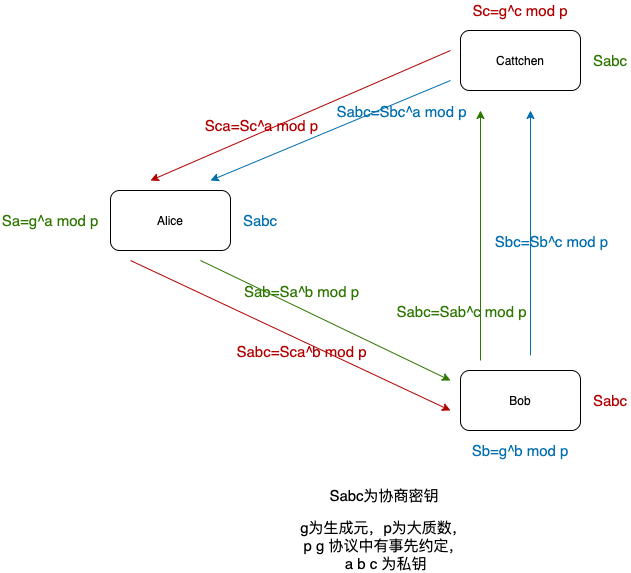
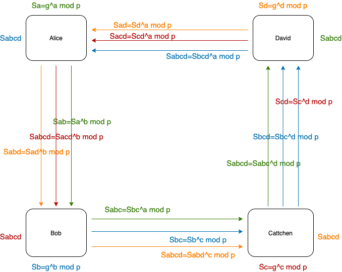
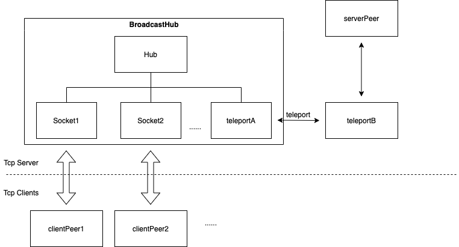
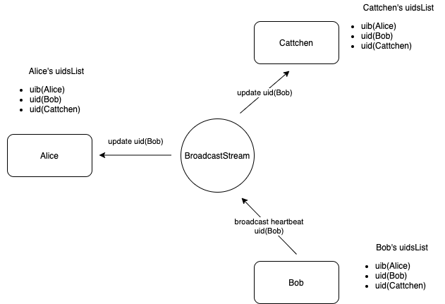
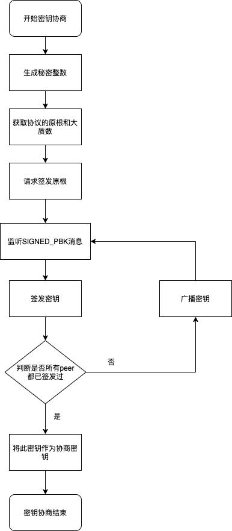

# 前言

这是信息安全综合实验实践周的大作业，基于此我重新学习了 Diffie-Hellman 算法，TCP 网络通信，还有 protobuf 的使用，也对 Electron 和 Nodejs 的 Stream 也有了更为深刻的了解。

[https://github.com/chenks12138/chatroom](https://github.com/chenks12138/chatroom)

# Diffie-Hellman 算法

这是基于离散对数问题的算法，可以使用 Diffie-Hellman 算法在一个不安全的信道里让双方协商一个密钥。这里我们用 Alice 和 Bob 来表示双方，原根 g 和一个大质数 p 是协议中公开的，双方先分别选择一个秘密整数 a、b，计算出公钥 A=g^a mod p,B=g^b mod p。将 A 和 B 公开，Alice 和 Bob 可以分别计算出协商密钥 Sab=B^a mod p = A^b mod p。

在这里我们需要处理的不止双方，而是三方。因此我们需要调整协商密钥为 Sabc = Sab^c mod p = Sbc^a mod p = Sac^b mod p。



同理，递推下去也可以进行四方的密钥协商，以及多方的密钥协商。



# 聊天室网络通信的设计

## 抹平 Server 和 Client，每个人都是 Peer



由于使用的是 TCP 作为网络协议，必然有 Server 和 Client 的概念。我使用了 BroadcastHub，使他作为一个类似集线器的存在，负责转发向所有 peer 广播所有收到的消息。每个 peer 都会直接的（serverPeer）或者间接的（clientPeer）与 BroadcastHub 连接。

```typescript
export class BroadcastHub {
  private hub: HubStream;
  serverPort: stream.Duplex;
  constructor() {
    this.hub = new HubStream();
    const [portA, portB] = createTeleports();
    this.hub.addPort(portA);
    this.serverPort = portB;
  }
  addSocket(socket: Socket) {
    this.hub.addPort(socket);
  }
  removeSocket(socket: Socket) {
    this.hub.removePort(socket);
    socket.unref();
  }
  destroy() {
    this.hub.destroy();
  }
}

export class HubStream extends stream.Duplex {
  ports: stream.Duplex[];
  constructor() {
    super();
    this.ports = [];
    this.pipe(this);
  }
  addPort(port: stream.Duplex) {
    port.on("data", chunk => {
      if (!this.push(chunk)) {
        port.pause();
      }
    });
    this.ports.push(port);
  }
  removePort(port: stream.Duplex) {
    const index = this.ports.findIndex(one => one === port);
    if (index !== -1) {
      this.ports.splice(index, 1);
      port.destroy();
    }
  }
  _read() {
    for (let i = 0; i < this.ports.length; i++) {
      this.ports[i].resume();
    }
  }
  _write(input: Buffer, encoding: BufferEncoding, done: any) {
    let waiting = this.ports.length;
    if (waiting === 0) {
      done();
    }
    for (let i = 0; i < this.ports.length; i++) {
      this.ports[i].write(input, encoding, () => {
        waiting--;
        if (waiting === 0) {
          done();
        }
      });
    }
  }
  _destroy() {
    this.unpipe(this);
    this.ports.forEach(one => {
      one.destroy();
    });
  }
}

export function createTeleports(): [stream.Duplex, stream.Duplex] {
  var portA: stream.Duplex, portB: stream.Duplex;
  portA = new stream.Duplex({
    read() {
      portB.resume();
    },
    write(chunk, enc, callback) {
      if (!portB.push(chunk, enc)) {
        portA.pause();
      }
      callback();
    },
  });
  portB = new stream.Duplex({
    read() {
      portA.resume();
    },
    write(chunk, enc, callback) {
      if (!portA.push(chunk, enc)) {
        portB.pause();
      }
      callback();
    },
  });
  return [portA, portB];
}
```

BroadcastHub 的核心是 HubStream，HubStream 是一个双向流，它会讲所有的输入传给输出，它的维护了一个 subStreams 作为输入来源和输入，以达到广播的效果。

使用了 teleportStream 达到连接 BroadcastHub 和 serverPeer 的目的，当我们向 portA 输入数据时，portB 会有输入，反之同理。

## peer 存活检测



进行协商前，每个 peer 都需要了解当前清楚当前的房间里有多少个 peer，因此我通过了定时发送心跳包的方式，让每个 peer 都维护了一个 peerList，来记录存活 peer。

不使用 server 端的 socket 连接数是有缘由的，如果在这层功能上依赖了 TCP Socket 能力，就违背了`抹平Server和Client，每个人都是Peer`的初衷。此外，Server 上的连接也不一定都是 Peer，直接使用`nc`也是可以连接 Server 的，有能力发送心跳包是作为这是一个合法 peer 的必要条件。

## 进行密钥协商



进行密钥协商时，每个 peer 的行为都是对称的，不停的签发密钥并广播直到这个密钥是所有人都签名过的密钥才停止。

为了应对丢包或者是 peerList 存在错误的场景，触发签名如果超时，则会被中止回到聊天的状态。

## 效果


