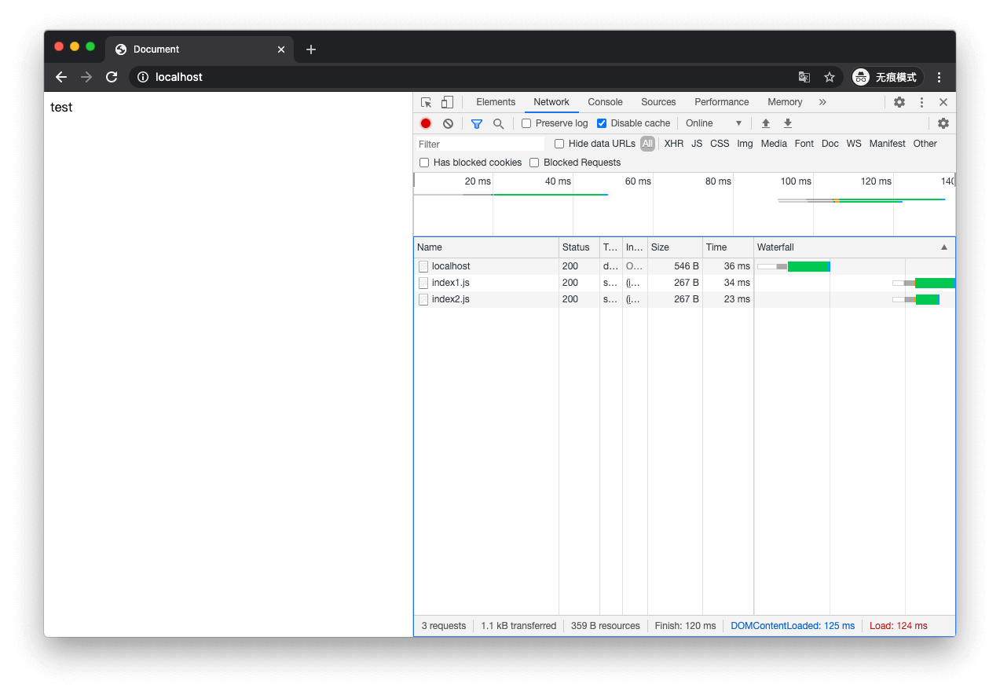
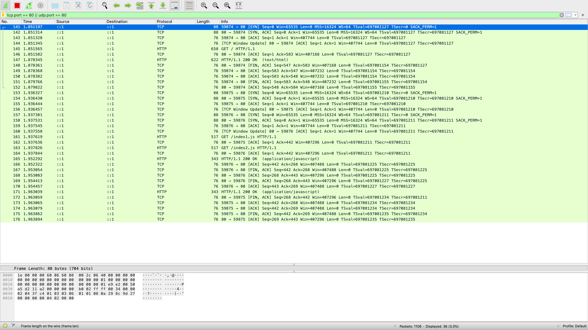
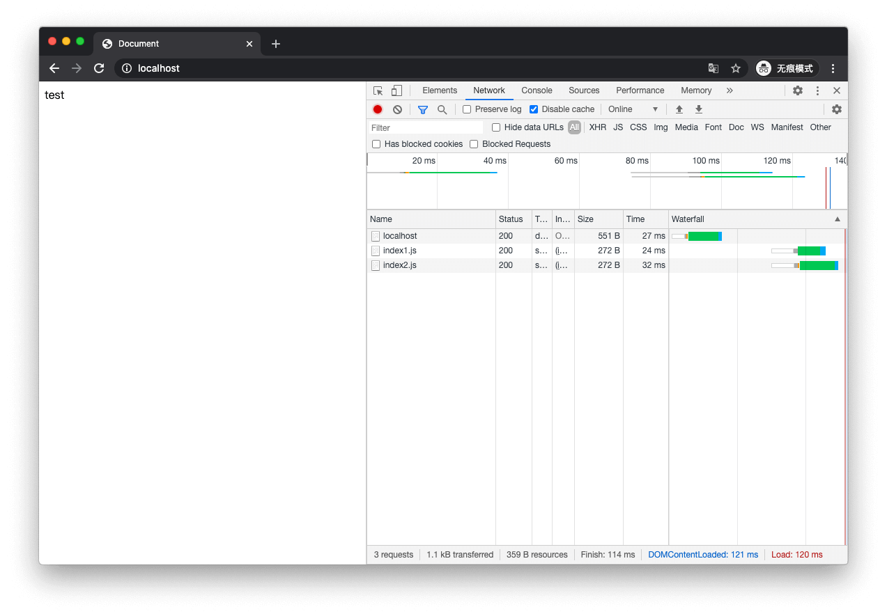
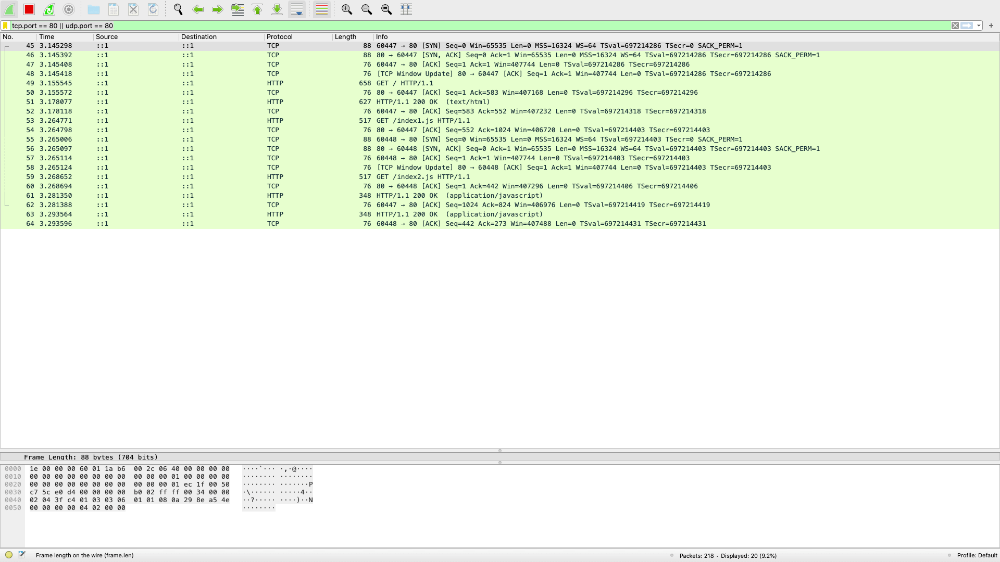
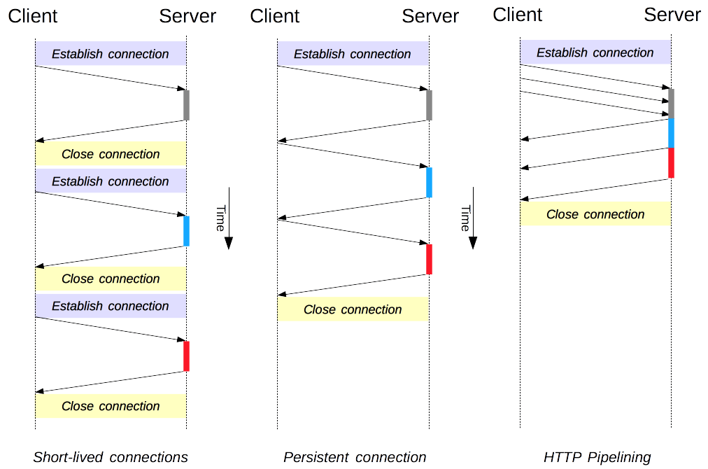
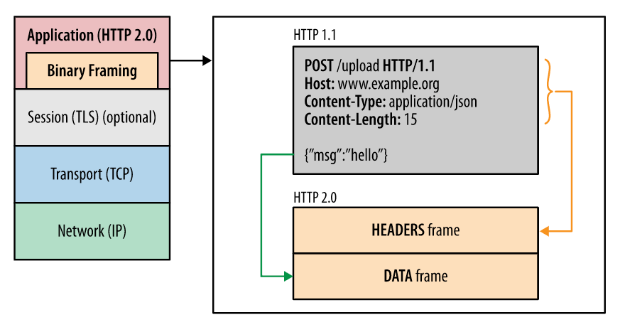

# 前言

HTTP 层的数据传输对于 web 开发人员来说是一个黑盒，但是平时的开发又离不开它。因此有必要去了解一下它是如何保障我们的数据可以被高效、准确地传输。

# 连接模型

抓包使用环境

> macOS 10.15.7
>
> Nginx 1.18.0
>
> Chrome 86.0.4240.80
>
> Wireshark Version 3.2.4 (v3.2.4-0-g893b5a5e1e3e)

## 短连接

短连接是 HTTP/1.0 默认的连接模型，使用它意味着每进行一次`请求-响应`就需要完成一次 TCP 三次握手和四次挥手。

Nginx 配置

```

worker_processes  1;
events {
    worker_connections  1024;
}
http {
    include       mime.types;
    default_type  application/octet-stream;
    sendfile        on;
    tcp_nopush     on;
    keepalive_timeout  0;
    server {
        listen       80;
        server_name  localhost;

        location / {
            root   /usr/share/nginx/html;
            index  index.html index.htm;
        }

    }
}
```





上图中打开了一个网页，同时这个网页需要加载 index1.js index2.js 这两个资源。从第二张图片中的抓包中可以看出`141-152`完成了对`index.html`数据的请求，`153-176`完成对 index1.js index2.js 资源的请求。`153-155`和`157-159`浏览器从不同的端口向 Server 发起了两个三次握手。

## 长连接

长连接是 HTTP/1.1 中新增的一种连接模型，HTTP/1.1 中默认就是长连接。使用长连接，完成一次 HTTP 的`请求-响应`后不会立即关闭 TCP 连接，TCP 连接会存活一段时间，如果这段时间内没有新的 HTTP`请求-响应`则会关闭 TCP 连接。TCP 三次握手、四次挥手开销都比较大，使用长连接可以避免一部分不需要的 TCP 握手挥手。

Ngnix 配置

```

worker_processes  1;
events {
    worker_connections  1024;
}
http {
    include       mime.types;
    default_type  application/octet-stream;
    sendfile        on;
    tcp_nopush     on;
    keepalive_timeout  65;
    server {
        listen       80;
        server_name  localhost;

        location / {
            root   /usr/share/nginx/html;
            index  index.html index.htm;
        }

    }
}
```




可以观察到上面的抓包结果中`52`完成对 index.html 的 HTTP 请求后，TCP 连接没有立即关闭，后面请求 index1.js 时，复用了这个 TCP 连接节约了 TCP 握手挥手的时间开销。TCP 连接的性能只有该连接被使用一段时间后才能得到改善，这个是 TCP 的慢启动机制、流控机制导致的，使用短连接，慢启动机制、流控机制还没来得及起作用，连接就已经关闭了。但是也要注意到，保持这个 TCP 连接是会消耗服务器资源的。

## 流水线模型

流水线在现代浏览器中默认是不开启的，它的大致思路是允许在同一个长连接上发出连续的请求，请求不再需要等待上一个请求的响应到达，在高延迟网络条件下可以降低网络回环时间降低延迟。但是使用流水线存在着一些问题和限制，我们需要保证在这个 TCP 连接上响应和请求的顺序是对应的，否则我们无法将`请求-响应`正确关联起来。同时还有 HOL 问题，如果前面的响应延迟了就会阻塞后面的请求的响应。



## 多路复用



HTTP/2 在 HTTP 和 TCP 间增加了一个二进制分帧层，有必要先理解几个概念

> - _数据流_：已建立的连接内的双向字节流，可以承载一条或多条消息。
> - _消息_：与逻辑请求或响应消息对应的完整的一系列帧。
> - _帧_：HTTP/2 通信的最小单位，每个帧都包含帧头，至少也会标识出当前帧所属的数据流。
> - 所有通信都在一个 TCP 连接上完成，此连接可以承载任意数量的双向数据流。
> - 每个数据流都有一个唯一的标识符和可选的优先级信息，用于承载双向消息。
> - 每条消息都是一条逻辑 HTTP 消息（例如请求或响应），包含一个或多个帧。
> - 帧是最小的通信单位，承载着特定类型的数据，例如 HTTP 标头、消息负载等等。 来自不同数据流的帧可以交错发送，然后再根据每个帧头的数据流标识符重新组装。

多路复用可以实现在一个 TCP 连接上传输多个`请求-响应`，并解决了 pipelining 中对响应返回顺序的要求。

# 小结

从上面的 HTTP 协议的发展中可以看出，这方面的优化主要是朝着减少不必要的 TCP 报文，降低网络延迟的角度进行。如今网络带宽越来越高，网络加载的性能瓶颈更多的是出现在了延迟上，pipelining 和多路复用想解决的都是这个问题。

# 参考引用

- [1] https://developers.google.com/web/fundamentals/performance/http2?hl=zh-cn
- [2] https://juejin.im/post/6844903853985366023
- [3] https://hpbn.co/primer-on-web-performance/#latency-as-a-performance-bottleneck
- [4] https://http2.akamai.com/demo
