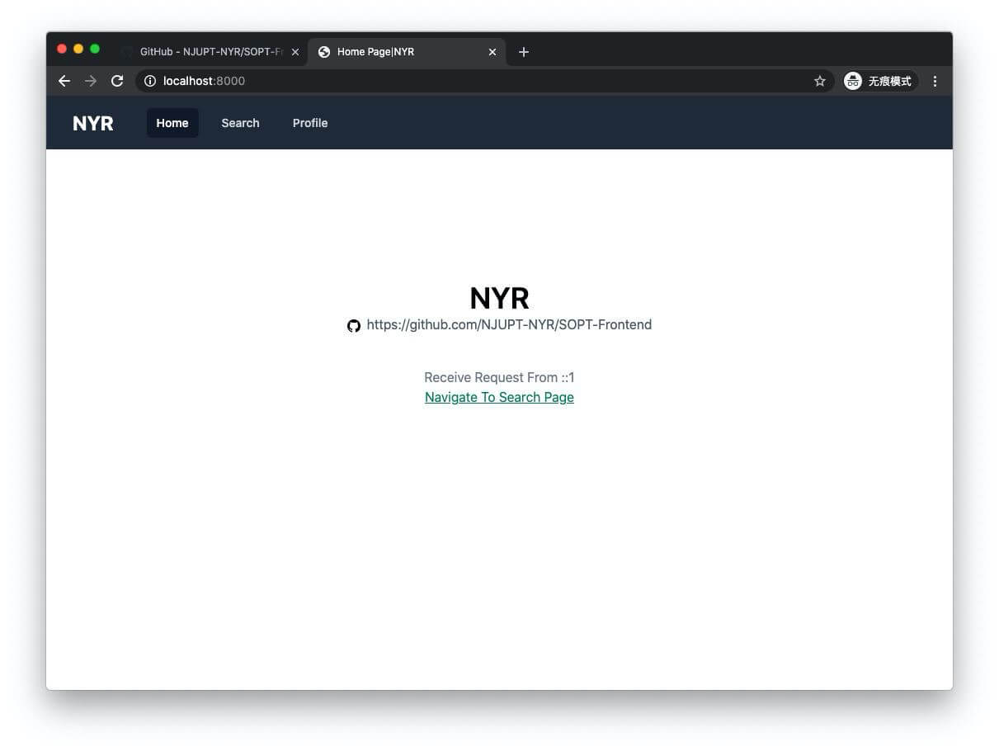
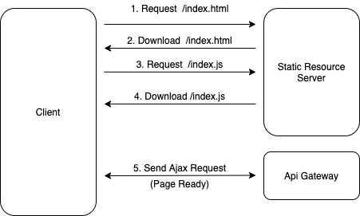
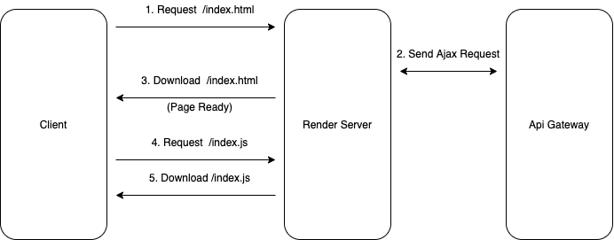

# 前言

从一开始的静态网页以及浏览器的出现，出现了文档链接其他文档这样的交互方式。后来 JavaScript 的出现了，通过在文档中编写脚本，借助浏览器的能力，文档和用户的交互有了更多的可能。再到后来 PHP、ASP 以及各种 CGI 应用的出现，CGI 应用通过自身的访问数据库、文件系统等各种能力，动态的生成文档，返回给用户，文档的内容有了更多的可能，这就是服务端渲染（SSR）的大致过程。最初前端部分的代码在 CGI 应用中的占比不高，主要是以服务端的代码为主，嵌入一部分的前端代码无伤大雅，但是随着前端内容的不断膨胀，前端代码在 CGI 应用中的占比不断提高，从代码的可维护性和用户体验的角度上看，这样的服务端渲染的方式不再合适。

后来衍生出了客户端渲染（CSR），前端代码从 CGI 应用中分离，文档的构建不再由 CGI 应用负责，而是用户获取到 JavaScript 脚本后，浏览器端执行 JavaScript 脚本动态的生成，并通过发送 ajax 请求和后端服务通信，获取到数据后，再通过 DOM 操作更新页面，可以理解为这是一个将 PJAX 做到了极致的技术。通过 CSR 可以实现单页应用，达到避免页面跳转时的白屏的目的，从工程的角度看，减少了代码的耦合，CGI 应用中的前端代码可以被分离出来作为一个独立的应用。但 CSR 也带来了些问题，用户下载到的文档是一个不包含内容的文档，需要执行 JavaScript 脚本后才可以构建出内容，这对于搜索引擎来说不够友好，如果搜素引擎没有执行脚本中的内容无法得到文档的内容，再者是页面首次加载会有白屏时间，用户体验不够好。

造成上面的问题的最主要的一个点就是，在 CSR 应用中用户下载的 HTML 文档不包含内容，需要客户端执行完 JavaScript 脚本后，才可以得到内容。那么问题就来了，我们是不是可以让 JavaScript 脚本执行的过程在服务端中执行一遍，这样得到的 HTML 文档就包含了页面内容。同时，请求发生在服务端时延会比在客户端小，能提高总体的加载速度。

市面上已经有了许多同构渲染的方案，例如 next.js、nuxt.js，但是我选择自己用 React、ReactDOM、Koa 实现一遍，以便于更好地理解这个过程，以及更好地做优化和故障排查。

# 同构渲染的主要过程

## 传统的 CSR



## 同构渲染



使用同构渲染技术，用户在获取到 HTML 时，文档就已经包含了内容，这可以较少应用的加载屏时长。React 是基于 Virtual DOM 来构建页面内容，可以使用 ReactDOM.render/ReactDOM.hydrate/renderToString 将 React 组件渲染出来。只不过，前两者传参需要一个 DOM 对象，ReactDOM 会操作这个 DOM，渲染出页面，而 renderToString 是直接输出 HTML 文本。hydrate 相比于 render 会对已有的内容进行 hydrate 操作。

因此我们可以让 Server 也渲染一遍 React 组件，得到 HTML 文本后返回给用户，再配合 ReactDOM.hydrate，浏览器端在 DOM 中标记好处理事件。

# 主要需要解决的问题

## 保证服务端和客户端 Virtual DOM 的一致性

客户端在构建页面时，目标 DOM 节点中已经存在了内容，因此我们需要传入 props，以保证 ReactDOM.hydrate 被调用后，构建出的 Virtual DOM 与目标 DOM 内容一致。

我采用的方案是在文档初次渲染时，将服务端获取到的 initProps，序列化以及 base64 加密后注入到文档中，构建 Virtual DOM 时再解密以及反序列化。

```jsx
var htmlTemplate = `<!DOCTYPE html>
<html <%- helmet.htmlAttributes.toString() %> >
  <head>
    <%- helmet.title.toString() %>
    <%- helmet.meta.toString() %>
    <%- helmet.link.toString() %>
  </head>
  <body <%- helmet.bodyAttributes.toString() %> >
    <div id="root"><%- content %></div>
  </body>
  <script>
    window.__PRERENDER_INIT_PAGE_PROPS__ = "<%- initPageProps %>";
  </script>
</html>
`;

ReactDOM.hydrate(
  <App
    initPath={location.pathname}
    initPageProps={parserProps(window.__PRERENDER_INIT_PAGE_PROPS__)}
  />,
  document.getElementById("root")
);
```

## 保证前后端路由解析的一致性

首次进入页面时依赖的是后端的路由，Koa 中间件需要解析出对应的页面组件，并调用其`getInitProps` 获取到数据，渲染组件以及注入页面。因此需要保证前后端路由解析的结果的一致性。最初我使用的`react-router-config`和`koa-router` 来分别实现前后端路由解析，后面为了保证解析结果的一致性，我使用了`path-to-regexp`和`query-string`实现了路由解析，并编写了对应的单元测试

## CSS Modules 服务端解析的问题

```javascript
import styles from "home.module.css";
console.log(styles);
/**
 * 服务端结果
   [
    [
      './src/containers/Home/home.module.css',
      '._2qPY_oWAq232nd_VnG32FK {\n  color: red;\n}\n',
      ''
    ],
    toString: [Function: toString],
    i: [Function (anonymous)],
    locals: { text: '_2qPY_oWAq232nd_VnG32FK' }
  ]
  * 客户端结果
    { text: '_2qPY_oWAq232nd_VnG32FK' }
 */
```

服务端在进行`CSS Modules`解析时得到了意料之外的结果，到目前我还没找到问题的原因。经过一番 Google 后，看到其他人也有类似的情况出现，但是其他人的解决方案的 babel plugin 并不能解决我的问题。所以我直接写了一个 babel plugin 以及对应的单元测试，转译出服务端代码时进行转换，操作 AST，以保证`styles`为`locals`中的内容。

```javascript
var t = require("@babel/types");

/**
 *  transfrom  import styles from "home.module.css";
 *         to  import __styles from "home.module.css";
 *             var styles = __styles.locals;
 */

module.exports = {
  visitor: {
    ImportDefaultSpecifier(path) {
      var parent = path.parent;
      var node = path.node;
      if (
        t.isImportDeclaration(parent) &&
        /\.module\.css/.test(parent.source.value)
      ) {
        var originName = node.local.name;
        node.local.name = "__" + originName;
        path.parentPath.insertAfter(
          t.variableDeclaration("var", [
            t.variableDeclarator(
              t.identifier(originName),
              t.memberExpression(
                t.identifier(node.local.name),
                t.identifier("locals")
              )
            ),
          ])
        );
      }
    },
  },
};
```

## 使用 Cluster 提高性能

为了更好地利用主机的计算资源，我使用了 Node.js 中的 Cluster 模块，进行多进程优化。

```javascript
import * as cluster from "cluster";
import * as os from "os";

export function run(worker: () => void) {
  if (ENALBE_SERVER_CLUSTER) {
    const cpuNum = os.cpus().length;
    if (cluster.isMaster) {
      for (let i = 0; i < cpuNum; i++) {
        cluster.fork();
      }
      console.log(`start ${cpuNum} process`);
      cluster.on("exit", (worker, code, signal) => {
        console.log(`worker ${worker.process.pid} exited`);
      });
    } else {
      worker();
    }
  } else {
    worker();
  }
}

run(() => {
  const app = new Koa();
  middlewares.forEach(middleware => {
    app.use(middleware);
  });
  app.listen(SERVER_PORT, () => {
    console.log(`worker ready, listen request from 0.0.0.0:${SERVER_PORT}`);
  });
});
```

# 小结

这只是一个简单的同构渲染的实践，可以做优化的地方还很多。欢迎 clone 源码自己看一遍，欢迎 Pull Request。等等，发现跑题了，NYR 是和小伙伴们想一起做的 PT 站~~，在线等其他有缘人一起把 NYR 写完~~。

[https://github.com/NJUPT-NYR/SOPT-Frontend](https://github.com/NJUPT-NYR/SOPT-Frontend)
