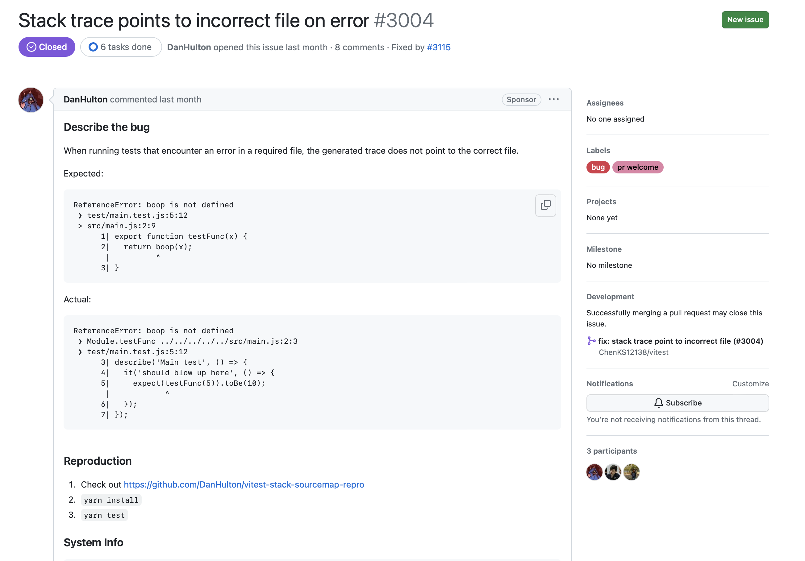

# 契机

最近在GitHub闲逛发现了这个Issue，它提供了完成可复现的例子，我试了一下确实可复现，瞬间提起了兴趣想修复它。前前后后花了一个周末+一天清明节假期修复，虽然说打工人的休息时间很宝贵，但是能完成这个挑战还是很是令人兴奋的。

https://github.com/vitest-dev/vitest/issues/3004



# 修复历程

https://github.com/vitest-dev/vitest/pull/3115

这个PR我前前后后提交了3版修改，虽然每次的修改都可以修复这个Bug，但是前两次都不是根本解。这是我第一次接触这个项目，通过借助debugger调试对项目进行了解，所产生的思维的局限性。这里体现了Code Review的重要性，让有全局视野的人把控代码质量，不让项目工程太快走向混乱。

```javascript
const fn = vm.runInThisContext(code, {
  // 通过debugger发现传入的__filename变量是正确的，但是打印的stacktrace却一直是错误的
  filename: __filename,
  lineOffset: 0,
  columnOffset: -codeDefinition.length,
})
```

期间我一度以为是`Node.js`的Bug，花了一天多调试Node.js的源代码，直到跟着源码发现了`Error.prepareStackTrace`这个API。Node.js在设计上充斥着各种函数的注册/回调，这导致我阅读代码的体验很糟糕，逻辑是割裂的，我需要不断的通过搜索函数名关联相关的逻辑。最后，才发现是`vitest`项目使用了这个API，自定义了对stacktrace的处理。

https://v8.dev/docs/stack-trace-api

当然调试Node.js期间也有不少收获，学会了使用lldb调试C++二进制，并使用脚本帮助自己更方便地在调试期间打印相关变量。

https://github.com/nodejs/node/blob/main/deps/v8/tools/lldb_commands.py

# 启发

## 向社区提反馈问题时尽量提供最小的可复现的样例

在提出自己的问题的同时，提供最小的可复现的样例帮助别人更快地了解自己的问题
https://stackoverflow.com/help/minimal-reproducible-example

## 写好测试代码

我一度十分疑惑，社区的开源代码是如何保证代码质量的。项目的开发人员是不固定的（没有开发人员能够为这些代码产生的事故负责，他们没有与任何使用方签订契约），交流也是不固定的（协作的人可能在全球任何可以接入互联网的角落，生活在各个时区），甚至代码风格也有点混乱，但是这样的代码项目就是可以正常的工作，并且被各个商业公司在清楚风险自负的情况下使用。一个比较重要的原因就是有各种测试代码保证着代码质量。

