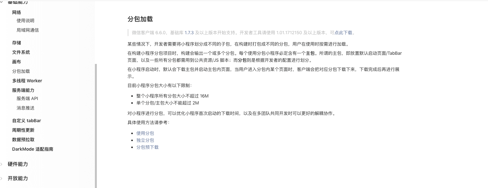

# 前言


这是一个可以用来制作毕业照的微信小程序，主要使用的技术栈是`Taro`，`React`。开发总体上，主要的问题是集中在`资源加载优化方面`还有`画布的处理上`。

# 资源加载优化方面


在这个装饰页面，以前也有见过类似的场景，是在`你头像真棒`小程序里。通过点击底下的图片，来更换画布中的背景图。但是不同于上一个场景，上一个场景加载的图片资源大多是一些头像挂件，体积都不大且数量不多，这里的图片资源数量比较多，除了体积大不的挂件，更多的是体积比较大的背景图。虽然图片资源都有进行了一定程度的压缩，但是总体的体积还是很大，加载完这个页面的资源需要`20+M`的流量，这个加载时长是不能接受的，而且这也会造成加载时滑动的卡顿。

此外，还有一点对象存储 OSS 的计费和图片的请求次数有关系，因此如果更降低图片的请求次数也是对加载的优化。



最后的方案是，对原先的高清图进行有损压缩并利用的小程序的`分包加载`能力，小程序的每个分包大小不超过 2M。将该页面所有缩略图控制在 2M 内，并作为缓存放进小程序的分包中。由于高清图资源的地址需要通过接口获取，因此需要建立高清图的 URL 和分包中对应的缩略图的地址的映射关系来进行优化。

```jsx
// thumbnail.js
const thumbnailMap = new Map(
  [
    [
      "https://graphbed.example.com/graduate/sdfovhidsf1",
      "/subPackage/package1/assets/1.png"
    ],
    [
      "https://graphbed.example.com/graduate/67sdf87sd6f",
      "/subPackage/package1/assets/2.png"
    ]
  ]
)

// page.jsx

render(){
  const src = 'https://graphbed.example.com/graduate/sdfovhidsf1';
  return <Image src={thumbnailMap.get(src) || src} >
}
```

这样当后端的高清图发生更新添加了新的高清图时，缓存未命中，可以 fallback 直接请求高清图的地址。同时，也需要前端在小程序包中添加新的缩略图，发布新的版本，在此期间不会影响小程序的使用。

# 画布处理上

在画布处理上，我将另一个项目中的原生的画布组件封装成了 Taro 组件，并修改了一部分的 props。不过该组件是一个 canvas，不同于普通的组件。框架并不能直接替我计算出需要帮我增加/提换/删除页面的什么节点，因此需要我在特定的生命周期，比对 props 的变化，操作 canvas context 的 api，重新进行渲染。因此要求传入的 props 的`graphArray`的每一个元素都应该有一个`key`，便于我追踪每一个 graph 的具体变化。
