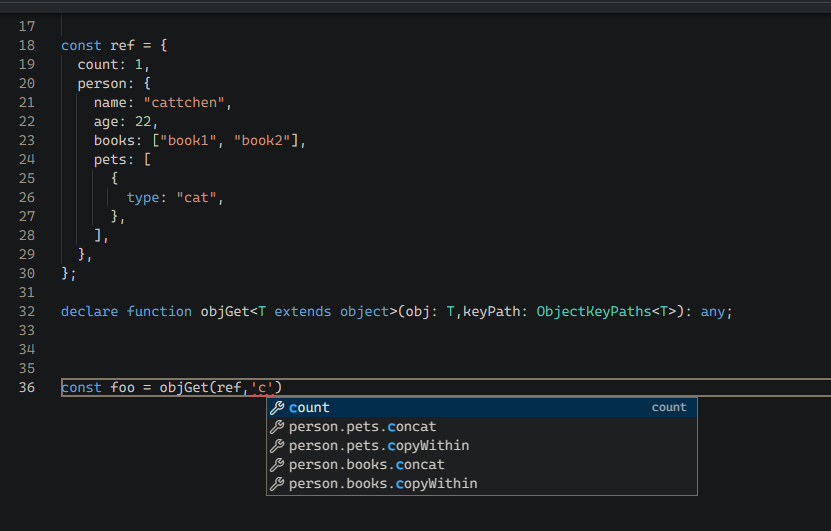

# 前置知识&TypeScript 类型系统

`TypeScript`可以基本被简单地理解为`JavaScript`+`类型注解`（因为 TypeScript 不会在运行时做约束，因此我更愿意称它为是一种注解）。JavaScript 是一门灵活的动态类型编程语言，正所谓，“动态类型一时爽，代码重构火葬场”，JavaScript 代码中的类型信息只能通过注释（一般是 JSDoc，但是场景也比较局限）记录，起不到约束作用。同时，也导致了代码中充斥着运行时的类型检查。而 TypeScript 的出现很好的解决了这几个问题，通过编译时检查（称之为转译会更合适一些），确保类型被正确使用。

使用 JavaScript 实现余额展示。

```javascript
/**
 * 将分为单位的金额数值格式化展示
 * @param {number} amountCent
 */
function formatAmountCent(amountCent) {
  if (typeof amountCent !== "number") {
    throw new Error(
      `amountCent type error, number expected, ${typeof amountCent} founded`
    );
  }
  return `${amountCent / 100}元`;
}
```

而使用 TypeScript

```typescript
/**
 * 将分为单位的金额数值格式化展示
 */
function formatAmountCent(amountCent: number): string {
  return `${amountCent / 100}元`;
}
```

上面的例子还不足以体现 TypeScript 的强大。如果仔细一想可能会发现这里有问题，JavaScript 作为一门灵活的动态类型语言，TypeScript 是否有足够的能力准确表达类型？一个函数入参可能有多种可能的类型，不同的入参类型需要映射到不同的返回值类型。像下面的例子，第一个函数虽然返回了类型，但是主调方其实还需要通过`as`等方式进行类型窄化，才能得到比较准确的类型；第二个函数通过了`Conditional Types`实现了比较准确的类型的计算推导。诸如此类的类型操作还有不少，可以参考[TypeScript HandBook/Type Manipulation](https://www.typescriptlang.org/docs/handbook/2/types-from-types.html)。

```typescript
type Arg = number | string;

declare function convertBetweenStringAndNumber1(arg: Arg): Arg;
const t1 = convertBetweenStringAndNumber1("123"); // number | string
const t2 = convertBetweenStringAndNumber1(123); // number | string

declare function convertBetweenStringAndNumber2<T>(
  arg: T
): T extends string ? number : T extends number ? string : never;
const t3 = convertBetweenStringAndNumber2("123"); // number
const t4 = convertBetweenStringAndNumber2(123); // string
```

https://www.typescriptlang.org/play?#code/C4TwDgpgBAggTgcygXigOwK4FsBGE5QA+UAzsHAJZoIDcAUHQCYQDGANgIZzQBmGaLYBQD2aKC1EA3fMABCEYAHcIENAGVyVBDDSMActjxwAjAAouCAFyxEASmvxadCWjJRgxlOKkz5Sleqa1Dr6hvhmAOTGAEwAzBG2NFAA9MnoYQTEZJTUzqJuwNFeLtJwcgrKqho52roGuOGmMbGJKWmYDZmkQQgMzOxcvPyCImIlvhUB1Voh9UbRADwAKgB8pnRQUBbWS3T2UEtQEAAewKqMJN01UAD86Z1QO0en55cdRrdXWo-oEKX0LgKsWKPjKfkqgRqswy0VMUTiCSSqXuRjyrmA7gALCC0KVyv4qj1oZ1Yc1WsjslogAhttps://www.typescriptlang.org/play?ssl=14&ssc=52&pln=14&pc=58#code/C4TwDgpgBAggTgcygXigOwK4FsBGE5QA+UAzsHAJZoIDcAUHQCYQDGANgIZzQBmGaLYBQD2aKC1EA3fMABCEYAHcIENAGVyVBDDSMActjxwAjAAouCAFyxEASmvxaDZuy69+gkWIlppcOQrKqhqU1Dr6hvgATAA8ACoAfKZ0UFAW1nF09lBxUBAAHsCqjCSkmtRQAPzokQQZeYXFpZi4+FVloUjWaBB+9Aw+ZFDAxijiUjLySirq5dq6Bq0mpgDkxlEAzCu2NFAA9Hs1S0QdWnSDwMNRYz5+AdPBc+GLRmbrGzv7hy1GJ2SdA1EQ2AGxuE38UyCs06z1qUVW722uwORyM5yBl2AABYwb5JoEZiEtLClvD3p8Uf8tEA

# 实现 ObjectKeyPaths

从上面的例子中可以看出 TypeSctipt 的类型系统类型计算推导的强大，前一段时间接触到了[type-challenges](https://github.com/type-challenges/type-challenges)这个项目，又重新学习了一遍 TypeScript。

同时，我也想到了一个问题，lodash 的 get 方法是 javascript 开发者熟悉的一个工具函数。在第一个对象参数类型明确的情况下，我们是否可以通过类型推导，得到第二个路径参数的所有可能的字面值。

```javascript
var object = { a: [{ b: { c: 3 } }] };

_.get(object, "a[0].b.c");
// => 3

_.get(object, "a.b.c", "default");
// => 'default'
```


我也贡献了一道题目，[type-challenge 题目地址](https://github.com/type-challenges/type-challenges/blob/main/questions/07258-hard-object-key-paths/README.md)

```typescript
type T1 = ObjectKeyPaths<{ name: string; age: number }>; // expected to be 'name' | 'age'
type T2 = ObjectKeyPaths<{
  refCount: number;
  person: { name: string; age: number };
}>; // expected to be 'refCount' | 'person' | 'person.name' | 'person.age'
type T3 = ObjectKeyPaths<{ books: [{ name: string; price: number }] }>; // expected to be the superset of 'books' | 'books.0' | 'books[0]' | 'books.[0]' | 'books.0.name' | 'books.0.price' | 'books.length' | 'books.find'
```

最终期望的效果如下，不仅能够实现字面值的参数校验，还可以帮助 IDE 更好地做代码提示。



https://github.com/type-challenges/type-challenges/issues/7258

提交 Issue 创建题目后，我也评论贴了自己的解法。同时也发现了社区中的其他有意思的解法，比如做尾递归优化等。更发现了这里例子 Anders Hejlsberg 在 TSConf 2021 上演示过。
