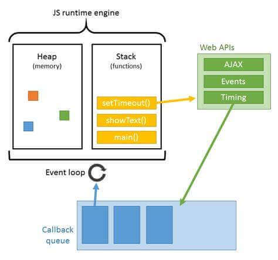

# 单线程异步

`JavaScript`是一门单线程异步的语言。这听起来似乎有点奇怪，只有一个 js 线程，为什么还能实现异步的功能。实际上，js 的异步操作的执行例如网络请求、定时器，并不是在 js 线程上执行，这些能力是由宿主环境提供的。例如在浏览器上有五大线程，`GUI渲染引擎线程`、`JavaScript引擎线程`、`定时器触发线程`、`事件触发线程`、`http异步请求线程`。当我们在 js 代码中发起一个 http 请求时，除了传递相关参数，浏览器会为网络应答设置一个监听器，当得到网络应答后通过将回调函数插入事件轮询来执行。

# 事件循环



每一个`JvaScript`运行时都会有一个`Heap`，`Stack`，`Callback Queue`，会不断地执行清空调用栈，然后又从事件队列中取出一个任务执行，依次往复，直至事件队列为空。

# 编写异步代码

我们可以通过`回调函数`、`Promise`、`async await`编写异步逻辑的代码。但是要注意到使用回调函数会有代码`回调地狱`的问题。使用回调函数还有其他不好的地方，使用它会将代码的控制权给了其他函数，因为我们并不清楚这个函数会怎么调用我们编写的回调函数，并且我们也无法进行干预。

使用`Promise`可以解决上面回调函数的弊端，但是也有代码可读性不好的问题。用`async` `await`可以让我们使用比较类似同步的语法编写异步逻辑。

```javascript
// 回调函数
function func1() {
  $.ajax("https://example.com/login", function (reason, res) {
    if (reason) {
      console.log("fail");
    } else {
      console.log("success");
    }
  });
}

// 使用Promise
function func2() {
  fetch("https://example.com/login").then(
    function (response) {
      console.log("success");
    },
    function (reason) {
      console.log("fail");
    }
  );
}

// 使用async await
async function func3() {
  try {
    const response = await fetch("https://example.com/login");
    console.log("success");
  } catch (reason) {
    console.log("fail");
  }
}
```

# 使用生成器控制异步逻辑

使用`async` `await`可以帮助我们比较好地写出异步逻辑的代码，但是并不能很好地解决我们对于代码异步逻辑测试的需求，使用`async`函数，函数调用者对于内部的异步逻辑的具体执行是无法感知的，只能有函数执行中、函数执行成功、函数执行失败三种状态。借助 ES6 中的`Generator Function`我们可以将函数中对异步逻辑的执行很好地暴露给外部，这样可以更好地控制异步逻辑以及测试，可以帮助我们让测试代码更好地覆盖到比较大的包含异步逻辑的函数。

```javascript
// util.js
const sleep = seconds =>
  new Promise(resolve => {
    setTimeout(() => {
      resolve();
    }, seconds * 1000);
  });

function CallDto(fn, args) {
  this.fn = fn;
  this.args = args;
}

const call = (fn, ...args) => new CallDto(fn, args);

const asyncWrapper = generatorFunc => async (...args) => {
  /**
   * @type {Generator}
   */
  const generator = generatorFunc(...args);
  let done = false;
  let iteratorArgs = args;
  while (!done) {
    const iteratorResult = generator.next(iteratorArgs);
    done = iteratorResult.done;
    if (iteratorResult.value instanceof Promise) {
      iteratorArgs = await iteratorResult.value;
    } else if (iteratorResult.value instanceof CallDto) {
      const { fn, args } = iteratorResult.value;
      iteratorArgs = await fn(args);
    } else {
      iteratorArgs = iteratorResult.value;
    }
  }
};

module.exports = {
  sleep,
  call,
  asyncWrapper,
};

// sleep.js
const { sleep, call } = require("./util");

function* chenSleep(time) {
  console.log("start sleep", Date.now());
  yield sleep(time);
  console.log("awake", Date.now());
  yield call(sleep, time * 2);
  console.log("awake again", Date.now());
}

module.exports = { chenSleep };

// index.js
const { asyncWrapper } = require("./util");
const { chenSleep } = require("./sleep");
asyncWrapper(chenSleep)(2);

// index.spec.js
const { chenSleep } = require("./sleep");
const { describe } = require("mocha");
const assert = require("assert");

describe("test chen sleep well", () => {
  const generator = chenSleep(2);
  it("expected to be a Promise", function () {
    assert(generator.next().value instanceof Promise);
  });
  it("expected sleep 4 seconds", function () {
    assert(generator.next().value.args[0] === 4);
  });
});

/**
 * 运行 index.js
 * start sleep 1599557846539
 * awake 1599557848556
 * awake again 1599557852561
 */

/**
 * 运行 mocha index.spec.js
 *    test chen sleep well
 * start sleep 1599557891720
 *     ✓ expected to be a Promise
 * awake 1599557891724
 *     ✓ expected sleep 4 seconds
 *
 *
 *   2 passing (15ms)
 */
```
