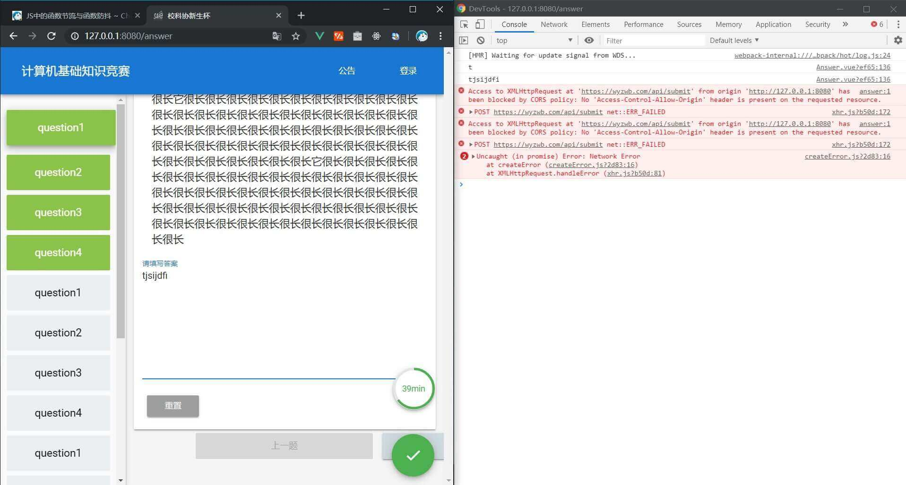
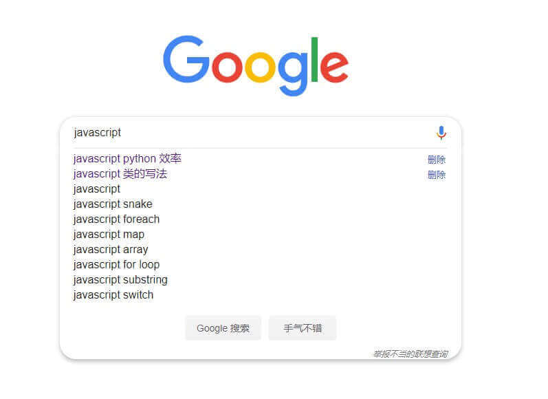

# 什么是函数节流和函数防抖

这两者都是 JavaScript 中的一些优化方法。顾名思义，节流与防抖都是通过一定的方法，较少函数的调用频率，来达到优化的目的。

## 函数防抖 (Debounce)

主要是实现，当一定的事件间隔内连续多次触发指定的事件后，事件处理函数不会立即执行。仅在最后一次触发的若干毫秒后执行事件处理函数。这避免了事件处理函数的多次执行。

## 函数节流 (Throttle)

主要是实现，当指定事件被多次触发后，保证事件处理函数的执行的时间间隔是一样的，都是间隔若个毫秒。就像它的名字一样，是一个水流量很小的水龙头，但是它的流量是稳定的，即时间处理函数的被调用情况从时间上来看是均匀的。

## 应用场景



诶，这是在 2019 校科协新生杯的前端项目 [仓库地址](https://github.com/ChenKS12138/sast_fresh_cup_frontend) 里使用到的。先来说说这个项目吧，这是个前后端分离的项目，接口是我设计的，我们所要讨论的问题是出现在了答题页。答题页需要将题目从服务器端获取，并将选手填写的答案传送到服务器端。题目获取方面，其实更准确地说是，是一些比赛的基本信息方面，包括题目，公告，截至时间等，我就加了一个接口对这些信息求哈希，客户端轮询这个接口。 ~~用 websocket 可能会更好~~ ，一旦有变化，再请求其他相关的接口。因此题目是一次性获取的，并且可能会比赛中途更新。而在提交答案方面，我没有采用一次性提交的方式。主要是怕哪个大佬学弟自己把 localStorage 清除了。但是这就有了一个问题，无论是使用`setInterval` 定时将答案发送到给服务器，还是只给文字输入框加一个监听输入的处理函数，效率都不高。因此使用在这种情况下使用节流和防抖就很有用了。

```javascript
// debounce.js
export default function DebounceConstructor(fn, interval = 0) {
  let timer;
  let wraper;
  function Debounce(...args) {
    if (timer) clearTimeout(timer);
    wraper = () => {
      fn(...args);
      timer = undefined;
    };
    timer = setTimeout(wraper, interval);
  }
  function Clear() {
    if (timer !== undefined) {
      clearTimeout(timer);
      wraper();
    }
  }
  return {
    Debounce,
    Clear,
  };
}
```

这是个闭包，从设计模式上来讲叫单例模式`singleton` 。

因为我还需要在题目切换时，强制处理函数执行，所以多了一个`clear` 。

调用处的代码

```javascript
// answer.vue
import DebounceConstructor from "debounce.js";
const { Debounce: handleTyping, Clear: handleExecute } = DebounceConstructor(
  (val) => {
    submit(val);
    console.log(val);
  },
  800
);
```

这样就如最上面那张图片看到的那样，遇到一系列的输入时，每次输入框的值发生改变时，都会调用`handleTyping`，只有在停止输入若干毫秒后才会执行事件处理函数。

## 另一种处理方式

上面的方案是采用了防抖的方法。其实也可以采用节流的方式。这个可以仔细研究一下。

## 类似的场景



需要使用到节流和防抖的类似的场景还有很多。像我们在搜索引擎输入关键字，底下会有提示框，这也是个应用场景。
