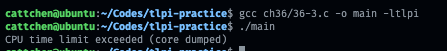
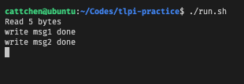

[《the linux programming interface》](https://man7.org/tlpi/index.html)

# 习题

## 第三章

### 3-1

magic number 隐藏着 Torvalds 和他女儿们的生日

https://github.com/torvalds/linux/blob/5bfc75d92efd494db37f5c4c173d3639d4772966/include/uapi/linux/reboot.h

https://www.nndb.com/people/444/000022378/

```c
#include <linux/reboot.h>
#include <stdio.h>
#include <stdlib.h>
#include <sys/syscall.h>
#include <unistd.h>

int main() {
  int code = syscall(SYS_reboot, LINUX_REBOOT_MAGIC1, LINUX_REBOOT_MAGIC2,
                     LINUX_REBOOT_CMD_RESTART);
  if (code == -1) {
    perror("reboot");
    exit(EXIT_FAILURE);
  }
  exit(EXIT_SUCCESS);
}
```

## 第四章

### 4-1

```c
#include <fcntl.h>
#include <stdio.h>
#include <stdlib.h>
#include <unistd.h>

#define BUFFER_SIZE 1024

int main(int argc, char *argv[]) {
  // check argc
  if (argc < 2) {
    fprintf(stderr, "usage: %s [-a] <file>\n", argv[0]);
    exit(EXIT_FAILURE);
  }

  // parse argv
  int flag_append = -1, opt = -1;
  while ((opt = getopt(argc, argv, "a")) != -1) {
    switch (opt) {
    case 'a':
      flag_append = 1;
      break;
    }
  }

  // open destination file
  int flag = O_WRONLY | (flag_append == -1 ? O_TRUNC : O_APPEND);
  int fd = open(argv[argc - 1], flag, 0644);
  if (fd == -1) {
    perror("open dest file");
    exit(EXIT_FAILURE);
  }

  // write file
  char *buf = malloc(BUFFER_SIZE);
  int n = BUFFER_SIZE;
  do {
    n = read(STDIN_FILENO, buf, n);
    write(fd, buf, n);
  } while (n);
  free(buf);
  exit(EXIT_SUCCESS);
}
```

#### 4-2

```c
#include <fcntl.h>
#include <stdio.h>
#include <stdlib.h>
#include <unistd.h>
#define BUFFER_SIZE 1014

int main(int argc, char *argv[]) {
  // check args
  if (argc != 3) {
    fprintf(stderr, "usage %s <src> <dest>", argv[0]);
    exit(EXIT_FAILURE);
  }

  // open {src,dest}
  int fd_src, fd_dest;
  if ((fd_src = open(argv[1], O_RDONLY)) == -1) {
    perror("open src");
    exit(EXIT_FAILURE);
  }
  if ((fd_dest = open(argv[2], O_WRONLY | O_CREAT, 0644)) == -1) {
    perror("open dest");
    exit(EXIT_FAILURE);
  }

  // copy
  char *buf = malloc(BUFFER_SIZE);
  int ino_r, ino_w;
  do {
    ino_r = read(fd_src, buf, BUFFER_SIZE);
    if (ino_r == -1) {
      perror("read src");
      exit(EXIT_FAILURE);
    }
    ino_w = write(fd_dest, buf, ino_r);
    if (ino_w == -1) {
      perror("write dest");
      exit(EXIT_FAILURE);
    }
  } while (ino_r);
  close(fd_src);
  close(fd_dest);
  exit(EXIT_SUCCESS);
}
```

## 第五章

### 5-1

```shell
gcc large-file.c -o large-file -ltlpi \
&& ./target-file 1.txt 10111222333
```

能够成功创建包含文件空洞的大文件，大文件逻辑上为 10GB 左右，但是只占据磁盘空间 4KB。文件空洞使用\0 填充，本身不占据物理空间，当实际有写入时才分配磁盘块。

```c
#define _LARGEFILE64_SOURCE
#include <fcntl.h>
#include <sys/stat.h>
#include <tlpi_hdr.h>

int main(int argc, char *argv[]) {
  int fd;
  off64_t off;
  if (argc != 3 || strcmp(argv[1], "--help") == 0)
    usageErr("%s pathname offset\n", argv[0]);
  fd = open64(argv[1], O_RDWR | O_CREAT, S_IRUSR | S_IWUSR);
  if (fd == -1)
    errExit("open64");
  off = atoll(argv[2]);
  if (lseek(fd, off, SEEK_SET) == -1)
    errExit("lseek64");
  if (write(fd, "test", 4) == -1)
    errExit("write");

  exit(EXIT_SUCCESS);
}
```

### 5-2

使用`O_APPEND`打开文件后，write 前使用 lseek 改变偏移量不能使下次写入位置改变。因为每次的写入都是一个原子操作，会先改变偏移量至文件尾再写入。这样做是为了避免并发共享 fd 时的竞态问题。

> ```
> O_APPEND
>       The file is opened in append mode.  Before each write(2),
>       the file offset is positioned at the end of the file, as
>       if with lseek(2).  The modification of the file offset and
>       the write operation are performed as a single atomic step.
>
>       O_APPEND may lead to corrupted files on NFS filesystems if
>       more than one process appends data to a file at once.
>       This is because NFS does not support appending to a file,
>       so the client kernel has to simulate it, which can't be
>       done without a race condition.
> ```

```c
#include <fcntl.h>
#include <stdio.h>
#include <string.h>
#include <tlpi_hdr.h>
#include <unistd.h>

int main(int argc, char *argv[]) {
  char *text1 = "hello\nhello1\nhello2\n";
  char *text2 = "abc";
  char *filename = "1.txt";
  int ino, fd;

  fd = open(filename, O_WRONLY | O_CREAT | O_TRUNC, 0644);
  if (fd == -1) {
    errExit("open0");
  }
  ino = write(fd, text1, strlen(text1));
  close(fd);
  fd = open(filename, O_WRONLY | O_APPEND, 0644);
  if (fd == -1) {
    errExit("open1");
  }
  ino = lseek(fd, 0, SEEK_SET);
  if (ino == -1) {
    errExit("lseek");
  }
  write(fd, text2, strlen(text2));
  close(fd);
  exit(EXIT_SUCCESS);
}
```

### 5-3

```shell
# generate f1
./atomic_append f1 1000000 & ./atomic_append f1 1000000
# generate f2
./atomic_append f1 1000000 x & ./atomic_append f1 1000000 x
```


不使用`O_APPEND`会发生竞态问题。t4 时 process1 的 fd 的偏移量并不是文件尾，而是最后一个字节，因此没有成为在文件尾添加一个字节。

| time slice | process1              | process2              |
| ---------- | --------------------- | --------------------- |
| t1         | lseek(fd,0,SEEK_END); |                       |
| t2         |                       | lseek(fd,0,SEEK_END); |
| t3         |                       | write(fd,"a",1);      |
| t4         | write(fd,"a",1);      |                       |

```c
#include <fcntl.h>
#include <stdio.h>
#include <string.h>
#include <tlpi_hdr.h>
#include <unistd.h>

int main(int argc, char *argv[]) {
  if (argc < 3) {
    usageErr("%s filename num-bytes [x]", argv[0]);
  }
  int fd, ino, num_bytes, open_flag;
  num_bytes = atoll(argv[2]);
  open_flag = O_WRONLY | O_CREAT;
  if (!(argc > 3 && strcmp(argv[3], "x") == 0)) {
    open_flag |= O_APPEND;
  }
  fd = open(argv[1], open_flag, 0644);
  if (fd == -1) {
    errExit("open");
  }
  while ((num_bytes--) > 0) {
    ino = lseek(fd, 0, SEEK_END);
    if (ino == -1) {
      errExit("lseek");
    }
    ino = write(fd, "a", 1);
    if (ino == -1) {
      errExit("write");
    }
  }
  close(fd);
}
```

### 5-4

```c
#include <assert.h>
#include <fcntl.h>
#include <stdio.h>
#include <stdlib.h>
#include <string.h>
#include <tlpi_hdr.h>
#include <unistd.h>

int tlpi_dup(int oldfd) { return fcntl(oldfd, F_DUPFD); }

int tlpi_dup2(int oldfd, int newfd) {
  int ino;
  if (oldfd == newfd) {
    ino = fcntl(oldfd, F_GETFL);
    if (ino == -1) {
      errno = EBADF;
      return -1;
    }
    return oldfd;
  }
  close(newfd);
  newfd = fcntl(oldfd, F_DUPFD, newfd);
  return newfd;
};

int main() {
  int fd, fd2, ino;
  char *text = "hello123\n";

  // validate tlpi_dup
  fd = open("1.txt", O_RDWR | O_CREAT | O_TRUNC, 0644);
  fd2 = tlpi_dup(fd);
  write(fd2, text, strlen(text));
  close(fd);

  char *buf1 = malloc(strlen(text) + 1);
  fd = open("1.txt", O_RDONLY);
  read(fd, buf1, strlen(text) + 1);
  assert(strcmp(buf1, text) == 0);
  close(fd);

  // validate tlpi_dup2
  fd = open("2.txt", O_RDWR | O_CREAT | O_TRUNC, 0644);
  tlpi_dup2(fd, STDOUT_FILENO);
  write(STDOUT_FILENO, text, strlen(text));
  close(fd);
  char *buf2 = malloc(strlen(text) + 1);
  fd = open("2.txt", O_RDONLY);
  read(fd, buf2, strlen(text) + 1);
  assert(strcmp(buf2, text) == 0);
  close(fd);

  exit(EXIT_SUCCESS);
}
```

### 5-5

```c
#include <assert.h>
#include <fcntl.h>
#include <stdio.h>
#include <stdlib.h>
#include <string.h>
#include <tlpi_hdr.h>
#include <unistd.h>

int tlpi_dup(int oldfd) { return fcntl(oldfd, F_DUPFD); }

int tlpi_dup2(int oldfd, int newfd) {
  int ino;
  if (oldfd == newfd) {
    ino = fcntl(oldfd, F_GETFL);
    if (ino == -1) {
      errno = EBADF;
      return -1;
    }
    return oldfd;
  }
  close(newfd);
  newfd = fcntl(oldfd, F_DUPFD, newfd);
  return newfd;
};

int main() {
  int fd, fd2, offset1, offset2, file_flag1, file_flag2;
  char *text = "hello world\n";
  fd = open("1.txt", O_RDWR | O_CREAT | O_TRUNC, 0644);
  write(fd, text, strlen(text));
  offset1 = lseek(fd, 3, SEEK_SET);
  file_flag1 = fcntl(fd, F_GETFL);
  fd2 = tlpi_dup(fd);
  offset2 = lseek(fd2, 0, SEEK_CUR);
  file_flag2 = fcntl(fd2, F_GETFL);
  // validate offset
  assert(offset1 == offset2);
  // validate file flag
  assert(file_flag1 == file_flag2);
  close(fd);
  close(fd2);
  exit(EXIT_SUCCESS);
}
```

### 5-6

```c
#include <assert.h>
#include <fcntl.h>
#include <stdio.h>
#include <string.h>
#include <unistd.h>

char *file = "1.txt";
char buffer[20];

void assert_file(char *content) {
  int fd = open(file, O_RDONLY);
  read(fd, buffer, 20);
  close(fd);
  assert(strcmp(buffer, content) == 0);
}

int main() {
  int fd1, fd2, fd3;
  fd1 = open(file, O_RDWR | O_CREAT | O_TRUNC, S_IRUSR | S_IWUSR);
  fd2 = dup(fd1);
  fd3 = open(file, O_RDWR);
  write(fd1, "Hello,", 6); // Hello,
  assert_file("Hello,");
  write(fd2, "world", 6); // Hello,world
  assert_file("Hello,world");
  lseek(fd2, 0, SEEK_SET);
  write(fd1, "HELLO,", 6); // HELLO,world
  assert_file("HELLO,world");
  write(fd3, "Gidday", 6); // Giddayworld
  assert_file("Giddayworld");
  close(fd1);
  close(fd2);
  close(fd3);
}
```

### 5-7

```c
#include <assert.h>
#include <fcntl.h>
#include <stdio.h>
#include <stdlib.h>
#include <string.h>
#include <sys/param.h>
#include <sys/uio.h>
#include <tlpi_hdr.h>
#include <unistd.h>

int tlpi_readv(int fd, const struct iovec *iov, int count) {
  int size, ino;
  char *buf;
  for (int i = 0; i < count; i++) {
    size += (iov + i)->iov_len;
  }
  buf = malloc(size);
  ino = read(fd, buf, size);
  if (ino != -1) {
    int byte_size = ino;
    for (int i = 0; i < count; i++) {
      const struct iovec *curr = iov + i;
      if (ino > 0) {
        memcpy(curr->iov_base, buf + (size - byte_size),
               MIN(curr->iov_len, byte_size));
        byte_size -= curr->iov_len;
      }
    }
  }
  free(buf);
  return ino;
}

int tlpi_writev(int fd, const struct iovec *iov, int count) {
  int size, ino, offset = 0;
  char *buf;
  for (int i = 0; i < count; i++) {
    size += (iov + i)->iov_len;
  }
  buf = malloc(size);
  for (int i = 0; i < count; i++) {
    const struct iovec *curr = iov + i;
    memcpy(buf + offset, curr->iov_base, curr->iov_len);
    offset += curr->iov_len;
  }
  ino = write(fd, buf, size);
  free(buf);
  return ino;
}

int main() {
  struct iovec iov1[2], iov2[2];
  int fd, ino;
  char *file = "1.txt";
  char *text1 = "hello c";
  char *text2 = "attchen";

  iov1[0].iov_base = malloc(7);
  iov1[0].iov_len = 7;
  iov1[1].iov_base = malloc(7);
  iov1[1].iov_len = 7;

  iov2[0].iov_base = malloc(7);
  iov2[0].iov_len = 7;
  iov2[1].iov_base = malloc(7);
  iov2[1].iov_len = 7;

  fd = open(file, O_RDWR | O_CREAT | O_TRUNC, 0644);

  memcpy(iov1[0].iov_base, text1, 7);
  memcpy(iov1[1].iov_base, text2, 7);
  ino = writev(fd, iov1, 2);
  if (ino == -1)
    errExit("writev");
  ino = lseek(fd, 0, SEEK_SET);
  if (ino == -1)
    errExit("lseek1");
  ino = tlpi_readv(fd, iov2, 2);
  if (ino == -1)
    errExit("tlpi_readv");
  assert(memcmp(iov1[0].iov_base, iov2[0].iov_base, iov1[0].iov_len) == 0);
  assert(memcmp(iov1[1].iov_base, iov2[1].iov_base, iov1[1].iov_len) == 0);
  assert(memcmp(iov1[0].iov_base, text1, iov1[0].iov_len) == 0);
  assert(memcmp(iov1[1].iov_base, text2, iov1[1].iov_len) == 0);

  ino = ftruncate(fd, 0);
  if (ino == -1)
    errExit("ftruncate");
  ino = lseek(fd, 0, SEEK_SET);
  if (ino == -1)
    errExit("lseek");
  memcpy(iov2[0].iov_base, text2, 8);
  memcpy(iov2[1].iov_base, text1, 8);
  ino = tlpi_writev(fd, iov2, 2);
  if (ino == -1)
    errExit("tlpi_writev");
  ino = lseek(fd, 0, SEEK_SET);
  if (ino == -1)
    errExit("lseek2");
  ino = readv(fd, iov1, 2);
  if (ino == -1)
    errExit("readv");
  assert(memcmp(iov1[0].iov_base, iov2[0].iov_base, iov1[0].iov_len) == 0);
  assert(memcmp(iov1[1].iov_base, iov2[1].iov_base, iov1[1].iov_len) == 0);
  assert(memcmp(iov2[0].iov_base, text2, iov1[0].iov_len) == 0);
  assert(memcmp(iov2[1].iov_base, text1, iov1[1].iov_len) == 0);

  free(iov1[0].iov_base);
  free(iov1[1].iov_base);
  free(iov2[0].iov_base);
  free(iov2[1].iov_base);
}
```

## 第六章

### 6-1

10MB 的数组指的是变量`main.mbuf`，它没有被初始化，是分配到 bss 段，在最后生成的代码中只记录的大小。

```c
// 方式1 初始化 mbuf会被分配到 data segment
static char mbuf[10240000] = {1};
// 方式2 赋值 mbuf被分配到 bss segment
static char mbuf[10240000];
mbuf[0]=1;
```


但是如果对 mbuf 进行初始化，会在最后的 binaray 占用 10MB 的空间存储 mbuf 的值，程序运行时再直接拷贝到 data segment。bss 区的数据不用去占据 ELF 文件的磁盘空间。

[https://stackoverflow.com/questions/16557677/difference-between-data-section-and-the-bss-section-in-c](https://stackoverflow.com/questions/16557677/difference-between-data-section-and-the-bss-section-in-c)

> Data
>
> The values for these variables are initially stored within the read-only memory (typically within the code segment) and are copied into the data segment during the start-up routine of the program.

### 6-2

```c
#include <setjmp.h>
#include <tlpi_hdr.h>

static jmp_buf env;

void f1() {
  printf("in f1\n");
  if (setjmp(env) == 1) {
    printf("jump from f2()\n");
  }
}

void f2() {
  printf("in f2\n");
  longjmp(env, 1);
}

int main() {
  f1();
  f2();
}
```

### 6-3

```c
#include <assert.h>
#include <stdio.h>
#include <stdlib.h>
#include <string.h>
#include <tlpi_hdr.h>

#define TLPI_ENV_SUCCESS 1

extern char **environ;

int tlpi_setenv(const char *name, const char *value, int overwrite) {
  char *str;
  int l_name, l_value, ino;

  str = getenv(name);
  if (str != NULL && !overwrite) {
    return TLPI_ENV_SUCCESS;
  }
  if (str != NULL) {
    free(str);
  }
  l_name = strlen(name);
  l_value = strlen(value);
  str = malloc(l_name + l_value + 2);
  strcpy(str, name);
  strcpy(str + l_name + 1, value);
  str[l_name] = '=';
  ino = putenv(str);
  return ino;
};

int tlpi_unsetenv(const char *name) {
  extern char **environ;
  char **ep_curr, **ep_end;
  int ep_len;
  for (ep_curr = environ; *ep_curr != NULL; ep_curr++) {
  }
  ep_len = ep_curr - environ;
  ep_end = environ + ep_len;
  for (ep_curr = environ; ep_curr != ep_end; ep_curr++) {
    char *name_p1 = *ep_curr, *name_p2 = (char *)(name);
    while (*name_p1 == *name_p2 && *name_p2 != 0) {
      name_p1++;
      name_p2++;
    }
    if (*name_p1 == '=' && *name_p2 == 0) {
      ep_end--;
      if (ep_curr == ep_end) {
        *ep_curr = NULL;
      } else {
        *ep_curr = *ep_end;
        *ep_end = NULL;
      }
      continue;
    }
  }
  return TLPI_ENV_SUCCESS;
};

int main() {
  char *key1 = "TLPI_TEST", *value1 = "cattchen", *key2 = "TLPI_TEST_2",
       *value2 = "value2";
  int ino;

  clearenv();
  ino = tlpi_setenv(key1, value1, 1);
  if (ino == -1) {
    errExit("tlpi_setenv1");
  }
  assert(strcmp(getenv(key1), value1) == 0);
  ino = tlpi_setenv(key2, value2, 1);
  if (ino == -1) {
    errExit("tlpi_setenv2");
  }
  ino = tlpi_setenv(key2, value1, 0);
  if (ino == -1) {
    errExit("tlpi_setenv3");
  }
  assert(strcmp(getenv(key2), value2) == 0);

  ino = tlpi_unsetenv(key2);
  if (ino == -1) {
    errExit("tlpi_unsetenv1");
  }
  assert(getenv(key2) == NULL);
  ino = tlpi_unsetenv(key1);
  if (ino == -1) {
    errExit("tlpi_unsetenv2");
  }
  assert(getenv(key1) == NULL);
}
```

## 第七章

### 7-1


```c
#include <tlpi_hdr.h>
#define MAX_ALLOCS 1000000

int main(int argc, char *argv[]) {
  char *ptr[MAX_ALLOCS];
  int freeStep, freeMin, freeMax, blockSize, numAllocs, j;
  printf("\n");
  if (argc < 3)
    usageErr("%s num-allocs block-size [step [min [max]]]\n", argv[0]);

  numAllocs = getInt(argv[1], GN_GT_0, "num-allocs");
  if (numAllocs > MAX_ALLOCS)
    cmdLineErr("free-max > num-allocs\n");

  blockSize = getInt(argv[2], GN_GT_0 | GN_ANY_BASE, "bolck-size");

  freeStep = (argc > 3) ? getInt(argv[3], GN_GT_0, "step") : 1;
  freeMin = (argc > 4) ? getInt(argv[4], GN_GT_0, "min") : 1;
  freeMax = (argc > 5) ? getInt(argv[5], GN_GT_0, "max") : numAllocs;

  if (freeMax > numAllocs)
    cmdLineErr("free-max > num-allocs\n");

  printf("Initial program brea: %10p\n", sbrk(0));
  printf("Allocating %d*%d bytes\n", numAllocs, blockSize);
  for (j = 0; j < numAllocs; j++) {
    ptr[j] = malloc(blockSize);
    if (ptr[j] == NULL)
      errExit("malloc");
    printf("Current Program Break %10p\n", sbrk(0));
  }

  printf("Program break is now %10p\n", sbrk(0));
  printf("Freeing blocks from %d to %d in steps of %d\n", freeMin, freeMax,
         freeStep);

  for (j = freeMin - 1; j < freeMax; j += freeStep)
    free(ptr[j]);
  printf("After free(),program break is %10p\n", sbrk(0));
  exit(EXIT_SUCCESS);
}
```

### 7-2

主要是踩了一个坑，调试花了比较长的时间，指针值进行相加减时，会有隐式的类型转换，最后得到的结果也不是我预想的字节数。同时标准库的 printf 有调用 malloc 建立缓冲区需要注意。


```c
#include <assert.h>
#include <stdarg.h>
#include <stdint.h>
#include <stdio.h>
#include <stdlib.h>
#include <string.h>
#include <unistd.h>

#define PRINT_BUFFER_SIZE 200
char msgbuf[PRINT_BUFFER_SIZE];

// printf 会使用glibc/malloc
int tlpi_printf(char *format, ...) {
  va_list arglist;
  int ret, len;
  va_start(arglist, format);
  vsnprintf(msgbuf, PRINT_BUFFER_SIZE, format, arglist);
  len = strlen(msgbuf);
  ret = write(STDOUT_FILENO, msgbuf, len);
  va_end(arglist);
  return ret;
};

/**
 * low address               ->           high address
 * malloc_meta|buffer|...|malloc_meta|buffer|
 *  ↑                      ↑
 * [malloc_meta_first]    [malloc_meta_last]
 */
typedef struct malloc_meta {
  // TODO *prev *next 减小体积
  struct malloc_meta *prev;
  struct malloc_meta *next;
  unsigned short is_in_use : 1;
} malloc_meta;

#define MALLOC_META_SIZE (sizeof(malloc_meta))
#define MALLOC_META_INUSE 1
#define MALLOC_META_NOUSE 0
#define malloc_size(curr)                                                      \
  (((char *)(curr) - (char *)(curr->prev)) - sizeof(malloc_meta))

static malloc_meta *malloc_meta_first = NULL; // address of first malloc_meta
static malloc_meta *malloc_meta_last = NULL;  // address of last malloc_meta

void *tlpi_malloc(int size) {
  if (size < 0)
    return NULL;
  malloc_meta *curr = malloc_meta_first, *candidate = NULL;
  size_t curr_size, candidate_size = SIZE_MAX;
  while (curr) {
    curr_size = malloc_size(curr);
    if (curr->is_in_use == MALLOC_META_NOUSE && curr_size >= size &&
        curr_size < candidate_size) {
      candidate = curr;
      candidate_size = curr_size;
    }
    curr = curr->next;
  }
  if (candidate == NULL) {
    void *ino;
    ino = sbrk(size + MALLOC_META_SIZE);
    if (ino == (void *)(-1)) {
      return NULL;
    }
    candidate = ino;
    if (malloc_meta_first == NULL) {
      malloc_meta_first = candidate;
    } else {
      malloc_meta_last->next = candidate;
      candidate->prev = malloc_meta_last;
    }
    malloc_meta_last = candidate;
  } else if (candidate->prev != NULL) {
    malloc_meta *rest;
    size_t rest_size;
    rest_size = malloc_size(candidate) - size;
    if (rest_size > MALLOC_META_SIZE) {
      rest = (malloc_meta *)((char *)(candidate) + MALLOC_META_SIZE + size);
      rest->is_in_use = MALLOC_META_NOUSE;
      if (candidate != malloc_meta_last) {
        candidate->next->prev = rest;
      }
      rest->next = candidate->next;
      rest->prev = candidate;
      candidate->next = rest;
    }
  }
  candidate->is_in_use = MALLOC_META_INUSE;
  return (void *)((char *)(candidate) + MALLOC_META_SIZE);
};

void tlpi_free(void *ptr) {
  malloc_meta *curr;
  size_t curr_size;
  curr = (malloc_meta *)((char *)(ptr)-MALLOC_META_SIZE);
  curr->is_in_use = MALLOC_META_NOUSE;
  while (curr && curr == malloc_meta_last &&
         curr->is_in_use == MALLOC_META_NOUSE) {
    curr_size = malloc_size(curr) + MALLOC_META_SIZE;
    sbrk(-curr_size);
    curr = curr->prev;
    malloc_meta_last = curr;
  }
  if (malloc_meta_last == NULL) {
    malloc_meta_first = NULL;
  }
};

int main() {
  int *ptr_arr[20];
  for (int i = 0; i < 20; i++) {
    ptr_arr[i] = tlpi_malloc(sizeof(int) * (20 - i));
    *ptr_arr[i] = i + 1;
  }
  for (int i = 0; i < 20; i++) {
    assert(*ptr_arr[i] == i + 1);
  }
  for (int i = 0; i < 10; i++) {
    tlpi_free(ptr_arr[i]);
    ptr_arr[i] = tlpi_malloc(sizeof(int) * (i + 1));
    *ptr_arr[i] = i + 1;
  }
  for (int i = 0; i < 20; i++) {
    assert(*ptr_arr[i] == i + 1);
  }
}
```

## 第八章

### 8-1

这个问题本身是有的问题的，示例代码可能被优化为两种结果（这个取决于编译器），同时两次`getpwnam`返回的是同一个指针，只是两次这个指针指向的内容不同，所以才导致了这个现象。

https://stackoverflow.com/questions/37043139/statically-allocated-variable-when-using-getpwnam

```c
// 原始代码
printf("%ld %ld\n", (long)(getpwnam("cattchen")->pw_uid), (long)(getpwnam("root")->pw_uid));

// 编译器可能的优化结果1
struct passwd *p1, *p2;
p1 = getpwnam("cattchen");
p2 = getpwnam("root");
printf("%u\n", p1->pw_uid);
printf("%u\n", p2->pw_uid);

// 编译器可能的优化结果2
struct passwd *p1, *p2;
p1 = getpwnam("cattchen");
printf("%u\n", p1->pw_uid);
p2 = getpwnam("root");
printf("%u\n", p2->pw_uid);

// 避免歧义的写法
printf("%ld %ld\n",(long)((*getpwnam("cattchen")).pw_uid),(long)((*getpwnam("root")).pw_uid));
```

### 8-2

```c
#include <assert.h>
#include <pwd.h>
#include <string.h>

struct passwd *tlpi_getpwnam(const char *name) {
  struct passwd *pw;
  setpwent();
  do {
    pw = getpwent();
  } while (pw && strcmp(pw->pw_name, name) != 0);
  endpwent();
  return pw;
}

int main() {
  assert((*(getpwnam("root"))).pw_uid == (*(tlpi_getpwnam("root"))).pw_uid);
  assert((*(getpwnam("cattchen"))).pw_uid ==
         (*(tlpi_getpwnam("cattchen"))).pw_uid);
}
```

## 第九章

### 9-1

```c
#define _GNU_SOURCE
#include <assert.h>
#include <stdio.h>
#include <sys/fsuid.h>
#include <unistd.h>

int main() {
  uid_t u_real, u_effective, u_saved, u_fs = 0;
  getresuid(&u_real, &u_effective, &u_saved);
  u_fs = setfsuid(u_fs);
  assert(u_real == 1000 && u_effective == 0 && u_saved == 0 && u_fs == 0);
  printf("precheck pass\n");

  // setuid(2000);
  // getresuid(&u_real, &u_effective, &u_saved);
  // printf("%d %d %d\n", u_real, u_effective, u_saved);
  // assert(u_real == 2000 && u_effective == 2000 && u_saved == 2000);
  // printf("a passed\n");

  // setreuid(-1, 2000);
  // getresuid(&u_real, &u_effective, &u_saved);
  // printf("%d %d %d\n", u_real, u_effective, u_saved);
  // assert(u_real == 1000 && u_effective == 2000 && u_saved == 2000);
  // printf("b passed\n");

  // seteuid(2000);
  // getresuid(&u_real, &u_effective, &u_saved);
  // printf("%d %d %d\n", u_real, u_effective, u_saved);
  // assert(u_real == 1000 && u_effective == 2000 && u_saved == 0);
  // printf("c passed\n");

  // setresuid(-1, 2000, 3000);
  // getresuid(&u_real, &u_effective, &u_saved);
  // printf("%d %d %d\n", u_real, u_effective, u_saved);
  // assert(u_real == 1000 && u_effective == 2000 && u_saved == 3000);
  // printf("e passed\n");
}
```

### 9-2

该进程不享有特权，因为`effective`不为 0。

### 9-3

```c
#include <grp.h>
#include <limits.h>
#include <pwd.h>
#include <stdio.h>
#include <tlpi_hdr.h>

int tlpi_initgroups(const char *name, gid_t group) {
  struct group *g;
  char **mem;
  gid_t grouplist[NGROUPS_MAX + 1];
  size_t grouplist_len = 0;
  int ino;
  setgrent();
  while ((g = getgrent()) != NULL) {
    for (mem = g->gr_mem; *mem != NULL; mem++) {
      if (strcmp(*mem, name) == 0) {
        grouplist[grouplist_len++] = g->gr_gid;
        break;
      }
    }
  }
  endgrent();
  grouplist[grouplist_len++] = group;
  ino = setgroups(grouplist_len, grouplist);
  return ino;
}

int main() {
  gid_t grouplist[NGROUPS_MAX + 1];
  int ino;
  ino = tlpi_initgroups("cattchen", 3000);
  if (ino == -1) {
    errExit("initgroups");
  }

  ino = getgroups(NGROUPS_MAX + 1, grouplist);
  if (ino == -1) {
    errExit("getgroups");
  }
  for (int i = 0; i < ino; i++) {
    printf("%d\n", grouplist[i]);
  }
}
```

### 9-4

```c
#define _GNU_SOURCE
#include <stdio.h>
#include <tlpi_hdr.h>
#include <unistd.h>

static uid_t u1, u2, u3;
void show_uid() {
  int ino;
  ino = getresuid(&u1, &u2, &u3);
  if (ino == -1) {
    errExit("getresuid");
  }
  printf("real %d effective %d saved %d\n", u1, u2, u3);
}

int main() {
  int ino;
  show_uid();

  // a
  // ino = seteuid(u1);
  // if (ino == -1) {
  //   errExit("seteuid");
  // }
  // show_uid();
  // exit(EXIT_SUCCESS);

  // b
  // ino = setresuid(u1, u1, u1);
  // show_uid();
}
```

### 9-5

```c
#define _GNU_SOURCE
#include <stdio.h>
#include <tlpi_hdr.h>
#include <unistd.h>

static uid_t u1, u2, u3;
void show_uid() {
  int ino;
  ino = getresuid(&u1, &u2, &u3);
  if (ino == -1) {
    errExit("getresuid");
  }
  printf("real %d effective %d saved %d\n", u1, u2, u3);
}

/*
 * # shell process real user as cattchen
 * gcc ch9/9-5.c -o set-user-ID-root -ltlpi
 * sudo chown root set-user-ID-root
 * sudo chmod u+s set-user-ID-root
 * ./set-user-ID-root
 */

int main() {
  int ino;
  show_uid();
}
```

## 第十章

### 10-1

需要隔 42949672 秒

```c
#include <stdint.h>
#include <sys/times.h>
#include <tlpi_hdr.h>

#define BUF_SIZE 200

int main() {
  int clock_per_second = sysconf(_SC_CLK_TCK);
  double res = UINT32_MAX / clock_per_second;
  printf("%lf\n", res);
}
```

## 第十一章

### 11-1

```c
#include <tlpi_hdr.h>

static void sysconfPrint(const char *msg, int name) {
  long lim;
  errno = 0;
  lim = sysconf(name);
  if (lim != -1) {
    printf("%s %ld\n", msg, lim);
  } else {
    if (errno == 0) {
      printf("%s (indeterminate)\n", msg);
    } else {
      errExit("sysconf %s", msg);
    }
  }
}

int main() {
  sysconfPrint("_SC_ARG_MAX: ", _SC_ARG_MAX);
  sysconfPrint("_SC_LOGIN_NAME_MAX: ", _SC_LOGIN_NAME_MAX);
  sysconfPrint("_SC_OPEN_MAX: ", _SC_OPEN_MAX);
  sysconfPrint("_SC_NGROUPS_MAX: ", _SC_NGROUPS_MAX);
  sysconfPrint("_SC_PAGESIZE: ", _SC_PAGESIZE);
  sysconfPrint("_SC_RTSIG_MAX: ", _SC_RTSIG_MAX);
  exit(EXIT_SUCCESS);
}
```

## 第十二章

### 12-1

```c
#include <ctype.h>
#include <dirent.h>
#include <fcntl.h>
#include <pwd.h>
#include <stdio.h>
#include <string.h>
#include <tlpi_hdr.h>
#include <unistd.h>

#define AUTOINCMM_INIT_SIZE 32

typedef struct auto_inc_mm {
  void *ptr;
  unsigned int size;
  unsigned int pos;
} auto_inc_mm;

auto_inc_mm *autoincmm_create() {
  auto_inc_mm *mm;
  mm = malloc(sizeof(auto_inc_mm));
  mm->ptr = malloc(AUTOINCMM_INIT_SIZE + 1);
  mm->size = AUTOINCMM_INIT_SIZE;
  mm->pos = 0;
  return mm;
}

struct proc_status_item {
  char *name;
  char *value;
};

void autoincmm_append(auto_inc_mm *mm, void *src, size_t size) {
  unsigned int next_size = mm->size;
  while (size + mm->pos >= next_size) {
    next_size = next_size * (next_size < 1024 ? 2 : 1.25);
  }
  if (next_size != mm->size) {
    void *next_ptr = malloc(next_size + 1);
    memcpy(next_ptr, mm->ptr, mm->pos);
    mm->ptr = next_ptr;
    mm->size = next_size;
  }
  memcpy(mm->ptr + mm->pos, src, size);
  mm->pos += size;
  *(((char *)(mm->ptr) + mm->pos)) = 0;
};

void autoincmm_reset(auto_inc_mm *mm) { mm->pos = 0; }

static int ps_fd;

int setpsent(const char *filename) {
  ps_fd = open(filename, O_RDONLY);
  return ps_fd;
}

#define BUFFER_SIZE 32
struct proc_status_item *getpsent() {
  int ino;
  static auto_inc_mm *mm;
  static char buffer[BUFFER_SIZE];
  static unsigned int pos_buffer = 0;

  static struct proc_status_item curr;
  static auto_inc_mm *curr_name;
  static auto_inc_mm *curr_value;

  if (mm == NULL)
    mm = autoincmm_create();
  if (curr_name == NULL)
    curr_name = autoincmm_create();
  if (curr_value == NULL)
    curr_value = autoincmm_create();

  autoincmm_reset(mm);
  autoincmm_reset(curr_name);
  autoincmm_reset(curr_value);

  while (1) {
    ino = read(ps_fd, buffer, BUFFER_SIZE);
    if (ino == -1)
      errExit("read");
    if (ino == 0) {
      return NULL;
    }
    pos_buffer = ino;
    for (int i = 0; i < ino; i++) {
      if (buffer[i] == '\n') {
        pos_buffer = i;
        break;
      }
    }
    autoincmm_append(mm, buffer, pos_buffer);
    if (pos_buffer != ino) {
      int offset = pos_buffer - ino + 1;
      lseek(ps_fd, offset, SEEK_CUR);
      break;
    }
  }
  int i = 0;
  while (*(char *)(mm->ptr + i) != ':') {
    autoincmm_append(curr_name, mm->ptr + (i++), 1);
  }
  i++;
  while (*(char *)(mm->ptr + i) == '\t' || *(char *)(mm->ptr + i) == ' ') {
    i++;
  };
  while (*(char *)(mm->ptr + i) != 0) {
    autoincmm_append(curr_value, mm->ptr + (i++), 1);
  }
  curr.name = curr_name->ptr;
  curr.value = curr_value->ptr;
  return &curr;
}

int endpsent() { return close(ps_fd); }

uid_t uid_from_name(const char *name) {
  struct passwd *pw;
  pw = getpwnam(name);
  if (pw == NULL)
    errExit("getpwnam");
  return pw->pw_uid;
}

int main(int argc, char *argv[]) {
  if (argc < 2)
    usageErr("%s <user>\n", argv[0]);
  uid_t uid;
  int ino;
  char filename[64];
  DIR *dir;
  struct dirent *dire;
  struct proc_status_item *curr;

  uid = uid_from_name(argv[1]);
  dir = opendir("/proc");
  while ((dire = readdir(dir)) != NULL) {
    if (!strspn(dire->d_name, "1234567890") || dire->d_type != DT_DIR) {
      continue;
    }
    snprintf(filename, 64, "/proc/%s/status", dire->d_name);
    ino = setpsent(filename);
    if (ino == -1) {
      continue;
    }
    char *name = NULL;
    uid_t curr_uid = -1;
    while ((curr = getpsent()) != NULL) {
      if (strcmp(curr->name, "Name") == 0) {
        name = malloc(strlen(curr->value) + 1);
        strcpy(name, curr->value);
      } else if (strcmp(curr->name, "Uid") == 0) {
        curr_uid = atol(curr->value);
      }
    }
    if (curr_uid == uid) {
      puts(name);
    }
    endpsent();
  };
}
```

### 12-2


```c
#include <dirent.h>
#include <fcntl.h>
#include <stdio.h>
#include <stdlib.h>
#include <string.h>
#include <tlpi_hdr.h>
#include <unistd.h>

#define AUTOINCMM_SIZE_INIT 32

typedef struct auto_inc_mm {
  void *ptr;
  size_t size;
  size_t pos;
} auto_inc_mm;

auto_inc_mm *autoincmm_create() {
  auto_inc_mm *mm = malloc(sizeof(auto_inc_mm));
  mm->ptr = malloc(AUTOINCMM_SIZE_INIT);
  mm->size = AUTOINCMM_SIZE_INIT;
  mm->pos = 0;
  return mm;
}

void autoincmm_append(auto_inc_mm *mm, void *ptr, size_t size) {
  size_t next_size = mm->size;
  while (mm->pos + size >= next_size) {
    next_size = next_size * (next_size <= 1024 ? 2 : 1.25);
  }
  if (next_size != mm->size) {
    void *next_ptr = malloc(next_size);
    memcpy(next_ptr, mm->ptr, mm->pos);
    free(mm->ptr);
    mm->ptr = next_ptr;
  }
  memcpy(mm->ptr + mm->pos, ptr, size);
  mm->pos += size;
}

void autoincmm_reset(auto_inc_mm *mm) { mm->pos = 0; }

struct pstree_node {
  char *name;
  unsigned int pid;
  unsigned int ppid;
} pstree_node;

struct ps_item {
  char *name;
  char *value;
};

static int ps_fd = -1;
int setpsent(const char *filename) {
  ps_fd = open(filename, O_RDONLY);
  return ps_fd;
};
struct ps_item *getpsent() {
  static char buffer[AUTOINCMM_SIZE_INIT];
  static auto_inc_mm *mm = NULL;
  static auto_inc_mm *curr_name = NULL;
  static auto_inc_mm *curr_value = NULL;
  static struct ps_item curr;
  int ino;
  unsigned int pos;

  if (mm == NULL)
    mm = autoincmm_create();
  if (curr_name == NULL)
    curr_name = autoincmm_create();
  if (curr_value == NULL)
    curr_value = autoincmm_create();

  autoincmm_reset(mm);
  autoincmm_reset(curr_name);
  autoincmm_reset(curr_value);

  while (1) {
    ino = read(ps_fd, buffer, AUTOINCMM_SIZE_INIT);
    if (ino == -1)
      errExit("read");
    if (ino == 0) {
      return NULL;
    }
    pos = ino;
    for (int i = 0; i < ino; i++) {
      if (buffer[i] == '\n') {
        pos = i;
        break;
      }
    }
    autoincmm_append(mm, buffer, pos);
    if (pos != ino) {
      autoincmm_append(mm, "", 1);
      int offset = pos - ino + 1;
      lseek(ps_fd, offset, SEEK_CUR);
      break;
    }
  }
  int i = 0;
  while (*((char *)(mm->ptr) + i) != ':') {
    autoincmm_append(curr_name, mm->ptr + (i++), 1);
  }
  i++;
  while (*((char *)(mm->ptr) + i) == ' ' || *((char *)(mm->ptr) + i) == '\t') {
    i++;
  }
  while (*((char *)(mm->ptr) + i) != 0) {
    autoincmm_append(curr_value, mm->ptr + (i++), 1);
  }
  autoincmm_append(curr_name, "", 1);
  autoincmm_append(curr_value, "", 1);
  curr.name = curr_name->ptr;
  curr.value = curr_value->ptr;
  return &curr;
};
void endpsend() { close(ps_fd); };

void print_pstree(struct pstree_node **list, int ppid, int depth) {
  for (struct pstree_node **item = list; *item != NULL; item++) {
    if (ppid == (*item)->ppid) {
      for (int i = 0; i < depth; i++) {
        printf("|\t");
      }
      printf("|---%s(%d)\n", (*item)->name, (*item)->pid);
      print_pstree(list, (*item)->pid, depth + 1);
    }
  }
}

int main() {
  char filename[PATH_MAX];
  DIR *d;
  struct dirent *dire;
  d = opendir("/proc");
  struct pstree_node *ps;
  struct ps_item *curr;
  auto_inc_mm *list = autoincmm_create();
  while ((dire = readdir(d)) != NULL) {
    if (!strspn(dire->d_name, "1234567890") || dire->d_type != DT_DIR) {
      continue;
    }
    snprintf(filename, PATH_MAX, "/proc/%s/status", dire->d_name);
    ps = malloc(sizeof(struct pstree_node));
    setpsent(filename);
    while ((curr = getpsent()) != NULL) {
      if (strcmp(curr->name, "Name") == 0) {
        ps->name = malloc(strlen(curr->value) + 1);
        strcpy(ps->name, curr->value);
      } else if (strcmp(curr->name, "Pid") == 0) {
        ps->pid = atoi(curr->value);
      } else if (strcmp(curr->name, "PPid") == 0) {
        ps->ppid = atoi(curr->value);
      }
    }
    endpsend();
    autoincmm_append(list, &ps, sizeof(ps));
    ps = NULL;
  }
  autoincmm_append(list, &ps, sizeof(ps));
  print_pstree(list->ptr, 0, 0);
}
```

### 12-3

```c
#include <dirent.h>
#include <fcntl.h>
#include <limits.h>
#include <stdio.h>
#include <tlpi_hdr.h>
#include <unistd.h>

void reset_filename(char *ptr, size_t size) { memset(ptr, 0, size); }

int main(int argc, char *argv[]) {
  char target_filename[PATH_MAX], tmp_filename[PATH_MAX],
      tmp2_filename[PATH_MAX];
  int fd, ino;
  if (argc < 2)
    usageErr("%s <filename>\n", argv[0]);
  fd = open(argv[1], O_RDONLY);
  if (fd == -1)
    errExit("open");
  snprintf(tmp_filename, PATH_MAX, "/proc/self/fd/%d", fd);
  ino = readlink(tmp_filename, target_filename, PATH_MAX);
  reset_filename(tmp_filename, PATH_MAX);
  if (ino == -1)
    errExit("readlink");

  DIR *d1, *d2;
  struct dirent *dire1, *dire2;
  d1 = opendir("/proc");
  if (d1 == NULL)
    errExit("opendir d1");
  while ((dire1 = readdir(d1)) != NULL) {
    if (!strspn(dire1->d_name, "1234567890") || dire1->d_type != DT_DIR) {
      continue;
    }
    snprintf(tmp_filename, PATH_MAX, "/proc/%s/fd", dire1->d_name);
    d2 = opendir(tmp_filename);
    reset_filename(tmp_filename, PATH_MAX);
    if (d2 == NULL)
      errExit("opendir d2");
    while ((dire2 = readdir(d2)) != NULL) {
      if (strcmp(dire2->d_name, ".") == 0 || strcmp(dire2->d_name, "..") == 0) {
        continue;
      }
      snprintf(tmp_filename, PATH_MAX, "/proc/%s/fd/%s", dire1->d_name,
               dire2->d_name);
      ino = readlink(tmp_filename, tmp2_filename, PATH_MAX);
      if (ino == -1)
        errExit("readlink");
      if (strcmp(tmp2_filename, target_filename) == 0) {
        printf("fd: %s\n", dire1->d_name);
      }
      reset_filename(tmp_filename, PATH_MAX);
      reset_filename(tmp2_filename, PATH_MAX);
    }
  }
  close(fd);
  closedir(d1);
  closedir(d2);
}
```

## 第十三章

### 13-1

```c
#include <fcntl.h>
#include <sys/stat.h>
#include <tlpi_hdr.h>

#ifndef BUF_SIZE
#define BUF_SIZE 1024
#endif

int main(int argc, char *argv[]) {
  int input_fd, output_fd, open_flags;
  mode_t file_perms;
  ssize_t num_read;
  char buf[BUF_SIZE];

  if (argc != 3)
    usageErr("%s old-file new-file\n", argv[0]);

  input_fd = open(argv[1], O_RDONLY);
  if (input_fd == -1)
    errExit("open");

  open_flags = O_CREAT | O_WRONLY | O_TRUNC;

#ifdef USE_SYNC
  open_flags |= O_SYNC;
#endif

  file_perms = S_IRUSR | S_IWUSR | S_IRGRP | S_IWGRP | S_IROTH | S_IWOTH;
  output_fd = open(argv[2], open_flags, file_perms);
  if (output_fd == -1)
    errExit("open");
  while ((num_read = read(input_fd, buf, BUF_SIZE) > 0))
    if (write(output_fd, buf, num_read) == -1)
      errExit("write");
  if (num_read == -1)
    errExit("read");

  if (close(input_fd) == -1)
    errExit("close");

  if (close(output_fd) == -1)
    errExit("close");

  exit(EXIT_SUCCESS);
}
```

```shell
dd if=/dev/urandom of=1.bin bs=1024 count=100
gcc ch13/13-1.c -DBUF_SIZE=1 -ltlpi -o copy-1
gcc ch13/13-1.c -DBUF_SIZE=1048576 -ltlpi -o copy-1048576
gcc ch13/13-1.c -DBUF_SIZE=1 -DUSE_SYNC -ltlpi -o copy-1-sync
gcc ch13/13-1.c -DBUF_SIZE=1048576 -DUSE_SYNC -ltlpi -o copy-1048576-sync
```


### 13-3

`fflush(fp);`会清空进程的用户空间 buffer，调用`write`将内容写入内核缓冲区

`fsync(fileno(fp));`等到内核缓冲区的内容加入写队列，内容都写到磁盘后才返回

### 13-4

```c
#include <stdio.h>
#include <unistd.h>

int main() {
  printf("If I had more time, \n");
  write(STDOUT_FILENO, "I would have written you a shorter letter.\n", 43);
}
```


当 stdout 指向终端时，默认的缓冲类型为`_IOLBF`，输出换行符前（除非缓冲区已满）将缓冲数据。

当 stdout 指向文件时，默认的缓冲类型为`_IOFBF`，缓冲区满时才会读/写数据。

### 13-5

```c
#include <fcntl.h>
#include <stdio.h>
#include <tlpi_hdr.h>
#include <unistd.h>

#ifndef BUF_SIZE
#define BUF_SIZE 32
#endif

int main(int argc, char *argv[]) {
  int num = -1, fd, ino, offset;
  char *filename;
  char buf[BUF_SIZE];
  char c;
  if (argc < 2)
    usageErr("%s [-n num] file\n", argv[0]);
  while ((c = getopt(argc, argv, "n:")) != -1) {
    switch (c) {
    case 'n':
      num = atoi(optarg);
      break;
    }
  }

  if (num == -1) {
    num = 10;
    filename = argv[1];
  } else {
    filename = argv[3];
  }
  if (num < 1)
    errExit("num should larger than 0");
  fd = open(filename, O_RDONLY);
  if (fd == -1)
    errExit("open");
  ino = lseek(fd, -BUF_SIZE, SEEK_END);
  if (ino == -1)
    errExit("lseek1");
  while (num > 0) {
    ino = read(fd, buf, BUF_SIZE);
    if (ino == -1)
      errExit("read");
    else if (ino == 0)
      break;

    for (int i = ino - 1; i >= 0; i--) {
      if (buf[i] == '\n') {
        num -= 1;
      }
      if (num <= 0) {
        offset = i - ino + 1;
        ino = lseek(fd, offset, SEEK_CUR);
        if (ino == -1)
          errExit("lseek2");
        break;
      }
    }
    if (num <= 0)
      break;
    offset = -BUF_SIZE - ino;
    ino = lseek(fd, offset, SEEK_CUR);
    if (ino == -1)
      errExit("lseek3");
  }
  while ((ino = read(fd, buf, BUF_SIZE)) > 0) {
    ino = write(STDOUT_FILENO, buf, ino);
    if (ino == -1) {
      errExit("write");
    }
  }
  close(fd);
}
```

## 第十四章

## 第十五章

### 15-1

```bash
#!/usr/bin/env bash

echo '123' > 1.txt &&\
chmod 0077 1.txt &&\
cat 1.txt
```

```c
#!/usr/bin/env bash

mkdir tmp-tlpi &&\
echo '1234' > tmp-tlpi/1.txt &&\
chmod 0477 tmp-tlpi
ls tmp-tlpi
cat tmp-tlpi/1.txt
```

|            | 新建文件 | 读文件 | 写文件 | 删除文件 |
| ---------- | -------- | ------ | ------ | -------- |
| 父目录权限 | W+X      | X      | X      | W+X      |
| 文件本身   | N/A      | R      | W      | (nil)    |

文件标记为 sticky 后，除了有对应权限，还需要是文件的属主

## 15-2

不会。stat 没有访问/修改文件内容，没有修改文件的 i-node 信息


### 15-3

```c
#include <fcntl.h>
#include <stdio.h>
#include <sys/stat.h>
#include <time.h>
#include <tlpi_hdr.h>
#include <unistd.h>

int main(int argc, char *argv[]) {
  int fd, ino;
  struct stat s;
  if (argc < 2)
    usageErr("%s <filename>\n", argv[0]);
  fd = open(argv[1], O_RDONLY);
  if (fd == -1)
    errExit("open");
  ino = fstat(fd, &s);
  if (ino == -1)
    errExit("fstat");
  printf("Access %lu.%lu\nModify: %lu.%lu\nChange: %lu.%lu\n", s.st_atim.tv_sec,
         s.st_atim.tv_nsec, s.st_mtim.tv_sec, s.st_mtim.tv_nsec,
         s.st_ctim.tv_sec, s.st_ctim.tv_nsec);
  exit(EXIT_SUCCESS);
}
```

### 15-4

```c
#include <fcntl.h>
#include <stdio.h>
#include <string.h>
#include <tlpi_hdr.h>

int main(int argc, char *argv[]) {
  int fd, file_perms = 0, ino;
  if (argc < 3)
    usageErr("%s filename frwx\n", argv[0]);
  for (int i = 0, len = strlen(argv[2]); i < len; i++) {
    switch (argv[2][i]) {
    case 'f':
      file_perms |= F_OK;
      break;
    case 'r':
      file_perms |= R_OK;
      break;
    case 'w':
      file_perms |= W_OK;
      break;
    case 'x':
      file_perms |= X_OK;
      break;
    }
  }
  ino = access(argv[1], file_perms);
  if (ino == 0) {
    puts("yes");
  } else {
    puts("no");
  }
}
```

### 15-5

需要警惕两次调用 umask 不能保证原子性

```c
#include <stdio.h>
#include <sys/stat.h>

mode_t get_mask() {
  mode_t t;
  t = umask(0777);
  umask(t);
  return t;
}

int main() { printf("%04o\n", get_mask()); }
```

### 15-6

```c
#include <stdio.h>
#include <sys/stat.h>
#include <sys/types.h>
#include <tlpi_hdr.h>

#define FILE_PERMS (S_IRUSR | S_IRGRP | S_IROTH)

int main(int argc, char *argv[]) {
  int fd, ino, file_perms;
  struct stat s;
  if (argc < 2)
    usageErr("%s [filename...]\n", argv[0]);
  for (int i = 1; i < argc; i++) {
    file_perms = FILE_PERMS;
    ino = stat(argv[i], &s);
    if (ino == -1)
      errExit("stat");
    if (((s.st_mode & S_IFMT) == S_IFDIR) ||
        (s.st_mode & (S_IXUSR | S_IXGRP | S_IXUSR))) {
      file_perms |= (S_IXOTH | S_IXUSR | S_IXGRP);
    }
    ino = chmod(argv[i], file_perms);
    if (ino == -1)
      errExit("chmod");
  }
  exit(EXIT_SUCCESS);
}
```

### 15-7

```c
#include <fcntl.h>
#include <linux/fs.h>
#include <stdio.h>
#include <sys/ioctl.h>
#include <tlpi_hdr.h>

int main(int argc, char *argv[]) {
  int fd, attr = 0, prev_attr, ino;
  if (argc < 3)
    usageErr("%s [+-=][acDijAdtsSTu] <filename>\n", argv[0]);
  char *c_attr = argv[1];
  char *filename = argv[2];
  fd = open(filename, O_RDONLY);
  ino = ioctl(fd, FS_IOC_GETFLAGS, &prev_attr);
  if (ino == -1)
    errExit("ioctl");
  for (int i = 1, len = strlen(c_attr); i < len; i++) {
    switch (c_attr[i]) {
    case 'a':
      attr |= FS_APPEND_FL;
      break;
    case 'c':
      attr |= FS_COMPR_FL;
      break;
    case 'D':
      attr |= FS_DIRSYNC_FL;
      break;
    case 'i':
      attr |= FS_IMMUTABLE_FL;
      break;
    case 'j':
      attr |= FS_JOURNAL_DATA_FL;
      break;
    case 'A':
      attr |= FS_NOATIME_FL;
      break;
    case 'd':
      attr |= FS_NODUMP_FL;
      break;
    case 't':
      attr |= FS_NOTAIL_FL;
      break;
    case 's':
      attr |= FS_SECRM_FL;
      break;
    case 'S':
      attr |= FS_SYNC_FL;
      break;
    case 'T':
      attr |= FS_TOPDIR_FL;
      break;
    case 'u':
      attr |= FS_UNRM_FL;
      break;
    }
  }
  switch (c_attr[0]) {
  case '+':
    prev_attr |= attr;
    break;
  case '-':
    prev_attr &= (~attr);
    break;
  case '=':
    prev_attr = attr;
    break;
  default:
    usageErr("%s <filename> [+-=][acDijAdtsSTu]\n", argv[0]);
  }
  ino = ioctl(fd, FS_IOC_SETFLAGS, &prev_attr);
  if (ino == -1)
    errExit("ioctl");
  exit(EXIT_SUCCESS);
}
```

## 第十六章

### 16-1

```c
#include <stdio.h>
#include <stdlib.h>
#include <string.h>
#include <sys/xattr.h>
#include <tlpi_hdr.h>
#include <unistd.h>

int main(int argc, char *argv[]) {
  char *flag_n = NULL, *flag_v = NULL, *flag_x = NULL, *filename, *tmp;
  char c;
  int ino;
  if (argc < 2)
    usageErr("%s [-x <key>| -n <key> -v <value>] <filename>\n", argv[0]);
  while ((c = getopt(argc, argv, "x:n:v:")) != -1) {
    tmp = malloc(sizeof(optarg) + 1);
    strcpy(tmp, optarg);
    switch (c) {
    case 'x':
      flag_x = tmp;
      break;
    case 'n':
      flag_n = tmp;
      break;
    case 'v':
      flag_v = tmp;
      break;
    default:
      errExit("unknown opt");
    }
  };
  filename = argv[argc - 1];
  if (flag_x != NULL) {
    ino = removexattr(filename, flag_x);
    if (ino == -1)
      errExit("removexattr");
  } else if (flag_n != NULL && flag_v != NULL) {
    ino = setxattr(filename, flag_n, flag_v, strlen(flag_v) + 1, 0);
    if (ino == -1)
      errExit("setxattr");
  }
  exit(EXIT_SUCCESS);
}
```

## 第十七章

### 17-1

```c
#include <stdio.h>
#include <sys/acl.h>
#include <tlpi_hdr.h>

#define BUF_SIZE 2048

int main(int argc, char *argv[]) {
  char *flag_type, *flag_id, *filename;
  char *buf;
  int fd, ino;
  acl_entry_t entry;
  acl_tag_t tag;
  uid_t *qualp;
  acl_permset_t permset;
  acl_t acl;
  if (argc < 2)
    usageErr("%s [u|g] <id> <filename>\n", argv[0]);
  flag_type = argv[1];
  flag_id = argv[2];
  filename = argv[3];
  acl = acl_get_file(filename, ACL_TYPE_ACCESS);
  ino = acl_get_entry(acl, ACL_FIRST_ENTRY, &entry);
  if (ino == -1) {
    errExit("acl_get_entry");
  }
  do {
    ino = acl_get_tag_type(entry, &tag);
    if (ino == -1)
      errExit("acl_get_tag_type");
    ino = acl_get_permset(entry, &permset);
    if (ino == -1)
      errExit("acl_get_permset");
    if (tag == ACL_USER || tag == ACL_GROUP) {
      qualp = acl_get_qualifier(entry);
      if (qualp == NULL)
        errExit("acl_get_qualifier");
      if (((flag_type[0] == 'g' && tag == ACL_GROUP) ||
           (flag_type[0] == 'u' && tag == ACL_USER)) &&
          *qualp == atol(flag_id)) {
        ssize_t len = BUF_SIZE - 1;
        buf = acl_to_text(acl, &len);
        printf("%s\n", buf);
      }
    }
  } while (acl_get_entry(acl, ACL_NEXT_ENTRY, &entry) == 1);
}
```

## 第十八章

### 18-1

两次文件的 i-node 编号不同，文件的删除本质是在删除文件名和 inode 的映射关系，不影响当前 fd 和 inode 的映射。

### 18-2

调用`symlink("myfile", "../mylink")`，创建的符号链接的内容为`myfile`，相对的是符号链接文件本身而不是 cwd，因此报错


```c
#include <dirent.h>
#include <fcntl.h>
#include <stdio.h>
#include <sys/stat.h>
#include <tlpi_hdr.h>

int main() {
  int ino, fd;
  ino = mkdir("test", S_IRUSR | S_IWUSR | S_IXUSR);
  if (ino == -1)
    errExit("mkdir");
  ino = chdir("test");
  if (ino == -1)
    errExit("test");
  fd = open("myfile", O_RDWR | O_CREAT, S_IRUSR | S_IWUSR);
  if (fd == -1)
    errExit("open");
  ino = symlink("myfile", "../mylink");
  if (ino == -1)
    errExit("symlink");
  ino = chmod("../mylink", S_IRUSR);
  if (ino == -1)
    errExit("chmod");
}
```

### 18-3

```c
#include <assert.h>
#include <fcntl.h>
#include <limits.h>
#include <pwd.h>
#include <stdio.h>
#include <string.h>
#include <tlpi_hdr.h>

char *tlpi_realpath(const char *path) {
  char **tokens = malloc(sizeof(char *) * PATH_MAX),
       **next_tokens = malloc(sizeof(char *) * PATH_MAX);
  char *next_path = malloc(PATH_MAX);
  char tmp[PATH_MAX] = {0};
  int token_index = 0, tmp_index = 0, char_index = 0, path_len = strlen(path);
  char c_prev = 0, c_curr = 0;

  memset(next_path, 0, PATH_MAX);

  // prefix
  if (path_len > 0) {
    if (path[0] == '~') {
      struct passwd *pw = getpwuid(getuid());
      strcat(next_path, pw->pw_dir);
      strcat(next_path, "/");
      strcat(next_path, path + 1);
    } else if (path[0] == '/') {
      strcat(next_path, path);
    } else {
      getcwd(next_path, PATH_MAX);
      strcat(next_path, "/");
      strcat(next_path, path);
    }
  }

  path_len = strlen(next_path);
  if (path_len > 0)
    c_curr = next_path[0];

  strcpy((tokens[token_index++] = malloc(PATH_MAX)), "/");

  do {
    if (c_prev == '/' && c_curr == '/') {
      // do nothing
    } else if (c_prev == 0 && c_curr == '/') {
      tmp[tmp_index++] = c_curr;
    } else if (c_prev != '/' && c_curr == '/') {
      tmp[tmp_index] = 0;
      strcpy((tokens[token_index++] = malloc(PATH_MAX)), tmp);
      tmp_index = 0;
      tmp[tmp_index++] = c_curr;
    } else if (tmp_index > 1 && c_curr == '.') {
      tmp[tmp_index++] = c_curr;
      tmp[tmp_index] = 0;
      strcpy((tokens[token_index++] = malloc(PATH_MAX)), tmp);
      tmp_index = 0;
    } else {
      tmp[tmp_index++] = c_curr;
    }

    c_prev = c_curr;
    c_curr = next_path[++char_index];
  } while (c_curr != 0);

  if (tmp_index > 0) {
    tmp[tmp_index] = 0;
    strcpy((tokens[token_index++] = malloc(PATH_MAX)), tmp);
  }
  tokens[token_index] = NULL;

  // handle `..`
  token_index = 0;
  for (char **curr = tokens; *curr != NULL; curr++) {
    if (strcmp(*curr, "/.") == 0) {
      continue;
    } else if (strcmp(*curr, "/..") == 0 && token_index > 0) {
      free(next_tokens[--token_index]);
    } else {
      next_tokens[token_index++] = *curr;
    }
  }
  next_tokens[token_index] = NULL;
  memset(next_path, 0, PATH_MAX);
  for (char **curr = next_tokens + 1; *curr != NULL; curr++) {
    strcat(next_path, *curr);
  }
  free(tokens);
  free(next_tokens);
  return next_path;
}

int main(int argc, char *argv[]) {
  if (argc < 2)
    usageErr("usage: %s <filename>\n", argv[0]);
  printf("%s\n", tlpi_realpath(argv[1]));
}
```

### 18-4

```c
#include <dirent.h>
#include <tlpi_hdr.h>

static void listFiles(const char *dirpath) {
  DIR *dirp;
  struct dirent dp, *result;
  dirp = opendir(dirpath);
  if (dirp == NULL) {
    errMsg("opendir failed %s", dirpath);
    return;
  }
  while (readdir_r(dirp, &dp, &result) == 0 && result != NULL) {
    if (strcmp(dp.d_name, ".") == 0 || strcmp(dp.d_name, "..") == 0)
      continue;
    printf("%s\n", dp.d_name);
  }
}

int main(int argc, char *argv[]) {
  if (argc == 1) {
    listFiles(".");
  } else {
    for (int i = 1; i < argc; i++) {
      listFiles(argv[i]);
    }
  }
}
```

### 18-5

```c
#include <dirent.h>
#include <fcntl.h>
#include <stdio.h>
#include <stdlib.h>
#include <sys/stat.h>
#include <tlpi_hdr.h>

char *tlpi_getcwd() {
  DIR *d1;
  struct dirent dr1, *dr2;
  struct stat s;
  char **tokens = malloc(sizeof(char *) * PATH_MAX);
  int prev_inode, curr_inode, ino, token_index = 0;
  char *path = malloc(PATH_MAX);

  strcat(path, "./");
  prev_inode = -1;
  ino = stat(path, &s);
  if (ino == -1)
    errExit("stat");
  curr_inode = s.st_ino;

  do {
    d1 = opendir(path);
    if (d1 == NULL)
      errExit("opendir");
    while (readdir_r(d1, &dr1, &dr2) == 0 && dr2 != NULL) {
      if (dr1.d_ino == prev_inode) {
        strcpy(tokens[token_index++] = malloc(PATH_MAX), dr1.d_name);
      }
    }
    prev_inode = curr_inode;
    strcat(path, "../");
    ino = stat(path, &s);
    if (ino == -1)
      errExit("stat");
    curr_inode = s.st_ino;
  } while (prev_inode != curr_inode);

  memset(path, 0, PATH_MAX);
  for (char **curr = tokens + token_index - 1; curr >= tokens; curr--) {
    strcat(path, "/");
    strcat(path, *curr);
    free(*curr);
  }
  free(tokens);
  return path;
};

int main() {
  char *cwd;
  cwd = tlpi_getcwd();
  printf("%s\n", cwd);
}
```

### 18-6

```c
#define _XOPEN_SOURCE 600

#include <ftw.h>
#include <tlpi_hdr.h>

static int dir_tree(const char *pathname, const struct stat *sbuf, int type,
                    struct FTW *ftwb) {
  switch (sbuf->st_mode & S_IFMT) {
  case S_IFREG:
    printf("-");
    break;
  case S_IFDIR:
    printf("d");
    break;
  case S_IFCHR:
    printf("c");
    break;
  case S_IFBLK:
    printf("b");
    break;
  case S_IFLNK:
    printf("l");
    break;
  case S_IFIFO:
    printf("p");
    break;
  case S_IFSOCK:
    printf("s");
    break;
  default:
    printf("?");
    break;
  }
  switch (type) {
  case FTW_D:
    printf("D  ");
    break;
  case FTW_DNR:
    printf("DNR");
    break;
  case FTW_DP:
    printf("DP ");
    break;
  case FTW_F:
    printf("F  ");
    break;
  case FTW_SL:
    printf("SL ");
    break;
  case FTW_SLN:
    printf("SLN");
    break;
  case FTW_NS:
    printf("NS ");
    break;
  default:
    printf("   ");
  }
  if (type != FTW_NS) {
    printf("%7ld ", (long)(sbuf->st_ino));
  } else {
    printf("        ");
  }
  printf(" %*s", 4 * ftwb->level, "");
  printf("%s\n", &pathname[ftwb->base]);
  return 0;
}

int main(int argc, char *argv[]) {
  int flags, opt;
  flags = 0;
  while ((opt = getopt(argc, argv, "dmp")) != -1) {
    switch (opt) {
    case 'd':
      flags |= FTW_DEPTH;
      break;
    case 'm':
      flags |= FTW_MOUNT;
      break;
    case 'p':
      flags |= FTW_PHYS;
      break;
    default:
      usageErr(argv[0], NULL);
    }
  }
  if (argc > optind + 1)
    usageErr(argv[0], NULL);
  if (nftw((argc > optind) ? argv[optind] : ".", dir_tree, 10, flags) == -1) {
    perror("ntfw");
    exit(EXIT_FAILURE);
  }
  exit(EXIT_SUCCESS);
}
```

### 18-7

```c
#define _XOPEN_SOURCE 500
#include <ftw.h>
#include <stdio.h>
#include <tlpi_hdr.h>

static int count_file = 0;
static int count_dir = 0;
static int count_symlnk = 0;

static int tree_dir(const char *pathname, const struct stat *statbuf,
                    int typeflag, struct FTW *ftwbuf) {
  switch (typeflag) {
  case FTW_D:
  case FTW_DNR:
  case FTW_DP:
    count_dir += 1;
    break;
  case FTW_F:
    count_file += 1;
    break;
  case FTW_SL:
  case FTW_SLN:
    count_symlnk += 1;
    break;
  }
  return 0;
}

int main(int argc, char *argv[]) {
  if (argc < 2)
    usageErr("%s dirpath\n", argv[0]);
  count_file = 0;
  count_dir = 0;
  count_symlnk = 0;
  if (nftw(argv[1], tree_dir, 10, FTW_MOUNT | FTW_PHYS) == -1) {
    errExit("nftw");
  };
  printf("dir %d\nfile %d\nsymbol %d\n", count_dir, count_file, count_symlnk);
  exit(EXIT_SUCCESS);
}
```

### 18-8

```c
#include <dirent.h>
#include <ftw.h>
#include <limits.h>
#include <stdio.h>
#include <string.h>
#include <tlpi_hdr.h>

int tlpi_ntfw(const char *dirpath,
              int (*func)(const char *pathname, const struct stat *statbuf,
                          int typeflag),
              int nopenfd, int flags) {
  DIR *d;
  struct dirent dr1, *dr2;
  struct stat s;
  char path[PATH_MAX];
  int ino;
  d = opendir(dirpath);
  while (readdir_r(d, &dr1, &dr2) == 0 && dr2 != NULL) {
    if (strcmp(dr1.d_name, ".") == 0 || strcmp(dr1.d_name, "..") == 0)
      continue;
    memset(path, 0, PATH_MAX);
    strcat(path, dirpath);
    strcat(path, "/");
    strcat(path, dr1.d_name);
    ino = stat(path, &s);
    if (ino == -1)
      errExit("stat");
    ino = func(path, &s, s.st_mode & S_IFMT);
    if (ino != 0)
      return ino;
    if (dr1.d_type == DT_DIR) {
      ino = tlpi_ntfw(path, func, nopenfd, flags);
      if (ino != 0)
        return ino;
    }
  }
  return 0;
}

static int tree_dir(const char *pathname, const struct stat *statbuf,
                    int typeflag) {
  printf("%s\n", pathname);
  return 0;
}

int main() { tlpi_ntfw(".", tree_dir, 10, 0); }
```

### 18-9


进行频繁切换时`chdir`因为有频繁的申请/释放 fd 的系统调用，所以耗时会更多。

```c
#include <fcntl.h>
#include <stdio.h>
#include <time.h>
#include <tlpi_hdr.h>
#include <unistd.h>

#define COUNT 1e3

void bench_1(size_t count) {
  clock_t t_start, t_end;
  int ino;
  t_start = clock();
  while (count-- > 0) {
    ino = chdir("tmp");
    if (ino == -1)
      errExit("chdir");
    ino = chdir("../");
    if (ino == -1)
      errExit("chdir");
  }
  t_end = clock();
  printf("bench1: %ld\n", (long)(t_end - t_start));
}

void bench_2(size_t count) {
  clock_t t_start, t_end;
  int fd1, fd2, ino;
  t_start = clock();
  fd1 = open("tmp", O_DIRECTORY);
  fd2 = open("../", O_DIRECTORY);
  if (fd1 == -1 || fd2 == -1)
    errExit("open");
  while (count-- > 0) {
    ino = fchdir(fd1);
    if (ino == -1)
      errExit("chdir");
    ino = fchdir(fd2);
    if (ino == -1)
      errExit("chdir");
  }
  t_end = clock();
  printf("bench2 %ld\n", (long)(t_end - t_start));
}

int main() {
  bench_1(COUNT);
  bench_2(COUNT);
}
```

### 第十九章

### 19-1

```c
#define _XOPEN_SOURCE 500

#include <ftw.h>
#include <limits.h>
#include <stdio.h>
#include <sys/inotify.h>
#include <tlpi_hdr.h>

#define BUF_SIZE sizeof(struct inotify_event) + NAME_MAX + 1

static int itd = -1;

static int walk_dir(const char *fpath, const struct stat *sb, int tflag,
                    struct FTW *ftwbuf) {
  inotify_add_watch(itd, fpath,
                    IN_CREATE | IN_DELETE | IN_MOVE | IN_DONT_FOLLOW);
  return 0;
}

int main(int argc, char *argv[]) {
  struct stat st;
  int ino;
  if (argc < 2)
    usageErr("%s dirname\n", argv[0]);
  void *buf;
  struct inotify_event *ie;
  char *pathname;

  buf = malloc(BUF_SIZE);
  itd = inotify_init();
  if (nftw(argv[1], &walk_dir, 20, FTW_MOUNT | FTW_DEPTH | FTW_PHYS) == -1)
    errExit("nftw");
  while (read(itd, buf, BUF_SIZE) > 0) {
    ie = (struct inotify_event *)(buf);
    pathname = (char *)(buf) + sizeof(struct inotify_event);
    if (ie->mask & IN_CREATE) {
      printf("create %s\n", pathname);
    } else if (ie->mask & IN_DELETE) {
      printf("delete %s\n", pathname);
    } else if (ie->mask & IN_MOVE) {
      printf("move %s\n", pathname);
    }
  }
  free(buf);
}
```

## 第二十章

### 20-1

```c
#include <signal.h>
#include <signal_functions.h>
#include <tlpi_hdr.h>

static int sigCnt[NSIG];

static volatile sig_atomic_t gotSigint = 0;

static void handler(int sig) {
  if (sig == SIGINT)
    gotSigint = 1;
  else
    sigCnt[sig]++;
}

int main(int argc, char *argv[]) {
  int n, numSecs;
  sigset_t pendingMask, blockingMask, emptyMask;
  printf("pid %ld\n", (long)getpid());

  for (n = 1; n < NSIG; n++) {
    struct sigaction s1, s2;
    s1.sa_handler = &handler;
    sigaction(n, &s1, &s2);
  }
  while (!gotSigint) {
  }

  for (n = 1; n < NSIG; n++) {
    if (sigCnt[n] != 0) {
      printf("singal %d caught %d times\n", n, sigCnt[n]);
    }
  }
  exit(EXIT_SUCCESS);
}
```

### 20-2


```c
#include <signal.h>
#include <stdio.h>
#include <unistd.h>

int main() {
  printf("%d\n", getpid());
  signal(SIGTERM, SIG_IGN);
  while (1) {
  }
}
```

### 20-3

```c
#include <signal.h>
#include <stdio.h>
#include <unistd.h>

static int sigs[NSIG];

void handler(int sig) { sigs[sig]++; }

int main() {
  struct sigaction s1, s2;
  sigset_t st;
  int i;
  s1.sa_handler = &handler;
  sigemptyset(&st);
  sigaddset(&st, SIGTERM);
  s1.sa_mask = st;
  s1.sa_flags = SA_RESETHAND;
  sigaction(SIGTERM, &s1, &s2);

  printf("%d\n", getpid());
  while (!sigs[SIGINT]) {
  }
}
```

### 20-4

```c

```

## 第二十一章

### 21-1

```c
#include <signal.h>
#include <stdio.h>

void tlpi_abort() {
  sigset_t st1, st2;
  sigemptyset(&st1);
  sigaddset(&st1, SIGABRT);
  sigprocmask(SIG_UNBLOCK, &st1, &st2);
  signal(SIGABRT, SIG_DFL#include <signal.h>
#include <stdio.h>

void tlpi_abort() {
  sigset_t st1, st2;
  sigemptyset(&st1);
  sigaddset(&st1, SIGABRT);
  // 将SIGABRT从进程掩码中去除
  sigprocmask(SIG_UNBLOCK, &st1, &st2);
  // 设置SIGABRT为默认信号处理器
  signal(SIGABRT, SIG_DFL);
  raise(SIGABRT);
}

int main() {
  signal(SIGABRT, SIG_IGN);
  printf("hello\n");
  tlpi_abort();
});
  raise(SIGABRT);
}

int main() {
  signal(SIGABRT, SIG_IGN);
  printf("hello\n");
  tlpi_abort();
}
```

## 第二十二章

### 22-1


对 SIGCONT 设置自定义函数后，依然可以执行默认的`继续`行为。使用进程掩码阻塞后，自定义信号处理器函数不执行，不影响默认行为。

```c
#include <signal.h>
#include <stdio.h>
#include <unistd.h>

static void handler(int sig) { printf("%d captured\n", sig); }

int main(int argc, char *argv[]) {
  struct sigaction s1;
  sigset_t st1;
  printf("%d\n", getpid());

  sigemptyset(&st1);
  sigaddset(&st1, SIGCONT);
  if (argc > 1) {
    sigprocmask(SIG_BLOCK, &st1, NULL);
  }

  signal(SIGCONT, &handler);
  while (1) {
  }
}
```

### 22-2


停止阻塞后，实时信号的信号处理器会比标准信号的先执行

```c
#include <signal.h>
#include <stdio.h>
#include <unistd.h>

void handler(int sig) { printf("%d captured\n", sig); }

int main() {
  sigset_t st1;
  int i;
  printf("pid %d\nsigmin %d\nsigmax %d\n", getpid(), SIGRTMIN, SIGRTMAX);
  for (i = 1; i < SIGRTMAX; i++) {
    signal(i, handler);
  }
  sigemptyset(&st1);
  for (i = 1; i < SIGRTMAX; i++) {
    sigaddset(&st1, i);
  }
  sigprocmask(SIG_BLOCK, &st1, NULL);
  sleep(15);
  printf("time out\n");
  sigprocmask(SIG_UNBLOCK, &st1, NULL);
  while (1) {
  }
}
```

```shell
#!/usr/bin/env bash

pid=$1
kill -CONT ${pid}
kill -35 ${pid}
```

### 22-3


```c
#include <signal.h>
#include <tlpi_hdr.h>

static void handler(int sig) {}

#define TESTSIG SIGUSR1

int main(int argc, char *argv[]) {
  if (argc != 2 || strcmp(argv[1], "--help") == 0)
    usageErr("%s num-sigs\n", argv[0]);

  int numSigs = getInt(argv[1], GN_GT_0, "num-sigs");

  struct sigaction sa;
  sigemptyset(&sa.sa_mask);
  sa.sa_flags = 0;
  sa.sa_handler = handler;
  if (sigaction(TESTSIG, &sa, NULL) == -1)
    errExit("sigaction");

  /* Block the signal before fork(), so that the child doesn't manage
     to send it to the parent before the parent is ready to catch it */

  sigset_t blockedMask, emptyMask;
  sigemptyset(&blockedMask);
  sigaddset(&blockedMask, TESTSIG);
  if (sigprocmask(SIG_SETMASK, &blockedMask, NULL) == -1)
    errExit("sigprocmask");

  sigemptyset(&emptyMask);

  pid_t childPid = fork();
  switch (childPid) {
  case -1:
    errExit("fork");

  case 0: /* child */
    for (int scnt = 0; scnt < numSigs; scnt++) {
      if (kill(getppid(), TESTSIG) == -1)
        errExit("kill");
      if (sigwaitinfo(&blockedMask, NULL) == -1 && errno != EINTR)
        errExit("sigwaitinfo");
    }
    exit(EXIT_SUCCESS);

  default: /* parent */
    for (int scnt = 0; scnt < numSigs; scnt++) {
      if (sigwaitinfo(&blockedMask, NULL) == -1 && errno != EINTR)
        errExit("sigwaitinfo");
      if (kill(childPid, TESTSIG) == -1)
        errExit("kill");
    }
    exit(EXIT_SUCCESS);
  }
}
```

### 22-4

```c
#define _XOPEN_SOURCE 500

#include <signal.h>
#include <stdio.h>

typedef __sighandler_t sighandler_t;

int tlpi_sighold(int sig) {
  sigset_t st;
  sigemptyset(&st);
  sigaddset(&st, sig);
  return sigprocmask(SIG_BLOCK, &st, NULL);
}

int tlpi_sigrelse(int sig) {
  sigset_t st;
  sigemptyset(&st);
  sigaddset(&st, sig);
  return sigprocmask(SIG_UNBLOCK, &st, NULL);
}

int tlpi_sigpause(int sig) {
  sigset_t st;
  if (sigprocmask(SIG_BLOCK, NULL, &st) == -1)
    return -1;
  sigdelset(&st, sig);
  if (sigprocmask(SIGUNUSED, &st, NULL))
    return -1;
  return sigsuspend(&st);
}

sighandler_t tlpi_sigset(int sig, sighandler_t disp) {
  struct sigaction st1, st2;
  if (disp == SIG_HOLD) {
    if (tlpi_sighold(sig) == -1)
      return SIG_ERR;
    if (sigaction(sig, NULL, &st1) == -1)
      return SIG_ERR;
  } else {
    sigemptyset(&st2.sa_mask);
    st2.sa_flags = 0;
    st2.sa_handler = disp;
    if (sigaction(sig, &st2, &st1) == -1)
      return SIG_ERR;
  }
  return st1.sa_handler;
};

int tlpi_sigignore(int sig) {
  if (tlpi_sigset(sig, SIG_IGN) != SIG_ERR)
    return 0;
  return -1;
}

int main() {}
```

## 第二十三章

### 23-1

```c
#include <errno.h>
#include <signal.h>
#include <stdio.h>
#include <sys/time.h>
#include <time.h>
#include <tlpi_hdr.h>
#include <unistd.h>

unsigned int tlpi_alarm(unsigned int seconds) {
  struct itimerval it1, it2;
  it1.it_interval.tv_sec = 0;
  it1.it_interval.tv_usec = 0;
  it1.it_value.tv_sec = seconds;
  it1.it_value.tv_usec = 0;
  setitimer(ITIMER_REAL, &it1, &it2);
  return it2.it_value.tv_sec;
}

int main() {
  tlpi_alarm(2);
  sigset_t st;
  sigemptyset(&st);
  sigsuspend(&st);
}
```

### 23-2

使用`nanosleep`时，使用的相对时间，先根据当前时间计算目标时间，再休眠。期间如果被频繁打断，计算占据了时间，但是频繁的休眠失败，没有成功扣除相对时间。导致实际休眠时间更长。

```c
#define _POSIX_C_SOURCE 199309
#define _XOPEN_SOURCE 600
#include <signal.h>
#include <sys/time.h>
#include <time.h>
#include <tlpi_hdr.h>

static void sigint_handler(int sig) { return; }

int main(int argc, char *argv[]) {
  struct timeval start, finish;
  struct timespec request;
  struct sigaction sa;
  int s;
  if (argc != 3 || strcmp(argv[1], "--help") == 0)
    usageErr("%s secs nanosecs\n", argv[0]);

  printf("pid %d\n", getpid());
  if (clock_gettime(CLOCK_REALTIME, &request) == -1)
    errExit("clock_gettime");
  request.tv_sec += getLong(argv[1], 0, "secs");
  request.tv_nsec += getLong(argv[2], 0, "nanosecs");

  sigemptyset(&sa.sa_mask);
  sa.sa_flags = 0;
  sa.sa_handler = sigint_handler;
  if (sigaction(SIGINT, &sa, NULL) == -1)
    errExit("sigaction");
  if (gettimeofday(&start, NULL) == -1)
    errExit("gettimeofday");

  clock_t ct;

  for (;;) {
    s = clock_nanosleep(CLOCK_REALTIME, TIMER_ABSTIME, &request, NULL);
    if (s == -1 && errno != EINTR)
      errExit("nanosleep");
    if (gettimeofday(&finish, NULL) == -1)
      errExit("gettimeofday");
    printf("Slept for: %9.6f secs\n",
           finish.tv_sec - start.tv_sec +
               (finish.tv_usec - start.tv_usec) / 1000000.0);
    if (s == 0)
      break;
  }
  printf("sleep complete\n");
  exit(EXIT_SUCCESS);
}
```

### 23-3

```c
#define _POSIX_C_SOURCE 199309
#include <signal.h>
#include <stdio.h>
#include <time.h>
#include <tlpi_hdr.h>

void handler(int sig) {}

int main() {
  struct sigevent evp;
  timer_t tt;
  struct itimerspec itr;
  sigset_t st;
  siginfo_t sinfo;

  itr.it_interval.tv_nsec = 0;
  itr.it_interval.tv_sec = 0;
  itr.it_value.tv_nsec = 0;
  itr.it_value.tv_sec = 3;
  if (timer_create(CLOCK_REALTIME, NULL, &tt) == -1)
    errExit("timer_create");
  if (timer_settime(tt, 0, &itr, NULL) == -1)
    errExit("timer_settime");
  sigemptyset(&st);
  sigaddset(&st, SIGALRM);
  signal(SIGALRM, &handler);
  if (sigwaitinfo(&st, &sinfo) == -1)
    errExit("sigwaitinfo");
  printf("%d %d\n", sinfo.si_signo, sinfo.si_value.sival_int);
}
```

### 23-4

```c
#define _POSIX_C_SOURCE 199309
#include "curr_time.h"           /* Declares currTime() */
#include "itimerspec_from_str.h" /* Declares itimerspecFromStr() */
#include <signal.h>
#include <time.h>
#include <tlpi_hdr.h>

#define TIMER_SIG SIGRTMAX /* Our timer notification signal */

static void handler(int sig) { return; }

int main(int argc, char *argv[]) {
  struct itimerspec ts;
  struct sigaction sa;
  struct sigevent sev;
  timer_t *tidlist;
  int j;

  if (argc < 2)
    usageErr("%s secs[/nsecs][:int-secs[/int-nsecs]]...\n", argv[0]);

  tidlist = calloc(argc - 1, sizeof(timer_t));
  if (tidlist == NULL)
    errExit("malloc");

  /* Establish handler for notification signal */

  signal(TIMER_SIG, &handler);

  /* Create and start one timer for each command-line argument */

  sev.sigev_notify = SIGEV_SIGNAL; /* Notify via signal */
  sev.sigev_signo = TIMER_SIG;     /* Notify using this signal */

  for (j = 0; j < argc - 1; j++) {
    itimerspecFromStr(argv[j + 1], &ts);

    sev.sigev_value.sival_ptr = &tidlist[j];
    /* Allows handler to get ID of this timer */

    if (timer_create(CLOCK_REALTIME, &sev, &tidlist[j]) == -1)
      errExit("timer_create");
    printf("Timer ID: %ld (%s)\n", (long)tidlist[j], argv[j + 1]);

    if (timer_settime(tidlist[j], 0, &ts, NULL) == -1)
      errExit("timer_settime");
  }

  sigset_t st;
  siginfo_t sit;
  sigemptyset(&st);
  sigaddset(&st, TIMER_SIG);

  while (sigwaitinfo(&st, &sit) != -1) {
    timer_t *tidptr;

    tidptr = sit.si_value.sival_ptr;
    printf("[%s] Got signal %d\n", currTime("%T"), sit.si_signo);
    printf("    *sival_ptr         = %ld\n", (long)*tidptr);
    printf("    timer_getoverrun() = %d\n", timer_getoverrun(*tidptr));
  }
}
```

## 第二十四章

### 24-1

共有 8 个进程，产生 7 个新进程

```c
#include <tlpi_hdr.h>

int main(int argc, char *argv[]) {
  fork();
  fork();
  fork();
  printf("%d\n", getpid());
}
```

### 24-2

```c
#include <stdio.h>
#include <tlpi_hdr.h>
#include <unistd.h>

int main() {
  pid_t child_pid;
  switch (child_pid = vfork()) {
  case -1:
    errExit("vfork");
    break;
  case 0:
    sleep(1);
    printf("done"); // 无法被正常打印，子进程共享并关闭了fd1
  default:
    close(STDOUT_FILENO);
  }
  exit(EXIT_SUCCESS);
}
```

### 24-3

```c
#include <signal.h>
#include <stdio.h>
#include <sys/wait.h>
#include <tlpi_hdr.h>

void generator_core_dump() {
  pid_t child_pid;
  int status = -1;
  switch (child_pid = fork()) {
  case -1:
    errExit("fork");
    break;
  case 0:
    pause();
    break;
  default:
    kill(child_pid, SIGABRT);
    break;
  }
}

int main() {
  generator_core_dump();
  printf("done\n");
}
```

### 24-4

### 24-5

```c
#include "curr_time.h" /* Declaration of currTime() */
#include "tlpi_hdr.h"
#include <signal.h>

#define SYNC_SIG SIGUSR1 /* Synchronization signal */

static void /* Signal handler - does nothing but return */
handler(int sig) {}

int main(int argc, char *argv[]) {
  pid_t childPid;
  sigset_t blockMask, origMask, emptyMask;
  struct sigaction sa;

  setbuf(stdout, NULL); /* Disable buffering of stdout */

  sigemptyset(&blockMask);
  sigaddset(&blockMask, SYNC_SIG); /* Block signal */
  if (sigprocmask(SIG_BLOCK, &blockMask, &origMask) == -1)
    errExit("sigprocmask");

  sigemptyset(&sa.sa_mask);
  sa.sa_flags = SA_RESTART;
  sa.sa_handler = handler;
  if (sigaction(SYNC_SIG, &sa, NULL) == -1)
    errExit("sigaction");

  switch (childPid = fork()) {
  case -1:
    errExit("fork");

  case 0: /* Child */

    /* Child process wait for parent process */
    if (sigsuspend(&emptyMask) == -1 && errno != EINTR)
      errExit("sigsuspend");

    /* Child does some required action here... */

    printf("[%s %ld] Child started - doing some work\n", currTime("%T"),
           (long)getpid());
    sleep(2); /* Simulate time spent doing some work */

    /* And then signals parent that it's done */

    printf("[%s %ld] Child about to signal parent\n", currTime("%T"),
           (long)getpid());
    if (kill(getppid(), SYNC_SIG) == -1)
      errExit("kill");

    /* Now child can do other things... */

    _exit(EXIT_SUCCESS);

  default: /* Parent */

    /* Parent may do some work here, and then waits for child to
       complete the required action */

    /* Parent finish work */
    if (kill(childPid, SYNC_SIG) == -1)
      errExit("kill");

    printf("[%s %ld] Parent about to wait for signal\n", currTime("%T"),
           (long)getpid());

    sigemptyset(&emptyMask);
    if (sigsuspend(&emptyMask) == -1 && errno != EINTR)
      errExit("sigsuspend");
    printf("[%s %ld] Parent got signal\n", currTime("%T"), (long)getpid());

    /* If required, return signal mask to its original state */

    if (sigprocmask(SIG_SETMASK, &origMask, NULL) == -1)
      errExit("sigprocmask");

    /* Parent carries on to do other things... */

    exit(EXIT_SUCCESS);
  }
}
```

## 第二十五章

### 25-1

返回结果为`255`，-1 的 16 位表示是 0xffff，对应的低 8 位表示为 0xff，即 255。

```c
#include <sys/wait.h>
#include <tlpi_hdr.h>

int main() {
  pid_t child_pid;
  int status;
  setbuf(stdout, NULL);
  switch (child_pid = fork()) {
  case -1:
    errExit("fork");
    break;
  case 0:
    exit(-1);
  default:
    wait(&status);
    printf("status: %d\n", WEXITSTATUS(status));
  }
  exit(EXIT_SUCCESS);
}
```

## 第二十六章

### 26-1

```c
#include <tlpi_hdr.h>

int main() {
  pid_t child_pid;
  switch (child_pid = fork()) {
  case -1:
    errExit("fork");
    break;
  case 0:
    sleep(3);
    printf("ppid: %d\n", getppid());
    break;
  default:
    exit(EXIT_SUCCESS);
    break;
  }
  exit(EXIT_SUCCESS);
}
```

### 26-2

当父进程变为僵尸进程后，子进程就会被 init 收养

```c
#include <tlpi_hdr.h>

int main() {
  pid_t child_pid1, child_pid2;
  switch (child_pid1 = fork()) {
  case -1:
    errExit("fork");
    break;
  case 0:
    switch (child_pid2 = fork()) {
    case -1:
      errExit("fork");
      break;
    case 0:
      printf("ppid: %d\n", getppid());
      sleep(2);
      printf("ppid: %d\n", getppid());
      break;
    default:
      sleep(1);
      exit(EXIT_SUCCESS);
      break;
    }
    break;
  default:
    while (1) {
    }
    break;
  }
}
```

### 26-3

```c
#include "print_wait_status.h" /* Declares printWaitStatus() */
#include "tlpi_hdr.h"
#include <sys/wait.h>

int main(int argc, char *argv[]) {
  int status;
  pid_t childPid;

  if (argc > 1 && strcmp(argv[1], "--help") == 0)
    usageErr("%s [exit-status]\n", argv[0]);

  switch (fork()) {
  case -1:
    errExit("fork");

  case 0: /* Child: either exits immediately with given
             status or loops waiting for signals */
    printf("Child started with PID = %ld\n", (long)getpid());
    if (argc > 1) /* Status supplied on command line? */
      exit(getInt(argv[1], 0, "exit-status"));
    else /* Otherwise, wait for signals */
      for (;;)
        pause();
    exit(EXIT_FAILURE); /* Not reached, but good practice */

  default: /* Parent: repeatedly wait on child until it
              either exits or is terminated by a signal */
    for (;;) {
      siginfo_t infop;
      childPid = waitid(P_ALL, -1, &infop, WEXITED);
      //       childPid = waitpid(-1, &status,
      //                          WUNTRACED
      // #ifdef WCONTINUED /* Not present on older versions of Linux */
      //                              | WCONTINUED
      // #endif
      //       );
      if (childPid == -1)
        errExit("waitpid");

      /* Print status in hex, and as separate decimal bytes */

      printf("waitpid() returned: PID=%ld; status=0x%04x (%d,%d)\n",
             (long)childPid, (unsigned int)status, status >> 8, status & 0xff);
      // printWaitStatus(NULL, status);
      printf("%s %d %d\n", strsignal(infop.si_signo), infop.si_code,
             infop.si_errno);

      if (WIFEXITED(status) || WIFSIGNALED(status))
        exit(EXIT_SUCCESS);
    }
  }
}
```

### 26-4

使用`sigsuspend`阻塞接收信号前，需要先使用`sigprocmask`阻塞对应信号，防止进程提前接收到信号。

```c
#include <libgen.h> /* For basename() declaration */
#include <signal.h>
#include <sys/wait.h>
#include <tlpi_hdr.h>

#define CMD_SIZE 200

void sig_handler(int sig) { printf("captured %d\n", sig); }

int main(int argc, char *argv[]) {
  char cmd[CMD_SIZE];
  pid_t childPid;
  sigset_t st;
  struct sigaction sa;

  setbuf(stdout, NULL); /* Disable buffering of stdout */

  printf("Parent PID=%ld\n", (long)getpid());

  switch (childPid = fork()) {
  case -1:
    errExit("fork");

  case 0: /* Child: immediately exits to become zombie */
    printf("Child (PID=%ld) exiting\n", (long)getpid());
    _exit(EXIT_SUCCESS);

  default: /* Parent */
    sigemptyset(&st);
    sigaddset(&st, SIGCHLD);
    if (sigprocmask(SIG_BLOCK, &st, NULL) == -1)
      errExit("sigprocmask");

    sa.sa_flags = SA_RESTART;
    sigemptyset(&sa.sa_mask);
    sa.sa_handler = &sig_handler;
    sigaction(SIGCHLD, &sa, NULL);

    sigfillset(&st);
    sigdelset(&st, SIGCHLD);
    if (sigsuspend(&st) == -1 && errno != EINTR)
      errExit("sigsuspend");
    snprintf(cmd, CMD_SIZE, "ps aux | grep %s", basename(argv[0]));
    system(cmd); /* View zombie child */

    /* Now send the "sure kill" signal to the zombie */

    sigemptyset(&st);
    sigaddset(&st, SIGCHLD);
    if (sigprocmask(SIG_BLOCK, &st, NULL) == -1)
      errExit("sigprocmask");

    if (kill(childPid, SIGKILL) == -1)
      errMsg("kill");

    sigfillset(&st);
    sigdelset(&st, SIGCHLD);
    if (sigsuspend(&st) == -1 && errno != EINTR)
      errExit("sigsuspend");
    // sleep(3); /* Give child a chance to react to signal */
    printf("After sending SIGKILL to zombie (PID=%ld):\n", (long)childPid);
    system(cmd); /* View zombie child again */

    exit(EXIT_SUCCESS);
  }
}
```

### 第二十七章

### 27-1


目录 dir1 和 dir2 都被加进了\$PATH，但是 dir1/xyz 没有执行权限，dir2/xyz 有执行权限。

```c
#include <tlpi_hdr.h>

int main(int argc, char *argv[]) {
  if (argc != 2 || strcmp(argv[1], "--help") == 0)
    usageErr("%s pathname\n", argv[0]);

  execlp(argv[1], argv[1], "hello world", (char *)NULL);
  errExit("execlp");
}
```

### 27-2

```c
#include <limits.h>
#include <stdarg.h>
#include <string.h>
#include <tlpi_hdr.h>

extern char **environ;

int tlpi_execlp(char *filename, ...) {
  va_list ap;
  char *tmp[2048];
  char **argv;
  size_t argv_size;
  int tmp_index = 0;
  char *path;
  char next_filename[PATH_MAX];
  int path_index, next_filename_index, path_len;

  tmp[tmp_index++] = strdup(filename);
  va_start(ap, filename);
  do {
    tmp[tmp_index] = va_arg(ap, char *);
  } while (tmp[tmp_index++]);
  tmp[tmp_index++] = NULL;
  argv_size = sizeof(char *) * (tmp_index);
  argv = malloc(argv_size);
  memcpy(argv, tmp, argv_size);
  path = getenv("PATH");
  path_len = strlen(path);
  path_index = 0;
  next_filename_index = 0;
  memset(next_filename, 0, PATH_MAX);
  do {
    if (path[path_index] == ':') {
      strcat(next_filename, "/");
      strcat(next_filename, filename);
      execve(next_filename, argv, environ);

      memset(next_filename, 0, PATH_MAX);
      next_filename_index = 0;
    } else {
      next_filename[next_filename_index++] = path[path_index];
    }
  } while ((path_index++) < path_len);

  strcat(next_filename, "/");
  strcat(next_filename, filename);
  execve(filename, argv, environ);
  return -1;
}

int main() {
  if (tlpi_execlp("python", "--version", (char *)NULL) == -1)
    errExit("tlpi_execlp");
}
```

### 27-3


```shell
#!/bin/cat -n
Hello world
```

```c
#include <tlpi_hdr.h>

int main(int argc, char *argv[]) {
  if (argc < 2)
    usageErr("%s script\n", argv[0]);
  system(argv[1]);
}
```

### 27-4


祖父进程可以常驻后台，父进程无需`wait`子进程，父进程退出后，子进程由`init`接管，子进程结束后由`init`进程进行`wait`，避免僵尸进程产生。

```c
#include <sys/wait.h>
#include <tlpi_hdr.h>

int main(int argc, char *argv[]) {
  pid_t childPid;
  int status;
  childPid = fork();
  if (childPid == -1)
    errExit("fork1");
  if (childPid == 0) {
    switch (fork()) {
    case -1:
      errExit("fork2");
    case 0:
      sleep(1);
      exit(EXIT_SUCCESS);
    default:
      exit(EXIT_SUCCESS);
    }
  }
  if (waitpid(childPid, &status, 0) == -1)
    errExit("waitpid");
  while (1) {
  }
}
```

### 27-5

当 stdout 为终端时，printf 默认的模式为`_IOLBF`，遇到回车才会清空用户空间的缓冲区。但是执行`execlp`后，当前进程的代码会被替换，堆区、栈区、数据区会被重新初始化，所以字符串来不及打印就被清空了。

```c
#include <tlpi_hdr.h>

int main(int argc, char *argv[]) {
  printf("Hello world");
  execlp("sleep", "sleep", "0", (char *)NULL);
}
```

### 27-6

```c
#include <signal.h>
#include <sys/wait.h>
#include <tlpi_hdr.h>

void handler(int sig) { printf("%d captured\n", sig); }

int main() {
  sigset_t ss;
  pid_t child_pid;
  struct sigaction sa;
  int status;
  char *cmd = "pwd";

  sigemptyset(&ss);
  sigaddset(&ss, SIGCHLD);

  sa.sa_flags = 0;
  sigemptyset(&sa.sa_mask);
  sa.sa_handler = &handler;

  sigprocmask(SIG_BLOCK, &ss, NULL);
  switch (child_pid = fork()) {
  case -1:
    errExit("fork");
    break;
  case 0:
    sigprocmask(SIG_UNBLOCK, &ss, NULL);
    exit(EXIT_SUCCESS);
    break;
  default:
    sigaction(SIGCHLD, &sa, NULL);
    sleep(2);
    system(cmd);
    if (wait(&status) == -1)
      errExit("wait");
    system(cmd);

    printf("status %d\n", WEXITSTATUS(status));
    sigprocmask(SIG_UNBLOCK, &ss, NULL);
  }
}
```

## 第二十八章

### 28-1


```c
#include <sys/wait.h>
#include <tlpi_hdr.h>

int main(int argc, char *argv[]) {
  int count = 0, is_vfork = 0, status;
  pid_t child_pid;
  if (argc < 2)
    usageErr("%s count [is-vfork]\n", argv[0]);
  count = getInt(argv[1], 0, "count");

  if (argc > 2)
    is_vfork = 1;
  for (int i = 0; i < count; i++) {
    switch (child_pid = (is_vfork ? vfork() : fork())) {
    case -1:
      errExit("fork");
    case 0:
      exit(EXIT_SUCCESS);
      break;
    default:
      wait(&status);
      break;
    }
  }
  printf("done\n");
  exit(EXIT_SUCCESS);
}
```

## 第二十九章

### 29-1


会造成死锁的编译时检查报错。为了避免 join 死锁，需要保证 join 的线程不为当前线程。

```c
#include <pthread.h>
#include <tlpi_hdr.h>

int main() {
  int s;
  s = pthread_join(pthread_self(), NULL);
  if (s != 0)
    errExitEN(s, "thread_join");
}
```

### 29-2

子线程没有被主线程 join，主线程的生命周期可能小于子线程，主线程直接 return 相当于调用 exit()，导致子线程的提前退出。

## 第三十章

### 30-1


```c
#include "tlpi_hdr.h"
#include <pthread.h>

static volatile int glob = 0; /* "volatile" prevents compiler optimizations
                                 of arithmetic operations on 'glob' */

typedef struct func_arg {
  int *loops;
  char *thread_name;
} func_arg;

static void * /* Loop 'arg' times incrementing 'glob' */
threadFunc(void *arg) {
  func_arg *fa = (func_arg *)arg;
  int loc, j;

  for (j = 0; j < *fa->loops; j++) {
    loc = glob;
    loc++;
    glob = loc;
    printf("%s: %d\n", fa->thread_name, glob);
  }

  return NULL;
}

int main(int argc, char *argv[]) {
  pthread_t t1, t2;
  int loops, s;

  loops = (argc > 1) ? getInt(argv[1], GN_GT_0, "num-loops") : 10000000;

  func_arg func_arg1 = {&loops, "thread1"}, func_arg2 = {&loops, "thread2"};

  s = pthread_create(&t1, NULL, threadFunc, (void *)&func_arg1);
  if (s != 0)
    errExitEN(s, "pthread_create");
  s = pthread_create(&t2, NULL, threadFunc, (void *)&func_arg2);
  if (s != 0)
    errExitEN(s, "pthread_create");

  s = pthread_join(t1, NULL);
  if (s != 0)
    errExitEN(s, "pthread_join");
  s = pthread_join(t2, NULL);
  if (s != 0)
    errExitEN(s, "pthread_join");

  printf("glob = %d\n", glob);
  exit(EXIT_SUCCESS);
}
```

### 30-2

可以进一步优化，目前是对整棵树都上锁，可以改进为对每个节点进行上锁

```c
#include <assert.h>
#include <pthread.h>
#include <tlpi_hdr.h>

enum BINARY_TREE_ERROR {
  OK,        // OK
  EREPET,    // key repeat
  ENOTFOUND, // key not found
};

typedef struct binary_tree_node {
  void **value;
  char *key;
  struct binary_tree_node *left;
  struct binary_tree_node *right;
} binary_tree_node;

typedef struct binary_tree {
  binary_tree_node *root;
  pthread_mutex_t *mux;
} binary_tree;

void binary_tree_initialize(binary_tree *tree) {
  tree->root = NULL;
  tree->mux = malloc(sizeof(pthread_mutex_t));
  pthread_mutex_init(tree->mux, NULL);
}

int binary_tree_add(binary_tree *tree, char *key, void **value) {
  binary_tree_node **current;
  int s;
  s = pthread_mutex_lock(tree->mux);
  if (s != 0)
    errExitEN(s, "pthread_mutex_lock");
  current = &tree->root;
  while (*current) {
    s = strcmp((*current)->key, key);
    if (s == 0) {
      s = pthread_mutex_unlock(tree->mux);
      if (s != 0)
        errExitEN(s, "pthread_mutex_unlock");
      return EREPET;
    }
    current = s < 0 ? &(*current)->left : &(*current)->right;
  }
  *current = malloc(sizeof(binary_tree_node));
  (*current)->key = key;
  (*current)->value = value;
  (*current)->left = NULL;
  (*current)->right = NULL;
  s = pthread_mutex_unlock(tree->mux);
  if (s != 0)
    errExitEN(s, "pthread_mutex_unlock");
  return OK;
};

int binary_tree_delete(binary_tree *tree, char *key) {
  binary_tree_node **current, **to_replace;
  binary_tree_node *tmp;
  int s;
  s = pthread_mutex_lock(tree->mux);
  if (s != 0)
    errExitEN(s, "pthread_mutex_lock");
  current = &tree->root;
  while (*current) {
    s = strcmp((*current)->key, key);
    if (s == 0) {
      if ((*current)->left) {
        to_replace = &(*current)->left;
        while ((*to_replace)->right) {
          to_replace = &(*to_replace)->right;
        }
        (*current)->key = (*to_replace)->key;
        (*current)->value = (*to_replace)->value;
        tmp = *to_replace;
        (*to_replace) = (*to_replace)->left;
        free(tmp);
      } else if ((*current)->right) {
        to_replace = &(*current)->right;
        while ((*to_replace)->left) {
          to_replace = &(*to_replace)->left;
        }
        (*current)->key = (*to_replace)->key;
        (*current)->value = (*to_replace)->value;
        tmp = *to_replace;
        (*to_replace) = (*to_replace)->right;
        free(tmp);
      } else {
        free(*current);
        *current = NULL;
      }
      s = pthread_mutex_unlock(tree->mux);
      if (s != 0)
        errExitEN(s, "pthread_mutex_unlock");
      return OK;
    }
    current = s < 0 ? &(*current)->left : &(*current)->right;
  }
  s = pthread_mutex_unlock(tree->mux);
  if (s != 0)
    errExitEN(s, "pthread_mutex_unlock");
  return ENOTFOUND;
};

Boolean binary_tree_lookup(binary_tree *tree, char *key, void **value) {
  binary_tree_node **current;
  int s;
  Boolean result;
  s = pthread_mutex_lock(tree->mux);
  if (s != 0)
    errExitEN(s, "pthread_mutex_lock");
  current = &tree->root;
  while (*current) {
    s = strcmp((*current)->key, key);
    if (s == 0) {
      result = (*current)->value == value;
      s = pthread_mutex_unlock(tree->mux);
      if (s != 0)
        errExitEN(s, "pthread_mutex_unlock");
      return result;
    }
    current = s < 0 ? &(*current)->left : &(*current)->right;
  }
  s = pthread_mutex_unlock(tree->mux);
  if (s != 0)
    errExitEN(s, "pthread_mutex_unlock");
  return FALSE;
};

int main() {
  char *keys[] = {"key1", "key2", "key3", "key4", "key5",
                  "key6", "key7", "key8", "key9"};
  char *unexists_keys[] = {"key11", "123"};
  int values[] = {11, 22, 33, 44, 55, 66, 77, 88, 99};
  binary_tree tree;
  binary_tree_initialize(&tree);
  binary_tree_add(&tree, keys[3], (void **)(values + 3));
  binary_tree_add(&tree, keys[4], (void **)(values + 4));
  binary_tree_add(&tree, keys[5], (void **)(values + 5));
  binary_tree_add(&tree, keys[0], (void **)(values + 0));
  binary_tree_add(&tree, keys[2], (void **)(values + 2));
  binary_tree_add(&tree, keys[6], (void **)(values + 6));
  binary_tree_add(&tree, keys[1], (void **)(values + 1));
  binary_tree_add(&tree, keys[8], (void **)(values + 8));
  binary_tree_add(&tree, keys[7], (void **)(values + 7));

  assert(binary_tree_lookup(&tree, keys[3], (void **)(values + 3)) == TRUE);
  assert(binary_tree_lookup(&tree, keys[3], (void **)(values + 7)) == FALSE);

  assert(binary_tree_lookup(&tree, unexists_keys[0], (void **)(values + 7)) ==
         FALSE);
  assert(binary_tree_lookup(&tree, keys[5], (void **)(values + 5)) == TRUE);
  binary_tree_delete(&tree, keys[5]);
  assert(binary_tree_lookup(&tree, keys[5], (void **)(values + 5)) == FALSE);
  assert(binary_tree_lookup(&tree, keys[6], (void **)(values + 6)) == TRUE);
}
```

## 第三十一章

### 31-1

```c
#include <pthread.h>
#include <tlpi_hdr.h>

typedef struct one_time_init_contorl {
  bool init;
  pthread_mutex_t mux;
} one_time_init_contorl;

void one_time_init_contorl_init(one_time_init_contorl *control) {
  pthread_mutex_init(&control->mux, NULL);
  control->init = false;
}

void one_time_init(one_time_init_contorl *control, void (*init)()) {
  int s;
  s = pthread_mutex_lock(&control->mux);
  if (s != 0)
    errExitEN(s, "pthread_mutex_lock");
  if (!control->init) {
    control->init = true;
    init();
  }
  s = pthread_mutex_unlock(&control->mux);
  if (s != 0)
    errExitEN(s, "pthread_mutex_unlock");
}

void init() {
  printf("init\n");
  return;
}

void *worker(void *arg) {
  one_time_init_contorl *control = (one_time_init_contorl *)arg;
  printf("in worker\n");
  one_time_init(control, init);
  return NULL;
};

int main() {
  one_time_init_contorl control;
  pthread_t t;
  int s;

  setbuf(stdout, NULL);
  one_time_init_contorl_init(&control);
  s = pthread_create(&t, NULL, worker, (void *)&control);
  if (s != 0)
    errExitEN(s, "pthread_create");

  worker((void *)&control);
  s = pthread_join(t, NULL);
  if (s != 0)
    errExitEN(s, "pthread_create");
}
```

### 31-2

```c
#include <libgen.h>
#include <limits.h>
#include <pthread.h>
#include <tlpi_hdr.h>

static pthread_key_t key_dirname;
static pthread_key_t key_basename;

static pthread_once_t once_dirname = PTHREAD_ONCE_INIT;
static pthread_once_t once_basename = PTHREAD_ONCE_INIT;

static void destructor(void *buf) { free(buf); }

void init_key_dirname() { pthread_key_create(&key_dirname, &destructor); }

void init_key_basename() { pthread_key_create(&key_basename, &destructor); }

char *dirname_r(char *pathname) {
  int s;
  char *buf, *ptr;

  if (pathname == NULL || strlen(pathname) == 0)
    return ".";

  if ((s = pthread_once(&once_dirname, init_key_dirname)) != 0)
    errExitEN(s, "pthread_once");

  buf = pthread_getspecific(key_dirname);
  if (buf == NULL)
    if ((s = pthread_setspecific(key_dirname, (buf = malloc(PATH_MAX + 1)))) !=
        0)
      errExitEN(s, "pthread_setspecific");
  memcpy(buf, pathname, strlen(pathname) + 1);
  ptr = buf + strlen(pathname) - 1;

  while ((*ptr) == '/')
    ptr--;
  if (ptr == pathname - 1)
    return ".";
  while ((*ptr) != '/')
    ptr--;
  if (ptr == pathname - 1)
    return ".";
  while ((*ptr) == '/')
    ptr--;
  *(ptr + 1) = '\0';
  return buf;
}

char *basename_r(char *pathname) {
  int s;
  char *buf, *ptr;
  if (pathname == NULL || strlen(pathname) == 0)
    return ".";

  if (strcmp(pathname, ".") == 0 || strcmp(pathname, "..") == 0 ||
      strcmp(pathname, "/") == 0)
    return pathname;

  if ((s = pthread_once(&once_basename, init_key_basename)) != 0)
    errExitEN(s, "pthread_once");

  buf = pthread_getspecific(key_basename);
  if (buf == NULL)
    if ((s = pthread_setspecific(key_basename, (buf = malloc(PATH_MAX + 1)))) !=
        0)
      errExitEN(s, "pthread_setspecific");
  memcpy(buf, pathname, strlen(pathname) + 1);
  ptr = buf + strlen(pathname) - 1;

  while ((*ptr) != '/')
    ptr--;

  return ptr + 1;
}

int main() {
  char *path = "/home/cattchen/Codes/tlpi-practice";
  printf("dirname %s\nbasename %s\n", dirname_r(path), basename_r(path));
}
```

## 第三十二章

## 第三十三章

### 33-1


```c
#include <pthread.h>
#include <signal.h>
#include <tlpi_hdr.h>

void print_sigset(sigset_t *st, char *alias) {
  printf("%s sigset: ", alias);
  for (int i = 1; i < SIGRTMIN; i++) {
    if (sigismember(st, i)) {
      printf("%d ", i);
    }
  }
  printf("\n");
  return;
}

void *worker(void *arg) {
  sigset_t st;
  int s;
  sigemptyset(&st);
  sigaddset(&st, SIGUSR1);
  if ((s = sigprocmask(SIG_BLOCK, &st, NULL)) == -1)
    errExit("sigprocmask");

  sleep(2);
  if ((s = sigpending(&st)) == -1)
    errExit("sigpending");
  print_sigset(&st, "worker thread");
  return NULL;
}

int main() {
  sigset_t st;
  pthread_t t;
  int s;
  setbuf(stdout, NULL);
  if ((s = pthread_create(&t, NULL, worker, (void *)NULL)) != 0)
    errExitEN(s, "pthread_create");

  sleep(1);

  pthread_kill(t, SIGUSR1);
  pthread_kill(t, SIGUSR1);

  sleep(1);

  if ((s = sigpending(&st)) == -1)
    errExit("sigpending");
  print_sigset(&st, "main thread");

  if ((s = pthread_join(t, NULL)) != 0)
    errExitEN(s, "pthread_join");
}
```

### 33-2


子线程提前退出的话，由子线程创建的信号处理器会由其他线程执行。

```c
#include <pthread.h>
#include <signal.h>
#include <sys/wait.h>
#include <tlpi_hdr.h>

void sig_handler(int sig) {
  pthread_t t;
  t = pthread_self();
  printf("%d captured %ld\n", sig, t);
}

void *worker(void *arg) {
  struct sigaction sa;
  sa.sa_flags = 0;
  sigemptyset(&sa.sa_mask);
  sa.sa_handler = &sig_handler;
  switch (fork()) {
  case -1:
    errExit("fork");
  case 0:
    sleep(1);
    exit(0);
  default:
    if (sigaction(SIGCHLD, &sa, NULL) == -1)
      errExit("sigaction");
    pthread_exit(NULL);
  }
  return NULL;
}

int main() {
  pthread_t t;
  int s;
  if ((s = pthread_create(&t, NULL, &worker, NULL)) != 0)
    errExitEN(s, "pthread_create");

  printf("main thread %ld, worker thread %ld\n", pthread_self(), t);
  if ((s = pthread_join(t, NULL)) != 0)
    errExitEN(s, "pthread_join");
  if (wait(NULL) == -1)
    errExit("wait");
  return 0;
}
```

## 第三十四章

### 34-2


```c
# 34-2-1.c
#include <tlpi_hdr.h>

extern char **environ;

int main(int argc, char *argv[]) {
  pid_t child_pid;
  switch (child_pid = fork()) {
  case -1:
    errExit("fork");
    break;
  case 0:
    printf("process PID=%ld PPID=%ld PGRP=%ld\n", (long)getpid(),
           (long)getppid(), (long)getpgrp());
    // sleep(2);
    // printf("process PID=%ld PPID=%ld PGRP=%ld\n", (long)getpid(),
    //        (long)getppid(), (long)getpgrp());
    if (execve("print-id", argv, environ) == -1)
      errExit("execve");
    break;
  default:
    sleep(1);
    setpgid(child_pid, child_pid);
    while (1) {
    }
  }
}
```

```c
# 34-2-2.c
#include <tlpi_hdr.h>

int main() {
  printf("in other process PID=%ld PPID=%ld PGRP=%ld\n", (long)getpid(),
         (long)getppid(), (long)getpgrp());
  sleep(2);
  printf("in other process PID=%ld PPID=%ld PGRP=%ld\n", (long)getpid(),
         (long)getppid(), (long)getpgrp());
}
```

### 34-3


使用管道创建进程组，当进程非进程组首进程时`setsid`调用成功

```c
#include <tlpi_hdr.h>

int main() {
  if (setsid() == -1)
    errExit("setsid");
  printf("done\n");
}
```

### 34-4


```c
#define _GNU_SOURCE /* Get strsignal() declaration from <string.h> */
#include "tlpi_hdr.h"
#include <signal.h>
#include <string.h>

static void /* Handler for SIGHUP */
handler(int sig) {
  printf("PID %ld: caught signal %2d (%s)\n", (long)getpid(), sig,
         strsignal(sig));
  /* UNSAFE (see Section 21.1.2) */
}

int main(int argc, char *argv[]) {
  pid_t parentPid, childPid;
  int j;
  struct sigaction sa;

  if (argc < 2 || strcmp(argv[1], "--help") == 0)
    usageErr("%s {d|s}... [ > sig.log 2>&1 ]\n", argv[0]);

  setbuf(stdout, NULL); /* Make stdout unbuffered */

  parentPid = getpid();
  printf("PID of parent process is:       %ld\n", (long)parentPid);
  printf("Foreground process group ID is: %ld\n",
         (long)tcgetpgrp(STDIN_FILENO));

  // 控制进程捕获SIGHUP
  signal(SIGHUP, SIG_IGN);

  for (j = 1; j < argc; j++) { /* Create child processes */
    childPid = fork();
    if (childPid == -1)
      errExit("fork");

    if (childPid == 0) {     /* If child... */
      if (argv[j][0] == 'd') /* 'd' --> to different pgrp */
        if (setpgid(0, 0) == -1)
          errExit("setpgid");

      sigemptyset(&sa.sa_mask);
      sa.sa_flags = 0;
      sa.sa_handler = handler;
      if (sigaction(SIGHUP, &sa, NULL) == -1)
        errExit("sigaction");
      break; /* Child exits loop */
    }
  }

  /* All processes fall through to here */

  alarm(60); /* Ensure each process eventually terminates */

  printf("PID=%ld PGID=%ld\n", (long)getpid(), (long)getpgrp());
  for (;;)
    pause(); /* Wait for signals */
}
```

### 34-5

执行`SIGHUP`信号处理器时默认是会阻塞`SIGHUP`，如果把接触阻塞`SIGHUP`的代码提前。可能导致信号处理器的递归调用

### 34-6


```c
#include <signal.h>
#include <tlpi_hdr.h>

int main() {
  if (fork() != 0)
    exit(EXIT_SUCCESS);
  char buf[1];
  int s;
  setbuf(stdout, NULL);
  signal(SIGTTIN, SIG_IGN);
  printf("EIO=%d\n", EIO);
  while (1) {
    sleep(1);
    if (read(STDIN_FILENO, buf, 1) == -1)
      printf("errno=%d\n", errno);
  }
  alarm(10);
}
```

### 34-7


```c
#define _GNU_SOURCE
#include <signal.h>
#include <tlpi_hdr.h>

void sig_handler(int sig) { printf("capture %s\n", strsignal(sig)); }

int main() {
  struct sigaction sa;

  setbuf(stdout, NULL);
  switch (fork()) {
  case -1:
    errExit("fork");
    break;
  case 0:
    sleep(1);
    sigemptyset(&sa.sa_mask);
    sa.sa_flags = 0;
#ifdef WITH_HANDLER
    sa.sa_handler = &sig_handler;
    printf("with handler\n");
#else
    sa.sa_handler = SIG_DFL;
    printf("default\n");
#endif
    if (sigaction(SIGTTIN, &sa, NULL) == -1)
      errExit("sigaction");
    alarm(60);
    while (1) {
      pause();
      printf("caught signal\n");
    }

  default:
    break;
  }
}
```

## 第三十五章

### 35-1


```c
#include <sched.h>
#include <sys/resource.h>
#include <tlpi_hdr.h>

extern char **environ;

static void print_usage(char *argv0) {
  usageErr("%s [-n N] [COMMAND [ARG]...]\n", argv0);
}

int main(int argc, char *argv[]) {
  int adjustment = 10;
  char c;
  char *command = NULL;
  char **command_argv;
  int command_index = 1, command_argc;

  if (argc < 2)
    print_usage(argv[0]);
  while ((c = getopt(argc, argv, "n:")) != -1) {
    switch (c) {
    case 'n':
      adjustment = atoi(optarg);
      command_index = 3;
      break;
    default:
      print_usage(argv[0]);
    }
  }
  command = argv[command_index];
  command_argc = argc - command_index - 1;
  command_argv = malloc(sizeof(char *) * (command_argc + 2));
  memcpy(command_argv, argv + command_index,
         (command_argc + 1) * sizeof(char *));
  command_argv[command_argc + 1] = NULL;
  if (setpriority(PRIO_PROCESS, 0, adjustment) == -1)
    errExit("setpriotity");
  printf("%s\n", command);
  if (execve(command, command_argv, environ) == -1)
    errExit("execve");
}
```

### 35-2


```c
#define _GNU_SOURCE
#include <sched.h>
#include <tlpi_hdr.h>

extern char **environ;

int main(int argc, char *argv[]) {
  int policy, command_argc;
  char *command, **command_argv;
  struct sched_param sp;
  uid_t ruid, euid, suid;

  if (argc < 4)
    usageErr("%s [r|f] priority commmand arg...", argv[0]);
  switch (argv[1][0]) {
  case 'r':
    policy = SCHED_RR;
    break;
  case 'f':
    policy = SCHED_FIFO;
    break;
  default:
    errMsg("unknown policy %s", policy);
  }
  sp.sched_priority = atoi(argv[2]);
  command = argv[3];
  command_argc = argc - 4;
  command_argv = malloc(sizeof(char *) * (command_argc + 2));
  memcpy(command_argv, argv + 3, sizeof(char *) * (command_argc + 1));
  command_argv[command_argc + 1] = NULL;

  if (getresuid(&ruid, &euid, &suid) == -1)
    errExit("getresuid");
  if (seteuid(suid) == -1)
    errExit("seteuid");

  if (sched_setscheduler(0, policy, &sp) == -1)
    errExit("sched_setscheduler");

  if (setresuid(ruid, euid, ruid) == -1)
    errExit("setresuid");

  if (execve(command, command_argv, environ) == -1)
    errExit("execve");
}
```

### 35-3


需要将虚拟机配置为单核 CPU

```c
#include <sched.h>
#include <sys/times.h>
#include <time.h>
#include <tlpi_hdr.h>

int main() {
  struct tms t1, t2;
  struct sched_param sp;
  pid_t this_pid, another_pid, parent_pid, child_pid;
  int step = 0;
  int ticks = sysconf(_SC_CLK_TCK);

  setbuf(stdout, NULL);
  parent_pid = getpid();
  sp.sched_priority = SCHED_FIFO;
  if (sched_setscheduler(0, 1, &sp) == -1)
    errExit("sched_setscheduler");

  switch (child_pid = fork()) {
  case -1:
    errExit("fork");
    break;
  case 0:
    another_pid = parent_pid;
    this_pid = child_pid;
    break;
  default:
    another_pid = child_pid;
    this_pid = parent_pid;
  }

  while (step++ < 12) {
    times(&t1);
    do {
      times(&t2);
    } while (((t2.tms_stime + t2.tms_utime) - (t1.tms_stime + t1.tms_utime)) <
             0.25 * ticks);
    printf("PID=%ld step=%d\n", (long)getpid(), step);
    if (step % 4 == 0) {
      sched_yield();
    }
  }
}
```

### 35-4

```c
// 涉及到了管道，后面补
```

## 第三十六章

### 36-1


```c
#include <sys/resource.h>
#include <sys/times.h>
#include <sys/wait.h>
#include <time.h>
#include <tlpi_hdr.h>

int main() {
  pid_t child_pid;

  child_pid = fork();
  if (child_pid == -1) {
    errExit("fork");
  } else if (child_pid == 0) {
    struct tms t1, t2;
    int ticks;
    ticks = sysconf(_SC_CLK_TCK);
    times(&t1);
    do {
      times(&t2);
    } while ((t2.tms_stime + t1.tms_utime) < 2 * ticks);
    _exit(EXIT_SUCCESS);
  } else {
    struct rusage rs1, rs2;
    int status;
    if (getrusage(RUSAGE_CHILDREN, &rs1) == -1)
      errExit("getrusage");
    wait(&status);
    if (getrusage(RUSAGE_CHILDREN, &rs2) == -1)
      errExit("getrusage");
    printf("stime: %ld.%09ld -> %ld.%09ld\nutime: %ld.%09ld -> %ld.%09ld\n",
           rs1.ru_stime.tv_sec, rs1.ru_stime.tv_usec, rs2.ru_stime.tv_sec,
           rs2.ru_stime.tv_usec, rs1.ru_utime.tv_sec, rs1.ru_utime.tv_usec,
           rs2.ru_utime.tv_sec, rs2.ru_utime.tv_usec);
  }
}
```

### 36-2


```c
#include <sys/resource.h>
#include <sys/times.h>
#include <sys/wait.h>
#include <time.h>
#include <tlpi_hdr.h>

extern char **environ;

int main(int argc, char *argv[]) {
  pid_t child_pid;
  char *command, **command_argv;
  int command_argc;
  struct rusage rs1, rs2;
  int status;

  if (argc < 2)
    usageErr("%s command arg...");

  setbuf(stdout, NULL);

  command = argv[1];
  command_argc = argc - 2;
  command_argv = malloc(sizeof(char *) * (command_argc + 2));
  memcpy(command_argv, argv + 1, sizeof(char *) * (command_argc + 1));
  command_argv[command_argc + 2] = NULL;

  child_pid = fork();
  if (child_pid == -1) {
    errExit("fork");
  } else if (child_pid == 0) {
    if (execve(command, command_argv, environ) == -1)
      errExit("execve");
  } else {
    if (getrusage(RUSAGE_CHILDREN, &rs1) == -1)
      errExit("getrusage");
    wait(&status);
    if (getrusage(RUSAGE_CHILDREN, &rs2) == -1)
      errExit("getrusage");
    printf("stime: %ld.%09ld -> %ld.%09ld\nutime: %ld.%09ld -> %ld.%09ld\n",
           rs1.ru_stime.tv_sec, rs1.ru_stime.tv_usec, rs2.ru_stime.tv_sec,
           rs2.ru_stime.tv_usec, rs1.ru_utime.tv_sec, rs1.ru_utime.tv_usec,
           rs2.ru_utime.tv_sec, rs2.ru_utime.tv_usec);
  }
}
```

### 36-3



```c
#include <sys/resource.h>
#include <sys/times.h>
#include <time.h>
#include <tlpi_hdr.h>

int main() {
  struct rlimit r;
  struct tms t1, t2;
  int ticks;

  ticks = sysconf(_SC_CLK_TCK);
  r.rlim_cur = 1;
  r.rlim_max = 2;
  if (setrlimit(RLIMIT_CPU, &r) == -1)
    errExit("setrlimit");
  times(&t1);
  do {
    times(&t2);
  } while ((t2.tms_stime + t2.tms_utime) - (t1.tms_stime + t1.tms_utime) <
           ticks * 3);
}
```

## 第三十七章

### 37-1

```c
#include <syslog.h>
#include <tlpi_hdr.h>

#define BUF_SIZE 2048

int main(int argc, char *argv[]) {
  char buf[BUF_SIZE];
  openlog(argv[0], LOG_PID, LOG_LOCAL0);
  while (1) {
    if (scanf("%s", buf) == -1)
      errExit("scanf");
    syslog(LOG_INFO, "%s", buf);
  }
}
```

## 第三十八章

### 38-1


尝试修改后，文件的 SUID 位会置为 0

### 38-2


```c
#define _GNU_SOURCE
#include <pwd.h>
#include <shadow.h>
#include <tlpi_hdr.h>

#define DEFAULT_USER "root"
#define PASSWORD_SIZE 2048

extern char **environ;

int main(int argc, char *argv[]) {
  char *command, **command_argv, c, *password, *encrypted;
  int command_argc, command_index;
  struct passwd *user, *curr_user;
  struct spwd *curr_swpd;

  if (argc < 2)
    usageErr("%s [-u user] command arg...", argv[0]);

  if ((curr_user = getpwuid(getuid())) == NULL)
    errExit("getpwuid");
  if ((curr_swpd = getspnam(curr_user->pw_name)) == NULL)
    errExit("getspnam");

  curr_user->pw_passwd = curr_swpd->sp_pwdp;

  password = getpass("Enter Current User Password:");
  if ((encrypted = crypt(password, curr_user->pw_passwd)) == NULL)
    errExit("crypt");
  memset(password, 0, strlen(password));

  if (strcmp(encrypted, curr_user->pw_passwd) != 0) {
    fprintf(stderr, "Wrong Password!\n");
    exit(EXIT_FAILURE);
  }

  command_index = 1;
  user = getpwnam(DEFAULT_USER);
  while ((c = getopt(argc, argv, "u:")) != -1) {
    switch (c) {
    case 'u':
      user = getpwnam(optarg);
      command_index += 2;
      break;
    }
  }
  command = argv[command_index];
  command_argc = argc - command_index - 1;
  command_argv = malloc(sizeof(char *) * (command_argc + 2));
  memcpy(command_argv, argv + command_index,
         sizeof(char *) * (command_argc + 1));
  command_argv[command_argc + 2] = NULL;
  if (setresuid(user->pw_uid, user->pw_uid, user->pw_uid) == -1)
    errExit("setresuid");
  // if (setresgid(user->pw_gid, user->pw_gid, user->pw_gid) == -1)
  //   errExit("setresgid");
  if (execve(command, command_argv, environ) == -1)
    errExit("execve");
  exit(EXIT_SUCCESS);
}
```

## 第三十九章

### 39-1


## 第四十章

### 40-1

```c
#include <tlpi_hdr.h>
#include <utmpx.h>

char *tlpi_getlogin(void) {
  struct utmpx *curr, condition;
  pid_t sid;

  condition.ut_type = LOGIN_PROCESS;
  strcpy(condition.ut_line, ttyname(STDOUT_FILENO) + 5);
  if ((sid = getpid()) == -1)
    errExit("getsid");
  setutxent();
  while ((curr = getutxline(&condition)) != NULL) {
    return curr->ut_user;
  }
  return NULL;
}

int main() {
  char *login_user;
  login_user = tlpi_getlogin();
  printf("login: %s\n", login_user);
  return 0;
}
```

### 40-2


```c
#define _GNU_SOURCE
#include "tlpi_hdr.h"
#include <fcntl.h>
#include <lastlog.h>
#include <paths.h> /* Definitions of _PATH_UTMP and _PATH_WTMP */
#include <pwd.h>
#include <time.h>
#include <utmpx.h>

int main(int argc, char *argv[]) {
  struct utmpx ut;
  struct lastlog llog;
  struct passwd *pw;
  char *devName;
  int fd, s;

  if (argc < 2 || strcmp(argv[1], "--help") == 0)
    usageErr("%s username [sleep-time]\n", argv[0]);

  /* Get passwd */
  if ((pw = getpwnam(argv[1])) == NULL)
    errExit("getpwnam");

  /* Initialize login record for utmp and wtmp files */

  memset(&ut, 0, sizeof(struct utmpx));
  ut.ut_type = USER_PROCESS; /* This is a user login */
  strncpy(ut.ut_user, argv[1], sizeof(ut.ut_user));
  if (time((time_t *)&ut.ut_tv.tv_sec) == -1)
    errExit("time"); /* Stamp with current time */
  ut.ut_pid = getpid();

  /* Set ut_line and ut_id based on the terminal associated with
     'stdin'. This code assumes terminals named "/dev/[pt]t[sy]*".
     The "/dev/" dirname is 5 characters; the "[pt]t[sy]" filename
     prefix is 3 characters (making 8 characters in all). */

  devName = ttyname(STDIN_FILENO);
  if (devName == NULL)
    errExit("ttyname");
  if (strlen(devName) <= 8) /* Should never happen */
    fatal("Terminal name is too short: %s", devName);

  strncpy(ut.ut_line, devName + 5, sizeof(ut.ut_line));
  strncpy(ut.ut_id, devName + 8, sizeof(ut.ut_id));

  /* Set lastlog */
  memset(&llog, 0, sizeof(llog));
  strncpy(llog.ll_line, devName + 5, strlen(devName + 5) * sizeof(char));
  llog.ll_time = time(NULL);

  if ((fd = open(_PATH_LASTLOG, O_RDWR)) == -1)
    errExit("open");

  if ((s = lseek(fd, pw->pw_uid * sizeof(struct lastlog), SEEK_CUR)) == -1)
    errExit("lseek");
  if ((s = write(fd, &llog, sizeof(struct lastlog))) == -1)
    errExit("write");

  printf("Creating login entries in utmp and wtmp\n");
  printf("        using pid %ld, line %.*s, id %.*s\n", (long)ut.ut_pid,
         (int)sizeof(ut.ut_line), ut.ut_line, (int)sizeof(ut.ut_id), ut.ut_id);

  setutxent();                 /* Rewind to start of utmp file */
  if (pututxline(&ut) == NULL) /* Write login record to utmp */
    errExit("pututxline");
  updwtmpx(_PATH_WTMP, &ut); /* Append login record to wtmp */

  /* Sleep a while, so we can examine utmp and wtmp files */

  sleep((argc > 2) ? getInt(argv[2], GN_NONNEG, "sleep-time") : 15);

  /* Now do a "logout"; use values from previously initialized 'ut',
     except for changes below */

  ut.ut_type = DEAD_PROCESS;        /* Required for logout record */
  time((time_t *)&ut.ut_tv.tv_sec); /* Stamp with logout time */
  memset(&ut.ut_user, 0, sizeof(ut.ut_user));
  /* Logout record has null username */

  printf("Creating logout entries in utmp and wtmp\n");
  setutxent();                 /* Rewind to start of utmp file */
  if (pututxline(&ut) == NULL) /* Overwrite previous utmp record */
    errExit("pututxline");
  updwtmpx(_PATH_WTMP, &ut); /* Append logout record to wtmp */

  endutxent();
  exit(EXIT_SUCCESS);
}
```

### 40-3

```c

```

### 40-4

```c
#include <time.h>
#include <tlpi_hdr.h>
#include <utmpx.h>

#define BUF_SIZE 2048

int main() {
  struct utmpx *curr;
  char buf[BUF_SIZE];
  setutxent();
  while ((curr = getutxent()) != NULL) {
    if (curr->ut_type == USER_PROCESS) {
      strftime(buf, BUF_SIZE, "%F %T",
               localtime((time_t *)&curr->ut_tv.tv_sec));
      printf("%s %s\t%s(%s)\n", curr->ut_user, curr->ut_line, buf,
             curr->ut_host);
    }
  }
  endutxent();
  exit(EXIT_SUCCESS);
}
```

## 第四十一章

### 41-1


加入`static`编译选项后，文件变大，并且不再引用共享库

```c
#include <stdio.h>

int main() {
  // 使用glic中的库函数
  printf("hello\n");
  return 0;
}
```

## 第四十二章

### 42-1


```c
#include <dlfcn.h>
#include <tlpi_hdr.h>

int main(int argc, char *argv[]) {
  // libmysub require libmyadd
  void *handle_libmyadd, *handle_libmysub;
  char *err;

  handle_libmyadd = dlopen("libmyadd.so", RTLD_NOW | RTLD_GLOBAL);
  if (handle_libmyadd == NULL && (err = dlerror()) != NULL) {
    fprintf(stderr, "%s", err);
    exit(EXIT_FAILURE);
  }
  handle_libmysub = dlopen("libmysub.so", RTLD_NOW | RTLD_GLOBAL);
  if (handle_libmysub == NULL && (err = dlerror()) != NULL) {
    fprintf(stderr, "%s", err);
    exit(EXIT_FAILURE);
  }

  printf("handle_libmyadd: %p\nhandle_libmysub: %p\n", handle_libmyadd,
         handle_libmysub);
  dlclose(handle_libmyadd);
  handle_libmyadd = dlopen("libmyadd.so", RTLD_NOW | RTLD_NOLOAD);
  printf("handle_libmyadd: %p\n", handle_libmyadd);
}
```

### 42-2


```c
#define _GNU_SOURCE
#include "tlpi_hdr.h"
#include <dlfcn.h>

int main(int argc, char *argv[]) {
  void *libHandle;     /* Handle for shared library */
  void (*funcp)(void); /* Pointer to function with no arguments */
  const char *err;
  Dl_info info;

  if (argc != 3 || strcmp(argv[1], "--help") == 0)
    usageErr("%s lib-path func-name\n", argv[0]);

  /* Load the shared library and get a handle for later use */

  libHandle = dlopen(argv[1], RTLD_LAZY);
  if (libHandle == NULL)
    fatal("dlopen: %s", dlerror());

  /* Search library for symbol named in argv[2] */

  (void)dlerror(); /* Clear dlerror() */
#pragma GCC diagnostic push
#pragma GCC diagnostic ignored "-Wpedantic"
  funcp = (void (*)(void))dlsym(libHandle, argv[2]);
#pragma GCC diagnostic pop

  /* In the book, instead of the preceding line, the code uses a
     rather clumsy looking cast of the form:

         *(void **) (&funcp) = dlsym(libHandle, argv[2]);

     This was done because the ISO C standard does not require compilers
     to allow casting of pointers to functions back and forth to 'void *'.
     (See TLPI pages 863-864.) SUSv3 TC1 and SUSv4 accepted the ISO C
     requirement and proposed the clumsy cast as the workaround. However,
     the 2013 Technical Corrigendum to SUSv4 requires implementations
     to support casts of the more natural form (now) used in the code
     above. However, various current compilers (e.g., gcc with the
     '-pedantic' flag) may still complain about such casts. Therefore,
     we use a gcc pragma to disable the warning.

     Note that this pragma is available only since gcc 4.6, released in
     2010. If you are using an older compiler, the pragma will generate
     an error. In that case, simply edit this program to remove the
     lines above that begin with '#pragma".

     See also the erratum note for page 864 at
     http://www.man7.org/tlpi/errata/. */

  if (dladdr(funcp, &info) == -1)
    errExit("dladdr");

  printf("dli_fname: %s\ndli_fbase: %p\ndli_sname: %s\ndli_saddr: %p\n",
         info.dli_fname, info.dli_fbase, info.dli_sname, info.dli_saddr);

  err = dlerror();
  if (err != NULL)
    fatal("dlsym: %s", err);

  /* Try calling the address returned by dlsym() as a function
     that takes no arguments */

  (*funcp)();

  dlclose(libHandle); /* Close the library */

  exit(EXIT_SUCCESS);
}
```

## 第四十三章

// 先跳过

## 第四十四章

### 44-1

```c
#include <ctype.h>
#include <tlpi_hdr.h>

#define BUF_SIZE 1024

int main(int argc, char *argv[]) {
  int fds1[2], fds2[2], s;
  char buf[BUF_SIZE];

  setbuf(stdout, NULL);

  if (pipe(fds1) == -1 || pipe(fds2) == -1)
    errExit("pipe");

  switch (fork()) {
  case -1:
    errExit("fork");
    break;
  case 0:
    if (close(fds1[1]) == -1 || close(fds2[0]) == -1)
      errExit("close");
    while ((s = read(fds1[0], &buf, BUF_SIZE)) > 0) {
      for (int i = 0; i < s; i++) {
        buf[i] = toupper(buf[i]);
      }
      if (write(fds2[1], &buf, s) == -1)
        errExit("write");
    }
    if (close(fds1[0]) == -1 || close(fds2[1]) == -1)
      errExit("close");
    break;
  default:
    if (close(fds1[0]) == -1 || close(fds2[1]) == -1)
      errExit("close");
    while ((s = read(STDIN_FILENO, &buf, BUF_SIZE)) > 0) {
      if (write(fds1[1], buf, s) == -1)
        errExit("write");
      if (read(fds2[0], buf, BUF_SIZE) == -1)
        errExit("read");
      printf("%s", buf);
    }
    if (close(fds1[1]) == -1 || close(fds2[0]) == -1)
      errExit("close");
    break;
  }
  exit(EXIT_SUCCESS);
}
```

### 44-2

```c
#include <string.h>
#include <sys/wait.h>
#include <tlpi_hdr.h>
#define BUF_SIZE 1024

enum TLPI_POPEN_MODE { TLPI_POPEN_MODE_R, TLPI_POPEN_MODE_W };

FILE *tlpi_popen(const char *command, const char *mode) {
  int fds[2];
  static FILE *f;
  pid_t child_pid;
  enum TLPI_POPEN_MODE m;
  if (pipe(fds) == -1)
    errExit("pipe");

  if (strchr(mode, 'r') != NULL) {
    m = TLPI_POPEN_MODE_R;
  } else if (strchr(mode, 'w') != NULL) {
    m = TLPI_POPEN_MODE_W;
  } else {
    fprintf(stderr, "Invalid mode\n");
    exit(EXIT_FAILURE);
  };

  switch ((child_pid = fork())) {
  case -1:
    errExit("fork");
    break;
  case 0:
    switch (m) {
    case TLPI_POPEN_MODE_R:
      if (close(fds[0]) == -1)
        errExit("close");
      if (dup2(fds[1], STDOUT_FILENO) == -1)
        errExit("dup2");
      break;
    case TLPI_POPEN_MODE_W:
      if (close(fds[1]) == -1)
        errExit("close");
      if (dup2(fds[0], STDIN_FILENO) == -1)
        errExit("dup2");
      break;
    default:
      fprintf(stderr, "Unexpected mode\n");
      exit(EXIT_FAILURE);
      break;
    }
    system(command);
    break;
  default:
    switch (m) {
    case TLPI_POPEN_MODE_R:
      if (close(fds[1]) == -1)
        errExit("close");
      if ((f = fdopen(fds[0], "r")) == NULL)
        errExit("fdopen");
      break;
    case TLPI_POPEN_MODE_W:
      if (close(fds[0]) == -1)
        errExit("close");
      if ((f = fdopen(fds[1], "w")) == NULL)
        errExit("fdopen");
      break;
    default:
      fprintf(stderr, "Unexpected mode\n");
      exit(EXIT_FAILURE);
      break;
    }
    break;
  }
  return f;
}

int *tlpi_pclose(FILE *fp) {
  static FILE *f;
  wait(NULL);
  if (f != NULL && fclose(f) == -1)
    errExit("fclose");
  f = NULL;
  return 0;
}

int main() {
  FILE *p;
  char buf[BUF_SIZE];
  int s;
  setbuf(stdout, NULL);
  p = tlpi_popen("sleep 1 && ls", "r");
  while ((s = fread(buf, 1, BUF_SIZE, p)) > 0) {
    printf("%s", buf);
  }
  tlpi_pclose(p);
}
```

### 44-3


```c
#include "fifo_seqnum.h"
#include <signal.h>

#define BACKUP_FILE_PATH "/tmp/backup_file"

int main(int argc, char *argv[]) {
  int serverFd, dummyFd, clientFd, backupFd, s;
  char clientFifo[CLIENT_FIFO_NAME_LEN];
  struct request req;
  struct response resp;
  int seqNum = 0; /* This is our "service" */

  /* Create well-known FIFO, and open it for reading */

  umask(0); /* So we get the permissions we want */
  if ((backupFd = open(BACKUP_FILE_PATH, O_RDWR | O_SYNC | O_CREAT, 0755)) ==
      -1)
    errExit("open %s", BACKUP_FILE_PATH);
  if ((s = read(backupFd, &seqNum, sizeof(seqNum))) == -1)
    errExit("read %s", BACKUP_FILE_PATH);
  if (mkfifo(SERVER_FIFO, S_IRUSR | S_IWUSR | S_IWGRP) == -1 && errno != EEXIST)
    errExit("mkfifo %s", SERVER_FIFO);
  serverFd = open(SERVER_FIFO, O_RDONLY);
  if (serverFd == -1)
    errExit("open %s", SERVER_FIFO);

  /* Open an extra write descriptor, so that we never see EOF */

  dummyFd = open(SERVER_FIFO, O_WRONLY);
  if (dummyFd == -1)
    errExit("open %s", SERVER_FIFO);

  /* Let's find out about broken client pipe via failed write() */

  if (signal(SIGPIPE, SIG_IGN) == SIG_ERR)
    errExit("signal");

  for (;;) { /* Read requests and send responses */
    if (read(serverFd, &req, sizeof(struct request)) !=
        sizeof(struct request)) {
      fprintf(stderr, "Error reading request; discarding\n");
      continue; /* Either partial read or error */
    }

    /* Open client FIFO (previously created by client) */

    snprintf(clientFifo, CLIENT_FIFO_NAME_LEN, CLIENT_FIFO_TEMPLATE,
             (long)req.pid);
    clientFd = open(clientFifo, O_WRONLY);
    if (clientFd == -1) { /* Open failed, give up on client */
      errMsg("open %s", clientFifo);
      continue;
    }

    /* Send response and close FIFO */

    resp.seqNum = seqNum;
    if (write(clientFd, &resp, sizeof(struct response)) !=
        sizeof(struct response))
      fprintf(stderr, "Error writing to FIFO %s\n", clientFifo);
    if (close(clientFd) == -1)
      errMsg("close");

    seqNum += req.seqLen; /* Update our sequence number */

    if (lseek(backupFd, 0, SEEK_SET) == -1 ||
        write(backupFd, &seqNum, sizeof(seqNum)) == -1)
      errExit("write %s", BACKUP_FILE_PATH);
  }
}
```

### 44-4


```c
#include "fifo_seqnum.h"
#include <signal.h>

void sig_handler(int sig) {
  if (unlink(SERVER_FIFO) == -1)
    errExit("unlink");
  if (signal(sig, SIG_DFL) == SIG_ERR)
    errExit("signal");
  raise(sig);
}

int main(int argc, char *argv[]) {
  int serverFd, dummyFd, clientFd;
  char clientFifo[CLIENT_FIFO_NAME_LEN];
  struct request req;
  struct response resp;
  int seqNum = 0; /* This is our "service" */

  /* Create well-known FIFO, and open it for reading */

  umask(0); /* So we get the permissions we want */
  if (mkfifo(SERVER_FIFO, S_IRUSR | S_IWUSR | S_IWGRP) == -1 && errno != EEXIST)
    errExit("mkfifo %s", SERVER_FIFO);
  serverFd = open(SERVER_FIFO, O_RDONLY);
  if (serverFd == -1)
    errExit("open %s", SERVER_FIFO);

  /* Open an extra write descriptor, so that we never see EOF */

  dummyFd = open(SERVER_FIFO, O_WRONLY);
  if (dummyFd == -1)
    errExit("open %s", SERVER_FIFO);

  /* Let's find out about broken client pipe via failed write() */

  if (signal(SIGPIPE, SIG_IGN) == SIG_ERR)
    errExit("signal");

  if (signal(SIGINT, &sig_handler) == SIG_ERR)
    errExit("signal");

  if (signal(SIGTERM, &sig_handler) == SIG_ERR)
    errExit("signal");

  for (;;) { /* Read requests and send responses */
    if (read(serverFd, &req, sizeof(struct request)) !=
        sizeof(struct request)) {
      fprintf(stderr, "Error reading request; discarding\n");
      continue; /* Either partial read or error */
    }

    /* Open client FIFO (previously created by client) */

    snprintf(clientFifo, CLIENT_FIFO_NAME_LEN, CLIENT_FIFO_TEMPLATE,
             (long)req.pid);
    clientFd = open(clientFifo, O_WRONLY);
    if (clientFd == -1) { /* Open failed, give up on client */
      errMsg("open %s", clientFifo);
      continue;
    }

    /* Send response and close FIFO */

    resp.seqNum = seqNum;
    if (write(clientFd, &resp, sizeof(struct response)) !=
        sizeof(struct response))
      fprintf(stderr, "Error writing to FIFO %s\n", clientFifo);
    if (close(clientFd) == -1)
      errMsg("close");

    seqNum += req.seqLen; /* Update our sequence number */
  }
}
```

### 44-5

在服务端进程关闭`serverFd`和重新打`serverFd`期间，可能存在客户端写打开 FIFO 报错

### 44-6

使用非阻塞 IO 打开客户端的 FIFO

## 第四十五章

### 45-1

当`ftok`传入同一个文件名，proj 时，返回相同的 keyid


```c
#include <sys/ipc.h>
#include <tlpi_hdr.h>

int main(int argc, char *argv[]) {
  char *filename;
  key_t ipc_id;
  int proj;
  if (argc < 3)
    usageErr("Usage %s <filename> <proj>\n", argv[0]);
  filename = argv[1];
  proj = getInt(argv[2], 0, "proj");

  ipc_id = ftok(filename, proj);
  printf("ipc_id: %d\n", ipc_id);
  return 0;
}
```

### 45-2


```c
#include <sys/stat.h>
#include <tlpi_hdr.h>

key_t tlpi_ftok(const char *pathname, int proj) {
  struct stat s;
  if (stat(pathname, &s) == -1)
    errExit("stat");
  return ((proj & 0xff) << 24) + ((s.st_dev & 0xff) << 16) +
         (s.st_ino & 0xffff);
}

int main(int argc, char *argv[]) {
  key_t ipc_key;
  if (argc < 3)
    usageErr("Usage %s filename proj", argv[0]);
  ipc_key = tlpi_ftok(argv[1], getLong(argv[2], 0, "proj"));
  printf("ipc_key: %d\n", ipc_key);
  return 0;
}
```

## 第四十六章

### 46-1


```c
#include <sys/msg.h>
#include <sys/stat.h>
#include <sys/types.h>
#include <tlpi_hdr.h>

#define MSG_MAX_SIZE 1024

int main(int argc, char *argv[]) {
  key_t ipc_key;
  int msg_key;
  void *msg_buf;
  ipc_key = ftok(argv[0], 1);
  msg_buf = malloc(MSG_MAX_SIZE);
  if ((msg_key = msgget(ipc_key, IPC_CREAT | IPC_EXCL | S_IRUSR | S_IWUSR)) ==
      -1)
    errExit("msgget");
  printf("msg_key:%d\n", msg_key);
  switch (fork()) {
  case -1:
    errExit("fork");
    break;
  case 0:
    while (msgrcv(msg_key, msg_buf, MSG_MAX_SIZE, 0, 0) != -1) {
      printf("%s", (char *)msg_buf);
    }
    printf("child process exit\n");
    _exit(EXIT_SUCCESS);
    break;
  default:
    for (int i = 0; i < 10; i++) {
      snprintf(msg_buf, MSG_MAX_SIZE, "msg %d\n", i);
      if (msgsnd(msg_key, msg_buf, MSG_MAX_SIZE, 0) == -1) {
        errExit("msgsnd");
        exit(EXIT_FAILURE);
      }
    }
    exit(EXIT_SUCCESS);
    break;
  }
}
```

### 46-2


```c
// server

#include "46-2-comm.h"
#include <sys/ipc.h>
#include <sys/msg.h>
#include <sys/stat.h>
#include <tlpi_hdr.h>

int main(int argc, char *argv[]) {
  key_t ipc_key;
  int msg_key;
  struct tlpi_msg *msg;
  if ((ipc_key = ftok(IPC_KEY_FILE, IPC_KEY_PROJ)) == -1)
    errExit("ftok");
  if ((msg_key = msgget(ipc_key, IPC_CREAT | S_IRUSR | S_IWUSR)) == -1)
    errExit("msgget");

  if ((msg = malloc(MSG_MAX_SIZE)) == NULL)
    errExit("malloc");

  while (1) {
    if (msgrcv(msg_key, msg, MSG_MAX_SIZE, 1, 0) == -1)
      errExit("msgrcv");
    printf("send to %ld, receive client %ld\n", msg->type_id,
           *((long *)(msg) + 1));
    if (msgsnd(msg_key, ((long *)msg + 1), MSG_MAX_SIZE - sizeof(long), 0) ==
        -1)
      errExit("msgsnd");
  }
  exit(EXIT_SUCCESS);
}
```

```c
// server

#include "46-2-comm.h"
#include <sys/ipc.h>
#include <sys/msg.h>
#include <sys/stat.h>
#include <tlpi_hdr.h>

int main(int argc, char *argv[]) {
  key_t ipc_key;
  int msg_key;
  struct tlpi_msg *msg;
  if ((ipc_key = ftok(IPC_KEY_FILE, IPC_KEY_PROJ)) == -1)
    errExit("ftok");
  if ((msg_key = msgget(ipc_key, IPC_CREAT | S_IRUSR | S_IWUSR)) == -1)
    errExit("msgget");

  if ((msg = malloc(MSG_MAX_SIZE)) == NULL)
    errExit("malloc");

  while (1) {
    if (msgrcv(msg_key, msg, MSG_MAX_SIZE, 1, 0) == -1)
      errExit("msgrcv");
    printf("send to %ld, receive client %ld\n", msg->type_id,
           *((long *)(msg) + 1));
    if (msgsnd(msg_key, ((long *)msg + 1), MSG_MAX_SIZE - sizeof(long), 0) ==
        -1)
      errExit("msgsnd");
  }
  exit(EXIT_SUCCESS);
}
```

### 46-3

消息类型还包含有其他含义，作为优先队列时，决定了顺序

### 46-4

//todo

### 46-5

//todo

### 46-6

//todo

## 第四十七章

### 47-1


### 47-2


```c
#include <sys/ipc.h>
#include <sys/sem.h>
#include <sys/stat.h>
#include <time.h>
#include <tlpi_hdr.h>

int main(int argc, char *argv[]) {
  key_t ipc_key;
  int sem_key, s;
  struct sembuf sops;

  setbuf(stdout, NULL);
  if ((ipc_key = ftok(argv[0], 0)) == -1)
    errExit("ftok");
  if ((sem_key = semget(ipc_key, 1, IPC_CREAT | S_IRUSR | S_IWUSR)) == -1)
    errExit("semget");
  if ((s = semctl(sem_key, 0, SETVAL, 0)) == -1)
    errExit("semctl");
  switch (fork()) {
  case -1:
    errExit("fork");
    break;
  case 0:
    printf("[%ld %ld] Child started - doing some work\n", (long)time(NULL),
           (long)getpid());
    sleep(2);
    printf("[%ld %ld]Child about to notify parent\n", (long)time(NULL),
           (long)getpid());
    sops.sem_flg = 0;
    sops.sem_num = 0;
    sops.sem_op = 1;
    if ((semop(sem_key, &sops, 1)) == -1)
      errExit("semop");
    _exit(EXIT_SUCCESS);
    break;
  default:
    printf("[%ld %ld] Parent about to wait for notify\n", (long)time(NULL),
           (long)getpid());
    sops.sem_flg = 0;
    sops.sem_num = 0;
    sops.sem_op = -1;
    if ((semop(sem_key, &sops, 1)) == -1)
      errExit("semop");
    printf("[%ld %ld] Parent got notify\n", (long)time(NULL), (long)getpid());
    exit(EXIT_SUCCESS);
    break;
  }
}
```

### 47-3


`SEM_UNDO`在进程退出时，会执行一次加上`-sem_op`的操作

```c
#include <sys/ipc.h>
#include <sys/sem.h>
#include <tlpi_hdr.h>

int main(int argc, char *argv[]) {
  int sem_key, sem_num, op, s;
  struct sembuf sops;
  if (argc < 3)
    usageErr("Usage: %s sem-key sem-num op\n", argv[0]);
  sem_key = getInt(argv[1], 0, "sem-key");
  sem_num = getInt(argv[2], 0, "sem-num");
  op = getInt(argv[3], 0, "op");
  sops.sem_flg = SEM_UNDO;
  sops.sem_num = sem_num;
  sops.sem_op = op;
  if ((s = semop(sem_key, &sops, 1)) == -1)
    errExit("semop");
  sleep(60);
  exit(EXIT_SUCCESS);
}
```

### 47-4

```c
#include <sys/ipc.h>
#include <sys/sem.h>
#include <tlpi_hdr.h>

Boolean bsUseSemUndo = FALSE;
Boolean bsRetryOnEintr = TRUE;

int reserveSemNB(int semId, int semNum) {
  struct sembuf sops;
  sops.sem_num = semNum;
  sops.sem_op = -1;
  sops.sem_flg = IPC_NOWAIT | (bsUseSemUndo ? SEM_UNDO : 0);
  while (semop(semId, &sops, 1) == -1)
    if (errno != EAGAIN || errno != EINTR || !bsRetryOnEintr)
      return -1;
  return 0;
}

int main() {}
```

### 47-5


```c
#include <sys/ipc.h>
#include <sys/sem.h>
#include <sys/stat.h>
#include <time.h>
#include <tlpi_hdr.h>

enum EventFlag { CLEAR, SET };

int set_event_flag(int sem_key, int sem_num) {
  return semctl(sem_key, sem_num, SETVAL, SET);
}

int clear_event_flag(int sem_key, int sem_num) {
  return semctl(sem_key, sem_num, SETVAL, CLEAR);
}

int get_flag_state(int sem_key, int sem_num) {
  return semctl(sem_key, sem_num, GETVAL);
}

int wait_for_event_flag(int sem_key, int sem_num) {
  struct sembuf sops;
  sops.sem_flg = SEM_UNDO;
  sops.sem_num = sem_num;
  sops.sem_op = -SET;
  while (semop(sem_key, &sops, 1) == -1) {
    if (errno == EINTR)
      continue;
    return -1;
  };
  sops.sem_op = SET;
  while (semop(sem_key, &sops, 1) == -1) {
    if (errno == EINTR)
      continue;
    return -1;
  };
  return 0;
}

int main(int argc, char *argv[]) {
  key_t ipc_key;
  int sem_key;
  ipc_key = ftok(argv[0], 1);
  if ((sem_key = semget(ipc_key, 1, IPC_CREAT | S_IRUSR | S_IWUSR)) == -1)
    errExit("semget");
  if ((set_event_flag(sem_key, 0)) == -1)
    errExit("set_event_flag");
  printf("event_flag %d\n", get_flag_state(sem_key, 0));
  if ((clear_event_flag(sem_key, 0)) == -1)
    errExit("clear_event_flag");
  printf("event_flag %d\n", get_flag_state(sem_key, 0));
  switch (fork()) {
  case -1:
    errExit("fork");
    break;
  case 0:
    printf("[%ld %ld]child process start\n", (long)time(NULL), (long)getpid());
    sleep(2);
    printf("[%ld %ld]child process about to send notify\n", (long)time(NULL),
           (long)getpid());
    set_event_flag(sem_key, 0);
    printf("[%ld %ld]child procee sended notify\n", (long)time(NULL),
           (long)getpid());
    break;
  default:
    printf("[%ld %ld]parent process wait notify\n", (long)time(NULL),
           (long)getpid());
    if ((wait_for_event_flag(sem_key, 0)) == -1)
      errExit("wait_for_event_flag");
    printf("[%ld %ld]parent process got notify\n", (long)time(NULL),
           (long)getpid());
    break;
  }
}
```

### 47-6


```c
#include <fcntl.h>
#include <sys/ipc.h>
#include <sys/sem.h>
#include <sys/stat.h>
#include <time.h>
#include <tlpi_hdr.h>

#define FIFO_FILE_PATH "/home/cattchen/Codes/tlpi-practice/fifo"

int reserve_sem(int fifo_read_fd) {
  // read
  int s, flag;
  if ((flag = fcntl(fifo_read_fd, F_GETFL)) == -1)
    errExit("fcntl");
  flag &= (~O_NONBLOCK);
  if (fcntl(fifo_read_fd, F_SETFL, flag) == -1)
    errExit("fcntl");
  return read(fifo_read_fd, &s, 1);
}

int reserve_sem_nb(int fifo_read_fd) {
  // read noblock
  int s, flag;
  if ((flag = fcntl(fifo_read_fd, F_GETFL)) == -1)
    errExit("fcntl");
  flag |= O_NONBLOCK;
  if (fcntl(fifo_read_fd, F_SETFL, flag) == -1)
    errExit("fcntl");
  return read(fifo_read_fd, &s, 1);
}

int release_sem(int fifo_write_fd) {
  // write
  int s;
  return write(fifo_write_fd, &s, 1);
}

int main() {
  int fd;
  if (mkfifo(FIFO_FILE_PATH, S_IRUSR | S_IWUSR) == -1)
    errExit("mkfifo");
  switch (fork()) {
  case -1:
    errExit("fork");
    break;
  case 0:
    if ((fd = open(FIFO_FILE_PATH, O_WRONLY)) == -1)
      errExit("open");
    printf("[%ld %ld]child process start\n", (long)time(NULL), (long)getpid());
    sleep(2);
    printf("[%ld %ld]child about to notify parent\n", (long)time(NULL),
           (long)getpid());
    if (release_sem(fd) == -1)
      errExit("release_sem");
    printf("[%ld %ld]child notified parent\n", (long)time(NULL),
           (long)getpid());
    break;
  default:
    if ((fd = open(FIFO_FILE_PATH, O_RDONLY)) == -1)
      errExit("open");
    printf("[%ld %ld]parent wait for notify\n", (long)time(NULL),
           (long)getpid());
    if (reserve_sem(fd) == -1)
      errExit("reserve_sem");
    printf("[%ld %ld]parent got notify\n", (long)time(NULL), (long)getpid());
    break;
  }
}
```

### 47-7

```c
#include <fcntl.h>
#include <sys/ipc.h>
#include <sys/sem.h>
#include <tlpi_hdr.h>

int main(int argc, char *argv[]) {
  int maxind, ind, semid;
  struct seminfo si;
  struct semid_ds ids;
  if ((maxind = semctl(0, 0, SEM_INFO, &si)) == -1)
    errExit("semctl");

  for (ind = 0; ind <= maxind; ind++) {
    if ((semid = semctl(ind, 0, SEM_STAT, &ids)) == -1) {
      if (errno != EINVAL && errno != EACCES)
        errExit("semctl");
      continue;
    }
    printf("%4d %8d  0x%08lx\n", ind, semid, (unsigned long)ids.sem_perm.__key);
  }
  exit(EXIT_SUCCESS);
}
```

## 第四十八章

### 48-1


```c
#include <sched.h>
#include <sys/ipc.h>
#include <sys/shm.h>
#include <sys/stat.h>
#include <sys/wait.h>
#include <tlpi_hdr.h>

#define BUF_SIZE 1024

static int shm_key;

enum ReadyRead { WAIT, READY };

struct shmmsg {
  short ready_read;
  int size;
  char buf[BUF_SIZE];
};

void handle_exit(void) {
  if (shmctl(shm_key, IPC_RMID, NULL) == -1)
    errExit("shmctl");
}

int main(int argc, char *argv[]) {
  key_t ipc_key;
  struct shmmsg *msg;
  if ((ipc_key = ftok(argv[0], 1)) == -1)
    errExit("ftok");
  if ((shm_key = shmget(ipc_key, sizeof(struct shmmsg),
                        IPC_CREAT | S_IRUSR | S_IWUSR)) == -1)
    errExit("shmget");
  if ((msg = shmat(shm_key, NULL, 0)) == NULL)
    errExit("shmat");
  msg->ready_read = WAIT;
  if (shmdt(msg) == -1)
    errExit("shmdt");
  /**
   * parent process as writer, child process as reader.
   */
  setbuf(stdout, NULL);
  atexit(&handle_exit);
  switch (fork()) {
  case -1:
    errExit("fork");
    break;
  case 0:
    // reader
    if ((msg = shmat(shm_key, NULL, 0)) == NULL)
      errExit("shmat");
    printf("child process buf %p\n", msg);
    while (1) {
      if (msg->ready_read == WAIT) {
        sched_yield();
        continue;
      }
      while (msg->size > 0) {
        if ((msg->size -= write(STDOUT_FILENO, msg->buf, msg->size)) == -1)
          errExit("write");
      }
      msg->ready_read = WAIT;
    }
    break;
  default:
    // writer
    if ((msg = shmat(shm_key, NULL, 0)) == NULL)
      errExit("shmat");
    printf("parent process buf %p\n", msg);
    while (1) {
      if (msg->ready_read == READY) {
        sched_yield();
        continue;
      }
      if ((msg->size = read(STDIN_FILENO, msg->buf, BUF_SIZE)) == -1)
        errExit("read");
      msg->ready_read = READY;
    }
    break;
  }
}
```

### 48-2

没有对 EOF 的情况进行处理

### 48-3

// TODO, benchmark

### 48-4


```c
#include <sys/ipc.h>
#include <sys/shm.h>
#include <time.h>
#include <tlpi_hdr.h>

int main(int argc, char *argv[]) {
  struct shmid_ds ds;

  int shm_id;
  if (argc < 2)
    usageErr("%s shm-id\n", argv[0]);
  shm_id = getInt(argv[1], 0, "shm-id");
  if (shmctl(shm_id, SHM_STAT, &ds) == -1)
    errExit("shmctl");
  printf("shm changed: %s", ctime(&ds.shm_ctime));
  printf("Last shmat():\t%s", ctime(&ds.shm_atime));
  printf("Last shmdt():\t%s", ctime(&ds.shm_dtime));
}
```

### 48-5


```c
#include <fcntl.h>
#include <string.h>
#include <sys/ipc.h>
#include <sys/sem.h>
#include <sys/shm.h>
#include <sys/stat.h>
#include <tlpi_hdr.h>

#define BUF_SIZE 10240

/**
* meta segment takes place first few bytes
* object segment growth from low address to high
* string segment growth from high address to low
*/
struct KVMeta {
 unsigned int object_offset;
 unsigned int string_offset;
};

/**
* KVObject is in used unless key_offset is point to NULL
*/
struct KVObject {
 unsigned int key_offset;
 unsigned int value_offset;
};

struct KVStringMeta {
 unsigned short in_use : 1;
 size_t str_size;
};

enum KVStringMetaInuse { FREE, OCCUPY };

/**
* string value in low address
* string meta in high address
*/
unsigned int strseg_malloc(void *buf, size_t size) {
 struct KVMeta *kv_meta;
 void *strseg_start, *strseg_end;
 struct KVStringMeta *curr, *target;
 int split_size;

 kv_meta = buf;
 strseg_start = buf + BUF_SIZE - sizeof(struct KVStringMeta);
 strseg_end =
     buf + BUF_SIZE - kv_meta->string_offset - sizeof(struct KVStringMeta);

 target = NULL;
 curr = (struct KVStringMeta *)strseg_start;
 while (curr != strseg_end) {
   if (curr->in_use == FREE &&
       (!target ||
        (curr->str_size >= size && curr->str_size < target->str_size)))
     target = curr;
   curr = (void *)curr - sizeof(struct KVStringMeta) - curr->str_size;
 }
 if (target == NULL) {
   if ((sizeof(struct KVMeta) + kv_meta->object_offset +
        kv_meta->string_offset + size + sizeof(struct KVStringMeta)) >
       BUF_SIZE)
     return 0;
   kv_meta->string_offset += (size + sizeof(struct KVStringMeta));
   target = (struct KVStringMeta *)strseg_end;
   target->str_size = size;
 } else if ((split_size = (target->str_size - size -
                           sizeof(struct KVStringMeta))) > 0) {
   curr = (void *)target - size - sizeof(struct KVStringMeta);
   curr->in_use = FREE;
   curr->str_size = split_size;
   target->str_size = size;
 }
 target->in_use = OCCUPY;
 return ((void *)target - target->str_size) - buf;
}

void strseg_free(void *buf, unsigned int target_offset) {
 struct KVMeta *kv_meta;
 void *strseg_start, *strseg_end, *target;
 struct KVStringMeta *curr, *prev, *seg_end;

 target = buf + target_offset;
 kv_meta = buf;
 strseg_start = buf + BUF_SIZE - sizeof(struct KVStringMeta);
 strseg_end =
     buf + BUF_SIZE - sizeof(struct KVStringMeta) - kv_meta->string_offset;
 prev = NULL;
 curr = strseg_start;
 seg_end = NULL;
 while (curr != strseg_end) {
   if (((void *)curr - curr->str_size) == target)
     curr->in_use = FREE;
   if (prev != NULL && curr->in_use == FREE) {
     prev->str_size += (sizeof(struct KVStringMeta) + curr->str_size);
   } else {
     prev = curr;
   }
   if (curr->in_use == OCCUPY)
     seg_end = curr;
   curr = (void *)curr - sizeof(struct KVStringMeta) - curr->str_size;
 }
 if (seg_end == NULL) {
   seg_end = strseg_start;
 } else {
   seg_end =
       ((void *)seg_end - sizeof(struct KVStringMeta) - seg_end->str_size);
 }
 kv_meta->string_offset -= ((void *)seg_end - strseg_end);
}

unsigned int objseg_malloc(void *buf) {
 struct KVObject *objseg_end, *curr;
 struct KVMeta *kv_meta;

 kv_meta = buf;
 curr = buf + sizeof(struct KVMeta);
 objseg_end = buf + sizeof(struct KVMeta) + kv_meta->object_offset;
 while (curr != objseg_end) {
   if (curr->key_offset == -1)
     return (void *)curr - buf;
   curr += 1;
 }
 if ((sizeof(struct KVMeta) + kv_meta->object_offset + kv_meta->string_offset +
      sizeof(struct KVObject)) > BUF_SIZE)
   return 0;
 kv_meta->object_offset += sizeof(struct KVObject);
 return (void *)objseg_end - buf;
}

void objseg_free(void *buf, unsigned int target_offset) {
 struct KVMeta *kv_meta;
 struct KVObject *objseg_start, *objseg_end, *curr, *seg_end;

 kv_meta = buf;
 objseg_start = buf + sizeof(struct KVMeta);
 objseg_end = buf + sizeof(struct KVMeta) + kv_meta->object_offset;
 seg_end = NULL;
 curr = buf + target_offset;
 curr->key_offset = -1;
 curr = objseg_start;
 while (curr != objseg_end) {
   if (curr->key_offset != -1)
     seg_end = curr;
   curr += 1;
 }
 if (seg_end == NULL) {
   seg_end = objseg_start;
 } else {
   seg_end = (void *)seg_end + sizeof(struct KVObject);
 }
 kv_meta->object_offset -= ((void *)objseg_end - (void *)seg_end);
}

int kv_insert(void *buf, const char *key, const char *value) {
 unsigned int key_size, value_size;
 struct KVObject *kv_obj;
 key_size = strlen(key) + 1;
 value_size = strlen(value) + 1;
 if (((kv_obj = buf + objseg_malloc(buf)) == buf) ||
     (kv_obj->key_offset = strseg_malloc(buf, key_size)) == 0 ||
     (kv_obj->value_offset = strseg_malloc(buf, value_size)) == 0)
   return -1;
 memcpy(buf + kv_obj->key_offset, key, key_size);
 memcpy(buf + kv_obj->value_offset, value, value_size);
 return 0;
}

void kv_init(void *buf) {
 struct KVMeta *kv_meta;
 kv_meta = buf;
 kv_meta->object_offset = 0;
 kv_meta->string_offset = 0;
}

const char *kv_get(void *buf, const char *key) {
 struct KVObject *curr, *kv_object_end;
 struct KVMeta *kv_meta;

 kv_meta = buf;
 curr = buf + sizeof(struct KVMeta);
 kv_object_end = buf + sizeof(struct KVMeta) + kv_meta->object_offset;
 while (curr != kv_object_end) {
   if (curr->key_offset != -1 && strcmp(key, buf + curr->key_offset) == 0)
     return buf + curr->value_offset;
   curr += 1;
 }
 return NULL;
}

int kv_delete(void *buf, const char *key) {
 struct KVObject *curr, *kv_object_end;
 struct KVMeta *kv_meta;

 kv_meta = buf;
 curr = buf + sizeof(struct KVMeta);
 kv_object_end = buf + sizeof(struct KVMeta) + kv_meta->object_offset;
 while (curr != kv_object_end) {
   if (curr->key_offset != -1 && strcmp(key, buf + curr->key_offset) == 0) {
     strseg_free(buf, curr->key_offset);
     strseg_free(buf, curr->value_offset);
     objseg_free(buf, (void *)curr - buf);
     return 0;
   }
   curr += 1;
 }
 return -1;
}

void kv_iter_r(void *buf, struct KVObject **kv_object) {
 struct KVMeta *kv_meta;
 kv_meta = buf;
 if (*kv_object == NULL) {
   *kv_object = buf + sizeof(struct KVMeta);
   *kv_object = (*kv_object) - 1;
 }
 do {
   *kv_object = (*kv_object) + 1;
 } while ((*kv_object)->key_offset == -1);
 if ((void *)(*kv_object) >=
     buf + sizeof(struct KVMeta) + kv_meta->object_offset) {
   *kv_object = NULL;
 }
}

void examine_segment(void *buf) {
 struct KVMeta *kv_meta;
 void *curr, *end;

 kv_meta = buf;
 printf("meta:\nobject_offset: %d\nstring_offset:%d\n", kv_meta->object_offset,
        kv_meta->string_offset);
 printf("\nobject segment:\n");
 for (curr = buf + sizeof(struct KVMeta),
     end = buf + sizeof(struct KVMeta) + kv_meta->object_offset;
      curr < end; curr += sizeof(struct KVObject)) {
   if (((struct KVObject *)curr)->key_offset == -1) {
     continue;
   }
   printf("offset: %ld, key_offset: %ld, value_offset: %ld\n", curr - buf,
          (long)((struct KVObject *)curr)->key_offset,
          (long)((struct KVObject *)curr)->value_offset);
 }
 printf("\nstring segment:\n");
 for (curr = buf + BUF_SIZE - sizeof(struct KVStringMeta),
     end = buf + BUF_SIZE - sizeof(struct KVStringMeta) -
           kv_meta->string_offset;
      curr > end; curr -= ((struct KVStringMeta *)curr)->str_size +
                          sizeof(struct KVStringMeta)) {
   printf("string_offset: %ld, meta_offset: %ld, str_size: %ld, in_used: "
          "%d, value: %s\n",
          curr - buf, curr - buf - ((struct KVStringMeta *)curr)->str_size,
          ((struct KVStringMeta *)curr)->str_size,
          ((struct KVStringMeta *)curr)->in_use,
          (char *)(curr - ((struct KVStringMeta *)curr)->str_size));
 }
 printf("\n");
}

static int sem_key;

void handle_exit(void) {
 struct sembuf sops;
 sops.sem_flg = 0;
 sops.sem_num = 0;
 sops.sem_op = 1;
 if (semop(sem_key, &sops, 1) == -1)
   errExit("semop");
}

int main(int argc, char *argv[]) {
 key_t ipc_key;
 int shm_key;
 void *buf;
 char *key, *value;
 int flag;
 struct KVObject *curr;
 struct sembuf sops;

 setbuf(stdout, NULL);
 if (argc < 2)
   usageErr("%s [g|s|d|l] [key [value]]\n", argv[0]);
 if ((ipc_key = ftok(argv[0], 1)) == -1)
   errExit("ftok");
 flag = IPC_CREAT | IPC_EXCL | S_IRUSR | S_IWUSR;
 if ((shm_key = shmget(ipc_key, BUF_SIZE, flag)) == -1) {
   flag &= (~IPC_EXCL);
   if ((shm_key = shmget(ipc_key, BUF_SIZE, flag)) == -1)
     errExit("shmget");
   if ((buf = shmat(shm_key, NULL, 0)) == NULL)
     errExit("shmat");
 } else {
   if ((buf = shmat(shm_key, NULL, 0)) == NULL)
     errExit("shmat");
   kv_init(buf);
 }

 /**
  * semophore
  */
 flag = IPC_CREAT | IPC_EXCL | S_IRUSR | S_IWUSR;
 if ((sem_key = semget(ipc_key, 1, flag)) == -1) {
   flag &= (~IPC_EXCL);
   if ((sem_key = semget(ipc_key, 1, flag)) == -1)
     errExit("semget");
 } else {
   if (semctl(sem_key, 0, SETVAL, 1) == -1)
     errExit("semctl");
 }
 key = argv[2];
 value = argv[3];
 sops.sem_flg = 0;
 sops.sem_num = 0;
 sops.sem_op = -1;
 if (semop(sem_key, &sops, 1) == -1)
   errExit("semop");
 if (atexit(&handle_exit) == -1)
   errExit("atexit");

 switch (argv[1][0]) {
 case 'g':
   value = (char *)kv_get(buf, key);
   printf("%s -> %s\n", key, value);
   break;
 case 's':
   kv_delete(buf, key);
   if (kv_insert(buf, key, value) == -1) {
     fprintf(stderr, "Insert Fail\n");
     break;
   }
   printf("%s -> %s\n", key, value);
   break;
 case 'd':
   if (kv_delete(buf, key) == -1) {
     fprintf(stderr, "Delete Fail\n");
     break;
   }
   printf("%s deleted\n", key);
   break;
 case 'l':
   curr = NULL;
   kv_iter_r(buf, &curr);
   while (curr != NULL) {
     printf("%s -> %s\n", (char *)(buf + curr->key_offset),
            (char *)(buf + curr->value_offset));
     kv_iter_r(buf, &curr);
   };
   break;
 case 'e':
   examine_segment(buf);
   break;
 default:
   fprintf(stderr, "Unexpected Command %s\n", argv[1]);
   exit(EXIT_FAILURE);
   break;
 }
 exit(EXIT_SUCCESS);
}
```

### 48-6

```c
#include <sys/ipc.h>
#include <sys/shm.h>
#include <tlpi_hdr.h>

int main(int argc, char *argv[]) {
  int maxind, ind, shmid;
  struct shm_info si;
  struct shmid_ds ids;
  if ((maxind = shmctl(0, SHM_INFO, (struct shmid_ds *)&si)) == -1)
    errExit("shminfo");

  for (ind = 0; ind <= maxind; ind++) {
    if ((shmid = shmctl(ind, SHM_STAT, &ids)) == -1) {
      if (errno != EINVAL && errno != EACCES)
        errExit("shmctl");
      continue;
    }
    printf("%4d %8d 0x%08lx %04d\n", ind, shmid, (long)ids.shm_perm.__key,
           (int)ids.shm_nattch);
  }
}
```

## 第四十九章

### 49-1

```c
#include <fcntl.h>
#include <sys/mman.h>
#include <sys/stat.h>
#include <tlpi_hdr.h>

int main(int argc, char *argv[]) {
  int fd_src, fd_dest;
  char *addr_src, *addr_dest;
  struct stat st;
  if (argc < 3)
    usageErr("usage %s src dest\n", argv[0]);
  if ((fd_src = open(argv[1], O_RDONLY)) == -1)
    errExit("open");
  if ((fd_dest = open(argv[2], O_RDWR | O_CREAT, 0755)) == -1)
    errExit("open");
  if (fstat(fd_src, &st) == -1)
    errExit("fstat");
  if (ftruncate(fd_dest, st.st_size) == -1)
    errExit("ftruncate");
  if ((addr_src = mmap(NULL, st.st_size, PROT_READ, MAP_SHARED, fd_src, 0)) ==
      MAP_FAILED)
    errExit("mmap");
  if ((addr_dest = mmap(NULL, st.st_size, PROT_WRITE, MAP_SHARED, fd_dest,
                        0)) == MAP_FAILED)
    errExit("mmap");
  memcpy(addr_dest, addr_src, st.st_size);
  exit(EXIT_SUCCESS);
}
```

### 49-2

```c
#include <sched.h>
#include <sys/mman.h>
#include <tlpi_hdr.h>

#define BUF_SIZE 1024

struct CommMsg {
  unsigned short ready_read : 1;
  unsigned int size;
  char buf[BUF_SIZE];
};

int main() {
  struct CommMsg *msg;
  if ((msg = mmap(NULL, sizeof(struct CommMsg), PROT_READ | PROT_WRITE,
                  MAP_SHARED | MAP_ANONYMOUS, -1, 0)) == MAP_FAILED)
    errExit("mmap");
  msg->ready_read = 0;
  switch (fork()) {
  case -1:
    errExit("fork");
    break;
  case 0:
    while (1) {
      if (!msg->ready_read) {
        sched_yield();
        continue;
      }
      while (msg->size > 0) {
        if ((msg->size -= write(STDOUT_FILENO, msg->buf, msg->size)) == -1)
          errExit("write");
      }
      msg->ready_read = 0;
    }
    break;
  default:
    while (1) {
      if (msg->ready_read) {
        sched_yield();
        continue;
      }
      if ((msg->size = read(STDIN_FILENO, msg->buf, BUF_SIZE)) == -1)
        errExit("read");
      msg->ready_read = 1;
    }
    break;
  }
}
```

### 49-3

```c
#include <fcntl.h>
#include <sys/mman.h>
#include <sys/signal.h>
#include <time.h>
#include <tlpi_hdr.h>

void sig_handler(int sig) {
  printf("[%ld %ld] %s\n", (long)time(NULL), (long)getpid(), strsignal(sig));
}

int main() {
  int page_size, fd;
  char *addr;
  page_size = sysconf(_SC_PAGESIZE);
  if ((fd = open("1.txt", O_RDWR | O_CREAT, 0755)) == -1)
    errExit("open");
  if (ftruncate(fd, page_size * 0.5) == -1)
    errExit("ftruncate");
  if ((addr = mmap(NULL, page_size * 2, PROT_READ | PROT_WRITE, MAP_SHARED, fd,
                   0)) == MAP_FAILED)
    errExit("mmap");
  signal(SIGBUS, &sig_handler);
  signal(SIGSEGV, &sig_handler);
  // *(addr + page_size + 16) = 'a';
  // *(addr + 2 * page_size + 16) = 'a';
}
```

### 49-4

// TODO

## 第五十章

### 50-1

```c
#include <sys/mman.h>
#include <tlpi_hdr.h>

int main() {
  int max_lock_memory;
  void *buf;
  max_lock_memory = sysconf(_SC_MEMLOCK);
  if ((buf = mmap(NULL, max_lock_memory * 2, PROT_READ | PROT_WRITE,
                  MAP_SHARED | MAP_ANONYMOUS, -1, 0)) == MAP_FAILED)
    errExit("mmap");
  if (mlock(buf, max_lock_memory * 2) == -1)
    errExit("mlock");
  printf("done\n");
  exit(EXIT_SUCCESS);
}
```

### 50-2

```c
#include <sys/mman.h>
#include <tlpi_hdr.h>

#define BUF_SIZE 1024

int main() {
  void *addr;
  if ((addr = mmap(NULL, BUF_SIZE, PROT_READ | PROT_WRITE,
                   MAP_PRIVATE | MAP_ANONYMOUS, -1, 0)) == MAP_FAILED)
    errExit("mmap");
  printf("addr: %p\n", addr);
  if (madvise(addr, BUF_SIZE, MADV_DONTNEED) == -1)
    errExit("madvise");
  printf("done\n");
  exit(EXIT_SUCCESS);
}
```

## 第五十一章

### 51-1

```c
#include "tlpi_hdr.h"
#include <fcntl.h> /* For definition of O_NONBLOCK */
#include <mqueue.h>
#include <time.h>

static void usageError(const char *progName) {
  fprintf(stderr, "Usage: %s [-n] mq-name seconds\n", progName);
  fprintf(stderr, "    -n           Use O_NONBLOCK flag\n");
  exit(EXIT_FAILURE);
}

int main(int argc, char *argv[]) {
  int flags, opt;
  mqd_t mqd;
  unsigned int prio;
  void *buffer;
  struct mq_attr attr;
  ssize_t numRead;
  struct timespec ts;

  flags = O_RDONLY;
  while ((opt = getopt(argc, argv, "n")) != -1) {
    switch (opt) {
    case 'n':
      flags |= O_NONBLOCK;
      break;
    default:
      usageError(argv[0]);
    }
  }

  if (optind + 1 >= argc)
    usageError(argv[0]);

  mqd = mq_open(argv[optind], flags);
  if (mqd == (mqd_t)-1)
    errExit("mq_open");

  clock_gettime(CLOCK_REALTIME, &ts);
  ts.tv_sec += getInt(argv[optind + 1], 0, "seconds");

  /* We need to know the 'mq_msgsize' attribute of the queue in
     order to determine the size of the buffer for mq_receive() */

  if (mq_getattr(mqd, &attr) == -1)
    errExit("mq_getattr");

  buffer = malloc(attr.mq_msgsize);
  if (buffer == NULL)
    errExit("malloc");

  numRead = mq_timedreceive(mqd, buffer, attr.mq_msgsize, &prio, &ts);
  if (numRead == -1)
    errExit("mq_receive");

  printf("Read %ld bytes; priority = %u\n", (long)numRead, prio);
  /*FIXME: above: should use %zd here, and remove (long) cast */
  if (write(STDOUT_FILENO, buffer, numRead) == -1)
    errExit("write");
  write(STDOUT_FILENO, "\n", 1);

  exit(EXIT_SUCCESS);
}
```

### 52-2

```c
// 52-2-comm
#ifndef _CH522COMM
#define _CH522COMM

#include <mqueue.h>
#define MQ_SERVER_PATH "/mq-server"
#define MQ_CLIENT_TEMPLATE "/mq-client-%ld"
#define BUF_SIZE 1024
struct MqMsg {
  long id;
  char buf[BUF_SIZE];
};

#endif
```

```c
// 52-2-client.c
#include "52-2-comm.h"
#include <limits.h>
#include <mqueue.h>
#include <time.h>
#include <tlpi_hdr.h>

int main(int argc, char *argv[]) {
  mqd_t send_fd, receive_fd;
  char send_path[PATH_MAX];
  struct MqMsg msg;
  struct mq_attr attr;
  attr.mq_flags = 0;
  attr.mq_maxmsg = 1;
  attr.mq_msgsize = sizeof(struct MqMsg);
  if (argc < 2)
    usageErr("%s text\n", argv[0]);
  msg.id = time(NULL);
  strcpy(msg.buf, argv[1]);
  snprintf(send_path, PATH_MAX, MQ_CLIENT_TEMPLATE, msg.id);
  if ((receive_fd = mq_open(send_path, O_CREAT | O_RDONLY, 0755, &attr)) == -1)
    errExit("mq_open");
  if ((send_fd = mq_open(MQ_SERVER_PATH, O_WRONLY)) == -1)
    errExit("mq_open");
  if (mq_send(send_fd, (char *)&msg, sizeof(struct MqMsg), 0) == -1)
    errExit("write");
  if (mq_receive(receive_fd, (char *)&msg, sizeof(struct MqMsg), 0) == -1)
    errExit("read");
  printf("%s\n", msg.buf);
  exit(EXIT_SUCCESS);
}
```

```c
// 52-2-server
#include "52-2-comm.h"
#include <limits.h>
#include <mqueue.h>
#include <time.h>
#include <tlpi_hdr.h>

int main() {
  mqd_t receive_fd, send_fd;
  struct MqMsg msg;
  struct mq_attr attr;
  char send_path[PATH_MAX];
  attr.mq_flags = 0;
  attr.mq_maxmsg = 1;
  attr.mq_msgsize = sizeof(struct MqMsg);
  if ((receive_fd = mq_open(MQ_SERVER_PATH, O_CREAT | O_RDONLY | O_TRUNC, 0755,
                            &attr)) == -1)
    errExit("mq_open");
  while (mq_receive(receive_fd, (char *)&msg, sizeof(struct MqMsg), NULL) !=
         -1) {
    if (snprintf(send_path, PATH_MAX, MQ_CLIENT_TEMPLATE, msg.id) == -1)
      errExit("snprintf");
    printf("[%ld %ld]open %s\n", (long)time(NULL), (long)getpid(), send_path);
    if ((send_fd = mq_open(send_path, O_WRONLY, 0755, &attr)) == -1)
      errExit("mq_open");
    if (mq_send(send_fd, (char *)&msg, sizeof(struct MqMsg), 0) == -1)
      errExit("mq_send");
  }
  errExit("msg_receive");
}
```

### 52-3

// TODO

### 52-4

// TODO

### 52-5



```shell
#!/usr/bin/env bash

DIR='/home/cattchen/Codes/tlpi-dist/pmsg'

NOTIFY='/home/cattchen/Codes/tlpi-practice/notify'

# Create posix-mq
rm /dev/mqueue/* >> /dev/null 2>&1
${DIR}/pmsg_create -c /mq -s 6

if [ $? != 0 ];then
  exit $?
fi

# Set posix-mq notify
${NOTIFY} /mq &

# Send notify twice
${DIR}/pmsg_send /mq hello\
&& echo 'write msg1 done'\
&& sleep 1\
&& ${DIR}/pmsg_send /mq hello\
&& echo 'write msg2 done'

wait
```

### 52-6

```c
#include "tlpi_hdr.h"
#include <fcntl.h> /* For definition of O_NONBLOCK */
#include <mqueue.h>
#include <signal.h>

#define NOTIFY_SIG SIGUSR1

static void handler(int sig) { /* Just interrupt sigsuspend() */
}

/* This program does not handle the case where a message already exists on
   the queue by the time the first attempt is made to register for message
   notification. In that case, the program would never receive a notification.
   See mq_notify_via_signal.c for an example of how to deal with that case. */

int main(int argc, char *argv[]) {
  struct sigevent sev;
  mqd_t mqd;
  struct mq_attr attr;
  void *buffer;
  ssize_t numRead;
  sigset_t blockMask, emptyMask;
  struct sigaction sa;
  siginfo_t info;

  if (argc != 2 || strcmp(argv[1], "--help") == 0)
    usageErr("%s mq-name\n", argv[0]);

  mqd = mq_open(argv[1], O_RDONLY | O_NONBLOCK);
  printf("mqd: %d\n", mqd);
  if (mqd == (mqd_t)-1)
    errExit("mq_open");

  /* Determine mq_msgsize for message queue, and allocate an input buffer
     of that size */

  if (mq_getattr(mqd, &attr) == -1)
    errExit("mq_getattr");

  buffer = malloc(attr.mq_msgsize);
  if (buffer == NULL)
    errExit("malloc");

  /* Block the notification signal and establish a handler for it */

  sigemptyset(&blockMask);
  sigaddset(&blockMask, NOTIFY_SIG);
  if (sigprocmask(SIG_BLOCK, &blockMask, NULL) == -1)
    errExit("sigprocmask");

  sigemptyset(&sa.sa_mask);
  sa.sa_flags = 0;
  sa.sa_handler = handler;
  if (sigaction(NOTIFY_SIG, &sa, NULL) == -1)
    errExit("sigaction");

  /* Register for message notification via a signal */

  sev.sigev_notify = SIGEV_SIGNAL;
  sev.sigev_signo = NOTIFY_SIG;
  if (mq_notify(mqd, &sev) == -1)
    errExit("mq_notify");

  sigemptyset(&emptyMask);

  for (;;) {
    // sigsuspend(&emptyMask); /* Wait for notification signal */
    if (sigwaitinfo(&blockMask, &info) == -1)
      errExit("sigwaitinfo");
    printf("si_code(SI_MESGQ is %d): %d signo: %d\n", SI_MESGQ, info.si_code,
           info.si_signo);

    /* Reregister for message notification */

    if (mq_notify(mqd, &sev) == -1)
      errExit("mq_notify");

    while ((numRead = mq_receive(mqd, buffer, attr.mq_msgsize, NULL)) >= 0)
      printf("Read %ld bytes\n", (long)numRead);
    /*FIXME: above: should use %zd here, and remove (long) cast */

    if (errno != EAGAIN) /* Unexpected error */
      errExit("mq_receive");
  }
}
```

### 52-7

不行，多个线程会共享进程的全局变量，产生竞态问题

## 第五十三章

### 53-1

```c
#include <pthread.h>
#include <semaphore.h>
#include <tlpi_hdr.h>

#define BUF_SIZE 1024

static sem_t read_ready, write_ready;
static char buf[BUF_SIZE];
static int size;

static void *read_worker(void *arg) {
  while (1) {
    if (sem_wait(&read_ready) == -1)
      errExit("sem_wait");
    while ((size -= write(STDOUT_FILENO, buf, size)) > 0) {
    }
    if (size == -1)
      errExit("write");

    if (sem_post(&write_ready) == -1)
      errExit("sem_post");
  }
  return NULL;
}

static void *write_worker(void *arg) {
  while (1) {
    if (sem_wait(&write_ready) == -1)
      errExit("sem_wait");
    if ((size = read(STDIN_FILENO, buf, BUF_SIZE)) == -1)
      errExit("read");
    if (sem_post(&read_ready) == -1)
      errExit("sem_post");
  }
  return NULL;
}

int main() {
  pthread_t thread_reader, thread_writer;
  int s;
  if (sem_init(&read_ready, 0, 0) == -1 || sem_init(&write_ready, 0, 1) == -1)
    errExit("sem_init");
  if ((s = pthread_create(&thread_reader, NULL, read_worker, NULL)) != 0)
    errExitEN(s, "pthread_create");
  if ((s = pthread_create(&thread_writer, NULL, write_worker, NULL)) != 0)
    errExitEN(s, "pthread_create");
  if ((s = pthread_join(thread_reader, NULL)) != 0)
    errExitEN(s, "pthread_join");
  if ((s = pthread_join(thread_writer, NULL)) != 0)
    errExitEN(s, "pthread_join");
  return 0;
}
```

### 53-2

```c
#include "tlpi_hdr.h"
#include <semaphore.h>
#include <time.h>

int main(int argc, char *argv[]) {
  sem_t *sem;
  struct timespec ts;

  if (argc < 3 || strcmp(argv[1], "--help") == 0)
    usageErr("%s sem-name timeout-seconds\n", argv[0]);

  clock_gettime(CLOCK_REALTIME, &ts);
  ts.tv_sec += getInt(argv[2], 0, "timeout-seconds");

  sem = sem_open(argv[1], 0);
  if (sem == SEM_FAILED)
    errExit("sem_open");

  if (sem_timedwait(sem, &ts) == -1)
    errExit("sem_wait");

  printf("%ld sem_wait() succeeded\n", (long)getpid());
  exit(EXIT_SUCCESS);
}
```

### 53-3

// TODO

### 53-4

// TODO

## 第五十四章

### 54-1

```c
#include <fcntl.h>
#include <sched.h>
#include <sys/mman.h>
#include <sys/wait.h>
#include <tlpi_hdr.h>

#define SHM_FILE "/read-writer-shm"
#define BUF_SIZE 1024

struct ShmMsg {
  unsigned short read_ready : 1;
  int size;
  char buf[BUF_SIZE];
};

int main() {
  int fd;
  struct ShmMsg *msg;
  if ((fd = shm_open(SHM_FILE, O_CREAT | O_RDWR, 0755)) == -1)
    errExit("shm_open");
  if (ftruncate(fd, sizeof(struct ShmMsg)) == -1)
    errExit("ftruncate");
  if ((msg = mmap(NULL, sizeof(struct ShmMsg), PROT_READ | PROT_WRITE,
                  MAP_SHARED, fd, 0)) == MAP_FAILED)
    errExit("mmap");

  switch (fork()) {
  case -1:
    errExit("fork");
    break;
  case 0:
    while (1) {
      if (!msg->read_ready) {
        sched_yield();
        continue;
      }
      if (write(STDOUT_FILENO, msg->buf, msg->size) == -1)
        errExit("write");
      msg->read_ready = 0;
    }
    break;
  default:
    while (1) {
      if (msg->read_ready) {
        sched_yield();
        continue;
      }
      if ((msg->size = read(STDIN_FILENO, msg->buf, BUF_SIZE)) == -1)
        errExit("read");
      msg->read_ready = 1;
    }
    break;
  }
  wait(NULL);
}
```

## 第五十五章

### 55-1

// TODO

### 55-2


是会发生死锁的，需要注意父子进程需要单独打开 fd，如果进行 dup，会引用同一个锁

```c
#include <fcntl.h>
#include <sys/file.h>
#include <time.h>
#include <tlpi_hdr.h>

int main(int argc, char *argv[]) {
  int fd1, fd2;
  switch (fork()) {
  case -1:
    errExit("fork");
    break;
  case 0:
    alarm(5);
    if ((fd1 = open("1.txt", O_RDWR | O_CREAT, 0755)) == -1)
      errExit("open");
    if ((fd2 = open("2.txt", O_RDWR | O_CREAT, 0755)) == -1)
      errExit("open");
    printf("[%ld %ld] start\n", (long)time(NULL), (long)getpid());
    if (flock(fd1, LOCK_EX) == -1)
      errExit("flock");
    printf("[%ld %ld] fd1\n", (long)time(NULL), (long)getpid());
    sleep(1);
    if (flock(fd2, LOCK_EX) == -1)
      errExit("flock");
    printf("[%ld %ld] fd2\n", (long)time(NULL), (long)getpid());
    sleep(3);
    break;
  default:
    alarm(5);
    if ((fd1 = open("1.txt", O_RDWR | O_CREAT, 0755)) == -1)
      errExit("open");
    if ((fd2 = open("2.txt", O_RDWR | O_CREAT, 0755)) == -1)
      errExit("open");
    printf("[%ld %ld] start\n", (long)time(NULL), (long)getpid());
    if (flock(fd2, LOCK_EX) == -1)
      errExit("flock");
    printf("[%ld %ld] fd2\n", (long)time(NULL), (long)getpid());
    sleep(1);
    if (flock(fd1, LOCK_EX) == -1)
      errExit("flock");
    printf("[%ld %ld] fd1\n", (long)time(NULL), (long)getpid());
    sleep(3);
    break;
  }
  exit(EXIT_SUCCESS);
}
```

### 55-3

```c
#include <fcntl.h>
#include <sys/file.h>
#include <sys/wait.h>
#include <tlpi_hdr.h>

int main() {
  int fd;
  if ((fd = open("1.txt", O_CREAT | O_RDWR, 0755)) == -1)
    errExit("open");
  if (flock(fd, LOCK_EX) == -1)
    errExit("flock");
  switch (fork()) {
  case -1:
    errExit("fork");
    break;
  case 0:
    if (flock(fd, LOCK_EX) == -1)
      errExit("flock");
    printf("get lock\n");
    break;
  default:
    break;
  }
}
```

### 55-4


`flock`和`fcntl`是互相不可见的

### // TODO

## 第五十六章

## 第五十七章

### 57-1


```c
#include <sys/socket.h>
#include <sys/un.h>
#include <sys/wait.h>
#include <time.h>
#include <tlpi_hdr.h>

#define SOCKET_SERVER "/tmp/echo-socket-server"
#define SOCKET_CLIENT "/tmp/echo-socket-client"
#define BUF_SIZE 1024

int main() {
  if (access(SOCKET_SERVER, F_OK) == 0)
    if (unlink(SOCKET_SERVER) == -1)
      errExit("unlink");
  if (access(SOCKET_CLIENT, F_OK) == 0)
    if (unlink(SOCKET_CLIENT) == -1)
      errExit("unlink");

  int fdl, fdr, size;
  struct sockaddr_un addr_s, addr_c;
  char buf[BUF_SIZE];

  memset(&addr_s, 0, sizeof(struct sockaddr_un));
  strcpy(addr_s.sun_path, SOCKET_SERVER);
  addr_s.sun_family = AF_UNIX;

  memset(&addr_c, 0, sizeof(struct sockaddr_un));
  strcpy(addr_c.sun_path, SOCKET_CLIENT);
  addr_c.sun_family = AF_UNIX;

  setbuf(stdout, NULL);

  switch (fork()) {
  case -1:
    errExit("fork");
    break;
  case 0:
    if ((fdl = socket(AF_UNIX, SOCK_DGRAM, 0)) == -1)
      errExit("socket");
    if (bind(fdl, (struct sockaddr *)(&addr_c), sizeof(addr_c)) == -1)
      errExit("bind");
    while (1) {
      if ((size = recvfrom(fdl, buf, BUF_SIZE, 0, NULL, NULL)) == -1)
        errExit("recvfrom");
      printf("[%ld %ld]%s", (long)time(NULL), (long)getpid(), buf);
      memset(buf, 0, BUF_SIZE);
      sleep(1);
    }
    break;
  default:
    if ((fdl = socket(AF_UNIX, SOCK_DGRAM, 0)) == -1)
      errExit("socket");
    if (bind(fdl, (struct sockaddr *)(&addr_s), sizeof(addr_s)) == -1)
      errExit("bind");
    for (int i = 0; i < 5; i++) {
      memset(buf, 0, BUF_SIZE);
      snprintf(buf, BUF_SIZE, "msg-%d\n", i);
      if (sendto(fdl, buf, BUF_SIZE, 0, (struct sockaddr *)&addr_c,
                 sizeof(addr_c)) == -1)
        errExit("sendto");
    }
    wait(NULL);
    break;
  }
}
```

### 57-2

```c
#include <sys/socket.h>
#include <sys/un.h>
#include <tlpi_hdr.h>

#define SOCKET_SERVER "123456"
#define BUF_SIZE 1024

int main() {
  int fdl, fdr, size;
  struct sockaddr_un addr;
  char buf[BUF_SIZE];

  if (access(SOCKET_SERVER, F_OK) == 0)
    if (unlink(SOCKET_SERVER) == -1)
      errExit("unlink");
  memset(&addr, 0, sizeof(struct sockaddr_un));
  addr.sun_family = AF_UNIX;
  strcpy(addr.sun_path + 1, SOCKET_SERVER);
  switch (fork()) {
  case -1:
    errExit("fork");
    break;
  case 0:
    if ((fdl = socket(AF_UNIX, SOCK_STREAM, 0)) == -1)
      errExit("socket");
    if ((fdr = connect(fdl, (struct sockaddr *)(&addr), sizeof(addr))) == -1)
      errExit("bind");
    while ((size = read(STDIN_FILENO, buf, BUF_SIZE)) > 0)
      while ((size -= write(fdr, buf, size)) != 0)
        if (size == -1)
          errExit("write");
    break;
  default:
    if ((fdl = socket(AF_UNIX, SOCK_STREAM, 0)) == -1)
      errExit("socket");
    if (bind(fdl, (struct sockaddr *)(&addr), sizeof(addr)) == -1)
      errExit("bind");
    if (listen(fdl, 0) == -1)
      errExit("listen");
    while (1) {
      if ((fdr = accept(fdl, NULL, NULL)) == -1) {
        fprintf(stderr, "[accept] %s\n", strerror(errno));
        continue;
      };
      while ((size = read(fdr, buf, BUF_SIZE)) > 0)
        while ((size -= write(fdr, buf, size)) != 0)
          if (size == -1)
            errExit("write");
      close(fdr);
    }
    break;
  }
}
```

### 57-3

```c
#include <sys/socket.h>
#include <sys/un.h>
#include <tlpi_hdr.h>

#define SOCKET_PATH "/tmp/num-socket-server"
#define BUF_SIZE 1024

int main() {
  int fdl, fdr, size, index;
  struct sockaddr_un addr;
  char buf[BUF_SIZE];

  if (access(SOCKET_PATH, F_OK) == 0)
    if (unlink(SOCKET_PATH) == -1)
      errExit("unlink");

  setbuf(stdout, NULL);
  memset(&addr, 0, sizeof(struct sockaddr_un));
  addr.sun_family = AF_UNIX;
  strcpy(addr.sun_path, SOCKET_PATH);

  switch (fork()) {
  case -1:
    errExit("fork");
    break;
  case 0:
    for (index = 0; index < 10; index++) {
      if ((fdl = socket(AF_UNIX, SOCK_STREAM, 0)) == -1)
        errExit("socket");
      if (connect(fdl, (struct sockaddr *)&addr, sizeof(struct sockaddr_un)) ==
          -1)
        errExit("connect");
      memset(buf, 0, BUF_SIZE);
      if ((size = read(fdl, buf, BUF_SIZE)) == -1)
        errExit("read");
      write(STDOUT_FILENO, buf, size + 1);
      close(fdl);
    }
    break;
  default:
    index = 0;
    if ((fdl = socket(AF_UNIX, SOCK_STREAM, 0)) == -1)
      errExit("socket");
    if (bind(fdl, (struct sockaddr *)&addr, sizeof(struct sockaddr_un)) == -1)
      errExit("bind");
    if (listen(fdl, 0) == -1)
      errExit("listen");
    for (;;) {
      if ((fdr = accept(fdl, NULL, NULL)) == -1)
        errExit("accept");
      memset(buf, 0, BUF_SIZE);
      snprintf(buf, BUF_SIZE, "%d\n", index);
      size = strlen(buf);
      if (write(fdr, buf, size) != size)
        errExit("write");
      close(fdr);
      index++;
    }
    break;
  }
}
```

### 57-4


一个地址同一个时刻只能被一个 socket bind

```c
#include <sys/socket.h>
#include <sys/un.h>
#include <sys/wait.h>
#include <tlpi_hdr.h>

#define SOCKET_A "/tmp/socket-a"
#define SOCKET_B "/tmp/socket-b"

int main() {
  int fdl;
  struct sockaddr_un addr_a, addr_b;

  memset(&addr_a, 0, sizeof(addr_a));
  addr_a.sun_family = AF_UNIX;
  strcpy(addr_a.sun_path, SOCKET_A);

  memset(&addr_b, 0, sizeof(addr_b));
  addr_b.sun_family = AF_UNIX;
  strcpy(addr_b.sun_path, SOCKET_B);

  switch (fork()) {
  case -1:
    errExit("fork");
    break;
  case 0:
    if ((fdl = socket(AF_UNIX, SOCK_DGRAM, 0)) == -1)
      errExit("socket");
    if (bind(fdl, (struct sockaddr *)&addr_a, sizeof(addr_a)) == -1)
      errExit("bind");
    break;
  default:
    switch (fork()) {
    case -1:
      errExit("fork");
      break;
    case 0:
      if ((fdl = socket(AF_UNIX, SOCK_DGRAM, 0)) == -1)
        errExit("socket");
      if (bind(fdl, (struct sockaddr *)&addr_b, sizeof(addr_b)) == -1)
        errExit("bind");
      break;
    default:
      if ((fdl = socket(AF_UNIX, SOCK_DGRAM, 0)) == -1)
        errExit("socket");
      if (bind(fdl, (struct sockaddr *)&addr_a, sizeof(addr_a)) == -1)
        errExit("bind");
      break;
      wait(NULL);
    }
    wait(NULL);
    break;
  }
  exit(EXIT_SUCCESS);
}
```

## 第五十八章

## 第五十九章

### 59-1

```c
#include <tlpi_hdr.h>

struct ReadlineBuf {
  char *buf;
  ssize_t cap;
  ssize_t pos;
};

int readline_buf_init(struct ReadlineBuf *rlbuf, ssize_t cap) {
  rlbuf->pos = cap + 1;
  rlbuf->cap = cap;
  rlbuf->buf = malloc(cap + 1);
  return 0;
}

int readline_buf_rl(int fd, struct ReadlineBuf *rlbuf) {
  int size;
  ssize_t i;
  memcpy(rlbuf->buf, rlbuf->buf + rlbuf->pos, rlbuf->cap + 1 - rlbuf->pos);
  rlbuf->pos %= (rlbuf->cap + 1);
  if ((size = read(fd, rlbuf->buf + rlbuf->pos, rlbuf->cap - rlbuf->pos)) == -1)
    return -1;
  size += rlbuf->pos;
  for (i = 0; i < size; i++) {
    if (rlbuf->buf[i] == '\n') {
      memcpy(rlbuf->buf + i + 2, rlbuf->buf + i + 1, rlbuf->cap - i - 1);
      rlbuf->pos = i + 2;
      rlbuf->buf[i + 1] = 0;
      return i + 1;
    }
  }
  rlbuf->pos = size + 1;
  rlbuf->buf[size] = 0;
  return size;
}

int readline_buf_destory(struct ReadlineBuf *rlbuf) {
  if (rlbuf->buf) {
    free(rlbuf->buf);
    rlbuf->buf = NULL;
  }
  return 0;
}

int main() {
  int size;
  struct ReadlineBuf rlbuf;
  readline_buf_init(&rlbuf, 1024);
  while ((size = readline_buf_rl(STDIN_FILENO, &rlbuf)) != 0) {
    if (size == -1)
      errExit("read");
    if (write(STDOUT_FILENO, rlbuf.buf, size) == -1)
      errExit("write");
  }
  readline_buf_destory(&rlbuf);
}
```

### 59-2

// TODO

### 59-3

```c
#include <fcntl.h>
#include <limits.h>
#include <sys/socket.h>
#include <sys/un.h>
#include <tlpi_hdr.h>

int un_bind(const char *socket_path, int type);
int un_listen(const char *socket_path, int backlog);
int un_connect(const char *socket_path, int type);

int un_bind(const char *socket_path, int type) {
  struct sockaddr_un addr;
  int fd;
  addr.sun_family = AF_UNIX;
  strcpy(addr.sun_path, socket_path);
  if ((fd = socket(AF_UNIX, type, 0)) == -1)
    return -1;
  if (bind(fd, (struct sockaddr *)&addr, sizeof(struct sockaddr_un)) == -1)
    return -1;
  return fd;
}

int un_listen(const char *socket_path, int backlog) {
  int fd;
  if ((fd = un_bind(socket_path, SOCK_DGRAM)) == -1)
    return -1;
  if (listen(fd, backlog) == -1)
    return -1;
  return fd;
}

int un_connect(const char *socket_path, int type) {
  int fd;
  struct sockaddr_un addr;
  if ((fd = un_bind(socket_path, type)) == -1)
    return -1;
  if (type == SOCK_DGRAM) {
    addr.sun_family = AF_UNIX;
    strcpy(addr.sun_path, socket_path);
    if (connect(fd, (struct sockaddr *)(&addr), sizeof(struct sockaddr_un)) ==
        -1)
      return -1;
  }
  return fd;
}

int main() {}
```

### 59-4


```c
#include <arpa/inet.h>
#include <netdb.h>
#include <netinet/in.h>
#include <sys/socket.h>
#include <tlpi_hdr.h>

#define BUFFER_SIZE 10240
#define IO_BUF_SIZE 1024

#define KV_STR_DEREF(meta)                                                     \
  (char *)((void *)(meta) - ((struct KVStringMeta *)(meta))->str_size)

#define USAGE "Usage:\nget <key>\nset <key> <value>\ndel <key>\nkeys\n"

static char buffer[BUFFER_SIZE];

struct KVMeta {
  ssize_t cap;
  ssize_t object_offset;
  ssize_t string_offset;
};

struct KVObject {
  ssize_t key_string_offset;
  ssize_t value_string_offset;
};

struct KVStringMeta {
  unsigned short in_used : 1;
  ssize_t str_size;
};

/* Init/Destory kv */
void kv_init(void *buf, ssize_t size);
void kv_destory(void *buf);

/* kv object */
struct KVObject *kv_object_malloc(void *buf);
void kv_object_free(void *buf, struct KVObject *obj);

/* kv string */
struct KVStringMeta *kv_string_malloc(void *buf, ssize_t str_size);
void kv_string_free(void *buf, struct KVStringMeta *str_meta);

/* operate key/value */
char *kv_get(void *buf, const char *key);
void kv_set(void *buf, const char *key, const char *value);
void kv_iter_r(void *buf, struct KVObject **curr);

/* do with command */
void tokenize(char *command, char ***tokens);
void do_work(char *command, char *query_result);

int main(int argc, char *argv[]) {
  char *command, *query_result;
  int fd_l, fd_r, optval, size;
  struct addrinfo hints, *curr, *result;

  if (argc < 3)
    usageErr("%s [ip|host] [port|service]\n", argv[0]);
  memset(&hints, 0, sizeof(struct addrinfo));
  hints.ai_family = AF_INET;
  hints.ai_socktype = SOCK_STREAM;
  if (getaddrinfo(argv[1], argv[2], &hints, &result) == -1)
    errExit("getaddrinfo");

  if ((fd_l = socket(AF_INET, SOCK_STREAM, 0)) == -1)
    errExit("socket");

  optval = 1;
  if (setsockopt(fd_l, SOL_SOCKET, SO_REUSEADDR, &optval, sizeof(optval)) == -1)
    errExit("setsockopt");

  for (curr = result; curr != NULL; curr = curr->ai_next) {
    if ((bind(fd_l, curr->ai_addr, curr->ai_addrlen)) == -1) {
      continue;
    }
    if (listen(fd_l, 0) == -1) {
      continue;
    }
    result = NULL;
    break;
  }

  command = malloc(IO_BUF_SIZE);
  query_result = malloc(IO_BUF_SIZE);

  kv_init(buffer, BUFFER_SIZE);
  for (;;) {
    if ((fd_r = accept(fd_l, NULL, NULL)) == -1) {
      fprintf(stderr, "[accept] %s\n", strerror(errno));
      continue;
    }
    for (;;) {
      send(fd_r, ">", 1, 0);
      memset(command, 0, IO_BUF_SIZE);
      if ((size = recv(fd_r, command, IO_BUF_SIZE, 0)) == -1) {
        fprintf(stderr, "[recv] %s\n", strerror(errno));
        break;
      }
      memset(query_result, 0, IO_BUF_SIZE);
      do_work(command, query_result);
      if ((size = send(fd_r, query_result, strlen(query_result), 0)) == -1) {
        fprintf(stderr, "[send] %s\n", strerror(errno));
        break;
      }
    }
    close(fd_r);
  }
  kv_destory(buffer);
  free(command);
  free(query_result);
}

void kv_init(void *buf, ssize_t size) {
  struct KVMeta *meta;
  meta = buf;
  meta->cap = size;
  meta->object_offset = 0;
  meta->string_offset = 0;
}

void kv_destory(void *buf) {
  struct KVMeta *meta;
  meta = buf;
  meta->cap = 0;
  meta->object_offset = 0;
  meta->string_offset = 0;
}

struct KVObject *kv_object_malloc(void *buf) {
  struct KVMeta *meta;
  struct KVObject *curr, *end;
  meta = buf;
  for (curr = buf + sizeof(struct KVMeta),
      end = (void *)curr + meta->object_offset;
       curr != end; curr++) {
    if (curr->key_string_offset == 0) {
      return curr;
    }
  }
  if ((sizeof(struct KVMeta) + meta->object_offset + meta->string_offset +
       sizeof(struct KVObject)) > meta->cap) {
    return NULL;
  }
  meta->object_offset += sizeof(struct KVObject);
  return end;
}

void kv_object_free(void *buf, struct KVObject *obj) {
  struct KVMeta *meta;
  struct KVObject *curr, *end, *next_end;
  meta = buf;
  obj->key_string_offset = 0;
  for (curr = buf + sizeof(struct KVMeta),
      end = (void *)curr + meta->object_offset, next_end = end;
       curr != end; curr++) {
    if (curr->key_string_offset != 0)
      next_end = curr + 1;
  }
  meta->object_offset -= ((end - next_end) * sizeof(struct KVObject));
}

struct KVStringMeta *kv_string_malloc(void *buf, ssize_t str_size) {
  struct KVMeta *meta;
  struct KVStringMeta *curr, *end, *target, *fragment;
  int fragment_size;
  meta = buf;
  target = NULL;
  for (curr = buf + meta->cap - sizeof(struct KVStringMeta),
      end = (void *)curr - meta->string_offset;
       curr != end;
       curr = (void *)curr - curr->str_size - sizeof(struct KVStringMeta)) {
    if (!curr->in_used && curr->str_size >= str_size &&
        (!target || curr->str_size < target->str_size))
      target = curr;
  }
  if (!target) {
    if ((sizeof(struct KVMeta) + meta->object_offset + meta->string_offset +
         sizeof(struct KVStringMeta)) > meta->cap) {
      return NULL;
    }
    meta->string_offset += (str_size + sizeof(struct KVStringMeta));
    target = end;
    target->str_size = str_size;
  } else if ((fragment_size = target->str_size - str_size -
                              sizeof(struct KVStringMeta)) > 0) {
    fragment = (void *)target - str_size - sizeof(struct KVStringMeta);
    fragment->in_used = 0;
    fragment->str_size = fragment_size;
  }
  target->in_used = 1;
  return target;
}

void kv_string_free(void *buf, struct KVStringMeta *str_meta) {
  struct KVMeta *meta;
  struct KVStringMeta *curr, *end, *next_end;
  meta = buf;
  str_meta->in_used = 0;
  for (curr = buf + meta->cap - sizeof(struct KVStringMeta),
      end = (void *)curr - meta->string_offset;
       curr != end;
       curr = ((void *)curr - curr->str_size - sizeof(struct KVStringMeta))) {
    if (curr->in_used != 0)
      next_end = (void *)curr - curr->str_size - sizeof(struct KVStringMeta);
  }
  meta->string_offset -= ((void *)next_end - (void *)end);
}

void kv_iter_r(void *buf, struct KVObject **curr) {
  struct KVMeta *meta;
  struct KVObject *end;
  meta = buf;
  end = buf + sizeof(struct KVMeta) + meta->object_offset;
  if (*curr == NULL) {
    *curr = buf + sizeof(struct KVMeta);
  } else {
    *curr = (void *)(*curr) + sizeof(struct KVObject);
  }
  while (*curr != end && (*curr)->key_string_offset == 0) {
    *curr = (void *)(*curr) + sizeof(struct KVObject);
  }
  if (*curr == end) {
    *curr = NULL;
  }
};

char *kv_get(void *buf, const char *key) {
  struct KVObject *curr;
  curr = NULL;
  kv_iter_r(buf, &curr);
  while (curr != NULL) {
    if (strcmp(key, KV_STR_DEREF(buf + curr->key_string_offset)) == 0) {
      return KV_STR_DEREF(buf + curr->value_string_offset);
    }
    kv_iter_r(buf, &curr);
  }
  return NULL;
};

void kv_set(void *buf, const char *key, const char *value) {
  struct KVObject *curr;
  struct KVStringMeta *key_meta, *value_meta;
  curr = NULL;
  kv_iter_r(buf, &curr);
  while (curr != NULL) {
    if (strcmp(key, KV_STR_DEREF(buf + curr->key_string_offset)) == 0) {
      kv_string_free(buf, buf + curr->key_string_offset);
      kv_string_free(buf, buf + curr->value_string_offset);
      kv_object_free(buf, curr);
      break;
    }
    kv_iter_r(buf, &curr);
  }
  if (value != NULL) {
    curr = kv_object_malloc(buf);
    key_meta = kv_string_malloc(buf, strlen(key) + 1);
    value_meta = kv_string_malloc(buf, strlen(value) + 1);
    strcpy(KV_STR_DEREF(key_meta), key);
    strcpy(KV_STR_DEREF(value_meta), value);
    curr->key_string_offset = (void *)key_meta - buf;
    curr->value_string_offset = (void *)value_meta - buf;
  }
}

void tokenize(char *command, char ***tokens) {
  ssize_t command_len, space_count, token_index;
  char *curr, *end;
  command_len = strlen(command);
  if (command_len == 0) {
    *tokens = NULL;
    return;
  }
  space_count = 0;
  for (curr = command + 1, end = command + command_len; curr != end; curr++) {
    if (*curr == ' ' && *(curr - 1) != ' ')
      space_count++;
    if (*curr == ' ' || *curr == '\n' || *curr == 13)
      *curr = 0;
  }
  *tokens = malloc((space_count + 2) * sizeof(char *));
  token_index = 0;
  (*tokens)[token_index++] = command;
  for (curr = command + 2, end = curr + command_len; curr != end; curr++) {
    if (*curr != 0 && *(curr - 1) == 0)
      (*tokens)[token_index++] = curr;
  }
  (*tokens)[token_index] = NULL;
}

void do_work(char *command, char *query_result) {
  char **tokens;
  char *value;
  struct KVObject *curr;
  tokenize(command, &tokens);
  if (strncmp("get", tokens[0], 3) == 0 && tokens[1] != NULL) {
    // pass
  } else if (strncmp("set", tokens[0], 3) == 0 && tokens[1] != NULL &&
             tokens[2] != NULL) {
    kv_set(buffer, tokens[1], tokens[2]);
  } else if (strncmp("del", tokens[0], 3) == 0 && tokens[1] != NULL) {
    kv_set(buffer, tokens[1], NULL);
  } else if (strncmp("keys", tokens[0], 4) == 0) {
    curr = NULL;
    kv_iter_r(buffer, &curr);
    while (curr != NULL) {
      snprintf(query_result + strlen(query_result), IO_BUF_SIZE, "%s -> %s\n",
               KV_STR_DEREF(buffer + curr->key_string_offset),
               KV_STR_DEREF(buffer + curr->value_string_offset));
      kv_iter_r(buffer, &curr);
    }
    return;
  } else {
    strcpy(query_result, USAGE);
    return;
  }
  value = kv_get(buffer, tokens[1]);
  snprintf(query_result, IO_BUF_SIZE, "%s -> %s\n", tokens[1],
           value == NULL ? "(nil)" : value);
};
```

### 59-5

// TODO

## 第六十章

### 60-1

```c
#include <fcntl.h>
#include <netdb.h>
#include <semaphore.h>
#include <signal.h>
#include <sys/wait.h>
#include <tlpi_hdr.h>

#define IO_BUF_SIZE 1024

sem_t limit_sem;

void sig_handler(int sig) {
  wait(NULL);
  sem_post(&limit_sem);
}

int main(int argc, char *argv[]) {
  char c, buf[IO_BUF_SIZE];
  ssize_t limit, opt_count;
  char *host, *port;
  struct addrinfo hints, *result, *curr;
  int optval, fd_l, fd_r, size;
  struct sigaction sig;

  if (argc < 3)
    usageErr("%s [-n limit] host port\n", argv[0]);
  limit = 1;
  opt_count = 0;
  while ((c = getopt(argc, argv, "n:")) != -1) {
    switch (c) {
    case 'n':
      limit = getLong(optarg, 0, "limit");
      opt_count += 1;
      break;
    default:
      errExit("getopt");
    }
  };
  memset(&hints, 0, sizeof(struct addrinfo));
  if (getaddrinfo(argv[1 + opt_count * 2], argv[2 + opt_count * 2], &hints,
                  &result) == -1)
    errExit("getaddrinfo");
  if ((fd_l = socket(AF_INET, SOCK_STREAM, 0)) == -1)
    errExit("socket");
  optval = 1;
  if (setsockopt(fd_l, SOL_SOCKET, SO_REUSEADDR, &optval, sizeof(optval)) == -1)
    errExit("setsockopt");
  hints.ai_family = AF_INET;
  hints.ai_socktype = SOCK_STREAM;
  for (curr = result; curr != NULL; curr = curr->ai_next) {
    if ((bind(fd_l, curr->ai_addr, curr->ai_addrlen)) == -1)
      continue;
    if (listen(fd_l, 0) == -1)
      continue;
    result = NULL;
    break;
  }
  if (result != NULL)
    errExit("bind/listen");

  // TODO handle SIGCHLD
  memset(&sig, 0, sizeof(sig));
  sig.sa_handler = &sig_handler;
  sig.sa_flags = SA_RESTART;
  if (sigemptyset(&sig.sa_mask) == -1)
    errExit("sigemptyset");
  if (sigaction(SIGCHLD, &sig, NULL) == -1)
    errExit("sigaction");

  printf("child process limit %ld\n", limit);
  if (sem_init(&limit_sem, 1, limit) == -1)
    errExit("sem_init");

  for (;;) {
    if ((fd_r = accept(fd_l, NULL, NULL)) == -1) {
      fprintf(stderr, "[accept] %s\n", strerror(errno));
      continue;
    }
    sem_wait(&limit_sem);
    switch (fork()) {
    case -1:
      fprintf(stderr, "[fork] %s\n", strerror(errno));
      close(fd_r);
      continue;
    case 0:
      for (;;) {
        memset(buf, 0, IO_BUF_SIZE);
        if ((size = recv(fd_r, buf, IO_BUF_SIZE, 0)) == -1) {
          fprintf(stderr, "[recv] %s\n", strerror(errno));
          break;
        }
        if (size == 0)
          break;
        if ((size = send(fd_r, buf, strlen(buf), 0)) == -1) {
          fprintf(stderr, "[send] %s\n", strerror(errno));
          break;
        }
      }
      close(fd_r);
      _exit(EXIT_SUCCESS);
      break;
    default:
      close(fd_r);
      break;
    }
  }
  sem_destroy(&limit_sem);
}
```

### 60-2

//TODO

## 第六十一章

### 61-1

这是个迭代式的服务器，一次时刻是能处理一个请求

```c
#include <netdb.h>
#include <tlpi_hdr.h>

#define IO_BUF_SIZE 1024

int main(int argc, char* argv[]) {
    int fd_l, fd_r, optval, size;
    struct addrinfo hints, *result, *curr;
    char buf[IO_BUF_SIZE];
    if (argc < 3)
        usageErr("%s host port\n", argv[0]);
    memset(&hints, 0, sizeof(hints));
    hints.ai_family = AF_INET;
    hints.ai_socktype = SOCK_STREAM;
    if (getaddrinfo(argv[1], argv[2], &hints, &result) == -1)
        errExit("getaddrinfo");
    if ((fd_l = socket(AF_INET, SOCK_STREAM, 0)) == -1)
        errExit("socket");
    optval = 1;
    if (setsockopt(fd_l, SOL_SOCKET, SO_REUSEADDR, &optval, sizeof(optval)) ==
        -1)
        errExit("setsockopt");
    for (curr = result; curr != NULL; curr = curr->ai_next) {
        if (bind(fd_l, curr->ai_addr, curr->ai_addrlen) == -1)
            continue;
        if (listen(fd_l, 0))
            continue;
        result = NULL;
        break;
    }
    if (result != NULL)
        errExit("bind/listen");
    for (;;) {
        if ((fd_r = accept(fd_l, NULL, NULL)) == -1) {
            fprintf(stderr, "[accept] %s\n", strerror(errno));
            continue;
        }
        for (;;) {
            memset(buf, 0, IO_BUF_SIZE);
            if ((size = read(STDIN_FILENO, buf, IO_BUF_SIZE)) == -1) {
                fprintf(stderr, "[read] %s\n", strerror(errno));
                break;
            };
            if (size == 0)
                break;
            if ((size = write(fd_r, buf, size)) == -1) {
                fprintf(stderr, "[write] %s\n", strerror(errno));
                break;
            }
        }
        if (shutdown(fd_r, SHUT_RDWR) == -1) {
            fprintf(stderr, "[shutdown] %s\n", strerror(errno));
        };
    }
}
```

### 61-2

```c
#include <sys/socket.h>
#include <sys/wait.h>
#include <tlpi_hdr.h>

int tlpi_pipe(int fds[2]) {
    if (socketpair(AF_UNIX, SOCK_STREAM, 0, fds) == -1)
        return -1;
    if (shutdown(fds[0], SHUT_WR) == -1 || shutdown(fds[1], SHUT_RD))
        return -1;
    return 0;
}

#define IO_BUF_SIZE 1024

int main() {
    int fds[2], size;
    char buf[IO_BUF_SIZE];
    if (tlpi_pipe(fds) == -1)
        errExit("tlpi_pipe");
    switch (fork()) {
    case -1:
        errExit("fork");
        break;
    case 0:
        if (close(fds[1]) == -1)
            errExit("close");
        if ((size = read(fds[0], buf, IO_BUF_SIZE)) == -1)
            errExit("read");
        if (write(STDOUT_FILENO, buf, size) == -1)
            errExit("write");
        break;
    default:
        if (close(fds[0]) == -1)
            errExit("close");
        memset(buf, 0, IO_BUF_SIZE);
        strcpy(buf, "hello\n");
        if (write(fds[1], buf, strlen(buf) + 1) == -1)
            errExit("write");
        wait(NULL);
    }
}
```

### 61-3

```c
#include <sys/mman.h>
#include <tlpi_hdr.h>

ssize_t tlpi_sendfile(int out_fd, int in_fd, off_t* offset, size_t count) {
    void* addr;
    ssize_t written_count;
    if ((addr = mmap(NULL, count, PROT_READ, MAP_PRIVATE, in_fd,
                     offset != NULL ? *offset : 0)) == MAP_FAILED)
        return -1;
    return write(out_fd, addr, count);
}

int mian() {}
```

### 61-4


```c
#include <netdb.h>
#include <netinet/in.h>
#include <sys/socket.h>
#include <tlpi_hdr.h>

#define BUF_SIZE 1024

int main() {
    int fd;
    struct sockaddr_in addr;
    socklen_t sock_len;
    char host[BUF_SIZE], service[BUF_SIZE];
    if ((fd = socket(AF_INET, SOCK_STREAM, 0)) == -1)
        errExit("socket");
    if (listen(fd, 0) == -1)
        errExit("listen");
    sock_len = sizeof(addr);
    if (getsockname(fd, (struct sockaddr*)&addr, &sock_len) == -1)
        errExit("getsockname");
    if (getnameinfo((struct sockaddr*)&addr, sock_len, host, BUF_SIZE, service,
                    BUF_SIZE, 0) == -1)
        errExit("getnameinfo");
    printf("host: %s\nservice: %s\n", host, service);
}
```

### 61-5


```c
#include <netdb.h>
#include <signal.h>
#include <sys/wait.h>
#include <tlpi_hdr.h>

void sig_handler(int sig) { wait(NULL); }

#define IO_BUF_SIZE 1024

int main(int argc, char* argv[]) {
    int fd_l, fd_r, optval, size;
    struct addrinfo hints, *result, *curr;
    char buf[IO_BUF_SIZE];
    struct sigaction sa;

    if (argc < 3)
        usageErr("%s host port\n", argv[0]);
    memset(&hints, 0, sizeof(hints));
    hints.ai_family = AF_INET;
    hints.ai_socktype = SOCK_STREAM;
    if (getaddrinfo(argv[1], argv[2], &hints, &result) == -1)
        errExit("getaddrinfo");
    if ((fd_l = socket(AF_INET, SOCK_STREAM, 0)) == -1)
        errExit("socket");
    optval = 1;
    if (setsockopt(fd_l, SOL_SOCKET, SO_REUSEADDR, &optval, sizeof(optval)) ==
        -1)
        errExit("setsockopt");
    for (curr = result; curr != NULL; curr = curr->ai_next) {
        if (bind(fd_l, curr->ai_addr, curr->ai_addrlen) == -1)
            continue;
        if (listen(fd_l, 0) == -1)
            continue;
        result = NULL;
        break;
    }
    if (result != NULL)
        errExit("bind/listen");

    memset(&sa, 0, sizeof(sa));
    sa.sa_flags = SA_RESTART;
    sigemptyset(&sa.sa_mask);
    sa.sa_handler = &sig_handler;
    if (sigaction(SIGCHLD, &sa, NULL) == -1)
        errExit("sigaction");
    for (;;) {
        if ((fd_r = accept(fd_l, NULL, NULL)) == -1) {
            fprintf(stderr, "[accpt] %s\n", strerror(errno));
            continue;
        }
        switch (fork()) {
        case -1:
            errExit("fork");
        case 0:
            if (dup2(fd_r, STDOUT_FILENO) == -1)
                errExit("dup2");
            for (;;) {
                if (send(fd_r, "> ", 2, 0) == -1) {
                    fprintf(stderr, "[send] %s\n", strerror(errno));
                    break;
                }
                memset(buf, 0, IO_BUF_SIZE);
                if ((size = read(fd_r, buf, IO_BUF_SIZE)) == -1) {
                    fprintf(stderr, "[read] %s\n", strerror(errno));
                    break;
                }
                for (size_t i = 0; i < size; i++) {
                    if (buf[i] == '\n' || buf[i] == 13)
                        buf[i] = 0;
                }
                if (system(buf) == -1)
                    errExit("system");
            }
            if (shutdown(fd_r, SHUT_RDWR) == -1)
                errExit("shutdown");
            break;
        default:
            close(fd_r);
            break;
        }
    }
}
```

### 61-6

// TODO

## 第六十二章

// TODO

## 第六十三章

### 63-1

### 63-2

UDP 的`recvfrom`需要使用 inet6 的地址接收

```c
#include <netdb.h>
#include <pthread.h>
#include <sys/epoll.h>
#include <tlpi_hdr.h>

#define IO_BUF_SIZE 1024

static int epollfd, fd_udp_l;

static void* echo_worker(void* arg) {
    int s;
    char buf[IO_BUF_SIZE];
    struct sockaddr_in6 addr;
    socklen_t addr_len;
    struct epoll_event epevt;
    for (;;) {
        if ((s = epoll_wait(epollfd, &epevt, 1, -1)) == -1)
            errExit("epoll_wait");
        if (s == 0)
            continue;
        if (epevt.data.fd != fd_udp_l) {
            if ((s = read(epevt.data.fd, buf, IO_BUF_SIZE)) == -1)
                errExit("read");
            if (s == 0) {
                if (epoll_ctl(epollfd, EPOLL_CTL_DEL, epevt.data.fd, NULL) ==
                    -1)
                    errExit("epoll_ctl");
            }
            if (send(epevt.data.fd, buf, s, 0) == -1)
                errExit("send");
        } else {
            if ((s = recvfrom(epevt.data.fd, buf, IO_BUF_SIZE, 0,
                              (struct sockaddr*)&addr, &addr_len)) == -1)
                errExit("recvfrom");
            if (sendto(epevt.data.fd, buf, s, 0, (struct sockaddr*)&addr,
                       addr_len) == -1)
                errExit("sendto");
        }
    }
    return NULL;
}

int main(int argc, char* argv[]) {
    int fd_tcp_l, fd_r, optval, s;
    struct addrinfo hints, *result, *curr;
    struct epoll_event evt;
    pthread_t echo_thread;

    if (argc < 3)
        usageErr("%s host port\n", argv[0]);

    if ((fd_tcp_l = socket(AF_INET, SOCK_STREAM, 0)) == -1)
        errExit("socket");
    optval = 1;
    if (setsockopt(fd_tcp_l, SOL_SOCKET, SO_REUSEADDR, &optval,
                   sizeof(optval)) == -1)
        errExit("setsockopt");
    memset(&hints, 0, sizeof(hints));
    hints.ai_family = AF_INET;
    hints.ai_socktype = SOCK_STREAM;
    if (getaddrinfo(argv[1], argv[2], &hints, &result) == -1)
        errExit("getaddrinfo");
    for (curr = result; curr != NULL; curr = curr->ai_next) {
        if (bind(fd_tcp_l, curr->ai_addr, curr->ai_addrlen) == -1)
            continue;
        if (listen(fd_tcp_l, 0) == -1)
            continue;
        result = NULL;
        break;
    }
    if (result != NULL)
        errExit("bind/listen");

    if ((fd_udp_l = socket(AF_INET, SOCK_DGRAM, 0)) == -1)
        errExit("socket");
    optval = 1;
    if (setsockopt(fd_udp_l, SOL_SOCKET, SO_REUSEADDR, &optval,
                   sizeof(optval)) == -1)
        errExit("setsockopt");
    memset(&hints, 0, sizeof(hints));
    hints.ai_family = AF_INET;
    hints.ai_socktype = SOCK_DGRAM;
    if (getaddrinfo(argv[1], argv[2], &hints, &result) == -1)
        errExit("getaddrinfo");
    for (curr = result; curr != NULL; curr = curr->ai_next) {
        if (bind(fd_udp_l, curr->ai_addr, curr->ai_addrlen) == -1)
            continue;
        result = NULL;
        break;
    }
    if (result != NULL)
        errExit("bind/listen");

    if ((epollfd = epoll_create(1)) == -1)
        errExit("epoll_create");
    if ((s = pthread_create(&echo_thread, NULL, &echo_worker, NULL)) != 0)
        errExitEN(s, "pthread_create");
    if ((s = pthread_detach(echo_thread)) != 0)
        errExitEN(s, "pthread_detach");
    memset(&evt, 0, sizeof(evt));
    evt.events = EPOLLIN;
    evt.data.fd = fd_udp_l;
    if (epoll_ctl(epollfd, EPOLL_CTL_ADD, fd_udp_l, &evt) == -1)
        errExit("epoll_ctl");
    for (;;) {
        if ((fd_r = accept(fd_tcp_l, NULL, NULL)) == -1) {
            fprintf(stderr, "[accept] %s\n", strerror(errno));
            continue;
        }
        memset(&evt, 0, sizeof(evt));
        evt.events = EPOLLIN;
        evt.data.fd = fd_r;
        if (epoll_ctl(epollfd, EPOLL_CTL_ADD, fd_r, &evt) == -1) {
            fprintf(stderr, "[epoll_ctl] %s\n", strerror(errno));
            continue;
        }
    }
}
```

### 63-3

// TODO

// TODO

## 第六十四章

//TODO
