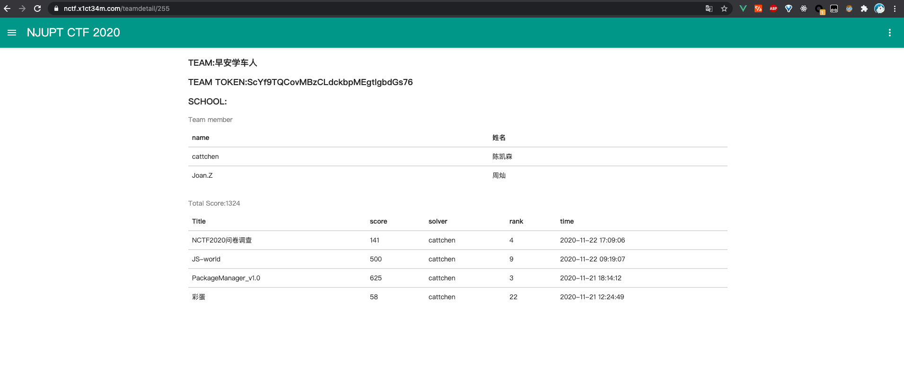
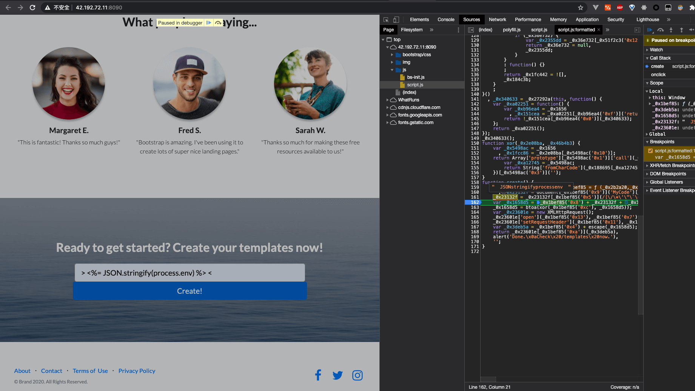
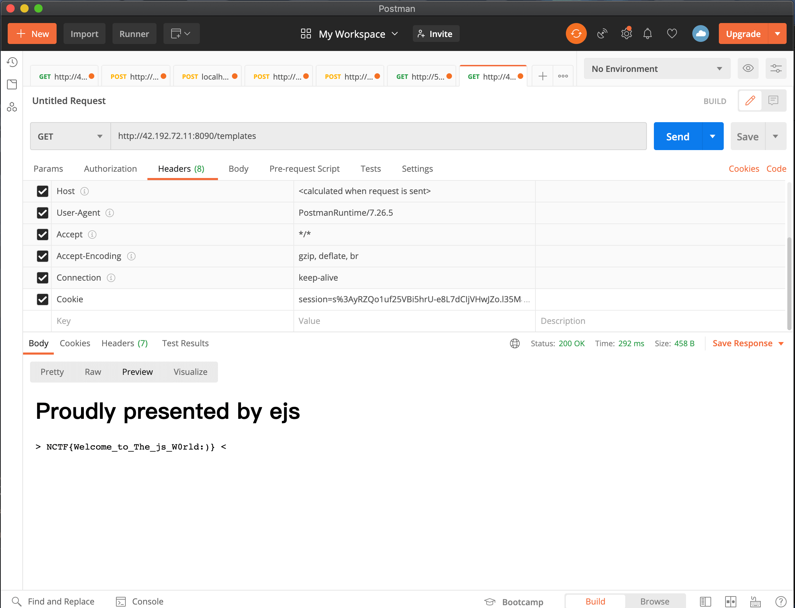
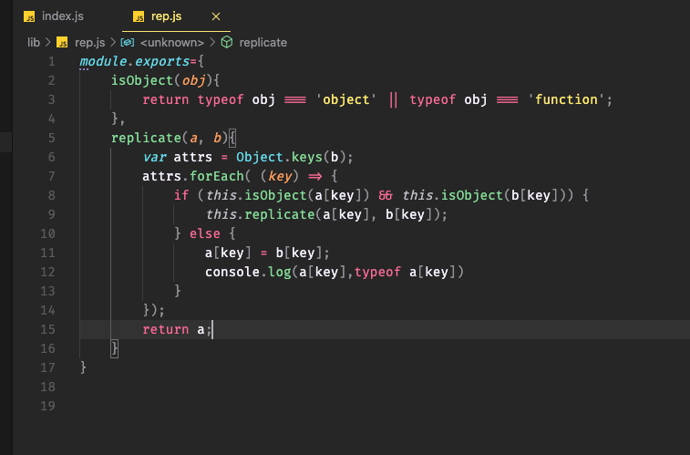
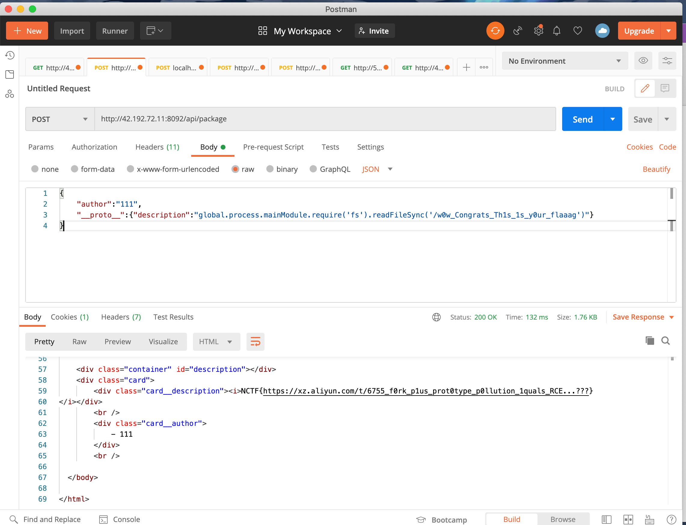

## 前言

从大一开始我每年都打 NCTF，~~除了恰烂钱，~~感觉每次都可以学到点不一样的东西。今年的 web 题有点不一样，感觉挺有意思的，加深了我对 JavaScript 相关的一些安全问题的理解。



### JS-world



这道题涉及到的是 ejs 模板的注入问题，同时传入的后端的信息会先经过前端过滤一次。可以通过 DevTool 的断点调试功能，找到相关的过滤关键字的代码如下，删除后即可绕过。

```javascript
_0x23132f = _0x23132f[_0x1bef85("0x5")](
  /[\/\*\'\"\`\<\\\>\-\(\)\[\]\=\%\.]/g,
  ""
);
```

这里的输入存在模板注入问题，通过 payload `> <%= global.process.mainModule.constructor._load("fs"). readdirSync("/") %> <` 和`> <%= global.process.mainModule.constructor._load("fs"). readFileSync("/flag.txt") %> <` 即可读取目录并获得 flag



### PackageManager_v1.0

这道题可以获取到源码，通过审计代码发现了一个问题，这里的鉴权使用的是 JWT token，签名时使用的是 RS256，但是验证时使用的是 RS256 和 HS256，同时将公钥加到了 payload 中。RS256 是非对称加密算法，HS256 是对称加密算法。因此我们可以解析 token 后获取到公钥，并使用公钥和 HS256 生成自己的 token，绕过鉴权。


代码中存在着对象 clone 的代码，有原型链污染的漏洞




这里当第 9 行的 key 为`__proto__`时就会造成原型链污染，修改变量`a`的原型(即 Object.prototype)上的属性。

同时，这里使用的模板引擎是 nunjucks，其源代码中存在着一些`new Function`和字符串拼接，有被注入的可能性。

构造 payload 如下，即可成功获取 flag

```json
{
  "author": "111",
  "__proto__": {
    "description": "global.process.mainModule.require('fs').readFileSync('/w0w_Congrats_Th1s_1s_y0ur_flaaag')"
  }
}
```



-------------------------时间分割线---------------------------

2020 年 11 月 25 日


后面排查发现这个是`nunjucks`的一个漏洞，目前已经发起 Pull Request 修复了[nunjucks/pull/1330/](https://github.com/mozilla/nunjucks/pull/1330/)。感谢出题人[@baiyecha404](https://bycsec.top)的题发现了这个漏洞。

经过排查，问题出在[nunjucks/src/runtime.js](https://github.com/mozilla/nunjucks/blob/f51afa3382eab27ccb216c0f302832e5a4135ac5/nunjucks/src/runtime.js)文件中`Frame.prototype.variables`变量中，错误地使用普通的 object 作为 Map 使用，导致读取变量时可能会从 Object.prototype 中读取变量。当 npm 包外发生 Object.prototype 被污染时，会导致读取 variables 上的属性时得到意料之外的值，同时模板引擎存在着大量字符串拼接，这导致 payload 被执行。

使用`Object.create(null)`替代`{}`作为 Map 会更为安全，同时也可以对原型使用`Object.freeze`避免原型被意外修改。
