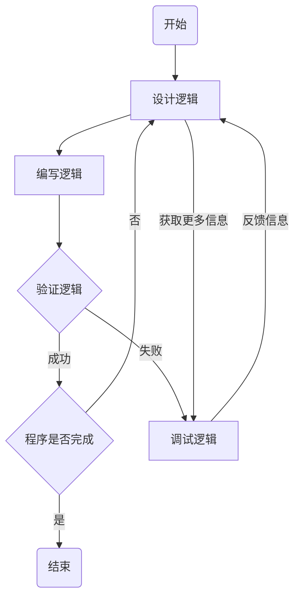
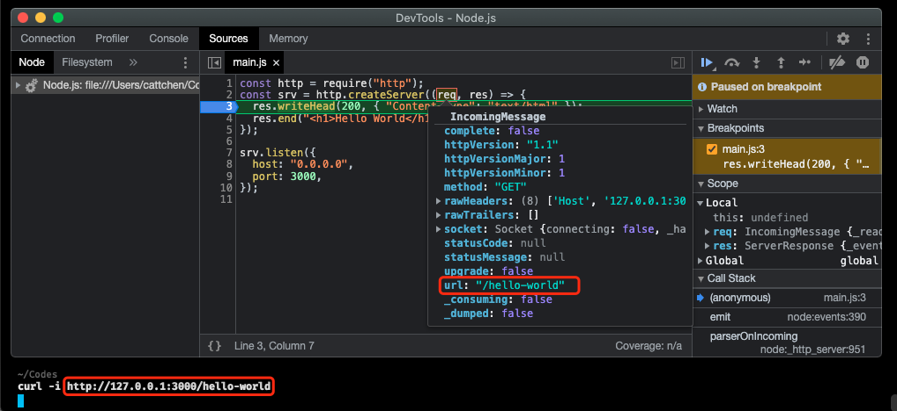

自己进行 Node.js 也有很长一段时间了，更准确地说是进行编程开发。编程开发给我的感觉就是这样的一个状态变化，我总是在不断地重复`设计逻辑/编写逻辑/验证逻辑`的 loop，如果遇到了逻辑验证失败的情况就需要增加`调试逻辑`并重新重复一遍 loop。一个程序的开发就是由这样的若干个 loop 组成。如果`设计逻辑`环节设计得当，设计的方案是正确的且能够正确地处理各种情况，`编写逻辑/验证逻辑`环节依然是必须的，但是可以避免一些不必要的`调试逻辑` 。



同时，如果逻辑调试没有做好，就容易产生很多不必要的`设计逻辑 ⇔ 调试逻辑`，浪费我的很多时间，导致效率低下。`编写逻辑`和`验证逻辑`环节时间占用基本是比较固定且比较难改变的，想办法降低`设计逻辑`和`调试逻辑`环节的时间占用，能比较好的提升自己的开发效率。`验证逻辑`是执行`设计逻辑`环节设计的逻辑验证方案，如果这个环节占用了大量时间，比如编写了一个接口，等服务重启或者是等请求响应需要大半天，则这里有很大的优化空间。由于优化方式不具有普适性，这里不做讨论。而能将`设计逻辑`和`调试逻辑`做得很好，我觉得这是软件工程师和代码打字员最大的区别。


# 日志调试和断点调试

日志调试直白的说就是`console.log`，直接在多个可疑的地方打印出相关的中间变量，判断是否符合预期，用二分的思想锁定BUG的位置，有时日志调试需要不止一轮。断点调试则是让程序执行到特定的位置停止，方便开发人员对此刻的全局变量/局部变量/函数参数等信息进行审查，并能进行代码的逐行执行。

对于大部分情况来说，日志调试已经足够了。Node.js重启执行代码足够迅速，能够短时间完成多轮的日志调试，如果我们对该项目代码足够熟悉，已经可以快速的做出判断，异常出现的位置。

```javascript
export function handlerBizFoo(ctx, bizPayload){
  // bizPlayload类型未知，仅能判断它有name属性
	console.log(bizPaylaod.name)
}
```

我们遇到的更多的调试逻辑比较棘手的情况是需要维护一个庞大的陌生的javascript项目，同时由于javascript的动态语言特性，函数参数的类型是不确定的，我们只能通过函数参数的使用以及检查所有函数调用处，对参数的类型进行推导 ~~(很伤脑细胞)~~。这种情况下，日志调试也能用，但是提供的信息不够全面友好（对比较复杂的javascript对象进行`console.log`效果并不好）。这时候借助Chrome Devtool、VS Code Debugger等工具进行断点调试，能够比较方便地对局部变量、全局变量进行审查，有比较好的效果。



# 调试Node.js进程

```shell
node --inspect=127.0.0.1:9229 main.js

# OR
node --title=hello-world main.js && pgrep -f hello-world | xargs -n1 sudo kill -SIGUSR1

```

通过添加inspect参数使Node.js启动调试器，在Chrome浏览器中输入`chrome://inspect`即可在inspect面板调试Node.js进程。如果已经启动了Node.js进程，来不及添加参数也没关系，可以向进程发送`SIGUSR1`信号启动调试。

