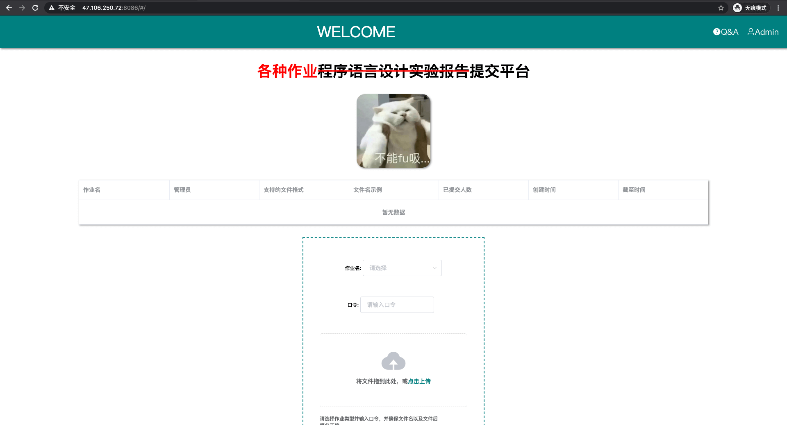
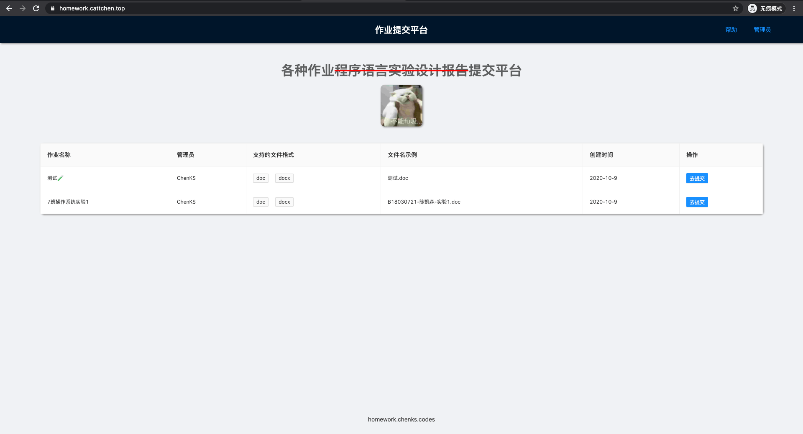

## 前言


大一上时刚学会点 php，然后自己是学习委员，作为学习委员需要经常收电子版的实验报告，从 QQ 上将实验报告一份一份下载很麻烦，为了提高效率就萌生了写一个提交作业的网站的想法。在这里我第一个使用 mysql+php+python 搭建了一个项目，现在回头看，之前写的代码确实不怎么好。没有一个管理后台，每次有需要收新的实验报告时都要改代码。不够安全，由于不清楚如何使用 php 发起 smtp 邮件请求，就采用了使用 exec 函数调用 python 程序发送邮件的方案。



后来大一下学会了点 Vue.js Node.js ，进行了重写了，使用了 ElementUI 这个组件库，解决了上一版的两个主要问题，了解到了 session、cookie、可以使用 gzip 这类压缩算法压缩 HTTP 响应，加快响应。



现在大三了，国庆期间又重写了代码，后端部分的代码试水了 golang，postgres，golang 有 python 的开发效率，有接近 C++的性能。我觉得这门语言设计者是个十足的偏执狂，golang 在代码格式的要求上要求很严格，`else if`是不换行的，代码格式不正确，编译不通过。前端部分，使用的技术栈是`react`+`redux`+`redux-saga`+`saga-duck`+`antd`，在实习期间了解到了`saga-duck`这个库，和`dvajs`有点类似，但是在与 typescript 的契合上更优，duck 间不仅有继承关系，还有组合关系。saga-duck 是使用了 ducks 模式管理了 redux 相关的一些代码，避免代码过于分散。在使用时，我没有使用官方的`duckRuntime`连接`redux`，我自己写了一个`useSagaDuckState`的 hook 函数，我认为并没有必要把所有页面组件级别的`state`都放在`store`中，使用`saga-duck`更多的是希望管理好当前页面的`state`，因此使用一个通过调用`useReducer`创建页面组件级别的`store`的`useSagaDuckState`的 hook 函数可能会更加符合场景需求。

期间我也了解了 jwt、HTTP 缓存、webpack、docker 这些技术，尽管使用了一台带宽更小的服务器（1Mbps），但是加载效果依然不错。

## 服务端的配置优化

这部分的优化主要是在服务端的 nginx 中，通过配置资源类请求的响应头，来实现缓存。可以通过增加 `expire` `cache-control`这类响应头字段来使客户端对资源进行缓存，减轻服务端压力。`expire`可以规定资源的到期时间，在到期时间前，会直接使用缓存。使用`cache-control`响应头可以规定资源的缓存时间长度。同时，通过浏览器可以通过资源请求响应的 e-tag，和服务器端确认资源的新鲜程度。


通过开启`gzip`这类压缩算法，可以优先降低实际传输的资源的大小

HTTP2 提供了多路复用的功能，可以提高多个并发连接时的性能。

## webpack 打包优化

### 使用代码分割

这个是 webapck4 中新增的功能，我们可以将多个 chunk 中的共同的部分提取出来，减少重复的代码，从总体上减少传输量。同时对于 vendor_chunk 我们也可以对其进行拆分，将不怎么变动的依赖像 react、redux、antd 之类的，单独放在一个 js 文件中，以达到更好的利用 HTTP 缓存的目的。最初将多个 js 文件合并打包到一个文件里是为了减少 HTTP 连接数，但是现在 HTTP2 多个请求可同时在一个连接上并行执行，或许将这类的依赖拆分出来可以提升缓存效果。

### 使用懒加载

懒加载是 webpack 提供的一项能力，可以配合 React16 中的 Suspense 和 lazy 使用。从我的这个项目场景分析看，大部分的用户都是只访问主页的，只有少数用户会访问其他页面，因此这里有必要将其他页面代码分离出来，当需要进入其他页面时再进行加载。

```jsx
const loadingElement = <Loading />;

const AuthPage = loadable({
  loader: () =>
    import(
      /*webpackChunkName: 'auth_page' */
      "@/containers/AuthPage/AuthPage"
    ),
  loading: loadingElement,
  minDuration: 500,
});
const HelpPage = loadable({
  loader: () =>
    import(
      /*webpackChunkName: 'help_page' */
      "@/containers/HelpPage/HelpPage"
    ),
  loading: loadingElement,
  minDuration: 500,
});
const AdminPage = loadable({
  loader: () =>
    import(
      /*webpackChunkName: 'admin_page' */
      "@/containers/AdminPage/AdminPage"
    ),
  loading: loadingElement,
  minDuration: 500,
});

function App() {
  return (
    <AppWrapper>
      <Router>
        <Route path={["/", "/detail/:id"]}>
          <ListPage />
        </Route>
        <Route path={["/auth", "/auth/registry"]}>
          <AuthPage />
        </Route>
        <Route path={["/admin", "/admin/create"]}>
          <AdminPage />
        </Route>
        <Route path={["/help"]}>
          <HelpPage />
        </Route>
      </Router>
      <GlobalStyle />
    </AppWrapper>
  );
}
```

### 分析打包结果

使用 webpack-bundle-analyzer 分析体积较大的 vendor，一些依赖可能体积很大，但是只需要使用少数的 api，就可以考虑自己实现一下相关的函数

## 加载效果优化

SPA 应用令人诟病的一点就是页面的加载白屏时间长，浏览器加载 html 文件后，还需要加载相关的 css、js 文件，我们可以在 React 在页面 mount 的标签中放上 loading，当相关文件加载完后，loading 会被自动替换。
