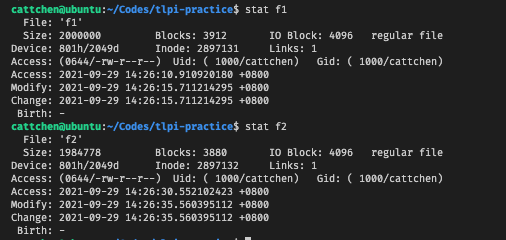
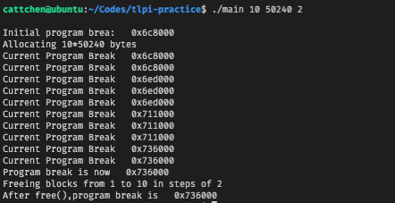
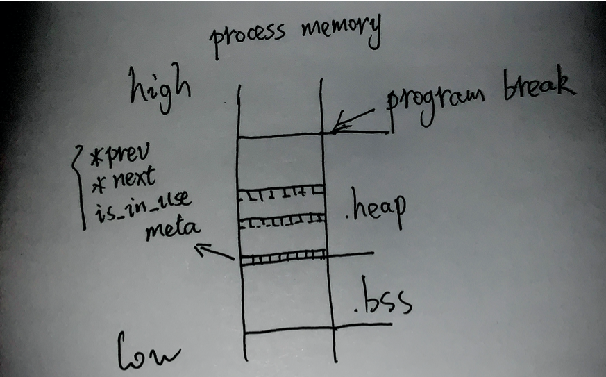
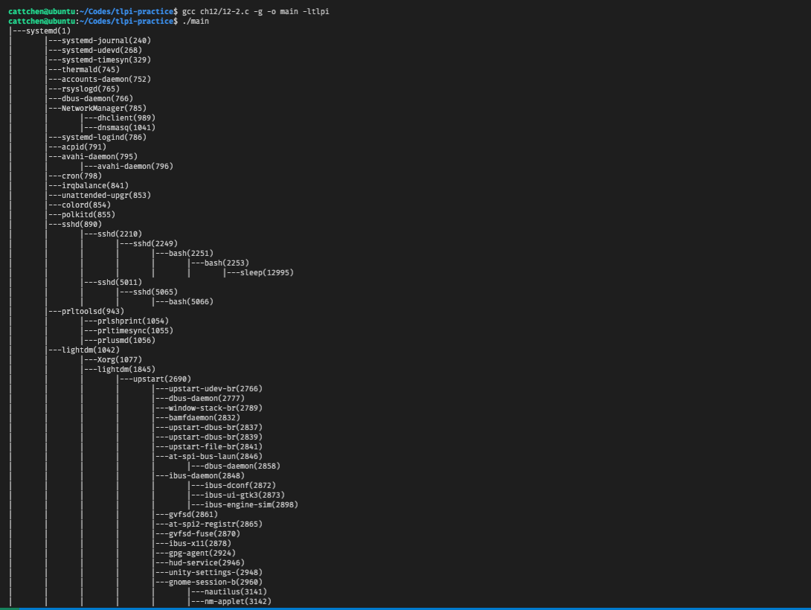
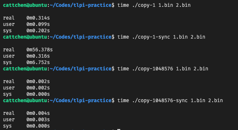
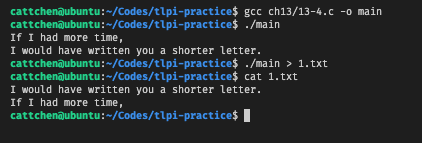
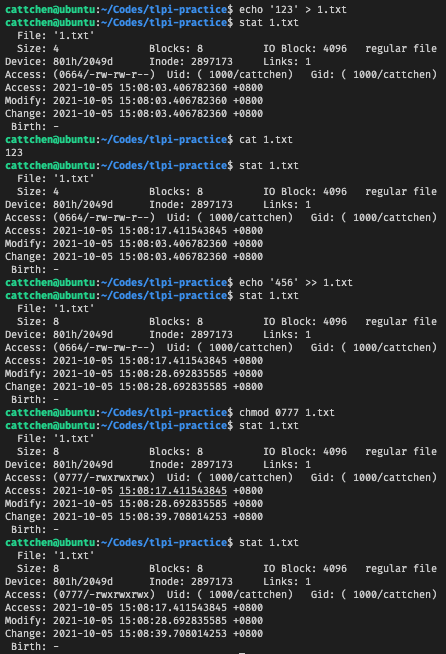

[《the linux programming interface》](https://man7.org/tlpi/index.html)

# 习题

## 第三章

### 3-1

magic number 隐藏着 Torvalds 和他女儿们的生日

https://github.com/torvalds/linux/blob/5bfc75d92efd494db37f5c4c173d3639d4772966/include/uapi/linux/reboot.h

https://www.nndb.com/people/444/000022378/

```c
#include <linux/reboot.h>
#include <stdio.h>
#include <stdlib.h>
#include <sys/syscall.h>
#include <unistd.h>

int main() {
  int code = syscall(SYS_reboot, LINUX_REBOOT_MAGIC1, LINUX_REBOOT_MAGIC2,
                     LINUX_REBOOT_CMD_RESTART);
  if (code == -1) {
    perror("reboot");
    exit(EXIT_FAILURE);
  }
  exit(EXIT_SUCCESS);
}
```

## 第四章

### 4-1

```c
#include <fcntl.h>
#include <stdio.h>
#include <stdlib.h>
#include <unistd.h>

#define BUFFER_SIZE 1024

int main(int argc, char *argv[]) {
  // check argc
  if (argc < 2) {
    fprintf(stderr, "usage: %s [-a] <file>\n", argv[0]);
    exit(EXIT_FAILURE);
  }

  // parse argv
  int flag_append = -1, opt = -1;
  while ((opt = getopt(argc, argv, "a")) != -1) {
    switch (opt) {
    case 'a':
      flag_append = 1;
      break;
    }
  }

  // open destination file
  int flag = O_WRONLY | (flag_append == -1 ? O_TRUNC : O_APPEND);
  int fd = open(argv[argc - 1], flag, 0644);
  if (fd == -1) {
    perror("open dest file");
    exit(EXIT_FAILURE);
  }

  // write file
  char *buf = malloc(BUFFER_SIZE);
  int n = BUFFER_SIZE;
  do {
    n = read(STDIN_FILENO, buf, n);
    write(fd, buf, n);
  } while (n);
  free(buf);
  exit(EXIT_SUCCESS);
}
```

#### 4-2

```c
#include <fcntl.h>
#include <stdio.h>
#include <stdlib.h>
#include <unistd.h>
#define BUFFER_SIZE 1014

int main(int argc, char *argv[]) {
  // check args
  if (argc != 3) {
    fprintf(stderr, "usage %s <src> <dest>", argv[0]);
    exit(EXIT_FAILURE);
  }

  // open {src,dest}
  int fd_src, fd_dest;
  if ((fd_src = open(argv[1], O_RDONLY)) == -1) {
    perror("open src");
    exit(EXIT_FAILURE);
  }
  if ((fd_dest = open(argv[2], O_WRONLY | O_CREAT, 0644)) == -1) {
    perror("open dest");
    exit(EXIT_FAILURE);
  }

  // copy
  char *buf = malloc(BUFFER_SIZE);
  int ino_r, ino_w;
  do {
    ino_r = read(fd_src, buf, BUFFER_SIZE);
    if (ino_r == -1) {
      perror("read src");
      exit(EXIT_FAILURE);
    }
    ino_w = write(fd_dest, buf, ino_r);
    if (ino_w == -1) {
      perror("write dest");
      exit(EXIT_FAILURE);
    }
  } while (ino_r);
  close(fd_src);
  close(fd_dest);
  exit(EXIT_SUCCESS);
}
```

## 第五章

### 5-1

```shell
gcc large-file.c -o large-file -ltlpi \
&& ./target-file 1.txt 10111222333
```

能够成功创建包含文件空洞的大文件，大文件逻辑上为 10GB 左右，但是只占据磁盘空间 4KB。文件空洞使用\0 填充，本身不占据物理空间，当实际有写入时才分配磁盘块。

```c
#define _LARGEFILE64_SOURCE
#include <fcntl.h>
#include <sys/stat.h>
#include <tlpi_hdr.h>

int main(int argc, char *argv[]) {
  int fd;
  off64_t off;
  if (argc != 3 || strcmp(argv[1], "--help") == 0)
    usageErr("%s pathname offset\n", argv[0]);
  fd = open64(argv[1], O_RDWR | O_CREAT, S_IRUSR | S_IWUSR);
  if (fd == -1)
    errExit("open64");
  off = atoll(argv[2]);
  if (lseek(fd, off, SEEK_SET) == -1)
    errExit("lseek64");
  if (write(fd, "test", 4) == -1)
    errExit("write");

  exit(EXIT_SUCCESS);
}
```

### 5-2

使用`O_APPEND`打开文件后，write 前使用 lseek 改变偏移量不能使下次写入位置改变。因为每次的写入都是一个原子操作，会先改变偏移量至文件尾再写入。这样做是为了避免并发共享 fd 时的竞态问题。

> ```
> O_APPEND
>       The file is opened in append mode.  Before each write(2),
>       the file offset is positioned at the end of the file, as
>       if with lseek(2).  The modification of the file offset and
>       the write operation are performed as a single atomic step.
>
>       O_APPEND may lead to corrupted files on NFS filesystems if
>       more than one process appends data to a file at once.
>       This is because NFS does not support appending to a file,
>       so the client kernel has to simulate it, which can't be
>       done without a race condition.
> ```

```c
#include <fcntl.h>
#include <stdio.h>
#include <string.h>
#include <tlpi_hdr.h>
#include <unistd.h>

int main(int argc, char *argv[]) {
  char *text1 = "hello\nhello1\nhello2\n";
  char *text2 = "abc";
  char *filename = "1.txt";
  int ino, fd;

  fd = open(filename, O_WRONLY | O_CREAT | O_TRUNC, 0644);
  if (fd == -1) {
    errExit("open0");
  }
  ino = write(fd, text1, strlen(text1));
  close(fd);
  fd = open(filename, O_WRONLY | O_APPEND, 0644);
  if (fd == -1) {
    errExit("open1");
  }
  ino = lseek(fd, 0, SEEK_SET);
  if (ino == -1) {
    errExit("lseek");
  }
  write(fd, text2, strlen(text2));
  close(fd);
  exit(EXIT_SUCCESS);
}
```

### 5-3

```shell
# generate f1
./atomic_append f1 1000000 & ./atomic_append f1 1000000
# generate f2
./atomic_append f1 1000000 x & ./atomic_append f1 1000000 x
```



不使用`O_APPEND`会发生竞态问题。t4 时 process1 的 fd 的偏移量并不是文件尾，而是最后一个字节，因此没有成为在文件尾添加一个字节。

| time slice | process1              | process2              |
| ---------- | --------------------- | --------------------- |
| t1         | lseek(fd,0,SEEK_END); |                       |
| t2         |                       | lseek(fd,0,SEEK_END); |
| t3         |                       | write(fd,"a",1);      |
| t4         | write(fd,"a",1);      |                       |

```c
#include <fcntl.h>
#include <stdio.h>
#include <string.h>
#include <tlpi_hdr.h>
#include <unistd.h>

int main(int argc, char *argv[]) {
  if (argc < 3) {
    usageErr("%s filename num-bytes [x]", argv[0]);
  }
  int fd, ino, num_bytes, open_flag;
  num_bytes = atoll(argv[2]);
  open_flag = O_WRONLY | O_CREAT;
  if (!(argc > 3 && strcmp(argv[3], "x") == 0)) {
    open_flag |= O_APPEND;
  }
  fd = open(argv[1], open_flag, 0644);
  if (fd == -1) {
    errExit("open");
  }
  while ((num_bytes--) > 0) {
    ino = lseek(fd, 0, SEEK_END);
    if (ino == -1) {
      errExit("lseek");
    }
    ino = write(fd, "a", 1);
    if (ino == -1) {
      errExit("write");
    }
  }
  close(fd);
}
```

### 5-4

```c
#include <assert.h>
#include <fcntl.h>
#include <stdio.h>
#include <stdlib.h>
#include <string.h>
#include <tlpi_hdr.h>
#include <unistd.h>

int tlpi_dup(int oldfd) { return fcntl(oldfd, F_DUPFD); }

int tlpi_dup2(int oldfd, int newfd) {
  int ino;
  if (oldfd == newfd) {
    ino = fcntl(oldfd, F_GETFL);
    if (ino == -1) {
      errno = EBADF;
      return -1;
    }
    return oldfd;
  }
  close(newfd);
  newfd = fcntl(oldfd, F_DUPFD, newfd);
  return newfd;
};

int main() {
  int fd, fd2, ino;
  char *text = "hello123\n";

  // validate tlpi_dup
  fd = open("1.txt", O_RDWR | O_CREAT | O_TRUNC, 0644);
  fd2 = tlpi_dup(fd);
  write(fd2, text, strlen(text));
  close(fd);

  char *buf1 = malloc(strlen(text) + 1);
  fd = open("1.txt", O_RDONLY);
  read(fd, buf1, strlen(text) + 1);
  assert(strcmp(buf1, text) == 0);
  close(fd);

  // validate tlpi_dup2
  fd = open("2.txt", O_RDWR | O_CREAT | O_TRUNC, 0644);
  tlpi_dup2(fd, STDOUT_FILENO);
  write(STDOUT_FILENO, text, strlen(text));
  close(fd);
  char *buf2 = malloc(strlen(text) + 1);
  fd = open("2.txt", O_RDONLY);
  read(fd, buf2, strlen(text) + 1);
  assert(strcmp(buf2, text) == 0);
  close(fd);

  exit(EXIT_SUCCESS);
}
```

### 5-5

```c
#include <assert.h>
#include <fcntl.h>
#include <stdio.h>
#include <stdlib.h>
#include <string.h>
#include <tlpi_hdr.h>
#include <unistd.h>

int tlpi_dup(int oldfd) { return fcntl(oldfd, F_DUPFD); }

int tlpi_dup2(int oldfd, int newfd) {
  int ino;
  if (oldfd == newfd) {
    ino = fcntl(oldfd, F_GETFL);
    if (ino == -1) {
      errno = EBADF;
      return -1;
    }
    return oldfd;
  }
  close(newfd);
  newfd = fcntl(oldfd, F_DUPFD, newfd);
  return newfd;
};

int main() {
  int fd, fd2, offset1, offset2, file_flag1, file_flag2;
  char *text = "hello world\n";
  fd = open("1.txt", O_RDWR | O_CREAT | O_TRUNC, 0644);
  write(fd, text, strlen(text));
  offset1 = lseek(fd, 3, SEEK_SET);
  file_flag1 = fcntl(fd, F_GETFL);
  fd2 = tlpi_dup(fd);
  offset2 = lseek(fd2, 0, SEEK_CUR);
  file_flag2 = fcntl(fd2, F_GETFL);
  // validate offset
  assert(offset1 == offset2);
  // validate file flag
  assert(file_flag1 == file_flag2);
  close(fd);
  close(fd2);
  exit(EXIT_SUCCESS);
}
```

### 5-6

```c
#include <assert.h>
#include <fcntl.h>
#include <stdio.h>
#include <string.h>
#include <unistd.h>

char *file = "1.txt";
char buffer[20];

void assert_file(char *content) {
  int fd = open(file, O_RDONLY);
  read(fd, buffer, 20);
  close(fd);
  assert(strcmp(buffer, content) == 0);
}

int main() {
  int fd1, fd2, fd3;
  fd1 = open(file, O_RDWR | O_CREAT | O_TRUNC, S_IRUSR | S_IWUSR);
  fd2 = dup(fd1);
  fd3 = open(file, O_RDWR);
  write(fd1, "Hello,", 6); // Hello,
  assert_file("Hello,");
  write(fd2, "world", 6); // Hello,world
  assert_file("Hello,world");
  lseek(fd2, 0, SEEK_SET);
  write(fd1, "HELLO,", 6); // HELLO,world
  assert_file("HELLO,world");
  write(fd3, "Gidday", 6); // Giddayworld
  assert_file("Giddayworld");
  close(fd1);
  close(fd2);
  close(fd3);
}
```

### 5-7

```c
#include <assert.h>
#include <fcntl.h>
#include <stdio.h>
#include <stdlib.h>
#include <string.h>
#include <sys/param.h>
#include <sys/uio.h>
#include <tlpi_hdr.h>
#include <unistd.h>

int tlpi_readv(int fd, const struct iovec *iov, int count) {
  int size, ino;
  char *buf;
  for (int i = 0; i < count; i++) {
    size += (iov + i)->iov_len;
  }
  buf = malloc(size);
  ino = read(fd, buf, size);
  if (ino != -1) {
    int byte_size = ino;
    for (int i = 0; i < count; i++) {
      const struct iovec *curr = iov + i;
      if (ino > 0) {
        memcpy(curr->iov_base, buf + (size - byte_size),
               MIN(curr->iov_len, byte_size));
        byte_size -= curr->iov_len;
      }
    }
  }
  free(buf);
  return ino;
}

int tlpi_writev(int fd, const struct iovec *iov, int count) {
  int size, ino, offset = 0;
  char *buf;
  for (int i = 0; i < count; i++) {
    size += (iov + i)->iov_len;
  }
  buf = malloc(size);
  for (int i = 0; i < count; i++) {
    const struct iovec *curr = iov + i;
    memcpy(buf + offset, curr->iov_base, curr->iov_len);
    offset += curr->iov_len;
  }
  ino = write(fd, buf, size);
  free(buf);
  return ino;
}

int main() {
  struct iovec iov1[2], iov2[2];
  int fd, ino;
  char *file = "1.txt";
  char *text1 = "hello c";
  char *text2 = "attchen";

  iov1[0].iov_base = malloc(7);
  iov1[0].iov_len = 7;
  iov1[1].iov_base = malloc(7);
  iov1[1].iov_len = 7;

  iov2[0].iov_base = malloc(7);
  iov2[0].iov_len = 7;
  iov2[1].iov_base = malloc(7);
  iov2[1].iov_len = 7;

  fd = open(file, O_RDWR | O_CREAT | O_TRUNC, 0644);

  memcpy(iov1[0].iov_base, text1, 7);
  memcpy(iov1[1].iov_base, text2, 7);
  ino = writev(fd, iov1, 2);
  if (ino == -1)
    errExit("writev");
  ino = lseek(fd, 0, SEEK_SET);
  if (ino == -1)
    errExit("lseek1");
  ino = tlpi_readv(fd, iov2, 2);
  if (ino == -1)
    errExit("tlpi_readv");
  assert(memcmp(iov1[0].iov_base, iov2[0].iov_base, iov1[0].iov_len) == 0);
  assert(memcmp(iov1[1].iov_base, iov2[1].iov_base, iov1[1].iov_len) == 0);
  assert(memcmp(iov1[0].iov_base, text1, iov1[0].iov_len) == 0);
  assert(memcmp(iov1[1].iov_base, text2, iov1[1].iov_len) == 0);

  ino = ftruncate(fd, 0);
  if (ino == -1)
    errExit("ftruncate");
  ino = lseek(fd, 0, SEEK_SET);
  if (ino == -1)
    errExit("lseek");
  memcpy(iov2[0].iov_base, text2, 8);
  memcpy(iov2[1].iov_base, text1, 8);
  ino = tlpi_writev(fd, iov2, 2);
  if (ino == -1)
    errExit("tlpi_writev");
  ino = lseek(fd, 0, SEEK_SET);
  if (ino == -1)
    errExit("lseek2");
  ino = readv(fd, iov1, 2);
  if (ino == -1)
    errExit("readv");
  assert(memcmp(iov1[0].iov_base, iov2[0].iov_base, iov1[0].iov_len) == 0);
  assert(memcmp(iov1[1].iov_base, iov2[1].iov_base, iov1[1].iov_len) == 0);
  assert(memcmp(iov2[0].iov_base, text2, iov1[0].iov_len) == 0);
  assert(memcmp(iov2[1].iov_base, text1, iov1[1].iov_len) == 0);

  free(iov1[0].iov_base);
  free(iov1[1].iov_base);
  free(iov2[0].iov_base);
  free(iov2[1].iov_base);
}
```

## 第六章

### 6-1

10MB 的数组指的是变量`main.mbuf`，它没有被初始化，是分配到 bss 段，在最后生成的代码中只记录的大小。

```CQL
// 方式1 初始化 mbuf会被分配到 data segment
static char mbuf[10240000] = {1};
// 方式2 赋值 mbuf被分配到 bss segment
static char mbuf[10240000];
mbuf[0]=1;
```


但是如果对 mbuf 进行初始化，会在最后的 binaray 占用 10MB 的空间存储 mbuf 的值，程序运行时再直接拷贝到 data segment。bss 区的数据不用去占据 ELF 文件的磁盘空间。

[https://stackoverflow.com/questions/16557677/difference-between-data-section-and-the-bss-section-in-c](https://stackoverflow.com/questions/16557677/difference-between-data-section-and-the-bss-section-in-c)

> Data
>
> The values for these variables are initially stored within the read-only memory (typically within the code segment) and are copied into the data segment during the start-up routine of the program.

### 6-2

```c
#include <setjmp.h>
#include <tlpi_hdr.h>

static jmp_buf env;

void f1() {
  printf("in f1\n");
  if (setjmp(env) == 1) {
    printf("jump from f2()\n");
  }
}

void f2() {
  printf("in f2\n");
  longjmp(env, 1);
}

int main() {
  f1();
  f2();
}
```

### 6-3

```c
#include <assert.h>
#include <stdio.h>
#include <stdlib.h>
#include <string.h>
#include <tlpi_hdr.h>

#define TLPI_ENV_SUCCESS 1

extern char **environ;

int tlpi_setenv(const char *name, const char *value, int overwrite) {
  char *str;
  int l_name, l_value, ino;

  str = getenv(name);
  if (str != NULL && !overwrite) {
    return TLPI_ENV_SUCCESS;
  }
  if (str != NULL) {
    free(str);
  }
  l_name = strlen(name);
  l_value = strlen(value);
  str = malloc(l_name + l_value + 2);
  strcpy(str, name);
  strcpy(str + l_name + 1, value);
  str[l_name] = '=';
  ino = putenv(str);
  return ino;
};

int tlpi_unsetenv(const char *name) {
  extern char **environ;
  char **ep_curr, **ep_end;
  int ep_len;
  for (ep_curr = environ; *ep_curr != NULL; ep_curr++) {
  }
  ep_len = ep_curr - environ;
  ep_end = environ + ep_len;
  for (ep_curr = environ; ep_curr != ep_end; ep_curr++) {
    char *name_p1 = *ep_curr, *name_p2 = (char *)(name);
    while (*name_p1 == *name_p2 && *name_p2 != 0) {
      name_p1++;
      name_p2++;
    }
    if (*name_p1 == '=' && *name_p2 == 0) {
      ep_end--;
      if (ep_curr == ep_end) {
        *ep_curr = NULL;
      } else {
        *ep_curr = *ep_end;
        *ep_end = NULL;
      }
      continue;
    }
  }
  return TLPI_ENV_SUCCESS;
};

int main() {
  char *key1 = "TLPI_TEST", *value1 = "cattchen", *key2 = "TLPI_TEST_2",
       *value2 = "value2";
  int ino;

  clearenv();
  ino = tlpi_setenv(key1, value1, 1);
  if (ino == -1) {
    errExit("tlpi_setenv1");
  }
  assert(strcmp(getenv(key1), value1) == 0);
  ino = tlpi_setenv(key2, value2, 1);
  if (ino == -1) {
    errExit("tlpi_setenv2");
  }
  ino = tlpi_setenv(key2, value1, 0);
  if (ino == -1) {
    errExit("tlpi_setenv3");
  }
  assert(strcmp(getenv(key2), value2) == 0);

  ino = tlpi_unsetenv(key2);
  if (ino == -1) {
    errExit("tlpi_unsetenv1");
  }
  assert(getenv(key2) == NULL);
  ino = tlpi_unsetenv(key1);
  if (ino == -1) {
    errExit("tlpi_unsetenv2");
  }
  assert(getenv(key1) == NULL);
}
```

## 第七章

### 7-1



```c
#include <tlpi_hdr.h>
#define MAX_ALLOCS 1000000

int main(int argc, char *argv[]) {
  char *ptr[MAX_ALLOCS];
  int freeStep, freeMin, freeMax, blockSize, numAllocs, j;
  printf("\n");
  if (argc < 3)
    usageErr("%s num-allocs block-size [step [min [max]]]\n", argv[0]);

  numAllocs = getInt(argv[1], GN_GT_0, "num-allocs");
  if (numAllocs > MAX_ALLOCS)
    cmdLineErr("free-max > num-allocs\n");

  blockSize = getInt(argv[2], GN_GT_0 | GN_ANY_BASE, "bolck-size");

  freeStep = (argc > 3) ? getInt(argv[3], GN_GT_0, "step") : 1;
  freeMin = (argc > 4) ? getInt(argv[4], GN_GT_0, "min") : 1;
  freeMax = (argc > 5) ? getInt(argv[5], GN_GT_0, "max") : numAllocs;

  if (freeMax > numAllocs)
    cmdLineErr("free-max > num-allocs\n");

  printf("Initial program brea: %10p\n", sbrk(0));
  printf("Allocating %d*%d bytes\n", numAllocs, blockSize);
  for (j = 0; j < numAllocs; j++) {
    ptr[j] = malloc(blockSize);
    if (ptr[j] == NULL)
      errExit("malloc");
    printf("Current Program Break %10p\n", sbrk(0));
  }

  printf("Program break is now %10p\n", sbrk(0));
  printf("Freeing blocks from %d to %d in steps of %d\n", freeMin, freeMax,
         freeStep);

  for (j = freeMin - 1; j < freeMax; j += freeStep)
    free(ptr[j]);
  printf("After free(),program break is %10p\n", sbrk(0));
  exit(EXIT_SUCCESS);
}
```

### 7-2

主要是踩了一个坑，调试花了比较长的时间，指针值进行相加减时，会有隐式的类型转换，最后得到的结果也不是我预想的字节数。同时标准库的 printf 有调用 malloc 建立缓冲区需要注意。



```c
#include <assert.h>
#include <stdarg.h>
#include <stdint.h>
#include <stdio.h>
#include <stdlib.h>
#include <string.h>
#include <unistd.h>

#define PRINT_BUFFER_SIZE 200
char msgbuf[PRINT_BUFFER_SIZE];

// printf 会使用glibc/malloc
int tlpi_printf(char *format, ...) {
  va_list arglist;
  int ret, len;
  va_start(arglist, format);
  vsnprintf(msgbuf, PRINT_BUFFER_SIZE, format, arglist);
  len = strlen(msgbuf);
  ret = write(STDOUT_FILENO, msgbuf, len);
  va_end(arglist);
  return ret;
};

/**
 * low address               ->           high address
 * malloc_meta|buffer|...|malloc_meta|buffer|
 *  ↑                      ↑
 * [malloc_meta_first]    [malloc_meta_last]
 */
typedef struct malloc_meta {
  // TODO *prev *next 减小体积
  struct malloc_meta *prev;
  struct malloc_meta *next;
  unsigned short is_in_use : 1;
} malloc_meta;

#define MALLOC_META_SIZE (sizeof(malloc_meta))
#define MALLOC_META_INUSE 1
#define MALLOC_META_NOUSE 0
#define malloc_size(curr)                                                      \
  (((char *)(curr) - (char *)(curr->prev)) - sizeof(malloc_meta))

static malloc_meta *malloc_meta_first = NULL; // address of first malloc_meta
static malloc_meta *malloc_meta_last = NULL;  // address of last malloc_meta

void *tlpi_malloc(int size) {
  if (size < 0)
    return NULL;
  malloc_meta *curr = malloc_meta_first, *candidate = NULL;
  size_t curr_size, candidate_size = SIZE_MAX;
  while (curr) {
    curr_size = malloc_size(curr);
    if (curr->is_in_use == MALLOC_META_NOUSE && curr_size >= size &&
        curr_size < candidate_size) {
      candidate = curr;
      candidate_size = curr_size;
    }
    curr = curr->next;
  }
  if (candidate == NULL) {
    void *ino;
    ino = sbrk(size + MALLOC_META_SIZE);
    if (ino == (void *)(-1)) {
      return NULL;
    }
    candidate = ino;
    if (malloc_meta_first == NULL) {
      malloc_meta_first = candidate;
    } else {
      malloc_meta_last->next = candidate;
      candidate->prev = malloc_meta_last;
    }
    malloc_meta_last = candidate;
  } else if (candidate->prev != NULL) {
    malloc_meta *rest;
    size_t rest_size;
    rest_size = malloc_size(candidate) - size;
    if (rest_size > MALLOC_META_SIZE) {
      rest = (malloc_meta *)((char *)(candidate) + MALLOC_META_SIZE + size);
      rest->is_in_use = MALLOC_META_NOUSE;
      if (candidate != malloc_meta_last) {
        candidate->next->prev = rest;
      }
      rest->next = candidate->next;
      rest->prev = candidate;
      candidate->next = rest;
    }
  }
  candidate->is_in_use = MALLOC_META_INUSE;
  return (void *)((char *)(candidate) + MALLOC_META_SIZE);
};

void tlpi_free(void *ptr) {
  malloc_meta *curr;
  size_t curr_size;
  curr = (malloc_meta *)((char *)(ptr)-MALLOC_META_SIZE);
  curr->is_in_use = MALLOC_META_NOUSE;
  while (curr && curr == malloc_meta_last &&
         curr->is_in_use == MALLOC_META_NOUSE) {
    curr_size = malloc_size(curr) + MALLOC_META_SIZE;
    sbrk(-curr_size);
    curr = curr->prev;
    malloc_meta_last = curr;
  }
  if (malloc_meta_last == NULL) {
    malloc_meta_first = NULL;
  }
};

int main() {
  int *ptr_arr[20];
  for (int i = 0; i < 20; i++) {
    ptr_arr[i] = tlpi_malloc(sizeof(int) * (20 - i));
    *ptr_arr[i] = i + 1;
  }
  for (int i = 0; i < 20; i++) {
    assert(*ptr_arr[i] == i + 1);
  }
  for (int i = 0; i < 10; i++) {
    tlpi_free(ptr_arr[i]);
    ptr_arr[i] = tlpi_malloc(sizeof(int) * (i + 1));
    *ptr_arr[i] = i + 1;
  }
  for (int i = 0; i < 20; i++) {
    assert(*ptr_arr[i] == i + 1);
  }
}
```

## 第八章

### 8-1

这个问题本身是有的问题的，示例代码可能被优化为两种结果（这个取决于编译器），同时两次`getpwnam`返回的是同一个指针，只是两次这个指针指向的内容不同，所以才导致了这个现象。

https://stackoverflow.com/questions/37043139/statically-allocated-variable-when-using-getpwnam

```c
// 原始代码
printf("%ld %ld\n", (long)(getpwnam("cattchen")->pw_uid), (long)(getpwnam("root")->pw_uid));

// 编译器可能的优化结果1
struct passwd *p1, *p2;
p1 = getpwnam("cattchen");
p2 = getpwnam("root");
printf("%u\n", p1->pw_uid);
printf("%u\n", p2->pw_uid);

// 编译器可能的优化结果2
struct passwd *p1, *p2;
p1 = getpwnam("cattchen");
printf("%u\n", p1->pw_uid);
p2 = getpwnam("root");
printf("%u\n", p2->pw_uid);

// 避免歧义的写法
printf("%ld %ld\n",(long)((*getpwnam("cattchen")).pw_uid),(long)((*getpwnam("root")).pw_uid));
```

### 8-2

```c
#include <assert.h>
#include <pwd.h>
#include <string.h>

struct passwd *tlpi_getpwnam(const char *name) {
  struct passwd *pw;
  setpwent();
  do {
    pw = getpwent();
  } while (pw && strcmp(pw->pw_name, name) != 0);
  endpwent();
  return pw;
}

int main() {
  assert((*(getpwnam("root"))).pw_uid == (*(tlpi_getpwnam("root"))).pw_uid);
  assert((*(getpwnam("cattchen"))).pw_uid ==
         (*(tlpi_getpwnam("cattchen"))).pw_uid);
}
```

## 第九章

### 9-1

```c
#define _GNU_SOURCE
#include <assert.h>
#include <stdio.h>
#include <sys/fsuid.h>
#include <unistd.h>

int main() {
  uid_t u_real, u_effective, u_saved, u_fs = 0;
  getresuid(&u_real, &u_effective, &u_saved);
  u_fs = setfsuid(u_fs);
  assert(u_real == 1000 && u_effective == 0 && u_saved == 0 && u_fs == 0);
  printf("precheck pass\n");

  // setuid(2000);
  // getresuid(&u_real, &u_effective, &u_saved);
  // printf("%d %d %d\n", u_real, u_effective, u_saved);
  // assert(u_real == 2000 && u_effective == 2000 && u_saved == 2000);
  // printf("a passed\n");

  // setreuid(-1, 2000);
  // getresuid(&u_real, &u_effective, &u_saved);
  // printf("%d %d %d\n", u_real, u_effective, u_saved);
  // assert(u_real == 1000 && u_effective == 2000 && u_saved == 2000);
  // printf("b passed\n");

  // seteuid(2000);
  // getresuid(&u_real, &u_effective, &u_saved);
  // printf("%d %d %d\n", u_real, u_effective, u_saved);
  // assert(u_real == 1000 && u_effective == 2000 && u_saved == 0);
  // printf("c passed\n");

  // setresuid(-1, 2000, 3000);
  // getresuid(&u_real, &u_effective, &u_saved);
  // printf("%d %d %d\n", u_real, u_effective, u_saved);
  // assert(u_real == 1000 && u_effective == 2000 && u_saved == 3000);
  // printf("e passed\n");
}
```

### 9-2

该进程不享有特权，因为`effective`不为 0。

### 9-3

```c
#include <grp.h>
#include <limits.h>
#include <pwd.h>
#include <stdio.h>
#include <tlpi_hdr.h>

int tlpi_initgroups(const char *name, gid_t group) {
  struct group *g;
  char **mem;
  gid_t grouplist[NGROUPS_MAX + 1];
  size_t grouplist_len = 0;
  int ino;
  setgrent();
  while ((g = getgrent()) != NULL) {
    for (mem = g->gr_mem; *mem != NULL; mem++) {
      if (strcmp(*mem, name) == 0) {
        grouplist[grouplist_len++] = g->gr_gid;
        break;
      }
    }
  }
  endgrent();
  grouplist[grouplist_len++] = group;
  ino = setgroups(grouplist_len, grouplist);
  return ino;
}

int main() {
  gid_t grouplist[NGROUPS_MAX + 1];
  int ino;
  ino = tlpi_initgroups("cattchen", 3000);
  if (ino == -1) {
    errExit("initgroups");
  }

  ino = getgroups(NGROUPS_MAX + 1, grouplist);
  if (ino == -1) {
    errExit("getgroups");
  }
  for (int i = 0; i < ino; i++) {
    printf("%d\n", grouplist[i]);
  }
}
```

### 9-4

```c
#define _GNU_SOURCE
#include <stdio.h>
#include <tlpi_hdr.h>
#include <unistd.h>

static uid_t u1, u2, u3;
void show_uid() {
  int ino;
  ino = getresuid(&u1, &u2, &u3);
  if (ino == -1) {
    errExit("getresuid");
  }
  printf("real %d effective %d saved %d\n", u1, u2, u3);
}

int main() {
  int ino;
  show_uid();

  // a
  // ino = seteuid(u1);
  // if (ino == -1) {
  //   errExit("seteuid");
  // }
  // show_uid();
  // exit(EXIT_SUCCESS);

  // b
  // ino = setresuid(u1, u1, u1);
  // show_uid();
}
```

### 9-5

```c
#define _GNU_SOURCE
#include <stdio.h>
#include <tlpi_hdr.h>
#include <unistd.h>

static uid_t u1, u2, u3;
void show_uid() {
  int ino;
  ino = getresuid(&u1, &u2, &u3);
  if (ino == -1) {
    errExit("getresuid");
  }
  printf("real %d effective %d saved %d\n", u1, u2, u3);
}

/*
 * # shell process real user as cattchen
 * gcc ch9/9-5.c -o set-user-ID-root -ltlpi
 * sudo chown root set-user-ID-root
 * sudo chmod u+s set-user-ID-root
 * ./set-user-ID-root
 */

int main() {
  int ino;
  show_uid();
}
```

## 第十章

### 10-1

需要隔 42949672 秒

```c
#include <stdint.h>
#include <sys/times.h>
#include <tlpi_hdr.h>

#define BUF_SIZE 200

int main() {
  int clock_per_second = sysconf(_SC_CLK_TCK);
  double res = UINT32_MAX / clock_per_second;
  printf("%lf\n", res);
}
```

## 第十一章

### 11-1

```c
#include <tlpi_hdr.h>

static void sysconfPrint(const char *msg, int name) {
  long lim;
  errno = 0;
  lim = sysconf(name);
  if (lim != -1) {
    printf("%s %ld\n", msg, lim);
  } else {
    if (errno == 0) {
      printf("%s (indeterminate)\n", msg);
    } else {
      errExit("sysconf %s", msg);
    }
  }
}

int main() {
  sysconfPrint("_SC_ARG_MAX: ", _SC_ARG_MAX);
  sysconfPrint("_SC_LOGIN_NAME_MAX: ", _SC_LOGIN_NAME_MAX);
  sysconfPrint("_SC_OPEN_MAX: ", _SC_OPEN_MAX);
  sysconfPrint("_SC_NGROUPS_MAX: ", _SC_NGROUPS_MAX);
  sysconfPrint("_SC_PAGESIZE: ", _SC_PAGESIZE);
  sysconfPrint("_SC_RTSIG_MAX: ", _SC_RTSIG_MAX);
  exit(EXIT_SUCCESS);
}
```

## 第十二章

### 12-1

```c
#include <ctype.h>
#include <dirent.h>
#include <fcntl.h>
#include <pwd.h>
#include <stdio.h>
#include <string.h>
#include <tlpi_hdr.h>
#include <unistd.h>

#define AUTOINCMM_INIT_SIZE 32

typedef struct auto_inc_mm {
  void *ptr;
  unsigned int size;
  unsigned int pos;
} auto_inc_mm;

auto_inc_mm *autoincmm_create() {
  auto_inc_mm *mm;
  mm = malloc(sizeof(auto_inc_mm));
  mm->ptr = malloc(AUTOINCMM_INIT_SIZE + 1);
  mm->size = AUTOINCMM_INIT_SIZE;
  mm->pos = 0;
  return mm;
}

struct proc_status_item {
  char *name;
  char *value;
};

void autoincmm_append(auto_inc_mm *mm, void *src, size_t size) {
  unsigned int next_size = mm->size;
  while (size + mm->pos >= next_size) {
    next_size = next_size * (next_size < 1024 ? 2 : 1.25);
  }
  if (next_size != mm->size) {
    void *next_ptr = malloc(next_size + 1);
    memcpy(next_ptr, mm->ptr, mm->pos);
    mm->ptr = next_ptr;
    mm->size = next_size;
  }
  memcpy(mm->ptr + mm->pos, src, size);
  mm->pos += size;
  *(((char *)(mm->ptr) + mm->pos)) = 0;
};

void autoincmm_reset(auto_inc_mm *mm) { mm->pos = 0; }

static int ps_fd;

int setpsent(const char *filename) {
  ps_fd = open(filename, O_RDONLY);
  return ps_fd;
}

#define BUFFER_SIZE 32
struct proc_status_item *getpsent() {
  int ino;
  static auto_inc_mm *mm;
  static char buffer[BUFFER_SIZE];
  static unsigned int pos_buffer = 0;

  static struct proc_status_item curr;
  static auto_inc_mm *curr_name;
  static auto_inc_mm *curr_value;

  if (mm == NULL)
    mm = autoincmm_create();
  if (curr_name == NULL)
    curr_name = autoincmm_create();
  if (curr_value == NULL)
    curr_value = autoincmm_create();

  autoincmm_reset(mm);
  autoincmm_reset(curr_name);
  autoincmm_reset(curr_value);

  while (1) {
    ino = read(ps_fd, buffer, BUFFER_SIZE);
    if (ino == -1)
      errExit("read");
    if (ino == 0) {
      return NULL;
    }
    pos_buffer = ino;
    for (int i = 0; i < ino; i++) {
      if (buffer[i] == '\n') {
        pos_buffer = i;
        break;
      }
    }
    autoincmm_append(mm, buffer, pos_buffer);
    if (pos_buffer != ino) {
      int offset = pos_buffer - ino + 1;
      lseek(ps_fd, offset, SEEK_CUR);
      break;
    }
  }
  int i = 0;
  while (*(char *)(mm->ptr + i) != ':') {
    autoincmm_append(curr_name, mm->ptr + (i++), 1);
  }
  i++;
  while (*(char *)(mm->ptr + i) == '\t' || *(char *)(mm->ptr + i) == ' ') {
    i++;
  };
  while (*(char *)(mm->ptr + i) != 0) {
    autoincmm_append(curr_value, mm->ptr + (i++), 1);
  }
  curr.name = curr_name->ptr;
  curr.value = curr_value->ptr;
  return &curr;
}

int endpsent() { return close(ps_fd); }

uid_t uid_from_name(const char *name) {
  struct passwd *pw;
  pw = getpwnam(name);
  if (pw == NULL)
    errExit("getpwnam");
  return pw->pw_uid;
}

int main(int argc, char *argv[]) {
  if (argc < 2)
    usageErr("%s <user>\n", argv[0]);
  uid_t uid;
  int ino;
  char filename[64];
  DIR *dir;
  struct dirent *dire;
  struct proc_status_item *curr;

  uid = uid_from_name(argv[1]);
  dir = opendir("/proc");
  while ((dire = readdir(dir)) != NULL) {
    if (!strspn(dire->d_name, "1234567890") || dire->d_type != DT_DIR) {
      continue;
    }
    snprintf(filename, 64, "/proc/%s/status", dire->d_name);
    ino = setpsent(filename);
    if (ino == -1) {
      continue;
    }
    char *name = NULL;
    uid_t curr_uid = -1;
    while ((curr = getpsent()) != NULL) {
      if (strcmp(curr->name, "Name") == 0) {
        name = malloc(strlen(curr->value) + 1);
        strcpy(name, curr->value);
      } else if (strcmp(curr->name, "Uid") == 0) {
        curr_uid = atol(curr->value);
      }
    }
    if (curr_uid == uid) {
      puts(name);
    }
    endpsent();
  };
}
```

### 12-2



```c
#include <dirent.h>
#include <fcntl.h>
#include <stdio.h>
#include <stdlib.h>
#include <string.h>
#include <tlpi_hdr.h>
#include <unistd.h>

#define AUTOINCMM_SIZE_INIT 32

typedef struct auto_inc_mm {
  void *ptr;
  size_t size;
  size_t pos;
} auto_inc_mm;

auto_inc_mm *autoincmm_create() {
  auto_inc_mm *mm = malloc(sizeof(auto_inc_mm));
  mm->ptr = malloc(AUTOINCMM_SIZE_INIT);
  mm->size = AUTOINCMM_SIZE_INIT;
  mm->pos = 0;
  return mm;
}

void autoincmm_append(auto_inc_mm *mm, void *ptr, size_t size) {
  size_t next_size = mm->size;
  while (mm->pos + size >= next_size) {
    next_size = next_size * (next_size <= 1024 ? 2 : 1.25);
  }
  if (next_size != mm->size) {
    void *next_ptr = malloc(next_size);
    memcpy(next_ptr, mm->ptr, mm->pos);
    free(mm->ptr);
    mm->ptr = next_ptr;
  }
  memcpy(mm->ptr + mm->pos, ptr, size);
  mm->pos += size;
}

void autoincmm_reset(auto_inc_mm *mm) { mm->pos = 0; }

struct pstree_node {
  char *name;
  unsigned int pid;
  unsigned int ppid;
} pstree_node;

struct ps_item {
  char *name;
  char *value;
};

static int ps_fd = -1;
int setpsent(const char *filename) {
  ps_fd = open(filename, O_RDONLY);
  return ps_fd;
};
struct ps_item *getpsent() {
  static char buffer[AUTOINCMM_SIZE_INIT];
  static auto_inc_mm *mm = NULL;
  static auto_inc_mm *curr_name = NULL;
  static auto_inc_mm *curr_value = NULL;
  static struct ps_item curr;
  int ino;
  unsigned int pos;

  if (mm == NULL)
    mm = autoincmm_create();
  if (curr_name == NULL)
    curr_name = autoincmm_create();
  if (curr_value == NULL)
    curr_value = autoincmm_create();

  autoincmm_reset(mm);
  autoincmm_reset(curr_name);
  autoincmm_reset(curr_value);

  while (1) {
    ino = read(ps_fd, buffer, AUTOINCMM_SIZE_INIT);
    if (ino == -1)
      errExit("read");
    if (ino == 0) {
      return NULL;
    }
    pos = ino;
    for (int i = 0; i < ino; i++) {
      if (buffer[i] == '\n') {
        pos = i;
        break;
      }
    }
    autoincmm_append(mm, buffer, pos);
    if (pos != ino) {
      autoincmm_append(mm, "", 1);
      int offset = pos - ino + 1;
      lseek(ps_fd, offset, SEEK_CUR);
      break;
    }
  }
  int i = 0;
  while (*((char *)(mm->ptr) + i) != ':') {
    autoincmm_append(curr_name, mm->ptr + (i++), 1);
  }
  i++;
  while (*((char *)(mm->ptr) + i) == ' ' || *((char *)(mm->ptr) + i) == '\t') {
    i++;
  }
  while (*((char *)(mm->ptr) + i) != 0) {
    autoincmm_append(curr_value, mm->ptr + (i++), 1);
  }
  autoincmm_append(curr_name, "", 1);
  autoincmm_append(curr_value, "", 1);
  curr.name = curr_name->ptr;
  curr.value = curr_value->ptr;
  return &curr;
};
void endpsend() { close(ps_fd); };

void print_pstree(struct pstree_node **list, int ppid, int depth) {
  for (struct pstree_node **item = list; *item != NULL; item++) {
    if (ppid == (*item)->ppid) {
      for (int i = 0; i < depth; i++) {
        printf("|\t");
      }
      printf("|---%s(%d)\n", (*item)->name, (*item)->pid);
      print_pstree(list, (*item)->pid, depth + 1);
    }
  }
}

int main() {
  char filename[PATH_MAX];
  DIR *d;
  struct dirent *dire;
  d = opendir("/proc");
  struct pstree_node *ps;
  struct ps_item *curr;
  auto_inc_mm *list = autoincmm_create();
  while ((dire = readdir(d)) != NULL) {
    if (!strspn(dire->d_name, "1234567890") || dire->d_type != DT_DIR) {
      continue;
    }
    snprintf(filename, PATH_MAX, "/proc/%s/status", dire->d_name);
    ps = malloc(sizeof(struct pstree_node));
    setpsent(filename);
    while ((curr = getpsent()) != NULL) {
      if (strcmp(curr->name, "Name") == 0) {
        ps->name = malloc(strlen(curr->value) + 1);
        strcpy(ps->name, curr->value);
      } else if (strcmp(curr->name, "Pid") == 0) {
        ps->pid = atoi(curr->value);
      } else if (strcmp(curr->name, "PPid") == 0) {
        ps->ppid = atoi(curr->value);
      }
    }
    endpsend();
    autoincmm_append(list, &ps, sizeof(ps));
    ps = NULL;
  }
  autoincmm_append(list, &ps, sizeof(ps));
  print_pstree(list->ptr, 0, 0);
}
```

### 12-3

```c
#include <dirent.h>
#include <fcntl.h>
#include <limits.h>
#include <stdio.h>
#include <tlpi_hdr.h>
#include <unistd.h>

void reset_filename(char *ptr, size_t size) { memset(ptr, 0, size); }

int main(int argc, char *argv[]) {
  char target_filename[PATH_MAX], tmp_filename[PATH_MAX],
      tmp2_filename[PATH_MAX];
  int fd, ino;
  if (argc < 2)
    usageErr("%s <filename>\n", argv[0]);
  fd = open(argv[1], O_RDONLY);
  if (fd == -1)
    errExit("open");
  snprintf(tmp_filename, PATH_MAX, "/proc/self/fd/%d", fd);
  ino = readlink(tmp_filename, target_filename, PATH_MAX);
  reset_filename(tmp_filename, PATH_MAX);
  if (ino == -1)
    errExit("readlink");

  DIR *d1, *d2;
  struct dirent *dire1, *dire2;
  d1 = opendir("/proc");
  if (d1 == NULL)
    errExit("opendir d1");
  while ((dire1 = readdir(d1)) != NULL) {
    if (!strspn(dire1->d_name, "1234567890") || dire1->d_type != DT_DIR) {
      continue;
    }
    snprintf(tmp_filename, PATH_MAX, "/proc/%s/fd", dire1->d_name);
    d2 = opendir(tmp_filename);
    reset_filename(tmp_filename, PATH_MAX);
    if (d2 == NULL)
      errExit("opendir d2");
    while ((dire2 = readdir(d2)) != NULL) {
      if (strcmp(dire2->d_name, ".") == 0 || strcmp(dire2->d_name, "..") == 0) {
        continue;
      }
      snprintf(tmp_filename, PATH_MAX, "/proc/%s/fd/%s", dire1->d_name,
               dire2->d_name);
      ino = readlink(tmp_filename, tmp2_filename, PATH_MAX);
      if (ino == -1)
        errExit("readlink");
      if (strcmp(tmp2_filename, target_filename) == 0) {
        printf("fd: %s\n", dire1->d_name);
      }
      reset_filename(tmp_filename, PATH_MAX);
      reset_filename(tmp2_filename, PATH_MAX);
    }
  }
  close(fd);
  closedir(d1);
  closedir(d2);
}
```

## 第十三章

### 13-1

```c
#include <fcntl.h>
#include <sys/stat.h>
#include <tlpi_hdr.h>

#ifndef BUF_SIZE
#define BUF_SIZE 1024
#endif

int main(int argc, char *argv[]) {
  int input_fd, output_fd, open_flags;
  mode_t file_perms;
  ssize_t num_read;
  char buf[BUF_SIZE];

  if (argc != 3)
    usageErr("%s old-file new-file\n", argv[0]);

  input_fd = open(argv[1], O_RDONLY);
  if (input_fd == -1)
    errExit("open");

  open_flags = O_CREAT | O_WRONLY | O_TRUNC;

#ifdef USE_SYNC
  open_flags |= O_SYNC;
#endif

  file_perms = S_IRUSR | S_IWUSR | S_IRGRP | S_IWGRP | S_IROTH | S_IWOTH;
  output_fd = open(argv[2], open_flags, file_perms);
  if (output_fd == -1)
    errExit("open");
  while ((num_read = read(input_fd, buf, BUF_SIZE) > 0))
    if (write(output_fd, buf, num_read) == -1)
      errExit("write");
  if (num_read == -1)
    errExit("read");

  if (close(input_fd) == -1)
    errExit("close");

  if (close(output_fd) == -1)
    errExit("close");

  exit(EXIT_SUCCESS);
}
```

```shell
dd if=/dev/urandom of=1.bin bs=1024 count=100
gcc ch13/13-1.c -DBUF_SIZE=1 -ltlpi -o copy-1
gcc ch13/13-1.c -DBUF_SIZE=1048576 -ltlpi -o copy-1048576
gcc ch13/13-1.c -DBUF_SIZE=1 -DUSE_SYNC -ltlpi -o copy-1-sync
gcc ch13/13-1.c -DBUF_SIZE=1048576 -DUSE_SYNC -ltlpi -o copy-1048576-sync
```



### 13-3

`fflush(fp);`会清空进程的用户空间 buffer，调用`write`将内容写入内核缓冲区

`fsync(fileno(fp));`等到内核缓冲区的内容加入写队列，内容都写到磁盘后才返回

### 13-4

```c
#include <stdio.h>
#include <unistd.h>

int main() {
  printf("If I had more time, \n");
  write(STDOUT_FILENO, "I would have written you a shorter letter.\n", 43);
}
```



当 stdout 指向终端时，默认的缓冲类型为`_IOLBF`，输出换行符前（除非缓冲区已满）将缓冲数据。

当 stdout 指向文件时，默认的缓冲类型为`_IOFBF`，缓冲区满时才会读/写数据。

### 13-5

```c
#include <fcntl.h>
#include <stdio.h>
#include <tlpi_hdr.h>
#include <unistd.h>

#ifndef BUF_SIZE
#define BUF_SIZE 32
#endif

int main(int argc, char *argv[]) {
  int num = -1, fd, ino, offset;
  char *filename;
  char buf[BUF_SIZE];
  char c;
  if (argc < 2)
    usageErr("%s [-n num] file\n", argv[0]);
  while ((c = getopt(argc, argv, "n:")) != -1) {
    switch (c) {
    case 'n':
      num = atoi(optarg);
      break;
    }
  }

  if (num == -1) {
    num = 10;
    filename = argv[1];
  } else {
    filename = argv[3];
  }
  if (num < 1)
    errExit("num should larger than 0");
  fd = open(filename, O_RDONLY);
  if (fd == -1)
    errExit("open");
  ino = lseek(fd, -BUF_SIZE, SEEK_END);
  if (ino == -1)
    errExit("lseek1");
  while (num > 0) {
    ino = read(fd, buf, BUF_SIZE);
    if (ino == -1)
      errExit("read");
    else if (ino == 0)
      break;

    for (int i = ino - 1; i >= 0; i--) {
      if (buf[i] == '\n') {
        num -= 1;
      }
      if (num <= 0) {
        offset = i - ino + 1;
        ino = lseek(fd, offset, SEEK_CUR);
        if (ino == -1)
          errExit("lseek2");
        break;
      }
    }
    if (num <= 0)
      break;
    offset = -BUF_SIZE - ino;
    ino = lseek(fd, offset, SEEK_CUR);
    if (ino == -1)
      errExit("lseek3");
  }
  while ((ino = read(fd, buf, BUF_SIZE)) > 0) {
    ino = write(STDOUT_FILENO, buf, ino);
    if (ino == -1) {
      errExit("write");
    }
  }
  close(fd);
}
```

## 第十四章

## 第十五章

### 15-1

```bash
#!/usr/bin/env bash

echo '123' > 1.txt &&\
chmod 0077 1.txt &&\
cat 1.txt
```

```c
#!/usr/bin/env bash

mkdir tmp-tlpi &&\
echo '1234' > tmp-tlpi/1.txt &&\
chmod 0477 tmp-tlpi
ls tmp-tlpi
cat tmp-tlpi/1.txt
```

|            | 新建文件 | 读文件 | 写文件 | 删除文件 |
| ---------- | -------- | ------ | ------ | -------- |
| 父目录权限 | W+X      | X      | X      | W+X      |
| 文件本身   | N/A      | R      | W      | (nil)    |

文件标记为 sticky 后，除了有对应权限，还需要是文件的属主

## 15-2

不会。stat 没有访问/修改文件内容，没有修改文件的 i-node 信息



### 15-3

```c
#include <fcntl.h>
#include <stdio.h>
#include <sys/stat.h>
#include <time.h>
#include <tlpi_hdr.h>
#include <unistd.h>

int main(int argc, char *argv[]) {
  int fd, ino;
  struct stat s;
  if (argc < 2)
    usageErr("%s <filename>\n", argv[0]);
  fd = open(argv[1], O_RDONLY);
  if (fd == -1)
    errExit("open");
  ino = fstat(fd, &s);
  if (ino == -1)
    errExit("fstat");
  printf("Access %lu.%lu\nModify: %lu.%lu\nChange: %lu.%lu\n", s.st_atim.tv_sec,
         s.st_atim.tv_nsec, s.st_mtim.tv_sec, s.st_mtim.tv_nsec,
         s.st_ctim.tv_sec, s.st_ctim.tv_nsec);
  exit(EXIT_SUCCESS);
}
```

### 15-4

```c
#include <fcntl.h>
#include <stdio.h>
#include <string.h>
#include <tlpi_hdr.h>

int main(int argc, char *argv[]) {
  int fd, file_perms = 0, ino;
  if (argc < 3)
    usageErr("%s filename frwx\n", argv[0]);
  for (int i = 0, len = strlen(argv[2]); i < len; i++) {
    switch (argv[2][i]) {
    case 'f':
      file_perms |= F_OK;
      break;
    case 'r':
      file_perms |= R_OK;
      break;
    case 'w':
      file_perms |= W_OK;
      break;
    case 'x':
      file_perms |= X_OK;
      break;
    }
  }
  ino = access(argv[1], file_perms);
  if (ino == 0) {
    puts("yes");
  } else {
    puts("no");
  }
}
```

### 15-5

需要警惕两次调用 umask 不能保证原子性

```c
#include <stdio.h>
#include <sys/stat.h>

mode_t get_mask() {
  mode_t t;
  t = umask(0777);
  umask(t);
  return t;
}

int main() { printf("%04o\n", get_mask()); }
```

### 15-6

```c
#include <stdio.h>
#include <sys/stat.h>
#include <sys/types.h>
#include <tlpi_hdr.h>

#define FILE_PERMS (S_IRUSR | S_IRGRP | S_IROTH)

int main(int argc, char *argv[]) {
  int fd, ino, file_perms;
  struct stat s;
  if (argc < 2)
    usageErr("%s [filename...]\n", argv[0]);
  for (int i = 1; i < argc; i++) {
    file_perms = FILE_PERMS;
    ino = stat(argv[i], &s);
    if (ino == -1)
      errExit("stat");
    if (((s.st_mode & S_IFMT) == S_IFDIR) ||
        (s.st_mode & (S_IXUSR | S_IXGRP | S_IXUSR))) {
      file_perms |= (S_IXOTH | S_IXUSR | S_IXGRP);
    }
    ino = chmod(argv[i], file_perms);
    if (ino == -1)
      errExit("chmod");
  }
  exit(EXIT_SUCCESS);
}
```

### 15-7

```c
#include <fcntl.h>
#include <linux/fs.h>
#include <stdio.h>
#include <sys/ioctl.h>
#include <tlpi_hdr.h>

int main(int argc, char *argv[]) {
  int fd, attr = 0, prev_attr, ino;
  if (argc < 3)
    usageErr("%s [+-=][acDijAdtsSTu] <filename>\n", argv[0]);
  char *c_attr = argv[1];
  char *filename = argv[2];
  fd = open(filename, O_RDONLY);
  ino = ioctl(fd, FS_IOC_GETFLAGS, &prev_attr);
  if (ino == -1)
    errExit("ioctl");
  for (int i = 1, len = strlen(c_attr); i < len; i++) {
    switch (c_attr[i]) {
    case 'a':
      attr |= FS_APPEND_FL;
      break;
    case 'c':
      attr |= FS_COMPR_FL;
      break;
    case 'D':
      attr |= FS_DIRSYNC_FL;
      break;
    case 'i':
      attr |= FS_IMMUTABLE_FL;
      break;
    case 'j':
      attr |= FS_JOURNAL_DATA_FL;
      break;
    case 'A':
      attr |= FS_NOATIME_FL;
      break;
    case 'd':
      attr |= FS_NODUMP_FL;
      break;
    case 't':
      attr |= FS_NOTAIL_FL;
      break;
    case 's':
      attr |= FS_SECRM_FL;
      break;
    case 'S':
      attr |= FS_SYNC_FL;
      break;
    case 'T':
      attr |= FS_TOPDIR_FL;
      break;
    case 'u':
      attr |= FS_UNRM_FL;
      break;
    }
  }
  switch (c_attr[0]) {
  case '+':
    prev_attr |= attr;
    break;
  case '-':
    prev_attr &= (~attr);
    break;
  case '=':
    prev_attr = attr;
    break;
  default:
    usageErr("%s <filename> [+-=][acDijAdtsSTu]\n", argv[0]);
  }
  ino = ioctl(fd, FS_IOC_SETFLAGS, &prev_attr);
  if (ino == -1)
    errExit("ioctl");
  exit(EXIT_SUCCESS);
}
```

## 第十六章

### 16-1

```c
#include <stdio.h>
#include <stdlib.h>
#include <string.h>
#include <sys/xattr.h>
#include <tlpi_hdr.h>
#include <unistd.h>

int main(int argc, char *argv[]) {
  char *flag_n = NULL, *flag_v = NULL, *flag_x = NULL, *filename, *tmp;
  char c;
  int ino;
  if (argc < 2)
    usageErr("%s [-x <key>| -n <key> -v <value>] <filename>\n", argv[0]);
  while ((c = getopt(argc, argv, "x:n:v:")) != -1) {
    tmp = malloc(sizeof(optarg) + 1);
    strcpy(tmp, optarg);
    switch (c) {
    case 'x':
      flag_x = tmp;
      break;
    case 'n':
      flag_n = tmp;
      break;
    case 'v':
      flag_v = tmp;
      break;
    default:
      errExit("unknown opt");
    }
  };
  filename = argv[argc - 1];
  if (flag_x != NULL) {
    ino = removexattr(filename, flag_x);
    if (ino == -1)
      errExit("removexattr");
  } else if (flag_n != NULL && flag_v != NULL) {
    ino = setxattr(filename, flag_n, flag_v, strlen(flag_v) + 1, 0);
    if (ino == -1)
      errExit("setxattr");
  }
  exit(EXIT_SUCCESS);
}
```

## 第十七章

### 17-1

```c

```
