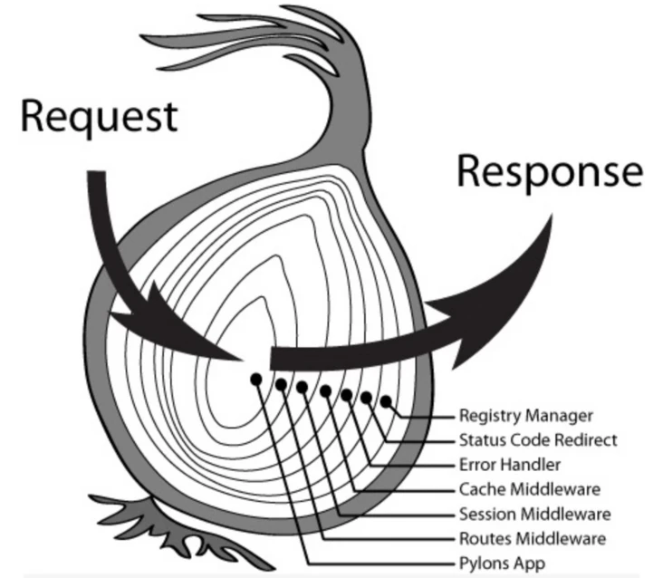
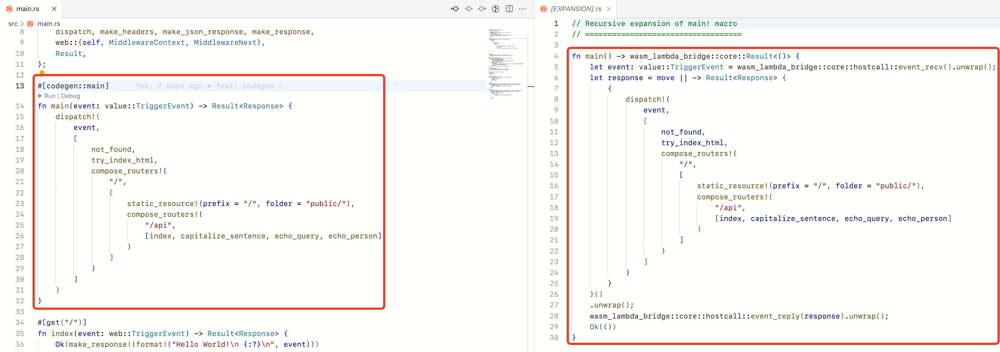
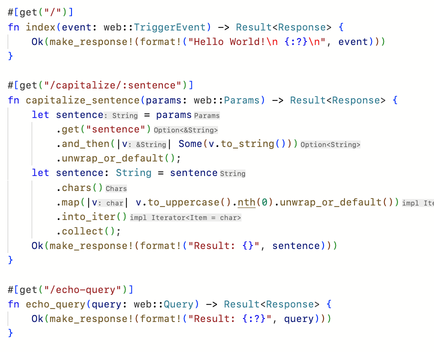
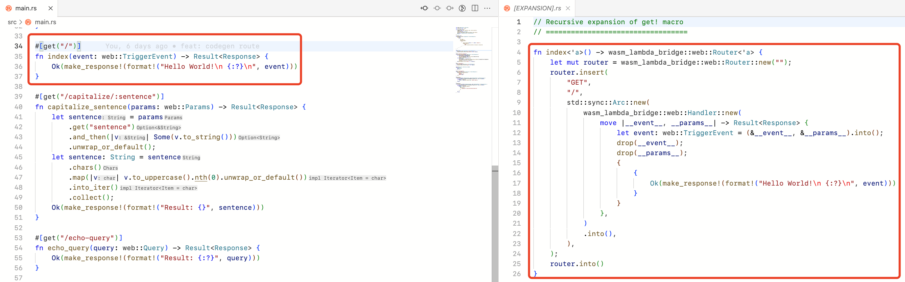
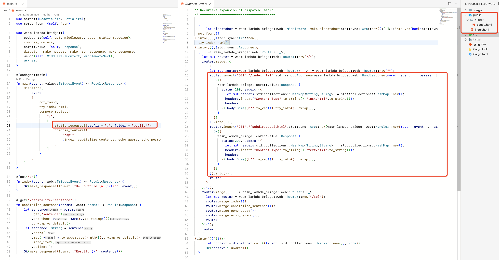
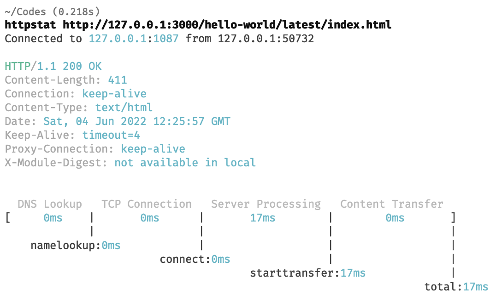

有一段是没有写博客了，这一段时间了解了不少新技术，但是没来得及写成博客总结。WebAssembly和Rust是我一直在关注的两项技术，这段时间使用它们编写了一个FaaS服务工具。

# 动机

作为一个Web开发者，我总希望能有这样一套工具/系统/流程。它能给我提供一套模板，我只需要简单地编写Restful服务的核心代码，整个过程足够优雅。

* 性能/性能方面
  
  1. 性能足够好。服务不会有太高的内存占用，性能足够好。如果能方便地进行扩缩容更好。
  2. 安全性足够好。希望能够向我提供控制Restful服务访问宿主机的各项权限的能力，如IO、环境变量等。

* 开发体验方面
  
  3. 编程效率足够高。能给我提供注解/装饰器，我只需要编写Restful服务核心的Handler，对于路由实现、服务鉴权等问题我不需要关心或者只需要做简单的配置即可。
  4. 编译产物足够简单。希望它最终产物只有一个Bundle，且这个Bundle体积不应该太大，因为我也不会在里面写什么复杂算法，不希望我的编译器把时间/算力浪费在重复地编译HTTP Server的实现上。
  5. 部署足够方便。以往一些将整个运行环境打包发布的方式太过麻烦（没错，说的就是Node.js/Python ）。同时，如果能同静态资源一起打包发布更好，避免需要同时维护两个模块。
  6. 测试开发的重编译速度足够快。开发时服务重启速度会影响开发速度，不希望我的时间浪费在等待长时间的编译上。

由此，我开发了[wams-lambda](https://github.com/ChenKS12138/wasm-lambda)项目，虽然已有不少的Web开发解决方案，但是我认为不能满足我的这些需求。

# 基于事件的FaaS

大部分的Restful服务都是可以转化成基于事件处理的服务，这种场景下使用FaaS<sup>[1]</sup>其实更为合适，但是我们看到的更多的是，每个Restful服务都bind一个socket，单独启动了一个HttpServer，这样的Restful服务多了，性能占用自然就高了。而使用FaaS平台，不需要常驻服务监听端口，可以缩容到0，降低了对系统资源的占用。

# 为什么是WebAssembly

## WebAssembly的安全性和性能

> WebAssembly provides no ambient access to the computing environment in which code is executed. Any inter- action with the environment, such as I/O, access to resources, or operating system calls, can only be performed by invoking functions provided by the embedder and imported into a WebAssembly module. An embedder can establish security policies suitable for a respective environment by controlling or limiting which functional capa- bilities it makes available for import. Such considerations are an embedder’s responsibility and the subject of API definitions for a specific environment.

WebAssembly<sup>[2]</sup>是一种被用于栈式虚拟机的编码格式。最初是被设计用于Web端，因此安全性在设计之初就是重要考量。wasm模块的指令集只包含了最基础的计算能力，不会影响外部执行环境，内部需要的IO能力、系统调用等都需要由虚拟机提供。当被用于FaaS时，FaaS模块内部代码通过调用import段的特定函数实现对外部环境的访问，这些函数由虚拟机进行实现，由此我们可以轻易地对模块的环境变量、模块的系统调用以及系统调用参数进行控制，提高安全性。同时，每个虚拟机都是隔离的（包括执行栈、内存、系统调用等），即使一个虚拟机发生了crush，也不会影响到其他模块的执行。

WebAssembly的性能表现依赖于具体的runtime实现，wasm的指令集是对真实世界计算机指令集的抽象<sup>[3]</sup>，不仅可以对wasm进行解释执行，还可以进行JIT/AOT，让代码以native的方式执行。

## 冷启动速度

FaaS缩容可以到0，因此冷启动问题<sup>[4]</sup>是FaaS相对于PaaS需要多处理的一个比较大的问题。不同于OpenFaaS等方案，运行一个wasm模块不需要单独启动一个容器，wasm运行时本身就是一个沙箱，因此可以比较好地应对冷启动问题，其主要的时间开销为从代码存储中拉取代码。

# Runtime Library

wasm-lambda提供了wasm-lambda-bridge的crate供FaaS模块调用，定义了一系列hostcall。每个wasm模块通过hostcall获取到事件，与宿主环境(host)进行通信。但是还不够开发者友好，因此wasm-lambda-bridge对hostcall进行了进一步封装，对事件进行解析，并派发给其他Handler，实现更优雅的编程。

```rust
// 直接调用raw hostcall
use std::collections::HashMap;
use wasm_lambda_bridge::core::{value::Response,hostcall::raw::event_reply};
fn main() {
		let reply = Response {
				value: 200,
				headers: HashMap::new(),
				body: Some("hello".to_string())
		};
		let data = bson::to_vec(&reply).unwrap();
    unsafe {
        event_reply(data.as_ptr(), data.len() as u64);
    };
}

// 使用Runtime Library
use wasm_lambda_bridge::{make_response,codegen,value::Response};
#[codegen::main] 
fn main() -> Result<Response> {
    Ok(make_response!("hello"))
}
```

## 基于洋葱路由的事件处理中间件



```rust
#[middleware]
fn not_found(context: MiddlewareContext, next: MiddlewareNext) -> MiddlewareContext {
    let mut context = next.call(context);
    if context.1.is_none() {
        context.1 = Some(make_response!(404, "404 Not Found"));
    }
    context
}
```

熟悉Koa.js的人对这个概念一定不陌生，这让我们的中间件有了两次被触发的机会，并且都写在了一个函数里。一些常见的中间件能力，如请求日志、错误捕获、处理未匹配路由都可以被实现。

## 使用Rust宏减少重复编码

我喜欢Rust的一个重要原因就是其强大的宏能力，它让我能够做到DRY(Don't Repeat Yourself)，或者是在Rust代码里再实现一套自己的DSL(Domain Specific Language)。Rust宏主要包括了声明式宏和过程宏。声明式宏编写匹配规则返回代码，更容易编写，能力有限；过程宏编写函数处理TokenStrema返回TokenStream，较为复杂，能力强大。Rust宏的使用这里不做赘述。

### `main`生成入口函数

使用过程宏重新wrap了传入的main函数，一方面使得代码更为简洁，另一方面避免了开发时遗忘返回响应。



### `#[get]`等生成route生成函数

使用`装饰器/注解`编写Restful服务的路由是我认为比较优雅的方式，这在`flask`和`Sprint Boot`中很常见，一方面使得代码更为直观，另一方面也使得后续使用代码生成文档更为容易。



同时对传入的函数参数进行解析，从请求事件中提取出对应的`Query`、`Param`、`TriggerEvent`、`Json`等再传入。



### `static_resource!()`引入资源

使用`static_resource!()`可以在编译期间对目录进行扫描，读取目录文件并生成包含`include_bytes!`的代码，实现静态资源也能被打包在wasm模块中。



# wasm-lambda Demo

1. 克隆并安装

```shell
git clone https://github.com/ChenKS12138/wasm-lambda.git
cd wasm-lambda
cargo install --path .
```

2. 编译 Example `hello-world`

```shell
cd examples/hello-world
cargo build
```

3. 启动

```shell
# Start Dev Server
wasm-lambda dev --bind 0.0.0.0:3000 -m hello-world:./target/wasm32-wasi/debug/hello-world.wasm

# Rebuild
# cargo build
```

4. 触发请求事件

打开浏览器，访问 `http://127.0.0.1:3000/hello-world/latest/`

或

```shell
curl -iL http://127.0.0.1:3000/hello-world/latest/
curl -i http://127.0.0.1:3000/hello-world/latest/api/capitalize/hello-world
curl -i http://127.0.0.1:3000/hello-world/latest/api/echo-query?name=cattchen&age=21
curl -i -X POST -d '{"name":"cattchen","age":21}' http://127.0.0.1:3000/hello-world/latest/api/echo-person
```



# 总结

这个项目实现还比较原始，很多东西都还没有实现或者是考虑到，后面还需要花比较多的时间来完善。

# 参考资料

- [1] https://aws.amazon.com/cn/blogs/china/iaas-faas-serverless/
- [2] https://webassembly.org/
- [3] https://blog.logrocket.com/webassembly-runtimes-compared/
- [4] https://www.infoq.cn/article/mi0lpquvxi7bpcq7ou9u