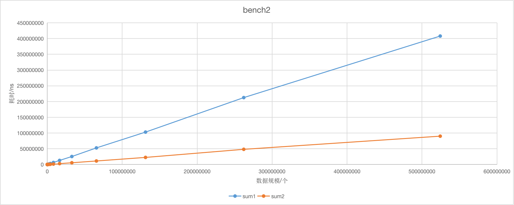

# 前言

我的主力开发语言是`JavaScript`，但是 js 对多线程的支持并不是特别好。在入门`golang`后，了解到了`go协程`和`channel`，想试一试多线程。`go`原生对并发很友好，我这里是希望尝试使用`go协程`优化大数组求和。

# 对比

进行对比的两个函数

1. `func sum1(bigArray []int) int` 使用普通的数组求和
2. `func sum2(bigArray []int)int`将数组分割成若干个数组，在不同的`go协程`进行求和，所有的`go协程`都得到结果后，再进行求和

```go
package main

import (
	"math/rand"
	"fmt"
	"sync"
	"time"
)

func main(){
	for i:=1000;i<10000000000;i*=2 {
		duration1,duration2,result1,result2 := runBenchmark(i);
		fmt.Println(i,duration1,duration2,result1,result2)
	}
}


func runBenchmark(amout int) (int64,int64,int64,int64) {
	bigArray :=createBigArray(amout);
	stop1 := createTimer();
	result1 := sum1(bigArray);
	duration1 := stop1();
	stop2 :=createTimer();
	result2 := sum2(bigArray);
	duration2 := stop2();
	return duration1,duration2,result1,result2;
}

func createBigArray(size int)[]int{
	rand.Seed(time.Now().Unix());
	list := make([]int,size);
	for i:=0;i<size;i++{
		list[i] = rand.Int()
	}
	return list;
}

func createTimer() func () int64 {
	startTime := time.Now().UnixNano()
	return func () int64 {
		return time.Now().UnixNano() - startTime
	}
}

func sum1(bigArray []int) int64 {
	sum := int64(0)
	for _,value := range(bigArray){
		sum += int64(value);
	}
	return sum;
}

func sum2(bigArray []int)int64 {
	SmallArraySize := len(bigArray)/100;
	sum:=int64(0);
	chanGroupSize := len(bigArray)/SmallArraySize;
	sumChan := make(chan int64,chanGroupSize+1);
	waitGroup := new(sync.WaitGroup);
	for i:=0;i<chanGroupSize;i++{
		waitGroup.Add(1);
		go sumRoutine(bigArray[i*SmallArraySize:(i+1)*SmallArraySize], sumChan, waitGroup)
	}
	waitGroup.Wait()
	for i:=0;i<chanGroupSize;i++ {
		sum+= <- sumChan;
	}
	return sum;
}

func sumRoutine(smallArray []int,ch chan int64,wg *sync.WaitGroup){
	defer wg.Done()
	sum :=int64(0);
	for _,value := range(smallArray){
		sum +=int64(value);
	}
	ch <- sum;
}
```

# 进行测试

首先我在自己的笔记本上跑了一下，效果似乎不是特别明显，当数据规模比较小时，使用`go协程`产生的开销相比多线程带来的性能提升会比较大。


```
数据规模 sum1函数耗时(ns) sum2函数耗时(ns)
1000	1000	257000
2000	2000	196000
4000	3000	123000
8000	19000	566000
16000	24000	574000
32000	21000	106000
64000	46000	101000
128000	92000	117000
256000	161000	164000
512000	710000	354000
1024000	633000	380000
2048000	1855000	746000
4096000	3779000	1430000
8192000	9285000	7126000
16384000	17107000	7522000
32768000	37100000	16824000
65536000	71186000	28741000
131072000	153552000	55689000
262144000	349672000	125364000
524288000	3370025000	221678000
```


---

后面我使用了一台 8 核 16GB 内存的云服务器进行测试，效果就比较明显了。sum2 函数的耗时明显降低。

```
processor	: 6
vendor_id	: GenuineIntel
cpu family	: 6
model		: 85
model name	: Intel(R) Xeon(R) Platinum 8255C CPU @ 2.50GHz
stepping	: 5
microcode	: 0x1
cpu MHz		: 2494.140
cache size	: 36608 KB
physical id	: 0
siblings	: 8
core id		: 6
cpu cores	: 8
apicid		: 6
initial apicid	: 6
fpu		: yes
fpu_exception	: yes
cpuid level	: 13
wp		: yes
```

```
数据规模 sum1函数耗时(ns) sum2函数耗时(ns)
1000	975	184791
2000	1744	136564
4000	2452	77209
8000	4462	148065
16000	13041	151411
32000	17729	99903
64000	34824	88240
128000	72507	88009
256000	153425	118217
512000	307149	128954
1024000	716739	218762
2048000	1498043	340398
4096000	3121459	741179
8192000	6512778	1440240
16384000	12999638	2841228
32768000	25421817	5573615
65536000	52787702	11216755
131072000	102977136	22564239
262144000	212568740	48269912
524288000	408104714	90059294
```



# 分析

在求和数组规模数据规模比较大，运行的机器核心数比较多的时候，使用`go协程`是可以提升数组求和的效率的。`go协程`和系统的进程并不是一一对应的，创建一个`go协程`本身的开销也比创建一个线程小。对大数组求和只是一种场景，也有很多其他类似的场景可以利用`go协程`进行优化。
