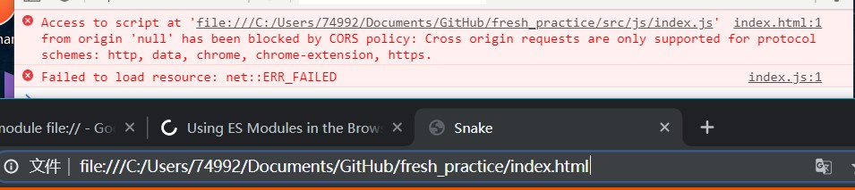

## 一开始

关于南邮 2019 届前端组校科协前端组的免试题。其实一开始我们三位讲师也不知道出些什么题目好，本来是打算像去年那样出道切图的题目，这样我们只要找张效果图，再给素材。新同学只要学好 HTML、CSS 基础，就可以交出一份不错的作品了。甚至，还可以引导他们学响应式布局、JavaScript 等。~~（毕竟我去年是这样水进前端组的）~~ emmm，其实对新人来讲，也并不是太简单，毕竟 CSS 布局那边有很多坑要踩。

## 再后来

上一届前端组讲师[大黄](https://github.com/UZIhuhuhu) 说可以做点不一样的。诶，我想到了我之前写的[贪吃蛇](https://github.com/ChenKS12138/H5-snake)，上一个寒假写的吧，第一次接触到了闭包以及 JavaScript 中的 this。

### 之前的代码

在那份代码中，我也开始有了像模块化代码的想法。我试图将代码拆分到多个 JavaScript 文件中。但是我当时并不懂得 `es module` ，`commonJS` , `webpack` 这些东西。当时只是分成了多个 JavaScript 文件，再用多了 script 标签引入。现在看来这种做法有缺点也有优点。优点是兼容性好，可以轻易地分割代码。但是缺点也很明显，依赖关系不清楚，不利于管理代码，而且这多个 script 标签中变量的作用域是相同的，容易产生变量之间的相互污染。

除此之外，当时的代码对 Snake、Food 这几个类或对象的职责也不明确。甚至一些状态判断的函数也写在了 Snake 类中，现在的我看来，这些做法都不太好，耦合度高。

```javascript
function Snake() {
  /*
   *这边的类用的是构造函数的方法写类，具体的函数实现已经删除了,感兴趣可以看源码
   */
  let body = new Array(); //第一个元素为蛇的头
  let direction = 1; // 1为向右，-1为向左，cellNum为向下，-cellNum为向上
  let live = true;
  let length = 3;
  let direcList = [1, -1, cellNum, -cellNum];
  (function initialPosition(lastOne, lastDir) {})();
  function move() {}
  function inDangerZone(target, direction) {}
  function crash(target) {}
  function getFood(position) {}
  return {
    body: body,
    direction: direction,
    move: move,
    crash: crash,
    getFood: getFood,
    length: length,
    live: live,
  };
}
```

### 现在的代码

因此，这次面试题，我是将原来 JavaScript 以外的代码保留，对 JavaScript 代码直接进行重写。重写完后的代码就很清爽了。

```javascript
class Snake {
  constructor(canvasWidth) {
    this.canvasWidth = canvasWidth;
    this.body = [23, 22, 21]; // 我们是用
    this._directionCode = 2; // 约定1为上，2为下，3为左，4为右
    this.live = true;
    this._directionLock = false;
  }
  get score() {}
  get nextHead() {}
  get currentHead() {}
  get currentTail() {}
  get directionCode() {}
  set directionCode(value) {}
  set nextTail(value) {}
  move() {}
}
```

这次，整个项目的代码主要由`Snake类` 、`Food类` 、`Grid类` 、`judgeStatus 函数` 、还有一个立即执行函数构成。Snake 和 Food 只存储蛇和食物的位置信息，所有的事件判断全部由 judgeStatus 负责。

这次还用上了`getter`、`setter` 。这样代码看起来会更加简洁，甚至有点优雅，少了很多括号~~逼死强迫症系列~~

```javascript
mySnake.directionCode = 4;
// 这样就会触发 `set directionCode(value)` 函数
```

## 到了最后

最后写了一两天吧，[代码仓库地址](https://github.com/ChenKS12138/fresh_practice) (打开时可能是私有仓库，9 月份开学后会开放源代码) 。

最后有点遗憾的地方是没办法模块化，代码有 170+行。诶，也不是说不能模块化，主要是如果模块化代码的话，新生做题会有点门槛。使用`es module`后，不能直接打开`index.html` ，必须起一个 web 服务，这就有点门槛了，这边有个问题。

> ## Requirements
>
> You’ll need a server to be able to fetch with import, as it doesn’t work on the `file://` protocol. You can use `npx serve` to start up a server in the current directory for testing locally.

[https://www.sitepoint.com/using-es-modules/](https://www.sitepoint.com/using-es-modules/)

直接打开 HTML 文件会有这样的报错，只有在 Chrome 上才有这个问题，Chrome 上的 cors 不支持 file 协议，在 Edge 、Firefox 都没有这个问题。



因此，只好将文件都放在一个 JavaScript 文件里，挺遗憾的吧。希望新同学们都可以做出免试题来。
