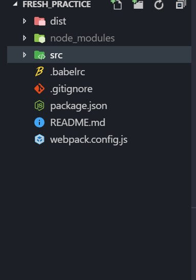
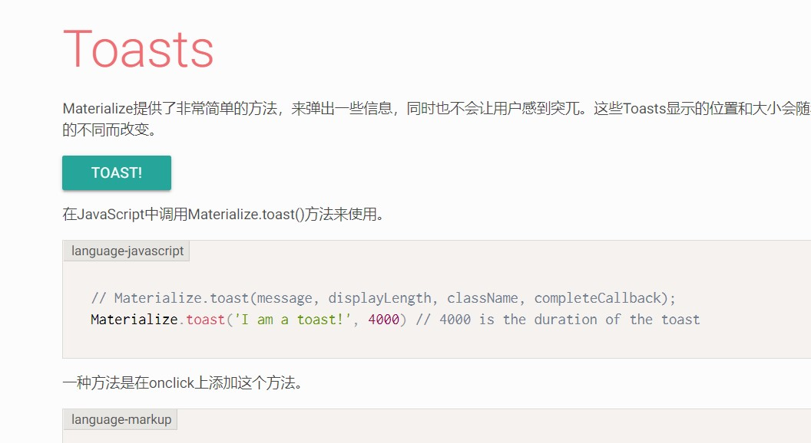
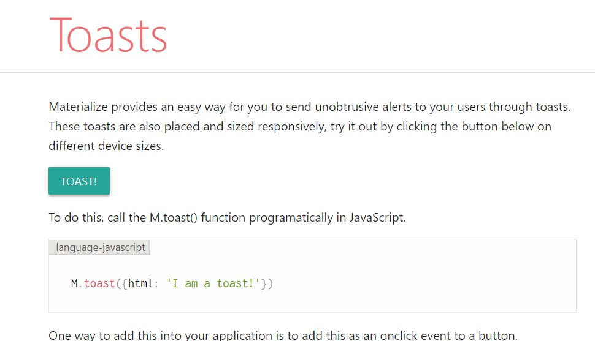

## 关于模块化

在前面说到了，不能把这个项目模块化挺遗憾的。所以我打算在参考答案的代码里用上模块化，这也算得上是我的一次前端工程化的实践吧。

我这里使用的是`webpack` 。先来安利一个 webpack 教程 https://www.valentinog.com/blog/webpack/ 这个跟着敲一遍，就可以知道个大概了。

在这里不得不吹`webpack4`，确实比较友好了。打包的入口文件 和输出位置不需要我配置，它有默认值。并且搭配上`webpack-dev-server` 可以实现热更新，这个体验就很友好了。

webpack 主要还是对 JavaScriptd 代码的打包，它可以根据我的代码入口文件，生成依赖树(`Dependence Graph`)，并将这多个 JavaScript 文件打包成一个文件。这对于前端的性能优化是很有意义的，它可以有效地减少 HTTP 请求数，加快加载速度。

### 那么在 HTML、CSS 文件的处理上，它又有什么优势呢？

使用了`html-loader`、`html-webpack-plugin` 之后，可以将原来的`index.html` 文件作为一个模板，webpack 会自动在合适的地方注入`script` 、 `link` 标签 。将`link` 标签注入 `head` 标签内部，`link` 标签不会阻塞 DOM 的解析。将`script` 标签注入`body` 标签的尾部，`script` 会阻塞 DOM 的解析。

而在 CSS 上，也是将多个文件合并成一个文件，减少 HTTP 请求数，以达到加快加载速度目的。

	<svg viewBox="0 0 1088 615" version="1.1" xmlns="http://www.w3.org/2000/svg" xmlns:xlink="http://www.w3.org/1999/xlink">
    <g stroke-width="1" fill="none" fill-rule="evenodd">
        <text font-family="'Source Sans Pro', sans-serif" font-size="18" font-weight="600" fill="#86A5BA">
            <tspan x="933.778" y="459">STATIC ASSETS</tspan>
        </text>
        <g transform="translate(1002, 326)">
            <g>
                <use fill-opacity="0.1" fill="#526B78" fill-rule="evenodd" xlink:href="#path-1"></use>
                <rect stroke="#526B78" stroke-width="4" x="-2" y="-2" width="84" height="84" rx="3"></rect>
            </g>
            <text font-family="'Source Sans Pro', sans-serif" font-size="22" font-weight="500" fill="#FFFFFF">
                <tspan x="18.891" y="46.7096774">.png</tspan>
            </text>
        </g>
        <g transform="translate(1002, 214)">
            <g>
                <use fill-opacity="0.1" fill="#526B78" fill-rule="evenodd" xlink:href="#path-2"></use>
                <rect stroke="#526B78" stroke-width="4" x="-2" y="-2" width="84" height="84" rx="3"></rect>
            </g>
            <text font-family="'Source Sans Pro', sans-serif" font-size="22" font-weight="500" fill="#FFFFFF">
                <tspan x="22.532" y="46.7096774">.css</tspan>
            </text>
        </g>
        <g transform="translate(894, 326)">
            <g>
                <use fill-opacity="0.1" fill="#526B78" fill-rule="evenodd" xlink:href="#path-3"></use>
                <rect stroke="#526B78" stroke-width="4" x="-2" y="-2" width="84" height="84" rx="3"></rect>
            </g>
            <text font-family="'Source Sans Pro', sans-serif" font-size="22" font-weight="500" fill="#FFFFFF">
                <tspan x="21.817" y="46.7096774">.jpg</tspan>
            </text>
        </g>
        <g transform="translate(894, 214)">
            <g>
                <use fill-opacity="0.1" fill="#526B78" fill-rule="evenodd" xlink:href="#path-4"></use>
                <rect stroke="#526B78" stroke-width="4" x="-2" y="-2" width="84" height="84" rx="3"></rect>
            </g>
            <text font-family="'Source Sans Pro', sans-serif" font-size="22" font-weight="500" fill="#FFFFFF">
                <tspan x="29" y="46.7096774">.js</tspan>
            </text>
        </g>
        <g transform="translate(342, 225)" stroke="#7E8C94" stroke-width="4">
            <path d="M499.558824,86.52 C499.558824,86.52 484.852941,81.02 439.908088,109.436667 C394.963235,137.853333 380.992647,164.436667 380.992647,164.436667" stroke-dasharray="7"></path>
            <path d="M499.558824,86.0616667 C499.558824,86.0616667 484.852941,91.5616667 439.908088,63.145 C394.963235,34.7283333 380.992647,8.145 380.992647,8.145" stroke-dasharray="7"></path>
            <path d="M0.477941176,170.395 C0.477941176,170.395 169.382939,98.895 447.847936,98.895" id="Shape_99_" stroke-dasharray="6"></path>
            <path d="M0.477941176,72.395 C0.477941176,72.395 169.382939,0.895 447.847936,0.895" id="Shape_99_" stroke-dasharray="6" transform="translate(224.162939, 36.645000) scale(1, -1) translate(-224.162939, -36.645000) "></path>
        </g>
        <text font-family="'Source Sans Pro', sans-serif" font-size="18" font-weight="600" fill="#86A5BA">
            <tspan x="24.934" y="562">MODULES WITH DEPENDENCIES</tspan>
        </text>
        <g transform="translate(228, 335)">
            <g>
                <use fill-opacity="0.1" fill="#526B78" fill-rule="evenodd" xlink:href="#path-5"></use>
                <rect stroke="#526B78" stroke-width="4" x="-2" y="-2" width="66" height="66" rx="3"></rect>
            </g>
            <text font-family="'Source Sans Pro', sans-serif" font-size="22" font-weight="500" fill="#FFFFFF">
                <tspan x="12.817" y="38">.jpg</tspan>
            </text>
        </g>
        <g transform="translate(228, 223)">
            <g>
                <use fill-opacity="0.1" fill="#526B78" fill-rule="evenodd" xlink:href="#path-6"></use>
                <rect stroke="#526B78" stroke-width="4" x="-2" y="-2" width="66" height="66" rx="3"></rect>
            </g>
            <text font-family="'Source Sans Pro', sans-serif" font-size="22" font-weight="500" fill="#FFFFFF">
                <tspan x="9.891" y="38">.png</tspan>
            </text>
        </g>
        <g transform="translate(302, 414.500000) scale(1, -1) translate(-302, -414.500000) translate(182, 404)">
            <rect fill="#BBDBEC" x="0" y="0" width="2" height="6"></rect>
            <rect fill="#BBDBEC" x="76" y="6" width="2" height="12"></rect>
            <rect fill="#BBDBEC" transform="translate(75.304690, 4.704683) rotate(-45) translate(-75.304690, -4.704683) " x="74.3046896" y="1.87968342" width="2" height="5.6500001"></rect>
            <rect fill="#BBDBEC" x="2" y="2" width="72" height="2"></rect>
            <polyline stroke="#BBDBEC" stroke-width="2" points="80 12 77 20.8000002 74 12"></polyline>
        </g>
        <g transform="translate(116, 391)">
            <g>
                <use fill-opacity="0.1" fill="#526B78" fill-rule="evenodd" xlink:href="#path-7"></use>
                <rect stroke="#526B78" stroke-width="4" x="-2" y="-2" width="66" height="66" rx="3"></rect>
            </g>
            <text font-family="'Source Sans Pro', sans-serif" font-size="22" font-weight="500" fill="#FFFFFF">
                <tspan x="8.076" y="38">.sass</tspan>
            </text>
        </g>
        <g transform="translate(116, 279)">
            <g>
                <use fill-opacity="0.1" fill="#526B78" fill-rule="evenodd" xlink:href="#path-8"></use>
                <rect stroke="#526B78" stroke-width="4" x="-2" y="-2" width="66" height="66" rx="3"></rect>
            </g>
            <text font-family="'Source Sans Pro', sans-serif" font-size="22" font-weight="500" fill="#FFFFFF">
                <tspan x="8.076" y="38">.sass</tspan>
            </text>
        </g>
        <g transform="translate(182, 201)">
            <rect fill="#BBDBEC" x="0" y="0" width="2" height="6"></rect>
            <rect fill="#BBDBEC" x="76" y="113" width="2" height="12"></rect>
            <rect fill="#BBDBEC" transform="translate(75.304690, 111.704683) rotate(-45) translate(-75.304690, -111.704683) " x="74.3046896" y="108.879683" width="2" height="5.6500001"></rect>
            <rect fill="#BBDBEC" x="26" y="109" width="48" height="2"></rect>
            <rect fill="#BBDBEC" transform="translate(24.704683, 108.304690) rotate(-45) translate(-24.704683, -108.304690) " x="23.7046835" y="105.47969" width="2" height="5.6500001"></rect>
            <rect fill="#BBDBEC" x="22" y="6" width="2" height="101"></rect>
            <rect fill="#BBDBEC" transform="translate(21.304690, 4.704683) rotate(-45) translate(-21.304690, -4.704683) " x="20.3046896" y="1.87968342" width="2" height="5.6500001"></rect>
            <rect fill="#BBDBEC" x="2" y="2" width="18" height="2"></rect>
            <polyline stroke="#BBDBEC" stroke-width="2" points="80 118 77 126.8 74 118"></polyline>
        </g>
        <g transform="translate(182, 189)">
            <rect fill="#BBDBEC" x="0" y="0" width="2" height="6"></rect>
            <rect fill="#BBDBEC" x="76" y="6" width="2" height="19"></rect>
            <rect fill="#BBDBEC" transform="translate(75.304690, 4.704683) rotate(-45) translate(-75.304690, -4.704683) " x="74.3046896" y="1.87968342" width="2" height="5.6500001"></rect>
            <rect fill="#BBDBEC" x="2" y="2" width="72" height="2"></rect>
            <polyline stroke="#BBDBEC" stroke-width="2" points="80 18 77 26.8000002 74 18"></polyline>
        </g>
        <g transform="translate(116, 167)">
            <g>
                <use fill-opacity="0.1" fill="#526B78" fill-rule="evenodd" xlink:href="#path-9"></use>
                <rect stroke="#526B78" stroke-width="4" x="-2" y="-2" width="66" height="66" rx="3"></rect>
            </g>
            <text font-family="'Source Sans Pro', sans-serif" font-size="22" font-weight="500" fill="#FFFFFF">
                <tspan x="20" y="38">.js</tspan>
            </text>
        </g>
        <g transform="translate(110, 470.500000) scale(1, -1) translate(-190, -470.500000) translate(150, 460)">
            <rect fill="#BBDBEC" x="0" y="0" width="2" height="6"></rect>
            <rect fill="#BBDBEC" x="76" y="6" width="2" height="12"></rect>
            <rect fill="#BBDBEC" transform="translate(75.304690, 4.704683) rotate(-45) translate(-75.304690, -4.704683) " x="74.3046896" y="1.87968342" width="2" height="5.6500001"></rect>
            <rect fill="#BBDBEC" x="2" y="2" width="72" height="2"></rect>
            <polyline stroke="#BBDBEC" stroke-width="2" points="80 12 77 20.8000002 74 12"></polyline>
        </g>
        <g transform="translate(4, 447)">
            <g>
                <use fill-opacity="0.1" fill="#526B78" fill-rule="evenodd" xlink:href="#path-10"></use>
                <rect stroke="#526B78" stroke-width="4" x="-2" y="-2" width="66" height="66" rx="3"></rect>
            </g>
            <text font-family="'Source Sans Pro', sans-serif" font-size="22" font-weight="500" fill="#FFFFFF">
                <tspan x="8.076" y="38">.sass</tspan>
            </text>
        </g>
        <g transform="translate(70, 363)">
            <rect fill="#BBDBEC" x="0" y="0" width="2" height="6"></rect>
            <rect fill="#BBDBEC" x="76" y="6" width="2" height="12"></rect>
            <rect fill="#BBDBEC" transform="translate(75.304690, 4.704683) rotate(-45) translate(-75.304690, -4.704683) " x="74.3046896" y="1.87968342" width="2" height="5.6500001"></rect>
            <rect fill="#BBDBEC" x="2" y="2" width="72" height="2"></rect>
            <polyline stroke="#BBDBEC" stroke-width="2" points="80 12 77 20.8000002 74 12"></polyline>
        </g>
        <g transform="translate(4, 335)">
            <g>
                <use fill-opacity="0.1" fill="#526B78" fill-rule="evenodd" xlink:href="#path-11"></use>
                <rect stroke="#526B78" stroke-width="4" x="-2" y="-2" width="66" height="66" rx="3"></rect>
            </g>
            <text font-family="'Source Sans Pro', sans-serif" font-size="22" font-weight="500" fill="#FFFFFF">
                <tspan x="15.38" y="38">.cjs</tspan>
            </text>
        </g>
        <g transform="translate(38, 307)">
            <rect fill="#BBDBEC" x="0" y="22" width="6" height="2"></rect>
            <rect fill="#BBDBEC" x="2" y="6" width="2" height="16"></rect>
            <rect fill="#BBDBEC" transform="translate(4.704683, 4.704683) rotate(45) translate(-4.704683, -4.704683) " x="3.70468347" y="1.87968342" width="2" height="5.6500001"></rect>
            <rect fill="#BBDBEC" x="6" y="2" width="62" height="2"></rect>
            <polyline stroke="#BBDBEC" stroke-width="2" transform="translate(66.400000, 3) rotate(270) translate(-66.400000, -3) " points="69.4000001 -1.4000001 66.4000001 7.4000001 63.4000001 -1.4000001"></polyline>
        </g>
        <g transform="translate(26, 289)">
            <polyline stroke="#BBDBEC" stroke-width="2" points="6 30 3 38.8000002 0 30"></polyline>
            <rect fill="#BBDBEC" x="2" y="0" width="2" height="39"></rect>
            <rect fill="#BBDBEC" x="0" y="0" width="6" height="2"></rect>
        </g>
        <g transform="translate(110, 246.500000) scale(1, -1) translate(-190, -246.500000) translate(150, 236)">
            <rect fill="#BBDBEC" x="0" y="0" width="2" height="6"></rect>
            <rect fill="#BBDBEC" x="76" y="6" width="2" height="12"></rect>
            <rect fill="#BBDBEC" transform="translate(75.304690, 4.704683) rotate(-45) translate(-75.304690, -4.704683) " x="74.3046896" y="1.87968342" width="2" height="5.6500001"></rect>
            <rect fill="#BBDBEC" x="2" y="2" width="72" height="2"></rect>
            <polyline stroke="#BBDBEC" stroke-width="2" points="80 12 77 20.8000002 74 12"></polyline>
        </g>
        <g transform="translate(4, 223)">
            <g>
                <use fill-opacity="0.1" fill="#526B78" fill-rule="evenodd" xlink:href="#path-12"></use>
                <rect stroke="#526B78" stroke-width="4" x="-2" y="-2" width="66" height="66" rx="3"></rect>
            </g>
            <text font-family="'Source Sans Pro', sans-serif" font-size="22" font-weight="500" fill="#FFFFFF">
                <tspan x="10.947" y="38">.hbs</tspan>
            </text>
        </g>
        <g transform="translate(32, 177)">
            <polyline stroke="#BBDBEC" stroke-width="2" points="6 30 3 38.8000002 0 30"></polyline>
            <rect fill="#BBDBEC" x="2" y="0" width="2" height="39"></rect>
            <rect fill="#BBDBEC" x="0" y="0" width="6" height="2"></rect>
        </g>
        <g transform="translate(4, 111)">
            <g>
                <use fill-opacity="0.1" fill="#526B78" fill-rule="evenodd" xlink:href="#path-13"></use>
                <rect stroke="#526B78" stroke-width="4" x="-2" y="-2" width="66" height="66" rx="3"></rect>
            </g>
            <text font-family="'Source Sans Pro', sans-serif" font-size="22" font-weight="500" fill="#FFFFFF">
                <tspan x="20" y="38">.js</tspan>
            </text>
        </g>
    </g>
  </svg>

### 在最后我要喷一下`materialize-css`

我想喷一下`materialize-css` ，同一个 API 中文文档和英文文档是不一样的 。

