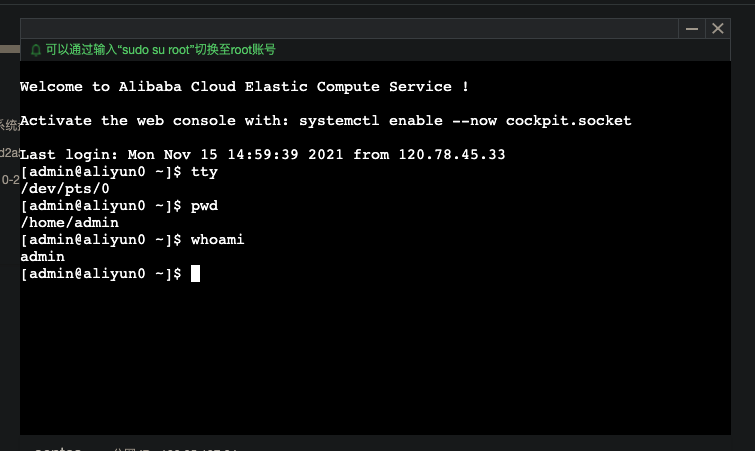
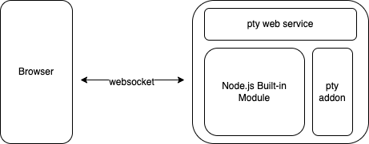
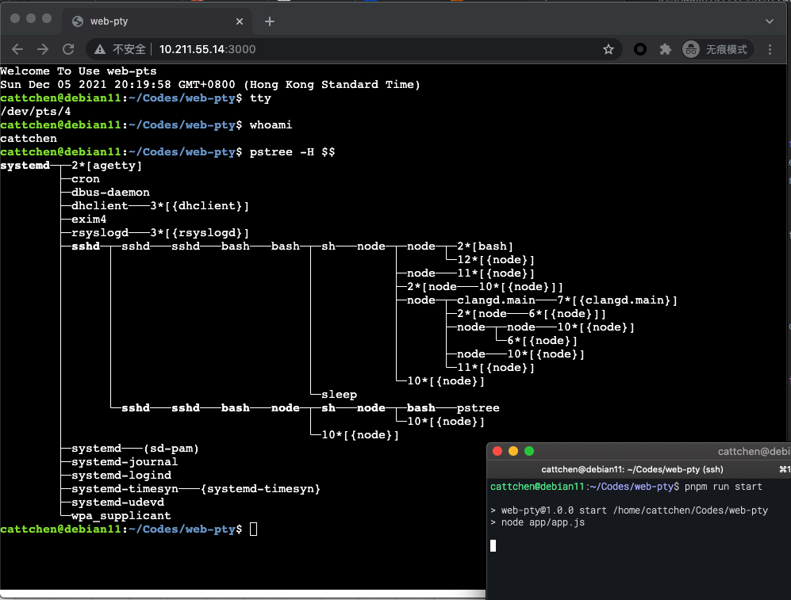
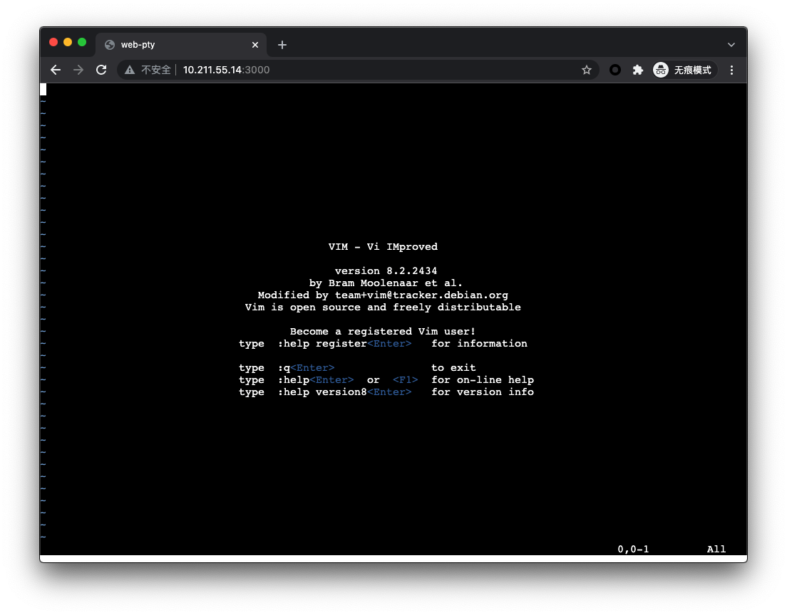

# 前言

最近看了《the linux programming interface》<sup>[[1]](#1)</sup>，总体感觉这是本好书，补充了一些课内 OS 没有告诉我，但是同样重要的东西，比较清晰地介绍了一些比较重要的概念，如`文件空洞`、`作业控制/进程组`、`标准信号/实时信号`、`进程的内存模型`、`僵尸进程`、`进程间通信`、`socket编程`、`ruid/euid/suid`、`elf文件`、`IO模型`等。书中最后一章介绍了伪终端技术，这里我想动手实现一个基于 web 的 terminal，顺便复习一下之前学到的东西。

# 什么是终端

在大型机的时代，人手一台计算机的事情是不可想象的，相比之下更为常见的是用户通过一台终端设备接入大型机。随着个人计算机的普及，我们通常不再需要单独的终端设备连接我们的计算机，提到的终端更多的是虚拟终端。从虚拟终端的实现上又分为 tty 和 pty<sup>[[2]](#2)</sup>。tty/pty 连接了用户空间的进程和外部的输入输出设备，不同之处在于 tty 连接的是内核的终端模拟器，终端模拟器外部对应真实的外设，pts 通过 ptmx 连接到其他用户空间进程。

# web 终端的实现

## 实现目标及方式





我们在使用各家云服务的计算时，都会提供一个 web 的终端，我的目标就是实现一个类似的 web 服务，通过 websocket 进行通信。同时因为 Node.js 的 Built-in 模块不提供伪终端相关的 api，我编写调用相关系统调用的 Node.js Addon。

## 实现原理

主要的流程如下

1. 进程调用`posix_openpt`获取伪终端主设备 fd
2. 进程调用`fork`生成子进程，父进程返回主设备 fd
3. 子进程打开伪终端从设备 fd，并将`stdin`,`stdout`,'stderr`改为伪终端从设备
4. 执行 exec，一般是 shell 程序

关闭伪终端时，需要对子进程发送`SIGHUP`，通知其终端将关闭。

上述流程编写完后，使用`nan`wrap 一层后，即可成为 addon。Node.js 服务获取到伪终端主设备 fd 后，封装为一个 Stream。因为 node.js 使用的是异步 I/O，不能直接阻塞。

```cpp
int fd_add_cloexec(int fd) {
    int flags;
    if ((flags = fcntl(fd, F_GETFD)) == -1) {
        pts_fatal("fcntl");
        return -1;
    };
    flags |= FD_CLOEXEC;
    return fcntl(fd, F_SETFD, flags);
    return 0;
}
int create_pts(int* child_pid_ptr) {
    int master_tty_fd, slave_tty_fd, child_pid;
    char slave_tty_name[FILENAME_MAX], *str, *shell;
    struct sigaction sia;

    if (child_pid_ptr == NULL) {
        child_pid_ptr = &child_pid;
    }

    if ((master_tty_fd = posix_openpt(O_RDWR | O_NOCTTY)) == -1) {
        pts_fatal("posix_openpt");
        return -1;
    }
    if (fd_add_cloexec(master_tty_fd) == -1) {
        pts_fatal("fd_add_cloexec");
        return -1;
    };
    if ((str = ptsname(master_tty_fd)) == NULL) {
        pts_fatal("ptsname");
        return -1;
    }
    strcpy(slave_tty_name, str);
    if (unlockpt(master_tty_fd) == -1) {
        pts_fatal("unlockpt");
        return -1;
    }
    if ((shell = getenv("SHELL")) == NULL)
        shell = (char*)"/bin/sh";

    memset(&sia, 0, sizeof(struct sigaction));
    sigemptyset(&sia.sa_mask);
    sia.sa_flags = SA_RESETHAND | SA_NOCLDWAIT;
    sia.sa_handler = SIG_DFL;
    if (sigaction(SIGCHLD, &sia, NULL) == -1) {
        pts_fatal("sigaction");
        return -1;
    }

    (*child_pid_ptr) = fork();
    if ((*child_pid_ptr) == -1) {
        pts_fatal("fork");
        return -1;
    }
    // child process
    if ((*child_pid_ptr) == 0) {
        if (setsid() == -1)
            err_exit("setsid");
        if (close(master_tty_fd) == -1)
            err_exit("close");
        if ((slave_tty_fd = open(slave_tty_name, O_RDWR)) == -1)
            err_exit("open");

        if (dup2(slave_tty_fd, STDIN_FILENO) == -1)
            err_exit("dup2");
        if (dup2(slave_tty_fd, STDOUT_FILENO) == -1)
            err_exit("dup2");
        if (dup2(slave_tty_fd, STDERR_FILENO) == -1)
            err_exit("dup2");
        execlp(shell, shell, (char*)NULL);
        err_exit("execlp");
    }
    return master_tty_fd;
}
int kill_pts_child(int child_pid) {
    kill(child_pid, SIGHUP);
    return 0;
}
int resize_pts(int pts_fd, unsigned short rows, unsigned short cols) {
    struct winsize wsize;
    if (ioctl(pts_fd, TIOCGWINSZ, &wsize) == -1) {
        pts_fatal("ioctl");
        return -1;
    };
    wsize.ws_row = rows;
    wsize.ws_col = cols;
    if (ioctl(pts_fd, TIOCSWINSZ, &wsize) == -1) {
        pts_fatal("ioctl");
        return -1;
    }
    return 0;
}
```

```javascript
const stream = require("stream");
const fs = require("fs");
const ptsAddon = require("./pts-addon");

class PtsStream extends stream.Duplex {
  constructor(options) {
    super(options);
    const { ptsFd, childPid } = ptsAddon.createPts();
    this.ptsFd = ptsFd;
    this.childPid = childPid;
  }
  _destroy() {
    fs.close(this.ptsFd);
    ptsAddon.killPtsChild(this.childPid);
  }
  _read(size) {
    fs.read(
      this.ptsFd,
      {
        length: size,
      },
      (err, bytesRead, buffer) => {
        if (err || bytesRead == 0) {
          this.destroy(err);
          return;
        }
        this.push(Buffer.from(buffer).slice(0, bytesRead));
      }
    );
  }
  _write(chunk, encoding, callback) {
    fs.write(this.ptsFd, chunk, callback);
  }
  resize(rows, cols) {
    ptsAddon.resizePts(this.ptsFd, rows, cols);
  }
}

module.exports = { PtsStream };
```

## 实现效果

Github 仓库 [https://github.com/ChenKS12138/web-pty](https://github.com/ChenKS12138/web-pty)





对窗口的调整做了适配，因此 vim 等编辑器也可以正常工作。

# 结语

之前遇到 linux 方面的问题，大都是通过直接 Google 搜索报错信息找到解决方案。看完 tlpi 了解了这些概念后对 linux 内核如何运作有了基本的认知，处理问题时心中可以有个模型，能够理解内核中发生的事件，排查问题时更有针对性。这也是我认为工程师区别于其他普通人的地方，其他人只能看到表象，但是工程师理解表象背后的系统运作逻辑。

# 参考引用

- [1] https://man7.org/tlpi/
- [2] https://zhuanlan.zhihu.com/p/97018747
