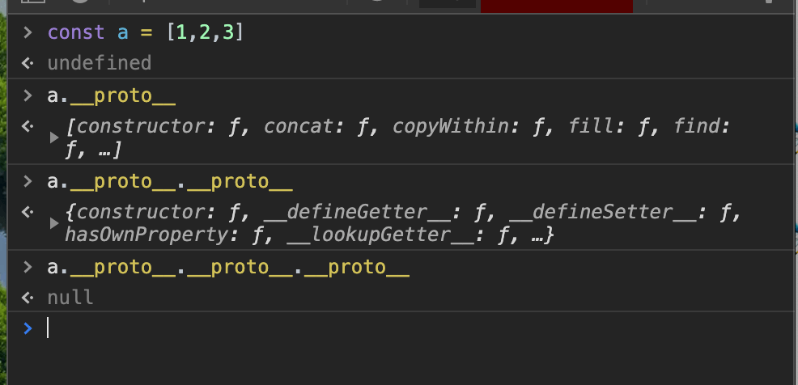
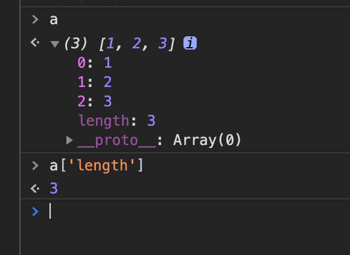

JavaScript 本身是没有类继承的，但是我们又可以使用 ES6 中的`class`关键字来写一个类，它的底层实现是原型链。原型链的介绍在[MDN--原型链](https://developer.mozilla.org/zh-CN/docs/Web/JavaScript/Inheritance_and_the_prototype_chain)上的介绍已经很详细了，但我想分享一下我的理解，如果不正确的地方，欢迎指出。

## 什么是原型链

在 chrome 的 devtool 中，我们打印一个引用类型的变量时可以看到这个变量一般会有个`__proto__`属性。这个对应的就是这个变量的原型。每个引用类型的变量都会有其对应的原型，然后其对应的原型又有其对应的原型 ~~套娃警告 ⚠️~~ ，这样的一条链被称为原型链，最终`__proto__`会指向 null。



就以上图为例子，我们需要先了解两个事实。首先 js 中的数组也是一个对象，第二 js 的数组通过下表访问数组元素时，本质上是使用了方括号表示法的属性访问器来获取对象的属性。



可能会疑惑我们常用的 js 的 push 方法，没有出现在这里。这其实是没有问题的，当我们调用`a.push()`的时候，首先会查看对象`a`上是否有`push`方法，没有则继续查看其`__proto__`上是否有`push`方法，以此类推，直到`__proto__`为 null 时，说明 a 上不存在`push`，因而报错，对于其他引用类型的变量也是同样的道理。我们使用构造函数 new 一个新的对象时，新对象的`__proto__` 指向的就是这个构造函数的`prototype`。这样，我们将一个构造函数的`prototype`的`__proto__`指向另一个构造函数的`prototype`，就可以用 js 的原型链实现类的继承。

## js 中的令人迷惑的 this 指向

js 中的 this 指向和函数的调用方式有关，我们可以分为以下几种方式。

1. 当作为普通函数调用时，this 指向的就是全局对象，这里的全局对象具体是什么，需要看运行环境。

2. 如果函数是作为对象的方法时，`this`指向的就是这个对象。

3. 如果函数是作为构造函数的话，那么 this 会指向这个`new`产生的新对象。

4. 除此之外还可以通过`call`,`apply`,`bind`这些方法来修改 this 的指向。

```javasc
function func1(){
  console.log(this);
}


const obj1 = {
  func:func1
}

const person = {
  name:'chen'
}

func1(); // 函数作为普通函数调用
obj1.func(); // 函数作为对象的方法调用
const obj2 = new func1(); // 函数作为构造函数调用
func1.call(person); // 使用call来修改this指向
obj1.func.apply(person); // 使用apply来修改this指向
```

**建议跟着敲一遍代码，有助于理解**

说到了 this 指向问题，不得不提一下`箭头函数`。`箭头函数`不仅仅是使函数的写法更加简短，箭头函数的 this 指向也与其他普通函数不同。箭头函数的 this 指向不会因为它的调用方式不同而不同，它的 this 指向的是定义函数处的 this。

```javascript
setTimeout(function () {
  console.log(this);
});

setTimeout(() => {
  console.log(this);
});
```

## 结语

理解原型链和 js 中的 this 指向问题以及箭头函数的一些特性可以帮助自己在写代码时，少踩挺多坑的。相关的有意思的问题还有挺多的，也有一些安全方面的问题，像原型链污染之类的。
