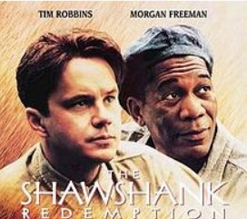
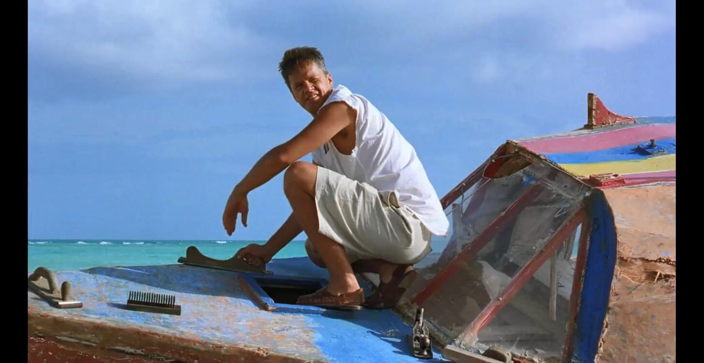
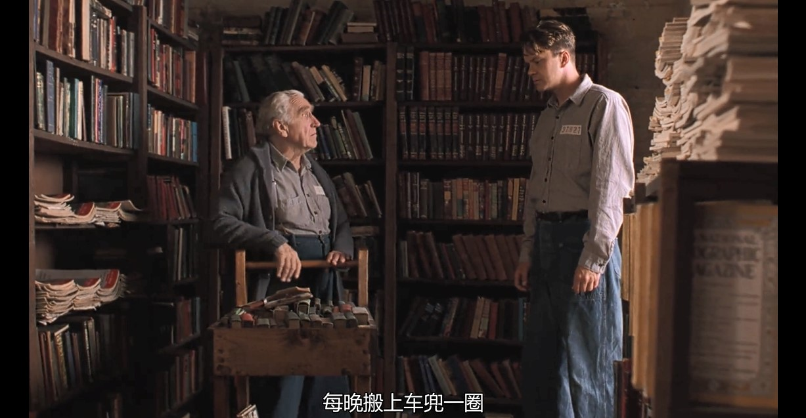
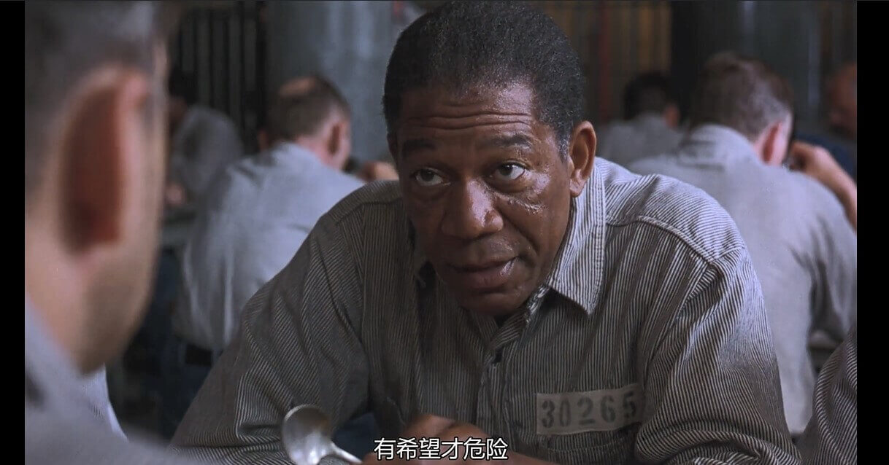
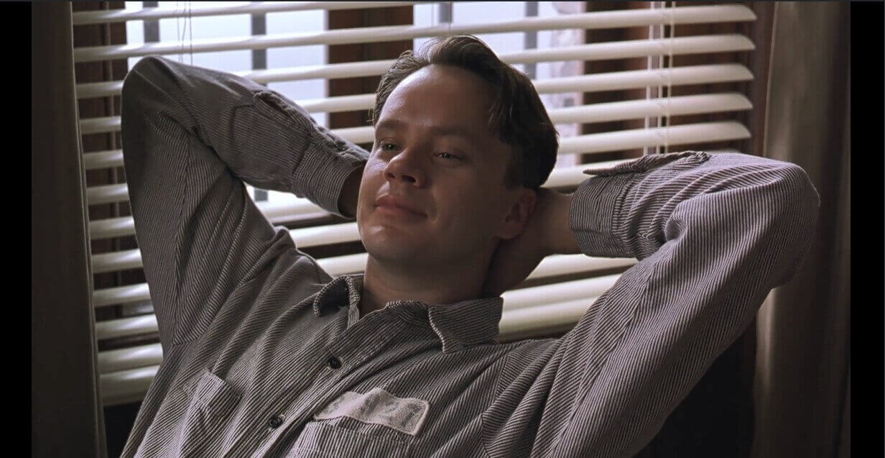
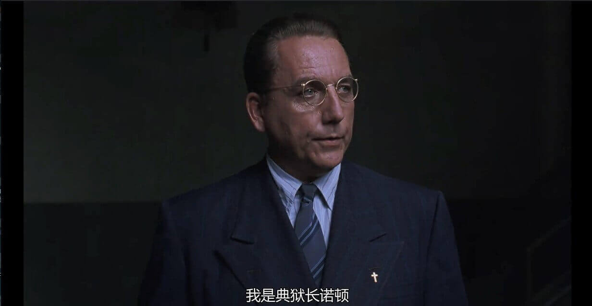
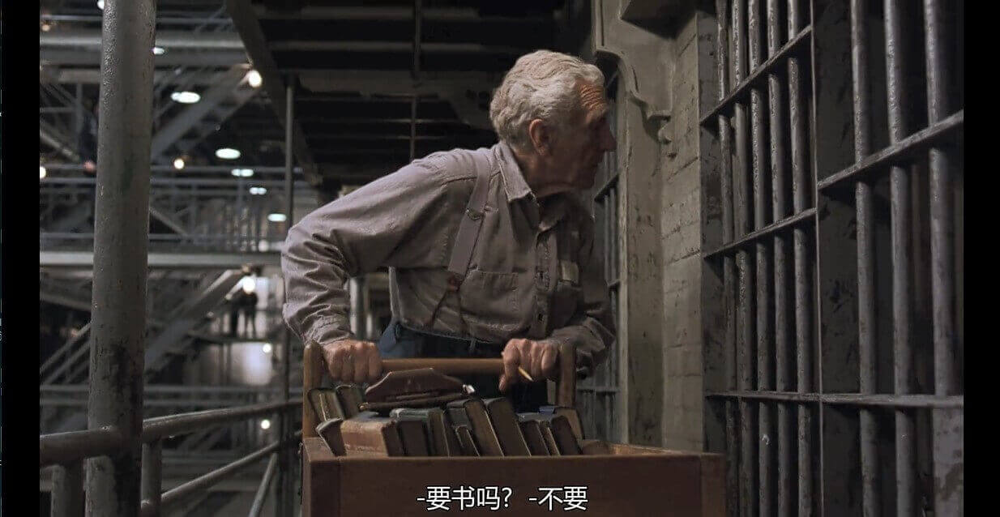
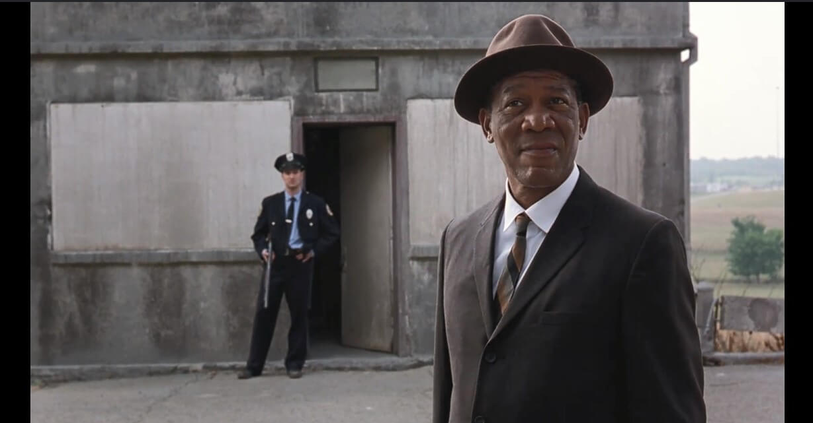
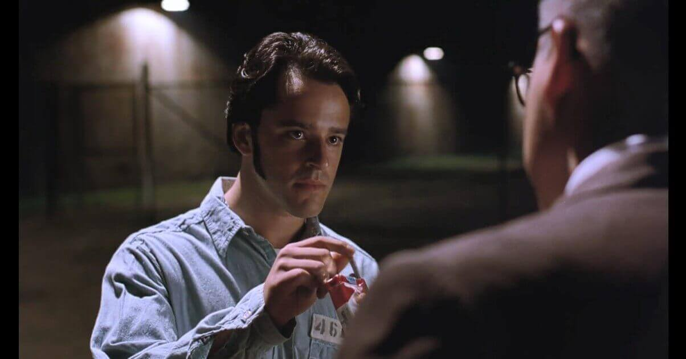

# 概述

`肖申克的救赎`，英文名为`The Shawshank Redemption` 。讲述的是一位年轻的银行家安迪·杜弗兰被指控杀害他的妻子与其情夫而入狱，本将在肖申克监狱中度过余生，但是在得知自己无罪后，越狱重获新生的故事。

安迪本来是一个年轻有为的银行家，但被判了无期徒刑进入了肖申克监狱。一开始，他独来独往，不与人接触。后来在他们的一次的出公差，他通过帮队长海利报税节税，让监狱最严格的警长请了他的”同事们“每人三瓶啤酒，自此狱友们对他刮目相看。不得不说有文化就是不一样。典狱长也注意到了安迪的财经能力，将他调离了原来的洗衣房，协助布鲁克管理监狱图书馆，并要求安迪暗中帮他做账洗钱。同时，在此期间他不断写信给州议会，在他的努力下，州议会最终拨款修缮监狱图书馆。后来，他从名叫汤米的狱友的口中得知，当年的凶手另有其人而自己无罪。他想让典狱长帮助自己，不料典狱长将安迪关禁闭，并将汤米骗出监狱，令队长海利以逃狱为由将其枪杀。后来，在一次的惯例的早点名中，安迪不见了。他从自己挖了 17 年的地道中逃了出去，并在逃狱后用着洗钱时用的假身份—— “兰道·斯蒂文森”，取出了典狱长的很大一部分黑钱，并检举了典狱长。最终，典狱长畏罪自杀，安迪过上了自由的生活。

# 几个细节

## 安迪是布鲁克的第一个助手

安迪到图书馆的第一天就问布鲁克这些年有没有其他助手，布鲁克说没有自己的工作很轻松不需要助手。我们其实在这边就应该想到，典狱长将安迪调到图书馆，目的不是来帮助布鲁克，而是另有所图。不出所料，到图书馆的第一天，开始有狱警请求安迪财经方面的问题。

## 瑞德说希望是危险的

瑞德在因用广播放音乐被关禁闭一个月后，朋友问他值吗，他说值，他在音乐中感受到了希望。瑞德告诉他希望是危险的，这也在后来的故事中得到了印证。汤米告诉了安迪事情的真相，给他带来了希望。但这样的希望给安迪带来了两个月的禁闭，给汤米带来了杀身之祸。

# 故事中的主要人物

## 安迪

作为故事的主要人物，他的故事确实十分传奇。先是入狱，再是给典狱长洗黑钱，后来逃狱了，还检举了典狱长。令他与肖申克监狱中的其他犯人不同的地方除了是他的学识，更在他的气质，他至始至终没有放弃过自由的追求。但他也并不像那个胖子狱友，第一天晚上就哭号，乞求出去，而被队长海利打死。他认为放音乐被关禁闭值得，他从音乐中感受到了希望，但众人却不敢奢望希望。这也正是他与众不同的地方。

## 典狱长

这是这部电影中最具讽刺以为的一个角色。每个囚犯进入肖申克监狱前都会先见典狱长和狱警队长。而典狱长每次都会强调不允许亵渎上帝、圣经的重要性以及自己是一名虔诚的信徒。可是他却是这部电影中最黑的一个人。他让安迪帮我洗钱，甚至在知道安迪无罪的情况下，消灭安迪的人证，并威胁安迪，好让他继续为自己洗钱。最终，警员要来逮捕他时，他选择了畏罪自杀。他的办公室墙上的画极具讽刺意味————“主的审判迅速降临”。

## 布鲁克

作为肖申克监狱的图书馆管理员，他已经被关了 50 年了，最后的成功假释却使他自杀，他是体制化的体制化的牺牲品。从一开始的惧怕监狱高墙，再到习惯高墙，最后是依赖于这堵高墙。

## 瑞德

作为安迪在狱中的朋友，一开始他对安迪并不看好，不认为他能在狱中生存下去，认为他应该是菜鸟们中第一个崩溃的人。但安迪并没有崩溃，还在后来安迪和瑞德成为了挚友。瑞德就像是肖申克监狱的百货商店，没有他代购不到的东西，这也是安迪成功越狱的一大关键。他向我们阐述了一个很重要的概念——体制化。这也是布鲁克假释成功后自杀的原因，原本瑞德也会像布鲁克一样自杀。他在与社会隔绝了 40 年后，已经很难再适应这个社会了。但是他并没有，是安迪帮助他完成了对自己的救赎。

## 汤米

作为一个给整个带来转折点的重要人物，汤米说出了真相，让自己领了盒饭。但他也是个上进的人，他主动找安迪请求他帮自己考学历证书，事实上他最后也成功了。也算是完成了对自己的救赎。

# 总结

~~咕咕咕~~
