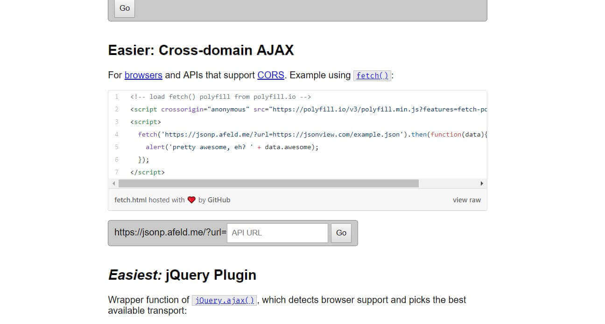

## 什么是跨域

简单地来说就是域 A 下网页试图加载域 B 下的资源。一般来说，浏览器会阻止这类行为。这是浏览器的同源策略导致的。所谓同源，就是要求两个 URL 的协议，域名，端口全部相同。

## 跨域会有什么影响

- AJAX 请求发不出去

- DOM、JS 对象无法获取

- Cookie、LocalStorage 也无法获取

## 为什么要有同源策略

让我们设想一下现在有个电商网站`www.oaboat.com`，它有个支付接口`www.oaboat.com/pay?target=749923710&amout=100` ，这样就可以给用户 id 为`749923710`的用户转账 100 元。如果有个博客网站 A，它被植入了一张图片`` 这样访问博客网站 A 的用户在不经意间，财物就被盗取了

## XSS 和 CSRF

### XSS

XSS 全称是 `Cross Site Scripting` ，中文名称是跨站脚本攻击，至于为什么不叫 CSS 是为了避免和`Cascading Style Sheets` 重名。还是刚才那个例子，黑客是怎么将植入图片的呢？

```javascript
const image = document.createElement("img");
img.src = "http://www.oaboat.com/pay?target=749923710&amout=100";
img.style = display = "none";
document.body.appendChild(img);
```

只要他将这段代码在评论区评论出来。如果这个博客网站没有 XSS 防范，那么每个浏览的用户都会收到攻击，都会执行上面的那段代码。

### CSRF

CSRF 全称是 `Cross-site request forgery` ，中文名称是跨站请求伪造。还是刚才那个例子。像刚才那个例子就涉及到了 CSRF，浏览博客网站却试图请求电商网站的接口。此时同源策略的作用就体现出来了，电商网站可以检测请求中的 Origin 字段，判断是否同源，决定是否异常。当然这只是一种方法，并不是绝对地安全。

## 一个有意思的跨域问题


我的博客的首页的背景图片以及中间的那一段 copyright 是爬取 Bing 得到的。这样魔改这个 hexo 主题的过程还是挺艰辛的，不过挺好看的就是了，也挺有成就感的。

### 直接请求这个接口

一开始我是尝试在博客页面直接请求那个[Bing 接口](http://cn.bing.com/HPImageArchive.aspx?format=js&idx=0&n=1)。

```javascript
fetch("http://cn.bing.com/HPImageArchive.aspx?format=js&idx=0&n=1").then(res =>
  console.log(res)
);
```


结果和我所猜想的一样，这样请求这个接口会有跨域的问题。这个需要后端加上一个响应头`Access-Control-Allow-Origin:*` ，这样当浏览器接收到这个响应时，才不会被 block。但是，当然我没办法修改这个接口的后端代码。

### 由我的服务器代理我的请求

我想到的第二个办法是，将请求发到我自己的服务器上，再由我的服务器请求这个 Bing 接口，服务器收到响应后，再返回给浏览器，并且增加一个`Access-Control-Allow-Origin:*` ，这样这个响应就不会被浏览器 block 了。

```javascript
const app = express();
const { default: axios } = require("axios");
const request = require("request");
app.get("/", async (req, res) => {
  const {
    data: { images },
  } = await axios.get(
    "https://cn.bing.com/HPImageArchive.aspx?format=js&idx=0&n=1&nc=1541141842428&pid=hp&video=1"
  );
  const { url } = images[0];
  request(`https://cn.bing.com${url}`).pipe(res);
}); //用于获取图片信息
app.get("/info", async (req, res) => {
  const {
    data: { images },
  } = await axios.get(
    "https://cn.bing.com/HPImageArchive.aspx?format=js&idx=0&n=1&nc=1541141842428&pid=hp&video=1"
  );
  const { copyright } = images[0];
  res.send(copyright);
}); //用于获取 copyright 信息
app.listen(8081);
```

这个想法在本地测试是没有问题的，但是在 Github Page 上就有问题了。`https://ChenKS12138.github.io` 是 HTTPS 协议，但是我的服务器上只能 HTTP ~~主要是太懒了，没有弄域名，更别说 HTTPSl 了~~ ,一个 HTTPS 的网站请求 HTTP 的资源会有 `mixed content`[(混合内容)](https://developers.google.com/web/fundamentals/security/prevent-mixed-content/what-is-mixed-content?hl=zh-cn) 的问题。请求图片资源问题不是很大，只是 warning，但是像 iframe、fetch 请求会直接报 error。如果想移除`mixed content` 的警告，需要改动浏览器的启动参数，比较麻烦，不现实。


### 继续尝试直接请求 Bing 接口

后面我也有尝试去使用 `jsonp` 、`window.postMessage` 这类的方法尝试直接请求 bing 接口，但是这类的方法都对服务器端返回的内容有要求，很难实现。

## JSONProxy



这个是我在其他人的博客中找到的，这个[代理工具](https://jsonp.afeld.me/)，它可以代理我的请求。这个和我的第二个思路有点相似。但是它的服务器有 HTTPS，不会有`mixed content` 的问题。

```html
<p style="font-size: 25px;color:white;margin-bottom:1rem">今日Bing美图</p>
<p
  id="desc"
  style="font-size: 20px;color:white;margin-bottom:1rem;max-width:80%;text-align:center;margin: 0 auto;"
>
  loading...
</p>
<script src="http://lib.sinaapp.com/js/jquery/2.0.2/jquery-2.0.2.min.js"></script>
<script>
  $.ajax({
    method: "get",
    url:
      "https://jsonp.afeld.me/?url=http%3A%2F%2Fcn.bing.com%2FHPImageArchive.aspx%3Fformat%3Djs%26idx%3D0%26n%3D1",
    success: function (data) {
      document.querySelector("#desc").innerHTML = data.images[0].copyright;
    },
  });
</script>
```

这样就得到我最后想要的效果了。
